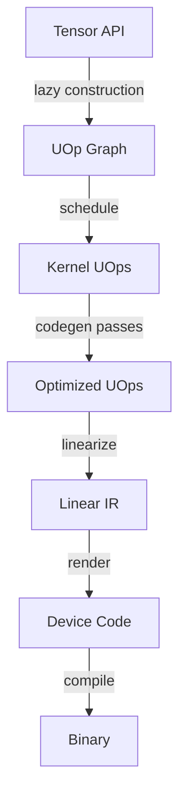

# IR Evolution Explorer for tinygrad

## Overview

tinygrad already has excellent infrastructure for this via `VIZ=1` and `DEBUG=1-7`. The goal is to create a focused educational script that builds on these tools, with annotated examples and structured output for tracing the full pipeline.

## Pipeline Stages to Capture

### Key transformation stages in codegen (from [`codegen/__init__.py`](tinygrad/codegen/__init__.py)):

1. Base AST (input SINK)
2. Early movement ops
3. Load collapse / split ranges / symbolic
4. Range simplification
5. Optimization (BEAM or heuristic)
6. Expander
7. Devectorizer
8. Control flow insertion
9. Linearization and rendering

## Approach

Create a single Python file `explore_ir.py` that:

1. **Annotated Examples** - Simple tensor operations with explanations:

   - Element-wise: `a + b`
   - Reduction: `x.sum()`
   - Matmul: `a @ b`
   - Fused: `(a + b).sum()`
   - Multi-output schedule

2. **Stage Capture** - For each example, extract and save:

   - Initial lazy UOp graph (`tensor.uop`)
   - Schedule output (list of `ExecItem`)
   - Kernel AST before/after optimization
   - Generated source code
   - Optionally: assembly via `DEBUG=7`

3. **Output Format** - Generate a structured markdown report with:

   - Annotated code blocks for each stage
   - Diffs between stages (what changed)
   - Links to VIZ for interactive exploration

4. **Integration with VIZ** - Optionally launch VIZ with `VIZ=-1` to save traces without blocking, then use [`extra/viz/cli.py`](extra/viz/cli.py) for CLI exploration.

## Key Files to Leverage

- [`tinygrad/engine/schedule.py`](tinygrad/engine/schedule.py) - `complete_create_schedule_with_vars`
- [`tinygrad/engine/realize.py`](tinygrad/engine/realize.py) - `ExecItem`, `get_runner`
- [`tinygrad/codegen/__init__.py`](tinygrad/codegen/__init__.py) - `get_program`, `full_rewrite_to_sink`
- [`tinygrad/uop/ops.py`](tinygrad/uop/ops.py) - `print_uops`, `pyrender`

## Additional Ideas

1. **Comparative Examples** - Show before/after for:

   - With vs without optimization (`NOOPT=1`)
   - Different BEAM settings
   - CPU vs GPU code generation

2. **Interactive Mode** - Add REPL-style exploration where you can inspect any stage

3. **Schedule Visualization** - Show kernel dependency graph for multi-kernel schedules

4. **Performance Annotations** - Include estimated FLOPs/memory bandwidth from `Estimates`

## Implementation

Single file at `explore_ir.py` in project root (not committed to tinygrad), approximately 200-300 lines.