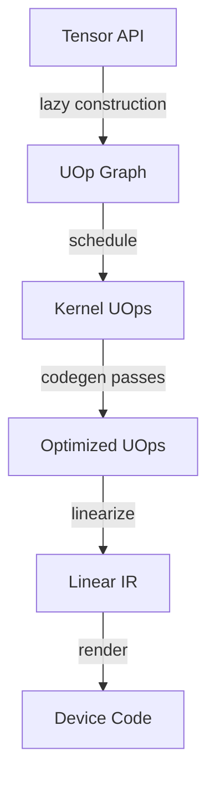

# IR Evolution Explorer Report

This report shows how tensor operations evolve through tinygrad's compilation pipeline.

## Pipeline Overview



## Examples

### add

Element-wise addition of two tensors. The simplest fused operation.

#### Lazy UOp Graph

The lazy computation graph built from tensor operations. Each operation creates UOps that form a DAG.

**Summary:** 9 UOps, top: UNIQUE:2, DEVICE:2, BUFFER:2, COPY:2, ADD:1

<details>
<summary>UOp Graph (click to expand)</summary>

```python
c2 = UOp.new_buffer('PYTHON', 3, dtypes.int, 0)
c4 = c2.copy_to_device('CPU')
c6 = UOp.new_buffer('PYTHON', 3, dtypes.int, 1)
c7 = c6.copy_to_device('CPU')
ast = c4+c7
```

</details>

#### Schedule

Scheduled 3 kernel(s). 
  Kernel 0: Ops.COPY
  Kernel 1: Ops.COPY
  Kernel 2: Ops.SINK

**Summary:** empty

#### Kernel 2 - Base AST

The kernel's abstract syntax tree before optimization passes. This is the SINK-rooted graph that represents the computation.

**Summary:** 12 UOps, top: DEFINE_GLOBAL:3, INDEX:3, CONST:1, RANGE:1, ADD:1

**Changes from previous stage:**
```
UOps: 9 -> 12 (+3)
  + Added: DEFINE_GLOBAL, SINK, INDEX, RANGE, STORE, END, CONST
  - Removed: UNIQUE, DEVICE, COPY, BUFFER
```

<details>
<summary>UOp Graph (click to expand)</summary>

```python
c0 = UOp(Ops.DEFINE_GLOBAL, dtypes.int.ptr(3), (), 0)
c2 = UOp.range(3, 0, AxisType.LOOP)
c4 = UOp(Ops.DEFINE_GLOBAL, dtypes.int.ptr(3), (), 1)
c6 = UOp(Ops.DEFINE_GLOBAL, dtypes.int.ptr(3), (), 2)
c8 = c4.index(c2)+c6.index(c2)
c10 = c0.index(c2, ptr=True).store(c8).end(c2)
ast = c10.sink()
```

</details>

#### Kernel 2 - Optimized

After optimization passes including: range simplification, load collapse, symbolic simplification, expander, devectorizer, etc.

**Summary:** 14 UOps, top: DEFINE_GLOBAL:3, INDEX:3, LOAD:2, CONST:1, RANGE:1

**Changes from previous stage:**
```
UOps: 12 -> 14 (+2)
  + Added: LOAD
```

<details>
<summary>UOp Graph (click to expand)</summary>

```python
c0 = UOp(Ops.DEFINE_GLOBAL, dtypes.int.ptr(3), (), 0)
c2 = UOp.range(3, 0, AxisType.LOOP, dtype=dtypes.int)
c4 = UOp(Ops.DEFINE_GLOBAL, dtypes.int.ptr(3), (), 1)
c6 = c4.index(c2, ptr=True).load()
c7 = UOp(Ops.DEFINE_GLOBAL, dtypes.int.ptr(3), (), 2)
c9 = c7.index(c2, ptr=True).load()
c10 = c6+c9
c12 = c0.index(c2, ptr=True).store(c10).end(c2)
ast = c12.sink(arg=KernelInfo(name='E\x1b[90m_\x1b[0m\x1b[97m3\x1b[0m\x1b[90m\x1b[0m', axis_types=(), dont_use_locals=False, applied_opts=(), opts_to_apply=None)).rtag(1)
```

</details>

#### Kernel 2 - Linear IR

The linearized IR ready for rendering. UOps are now in execution order with control flow.

**Summary:** 14 linear UOps

**Estimates:** ops=3, loads/stores=36, memory=36

#### Kernel 2 - Source Code

Generated CPU code for execution.

**Summary:** 7 lines of code

<details>
<summary>Source Code (click to expand)</summary>

```c

void E_3n1(int* restrict data0_3, int* restrict data1_3, int* restrict data2_3, int core_id) {
  for (int Lidx0 = 0; Lidx0 < 3; Lidx0++) {
    int val0 = (*(data1_3+Lidx0));
    int val1 = (*(data2_3+Lidx0));
    *(data0_3+Lidx0) = (val0+val1);
  }
}

```

</details>

**Estimates:** ops=3, loads/stores=36, memory=36

---

### mul

Element-wise multiplication. Similar to add but uses MUL op.

#### Lazy UOp Graph

The lazy computation graph built from tensor operations. Each operation creates UOps that form a DAG.

**Summary:** 9 UOps, top: UNIQUE:2, DEVICE:2, BUFFER:2, COPY:2, MUL:1

<details>
<summary>UOp Graph (click to expand)</summary>

```python
c2 = UOp.new_buffer('PYTHON', 3, dtypes.int, 5)
c4 = c2.copy_to_device('CPU')
c6 = UOp.new_buffer('PYTHON', 3, dtypes.int, 6)
c7 = c6.copy_to_device('CPU')
ast = c4*c7
```

</details>

#### Schedule

Scheduled 3 kernel(s). 
  Kernel 0: Ops.COPY
  Kernel 1: Ops.COPY
  Kernel 2: Ops.SINK

**Summary:** empty

#### Kernel 2 - Base AST

The kernel's abstract syntax tree before optimization passes. This is the SINK-rooted graph that represents the computation.

**Summary:** 12 UOps, top: DEFINE_GLOBAL:3, INDEX:3, CONST:1, RANGE:1, MUL:1

**Changes from previous stage:**
```
UOps: 9 -> 12 (+3)
  + Added: DEFINE_GLOBAL, SINK, INDEX, RANGE, STORE, END, CONST
  - Removed: UNIQUE, DEVICE, COPY, BUFFER
```

<details>
<summary>UOp Graph (click to expand)</summary>

```python
c0 = UOp(Ops.DEFINE_GLOBAL, dtypes.int.ptr(3), (), 0)
c2 = UOp.range(3, 0, AxisType.LOOP)
c4 = UOp(Ops.DEFINE_GLOBAL, dtypes.int.ptr(3), (), 1)
c6 = UOp(Ops.DEFINE_GLOBAL, dtypes.int.ptr(3), (), 2)
c8 = c4.index(c2)*c6.index(c2)
c10 = c0.index(c2, ptr=True).store(c8).end(c2)
ast = c10.sink()
```

</details>

#### Kernel 2 - Optimized

After optimization passes including: range simplification, load collapse, symbolic simplification, expander, devectorizer, etc.

**Summary:** 14 UOps, top: DEFINE_GLOBAL:3, INDEX:3, LOAD:2, CONST:1, RANGE:1

**Changes from previous stage:**
```
UOps: 12 -> 14 (+2)
  + Added: LOAD
```

<details>
<summary>UOp Graph (click to expand)</summary>

```python
c0 = UOp(Ops.DEFINE_GLOBAL, dtypes.int.ptr(3), (), 0)
c2 = UOp.range(3, 0, AxisType.LOOP, dtype=dtypes.int)
c4 = UOp(Ops.DEFINE_GLOBAL, dtypes.int.ptr(3), (), 1)
c6 = c4.index(c2, ptr=True).load()
c7 = UOp(Ops.DEFINE_GLOBAL, dtypes.int.ptr(3), (), 2)
c9 = c7.index(c2, ptr=True).load()
c10 = c6*c9
c12 = c0.index(c2, ptr=True).store(c10).end(c2)
ast = c12.sink(arg=KernelInfo(name='E\x1b[90m_\x1b[0m\x1b[97m3\x1b[0m\x1b[90mn2\x1b[0m', axis_types=(), dont_use_locals=False, applied_opts=(), opts_to_apply=None)).rtag(1)
```

</details>

#### Kernel 2 - Linear IR

The linearized IR ready for rendering. UOps are now in execution order with control flow.

**Summary:** 14 linear UOps

**Estimates:** ops=3, loads/stores=36, memory=36

#### Kernel 2 - Source Code

Generated CPU code for execution.

**Summary:** 7 lines of code

<details>
<summary>Source Code (click to expand)</summary>

```c

void E_3n3(int* restrict data0_3, int* restrict data1_3, int* restrict data2_3, int core_id) {
  for (int Lidx0 = 0; Lidx0 < 3; Lidx0++) {
    int val0 = (*(data1_3+Lidx0));
    int val1 = (*(data2_3+Lidx0));
    *(data0_3+Lidx0) = (val0*val1);
  }
}

```

</details>

**Estimates:** ops=3, loads/stores=36, memory=36

---

### sum

Reduction operation (sum). Introduces REDUCE_AXIS and range loops.

#### Lazy UOp Graph

The lazy computation graph built from tensor operations. Each operation creates UOps that form a DAG.

**Summary:** 8 UOps, top: DEVICE:2, UNIQUE:1, BUFFER:1, COPY:1, REDUCE_AXIS:1

<details>
<summary>UOp Graph (click to expand)</summary>

```python
c2 = UOp.new_buffer('PYTHON', 5, dtypes.int, 10)
c4 = c2.copy_to_device('CPU')
c6 = UOp(Ops.VECTORIZE, dtypes.index.vec(0), ())
ast = c4.r(Ops.ADD, (0,)).reshape(())
```

</details>

#### Schedule

Scheduled 2 kernel(s). 
  Kernel 0: Ops.COPY
  Kernel 1: Ops.SINK

**Summary:** empty

#### Kernel 1 - Base AST

The kernel's abstract syntax tree before optimization passes. This is the SINK-rooted graph that represents the computation.

**Summary:** 10 UOps, top: DEFINE_GLOBAL:2, CONST:2, INDEX:2, RANGE:1, REDUCE:1

**Changes from previous stage:**
```
UOps: 8 -> 10 (+2)
  + Added: DEFINE_GLOBAL, SINK, INDEX, REDUCE, RANGE, STORE, CONST
  - Removed: COPY, BUFFER, RESHAPE, VECTORIZE, REDUCE_AXIS, UNIQUE, DEVICE
```

<details>
<summary>UOp Graph (click to expand)</summary>

```python
c0 = UOp(Ops.DEFINE_GLOBAL, dtypes.int.ptr(1), (), 0)
c3 = UOp(Ops.DEFINE_GLOBAL, dtypes.int.ptr(5), (), 1)
c5 = UOp.range(5, 0, AxisType.REDUCE)
c6 = c3.index(c5)
c7 = c6.reduce(c5, arg=Ops.ADD)
c8 = c0.index(UOp.const(dtypes.index, 0), ptr=True).store(c7)
ast = c8.sink()
```

</details>

#### Kernel 1 - Optimized

After optimization passes including: range simplification, load collapse, symbolic simplification, expander, devectorizer, etc.

**Summary:** 24 UOps, top: INDEX:6, CONST:5, LOAD:5, ADD:4, DEFINE_GLOBAL:2

**Changes from previous stage:**
```
UOps: 10 -> 24 (+14)
  + Added: LOAD, ADD
  - Removed: REDUCE, RANGE
  ~ Changed: INDEX: 2->6, CONST: 2->5
```

<details>
<summary>UOp Graph (click to expand)</summary>

```python
c0 = UOp(Ops.DEFINE_GLOBAL, dtypes.int.ptr(1), (), 0)
c3 = UOp(Ops.DEFINE_GLOBAL, dtypes.int.ptr(5), (), 1)
c5 = c3.index(UOp.const(dtypes.int, 0), ptr=True).load()
c8 = c3.index(UOp.const(dtypes.int, 1), ptr=True).load()
c12 = c3.index(UOp.const(dtypes.int, 2), ptr=True).load()
c16 = c3.index(UOp.const(dtypes.int, 3), ptr=True).load()
c20 = c3.index(UOp.const(dtypes.int, 4), ptr=True).load()
c21 = c5+c8+c12+c16+c20
c22 = c0.index(UOp.const(dtypes.int, 0), ptr=True).store(c21)
ast = c22.sink(arg=KernelInfo(name='r\x1b[90m_\x1b[0m\x1b[35m5\x1b[0m\x1b[90m\x1b[0m', axis_types=(), dont_use_locals=False, applied_opts=(Opt(op=OptOps.UNROLL, axis=0, arg=0),), opts_to_apply=None)).rtag(1)
```

</details>

#### Kernel 1 - Linear IR

The linearized IR ready for rendering. UOps are now in execution order with control flow.

**Summary:** 24 linear UOps

**Estimates:** ops=4, loads/stores=24, memory=24

#### Kernel 1 - Source Code

Generated CPU code for execution.

**Summary:** 8 lines of code

<details>
<summary>Source Code (click to expand)</summary>

```c

void r_5n1(int* restrict data0_1, int* restrict data1_5, int core_id) {
  int val0 = (*(data1_5+0));
  int val1 = (*(data1_5+1));
  int val2 = (*(data1_5+2));
  int val3 = (*(data1_5+3));
  int val4 = (*(data1_5+4));
  *(data0_1+0) = (val0+val1+val2+val3+val4);
}

```

</details>

**Estimates:** ops=4, loads/stores=24, memory=24

---

### matmul

Matrix multiplication (a @ b). Creates complex indexing patterns with contractions.

#### Lazy UOp Graph

The lazy computation graph built from tensor operations. Each operation creates UOps that form a DAG.

**Summary:** 224 UOps, top: RESHAPE:43, EXPAND:31, CONST:29, MUL:18, ADD:17

<details>
<summary>UOp Graph (click to expand)</summary>

```python
c3 = UOp.const(dtypes.float, 1.5707963267948966, device='CPU').reshape((1,1))
c31 = UOp.unique_const(dtypes.uint, 1, device='CPU', unique=16).reshape((1,)).expand((32,)).pad(((31, 0),)).reshape((1,63)).expand((33,63)).reshape((2079,)).shrink(((0, 2048),)).reshape((32,64)).shrink(((0, 32),(0, 32))).reshape((32,32,1)).reshape((32,32)).permute((1, 0))
c35 = UOp.const(dtypes.uint, -1, device='CPU').reshape((1,))
c36 = c35.expand((32,))
c40 = UOp.new_buffer('PYTHON', 1, dtypes.uint, 15)
c41 = c40.copy_to_device('CPU')
c43 = UOp.const(dtypes.uint, 64, device='CPU').reshape((1,))
c44 = c43*c35
c47 = c31.r(Ops.ADD, (1,)).reshape((32,))+c36+(c41+c44).expand((32,))
c50 = UOp.const(dtypes.uint, 32, device='CPU').reshape((1,)).expand((32,))
c55 = UOp.const(dtypes.ulong, 4294967296, device='CPU').reshape((1,)).expand((32,))
c60 = UOp.new_buffer('PYTHON', 2, dtypes.uint, 14)
c61 = c60.copy_to_device('CPU')
c64 = UOp(Ops.VECTORIZE, dtypes.index.vec(0), ())
c75 = c61.shrink(((1, 2),)).reshape(()).reshape((1,)).expand((32,)).cast(dtypes.ulong)*c55|c61.shrink(((0, 1),)).reshape(()).reshape((1,)).expand((32,)).cast(dtypes.ulong)
c76 = ((c47+c50).cast(dtypes.ulong)*c55|c47.cast(dtypes.ulong)).threefry(c75)
c79 = UOp.const(dtypes.ulong, 4294967295, device='CPU').reshape((1,)).expand((32,))
c91 = UOp.const(dtypes.uint, 512, device='CPU').reshape((1,)).expand((64,))
c106 = UOp.const(dtypes.float, 1.0, device='CPU').reshape((1,)).expand((64,))*UOp.const(dtypes.float, -1.0, device='CPU').reshape((1,)).expand((64,))
c110 = ((((c76&c79).cast(dtypes.uint).pad(((0, 32),))+(c76//c55&c79).cast(dtypes.uint).pad(((32, 0),)))//c91|UOp.unique_const(dtypes.float, 1.0, device='CPU', unique=17).reshape((1,)).expand((64,)).bitcast(dtypes.uint)).bitcast(dtypes.float)+c106).reshape((2,4,8)).contiguous()
c116 = UOp.const(dtypes.float, 6.283185307179586, device='CPU').reshape((1,1))
c119 = UOp.const(dtypes.float, -1.0, device='CPU').reshape((1,1))
c120 = c119.expand((4,8))
c124 = UOp.const(dtypes.float, 1.0, device='CPU').reshape((1,1))
c133 = UOp.const(dtypes.float, 0.6931471805599453, device='CPU').reshape((1,1))
c137 = UOp.const(dtypes.float, -2.0, device='CPU').reshape((1,1))
c161 = UOp.unique_const(dtypes.uint, 1, device='CPU', unique=19).reshape((1,)).expand((32,)).pad(((31, 0),)).reshape((1,63)).expand((33,63)).reshape((2079,)).shrink(((0, 2048),)).reshape((32,64)).shrink(((0, 32),(0, 32))).reshape((32,32,1)).reshape((32,32)).permute((1, 0))
c166 = c41.assign((c41+c43))
c169 = c161.r(Ops.ADD, (1,)).reshape((32,))+c36+(c166+c44).expand((32,))
c175 = ((c169+c50).cast(dtypes.ulong)*c55|c169.cast(dtypes.ulong)).threefry(c75)
c195 = ((((c175&c79).cast(dtypes.uint).pad(((0, 32),))+(c175//c55&c79).cast(dtypes.uint).pad(((32, 0),)))//c91|UOp.unique_const(dtypes.float, 1.0, device='CPU', unique=20).reshape((1,)).expand((64,)).bitcast(dtypes.uint)).bitcast(dtypes.float)+c106).reshape((2,8,4)).contiguous()
c201 = c119.expand((8,4))
c220 = ((c3.expand((4,8))+c110.shrink(((0, 1),(0, 4),(0, 8))).reshape((4,8))*c116.expand((4,8))*c120).sin()*((c124.expand((4,8))+c110.shrink(((1, 2),(0, 4),(0, 8))).reshape((4,8))*c120).log2()*c133.expand((4,8))*c137.expand((4,8))).sqrt()).reshape((4,1,8)).expand((4,4,8))*((c3.expand((8,4))+c195.shrink(((0, 1),(0, 8),(0, 4))).reshape((8,4))*c116.expand((8,4))*c201).sin()*((c124.expand((8,4))+c195.shrink(((1, 2),(0, 8),(0, 4))).reshape((8,4))*c201).log2()*c133.expand((8,4))*c137.expand((8,4))).sqrt()).reshape((1,8,4)).permute((0, 2, 1)).expand((4,4,8))
ast = c220.r(Ops.ADD, (2,)).reshape((4,4))
```

</details>

#### Schedule

Scheduled 6 kernel(s). 
  Kernel 0: Ops.COPY
  Kernel 1: Ops.COPY
  Kernel 2: Ops.SINK
  Kernel 3: Ops.SINK
  Kernel 4: Ops.SINK
  Kernel 5: Ops.SINK

**Summary:** empty

#### Kernel 2 - Base AST

The kernel's abstract syntax tree before optimization passes. This is the SINK-rooted graph that represents the computation.

**Summary:** 9 UOps, top: DEFINE_GLOBAL:2, CONST:2, INDEX:2, ADD:1, STORE:1

**Changes from previous stage:**
```
UOps: 224 -> 9 (-215)
  + Added: DEFINE_GLOBAL, INDEX, STORE, SINK
  - Removed: VECTORIZE, CAST, BITCAST, LOG2, SIN, SQRT, MUL, IDIV, OR, AND, THREEFRY, VCONST, UNIQUE, DEVICE, ASSIGN, CONTIGUOUS, COPY, BUFFER, RESHAPE, PERMUTE, EXPAND, PAD, SHRINK, REDUCE_AXIS
  ~ Changed: ADD: 17->1, CONST: 29->2
```

<details>
<summary>UOp Graph (click to expand)</summary>

```python
c0 = UOp(Ops.DEFINE_GLOBAL, dtypes.uint.ptr(1), (), 0)
c3 = UOp(Ops.DEFINE_GLOBAL, dtypes.uint.ptr(1), (), 1)
c6 = c3.index(UOp.const(dtypes.index, 0))+64
c7 = c0.index(UOp.const(dtypes.index, 0), ptr=True).store(c6)
ast = c7.sink()
```

</details>

#### Kernel 2 - Optimized

After optimization passes including: range simplification, load collapse, symbolic simplification, expander, devectorizer, etc.

**Summary:** 10 UOps, top: DEFINE_GLOBAL:2, CONST:2, INDEX:2, LOAD:1, ADD:1

**Changes from previous stage:**
```
UOps: 9 -> 10 (+1)
  + Added: LOAD
```

<details>
<summary>UOp Graph (click to expand)</summary>

```python
c0 = UOp(Ops.DEFINE_GLOBAL, dtypes.uint.ptr(1), (), 0)
c3 = UOp(Ops.DEFINE_GLOBAL, dtypes.uint.ptr(1), (), 1)
c5 = c3.index(UOp.const(dtypes.int, 0), ptr=True).load()
c7 = c5+64
c8 = c0.index(UOp.const(dtypes.int, 0), ptr=True).store(c7)
ast = c8.sink(arg=KernelInfo(name='E\x1b[90m\x1b[0m', axis_types=(), dont_use_locals=False, applied_opts=(), opts_to_apply=None)).rtag(1)
```

</details>

#### Kernel 2 - Linear IR

The linearized IR ready for rendering. UOps are now in execution order with control flow.

**Summary:** 10 linear UOps

**Estimates:** ops=1, loads/stores=8, memory=8

#### Kernel 2 - Source Code

Generated CPU code for execution.

**Summary:** 4 lines of code

<details>
<summary>Source Code (click to expand)</summary>

```c

void En1(unsigned int* restrict data0_1, unsigned int* restrict data1_1, int core_id) {
  unsigned int val0 = (*(data1_1+0));
  *(data0_1+0) = (val0+64u);
}

```

</details>

**Estimates:** ops=1, loads/stores=8, memory=8

#### Kernel 3 - Base AST

The kernel's abstract syntax tree before optimization passes. This is the SINK-rooted graph that represents the computation.

**Summary:** 66 UOps, top: CONST:14, ADD:12, CAST:10, MUL:5, INDEX:4

**Changes from previous stage:**
```
UOps: 10 -> 66 (+56)
  + Added: MUL, IDIV, CMPLT, OR, THREEFRY, WHERE, RANGE, END, CAST, BITCAST
  - Removed: LOAD
  ~ Changed: DEFINE_GLOBAL: 2->3, INDEX: 2->4, ADD: 1->12, CONST: 2->14
```

<details>
<summary>UOp Graph (click to expand)</summary>

```python
c0 = UOp(Ops.DEFINE_GLOBAL, dtypes.float.ptr(64), (), 0)
c2 = UOp.range(4, 1, AxisType.LOOP)
c5 = UOp.range(8, 2, AxisType.LOOP)
c8 = UOp.range(2, 0, AxisType.LOOP)
c11 = c2*8+c5+c8*32
c14 = c8<1
c15 = UOp(Ops.DEFINE_GLOBAL, dtypes.uint.ptr(1), (), 1)
c17 = c15.index(UOp.const(dtypes.index, 0))
c20 = c17+(c11+1).cast(dtypes.uint)
c30 = UOp(Ops.DEFINE_GLOBAL, dtypes.uint.ptr(2), (), 2)
c36 = c30.index(UOp.const(dtypes.index, 1)).cast(dtypes.ulong)*4294967296|c30.index(UOp.const(dtypes.index, 0)).cast(dtypes.ulong)
c40 = c14.where(((c20+-33).cast(dtypes.ulong)*4294967296|(c20+-65).cast(dtypes.ulong)).threefry(c36).cast(dtypes.uint), UOp.const(dtypes.uint, 0))
c44 = c17+(c11+-31).cast(dtypes.uint)
c54 = c14.where(UOp.const(dtypes.uint, 0), (((c44+-33).cast(dtypes.ulong)*4294967296|(c44+-65).cast(dtypes.ulong)).threefry(c36)//4294967296).cast(dtypes.uint))
c62 = ((c40+c54)//512|1065353216).bitcast(dtypes.float)+-1.0
c64 = c0.index(c11, ptr=True).store(c62).end(c8, c2, c5)
ast = c64.sink()
```

</details>

#### Kernel 3 - Optimized

After optimization passes including: range simplification, load collapse, symbolic simplification, expander, devectorizer, etc.

**Summary:** 673 UOps, top: ADD:314, SHR:101, XOR:98, SHL:97, CONST:27

**Changes from previous stage:**
```
UOps: 66 -> 673 (+607)
  + Added: SHL, SHR, XOR, GROUP, VECTORIZE, LOAD
  - Removed: MUL, IDIV, CMPLT, THREEFRY, WHERE
  ~ Changed: INDEX: 4->5, STORE: 1->2, CAST: 10->6, BITCAST: 1->5, ADD: 12->314, OR: 4->5, RANGE: 3->2, END: 1->2, CONST: 14->27
```

<details>
<summary>UOp Graph (click to expand)</summary>

```python
c0 = UOp(Ops.DEFINE_GLOBAL, dtypes.float.ptr(64), (), 0)
c2 = UOp.range(8, 0, 0, AxisType.LOOP, dtype=dtypes.int)
c4 = c2<<2
c7 = UOp(Ops.DEFINE_GLOBAL, dtypes.uint.ptr(1), (), 1)
c10 = c7.index(UOp.const(dtypes.int, 0), ptr=True).load()
c14 = c10+(c4+1).cast(dtypes.uint)
c17 = UOp(Ops.DEFINE_GLOBAL, dtypes.uint.ptr(2), (), 2)
c19 = c17.index(UOp.const(dtypes.int, 0), ptr=True).load()
c24 = c17.index(UOp.const(dtypes.int, 1), ptr=True).load()
c25 = c14+-33+c24
c26 = c14+-65+c19+c25
c32 = c26^(c25<<13)+(c25>>19)
c33 = c26+c32
c39 = c33^(c32<<15)+(c32>>17)
c40 = c33+c39
c46 = c40^(c39<<26)+(c39>>6)
c47 = c40+c46
c55 = c19^c24^466688986
c58 = (c47^(c46<<6)+(c46>>26))+c55+1
c59 = c47+c24+c58
c63 = c59^(c58<<17)+(c58>>15)
c64 = c59+c63
c70 = c64^(c63<<29)+(c63>>3)
c71 = c64+c70
c76 = c71^(c70<<16)+(c70>>16)
c77 = c71+c76
c87 = (c77^(c76<<24)+(c76>>8))+c19+1+1
c88 = c77+c55+c87
c92 = c88^(c87<<13)+(c87>>19)
c93 = c88+c92
c97 = c93^(c92<<15)+(c92>>17)
c98 = c93+c97
c102 = c98^(c97<<26)+(c97>>6)
c103 = c98+c102
c112 = (c103^(c102<<6)+(c102>>26))+c24+2+1
c113 = c103+c19+c112
c117 = c113^(c112<<17)+(c112>>15)
c118 = c113+c117
c122 = c118^(c117<<29)+(c117>>3)
c123 = c118+c122
c127 = c123^(c122<<16)+(c122>>16)
c128 = c123+c127
c136 = (c128^(c127<<24)+(c127>>8))+c55+3+1
c137 = c128+c24+c136
c141 = c137^(c136<<13)+(c136>>19)
c142 = c137+c141
c146 = c142^(c141<<15)+(c141>>17)
c147 = c142+c146
c163 = c10+(c4+2).cast(dtypes.uint)
c167 = c163+-33+c24
c168 = c163+-65+c19+c167
c172 = c168^(c167<<13)+(c167>>19)
c173 = c168+c172
c177 = c173^(c172<<15)+(c172>>17)
c178 = c173+c177
c182 = c178^(c177<<26)+(c177>>6)
c183 = c178+c182
c190 = (c183^(c182<<6)+(c182>>26))+c55+1
c191 = c183+c24+c190
c195 = c191^(c190<<17)+(c190>>15)
c196 = c191+c195
c200 = c196^(c195<<29)+(c195>>3)
c201 = c196+c200
c205 = c201^(c200<<16)+(c200>>16)
c206 = c201+c205
c214 = (c206^(c205<<24)+(c205>>8))+c19+1+1
c215 = c206+c55+c214
c219 = c215^(c214<<13)+(c214>>19)
c220 = c215+c219
c224 = c220^(c219<<15)+(c219>>17)
c225 = c220+c224
c229 = c225^(c224<<26)+(c224>>6)
c230 = c225+c229
c238 = (c230^(c229<<6)+(c229>>26))+c24+2+1
c239 = c230+c19+c238
c243 = c239^(c238<<17)+(c238>>15)
c244 = c239+c243
c248 = c244^(c243<<29)+(c243>>3)
c249 = c244+c248
c253 = c249^(c248<<16)+(c248>>16)
c254 = c249+c253
c262 = (c254^(c253<<24)+(c253>>8))+c55+3+1
c263 = c254+c24+c262
c267 = c263^(c262<<13)+(c262>>19)
c268 = c263+c267
c272 = c268^(c267<<15)+(c267>>17)
c273 = c268+c272
c287 = c10+(c4+3).cast(dtypes.uint)
c291 = c287+-33+c24
c292 = c287+-65+c19+c291
c296 = c292^(c291<<13)+(c291>>19)
c297 = c292+c296
c301 = c297^(c296<<15)+(c296>>17)
c302 = c297+c301
c306 = c302^(c301<<26)+(c301>>6)
c307 = c302+c306
c314 = (c307^(c306<<6)+(c306>>26))+c55+1
c315 = c307+c24+c314
c319 = c315^(c314<<17)+(c314>>15)
c320 = c315+c319
c324 = c320^(c319<<29)+(c319>>3)
c325 = c320+c324
c329 = c325^(c324<<16)+(c324>>16)
c330 = c325+c329
c338 = (c330^(c329<<24)+(c329>>8))+c19+1+1
c339 = c330+c55+c338
c343 = c339^(c338<<13)+(c338>>19)
c344 = c339+c343
c348 = c344^(c343<<15)+(c343>>17)
c349 = c344+c348
c353 = c349^(c348<<26)+(c348>>6)
c354 = c349+c353
c362 = (c354^(c353<<6)+(c353>>26))+c24+2+1
c363 = c354+c19+c362
c367 = c363^(c362<<17)+(c362>>15)
c368 = c363+c367
c372 = c368^(c367<<29)+(c367>>3)
c373 = c368+c372
c377 = c373^(c372<<16)+(c372>>16)
c378 = c373+c377
c386 = (c378^(c377<<24)+(c377>>8))+c55+3+1
c387 = c378+c24+c386
c391 = c387^(c386<<13)+(c386>>19)
c392 = c387+c391
c396 = c392^(c391<<15)+(c391>>17)
c397 = c392+c396
c411 = c10+(c4+4).cast(dtypes.uint)
c415 = c411+-33+c24
c416 = c411+-65+c19+c415
c420 = c416^(c415<<13)+(c415>>19)
c421 = c416+c420
c425 = c421^(c420<<15)+(c420>>17)
c426 = c421+c425
c430 = c426^(c425<<26)+(c425>>6)
c431 = c426+c430
c438 = (c431^(c430<<6)+(c430>>26))+c55+1
c439 = c431+c24+c438
c443 = c439^(c438<<17)+(c438>>15)
c444 = c439+c443
c448 = c444^(c443<<29)+(c443>>3)
c449 = c444+c448
c453 = c449^(c448<<16)+(c448>>16)
c454 = c449+c453
c462 = (c454^(c453<<24)+(c453>>8))+c19+1+1
c463 = c454+c55+c462
c467 = c463^(c462<<13)+(c462>>19)
c468 = c463+c467
c472 = c468^(c467<<15)+(c467>>17)
c473 = c468+c472
c477 = c473^(c472<<26)+(c472>>6)
c478 = c473+c477
c486 = (c478^(c477<<6)+(c477>>26))+c24+2+1
c487 = c478+c19+c486
c491 = c487^(c486<<17)+(c486>>15)
c492 = c487+c491
c496 = c492^(c491<<29)+(c491>>3)
c497 = c492+c496
c501 = c497^(c496<<16)+(c496>>16)
c502 = c497+c501
c510 = (c502^(c501<<24)+(c501>>8))+c55+3+1
c511 = c502+c24+c510
c515 = c511^(c510<<13)+(c510>>19)
c516 = c511+c515
c520 = c516^(c515<<15)+(c515>>17)
c521 = c516+c520
c532 = UOp(Ops.VECTORIZE, dtypes.float.vec(4), (((c147+(c147^(c146<<26)+(c146>>6))+c55>>9|1065353216).bitcast(dtypes.float)+-1.0), ((c273+(c273^(c272<<26)+(c272>>6))+c55>>9|1065353216).bitcast(dtypes.float)+-1.0), ((c397+(c397^(c396<<26)+(c396>>6))+c55>>9|1065353216).bitcast(dtypes.float)+-1.0), ((c521+(c521^(c520<<26)+(c520>>6))+c55>>9|1065353216).bitcast(dtypes.float)+-1.0)))
c534 = c0.index(c4, ptr=True).cast(dtypes.float.vec(4).ptr(64)).store(c532).end(c2)
c536 = UOp.range(32, 0, 1, AxisType.LOOP, src=(c534,), dtype=dtypes.int)
c541 = c10+(c536+1).cast(dtypes.uint)
c545 = c541+-33+c24
c546 = c541+-65+c19+c545
c550 = c546^(c545<<13)+(c545>>19)
c551 = c546+c550
c555 = c551^(c550<<15)+(c550>>17)
c556 = c551+c555
c560 = c556^(c555<<26)+(c555>>6)
c561 = c556+c560
c568 = (c561^(c560<<6)+(c560>>26))+c55+1
c569 = c561+c24+c568
c573 = c569^(c568<<17)+(c568>>15)
c574 = c569+c573
c578 = c574^(c573<<29)+(c573>>3)
c579 = c574+c578
c583 = c579^(c578<<16)+(c578>>16)
c584 = c579+c583
c592 = (c584^(c583<<24)+(c583>>8))+c19+1+1
c593 = c584+c55+c592
c597 = c593^(c592<<13)+(c592>>19)
c598 = c593+c597
c602 = c598^(c597<<15)+(c597>>17)
c603 = c598+c602
c607 = c603^(c602<<26)+(c602>>6)
c608 = c603+c607
c616 = (c608^(c607<<6)+(c607>>26))+c24+2+1
c617 = c608+c19+c616
c621 = c617^(c616<<17)+(c616>>15)
c622 = c617+c621
c626 = c622^(c621<<29)+(c621>>3)
c627 = c622+c626
c631 = c627^(c626<<16)+(c626>>16)
c632 = c627+c631
c640 = (c632^(c631<<24)+(c631>>8))+c55+3+1
c641 = c632+c24+c640
c645 = c641^(c640<<13)+(c640>>19)
c646 = c641+c645
c650 = c646^(c645<<15)+(c645>>17)
c651 = c646+c650
c655 = c651^(c650<<26)+(c650>>6)
c668 = ((c651+c655^(c655<<6)+(c655>>26))+c19+4+1>>9|1065353216).bitcast(dtypes.float)+-1.0
c670 = c0.index((c536+32), ptr=True).store(c668).end(c536)
c671 = UOp(Ops.GROUP, dtypes.void, (c534, c670))
ast = c671.sink(arg=KernelInfo(name='E\x1b[90m_\x1b[0m\x1b[90m8\x1b[0m\x1b[90m_\x1b[0m\x1b[90m32\x1b[0m\x1b[90m_\x1b[0m\x1b[33m4\x1b[0m\x1b[90m\x1b[0m', axis_types=(), dont_use_locals=False, applied_opts=(Opt(op=OptOps.UPCAST, axis=0, arg=4),), opts_to_apply=None)).rtag(1)
```

</details>

#### Kernel 3 - Linear IR

The linearized IR ready for rendering. UOps are now in execution order with control flow.

**Summary:** 673 linear UOps

**Estimates:** ops=7938, loads/stores=268, memory=268

#### Kernel 3 - Source Code

Generated CPU code for execution.

**Summary:** 210 lines of code

<details>
<summary>Source Code (click to expand)</summary>

```c
typedef float float4 __attribute__((aligned(16),ext_vector_type(4)));
void E_8_32_4n1(float* restrict data0_64, unsigned int* restrict data1_1, unsigned int* restrict data2_2, int core_id) {
  unsigned int val0 = (*(data1_1+0));
  unsigned int val1 = (*(data2_2+0));
  unsigned int val2 = (*(data2_2+1));
  unsigned int alu0 = (val1^val2^466688986u);
  for (int Lidx0_0 = 0; Lidx0_0 < 8; Lidx0_0++) {
    int alu1 = (Lidx0_0<<2);
    unsigned int alu2 = (val0+((unsigned int)((alu1+1))));
    unsigned int alu3 = (alu2+4294967263u+val2);
    unsigned int alu4 = (alu2+4294967231u+val1+alu3);
    unsigned int alu5 = (alu4^((alu3<<13u)+(alu3>>19u)));
    unsigned int alu6 = (alu4+alu5);
    unsigned int alu7 = (alu6^((alu5<<15u)+(alu5>>17u)));
    unsigned int alu8 = (alu6+alu7);
    unsigned int alu9 = (alu8^((alu7<<26u)+(alu7>>6u)));
    unsigned int alu10 = (alu8+alu9);
    unsigned int alu11 = ((alu10^((alu9<<6u)+(alu9>>26u)))+alu0+1u);
    unsigned int alu12 = (alu10+val2+alu11);
    unsigned int alu13 = (alu12^((alu11<<17u)+(alu11>>15u)));
    unsigned int alu14 = (alu12+alu13);
    unsigned int alu15 = (alu14^((alu13<<29u)+(alu13>>3u)));
    unsigned int alu16 = (alu14+alu15);
    unsigned int alu17 = (alu16^((alu15<<16u)+(alu15>>16u)));
    unsigned int alu18 = (alu16+alu17);
    unsigned int alu19 = ((alu18^((alu17<<24u)+(alu17>>8u)))+val1+1u+1u);
    unsigned int alu20 = (alu18+alu0+alu19);
    unsigned int alu21 = (alu20^((alu19<<13u)+(alu19>>19u)));
    unsigned int alu22 = (alu20+alu21);
    unsigned int alu23 = (alu22^((alu21<<15u)+(alu21>>17u)));
    unsigned int alu24 = (alu22+alu23);
    unsigned int alu25 = (alu24^((alu23<<26u)+(alu23>>6u)));
    unsigned int alu26 = (alu24+alu25);
    unsigned int alu27 = ((alu26^((alu25<<6u)+(alu25>>26u)))+val2+2u+1u);
    unsigned int alu28 = (alu26+val1+alu27);
    unsigned int alu29 = (alu28^((alu27<<17u)+(alu27>>15u)));
    unsigned int alu30 = (alu28+alu29);
    unsigned int alu31 = (alu30^((alu29<<29u)+(alu29>>3u)));
    unsigned int alu32 = (alu30+alu31);
    unsigned int alu33 = (alu32^((alu31<<16u)+(alu31>>16u)));
    unsigned int alu34 = (alu32+alu33);
    unsigned int alu35 = ((alu34^((alu33<<24u)+(alu33>>8u)))+alu0+3u+1u);
    unsigned int alu36 = (alu34+val2+alu35);
    unsigned int alu37 = (alu36^((alu35<<13u)+(alu35>>19u)));
    unsigned int alu38 = (alu36+alu37);
    unsigned int alu39 = (alu38^((alu37<<15u)+(alu37>>17u)));
    unsigned int alu40 = (alu38+alu39);
    unsigned int alu41 = (val0+((unsigned int)((alu1+2))));
    unsigned int alu42 = (alu41+4294967263u+val2);
    unsigned int alu43 = (alu41+4294967231u+val1+alu42);
    unsigned int alu44 = (alu43^((alu42<<13u)+(alu42>>19u)));
    unsigned int alu45 = (alu43+alu44);
    unsigned int alu46 = (alu45^((alu44<<15u)+(alu44>>17u)));
    unsigned int alu47 = (alu45+alu46);
    unsigned int alu48 = (alu47^((alu46<<26u)+(alu46>>6u)));
    unsigned int alu49 = (alu47+alu48);
    unsigned int alu50 = ((alu49^((alu48<<6u)+(alu48>>26u)))+alu0+1u);
    unsigned int alu51 = (alu49+val2+alu50);
    unsigned int alu52 = (alu51^((alu50<<17u)+(alu50>>15u)));
    unsigned int alu53 = (alu51+alu52);
    unsigned int alu54 = (alu53^((alu52<<29u)+(alu52>>3u)));
    unsigned int alu55 = (alu53+alu54);
    unsigned int alu56 = (alu55^((alu54<<16u)+(alu54>>16u)));
    unsigned int alu57 = (alu55+alu56);
    unsigned int alu58 = ((alu57^((alu56<<24u)+(alu56>>8u)))+val1+1u+1u);
    unsigned int alu59 = (alu57+alu0+alu58);
    unsigned int alu60 = (alu59^((alu58<<13u)+(alu58>>19u)));
    unsigned int alu61 = (alu59+alu60);
    unsigned int alu62 = (alu61^((alu60<<15u)+(alu60>>17u)));
    unsigned int alu63 = (alu61+alu62);
    unsigned int alu64 = (alu63^((alu62<<26u)+(alu62>>6u)));
    unsigned int alu65 = (alu63+alu64);
    unsigned int alu66 = ((alu65^((alu64<<6u)+(alu64>>26u)))+val2+2u+1u);
    unsigned int alu67 = (alu65+val1+alu66);
    unsigned int alu68 = (alu67^((alu66<<17u)+(alu66>>15u)));
    unsigned int alu69 = (alu67+alu68);
    unsigned int alu70 = (alu69^((alu68<<29u)+(alu68>>3u)));
    unsigned int alu71 = (alu69+alu70);
    unsigned int alu72 = (alu71^((alu70<<16u)+(alu70>>16u)));
    unsigned int alu73 = (alu71+alu72);
    unsigned int alu74 = ((alu73^((alu72<<24u)+(alu72>>8u)))+alu0+3u+1u);
    unsigned int alu75 = (alu73+val2+alu74);
    unsigned int alu76 = (alu75^((alu74<<13u)+(alu74>>19u)));
    unsigned int alu77 = (alu75+alu76);
    unsigned int alu78 = (alu77^((alu76<<15u)+(alu76>>17u)));
    unsigned int alu79 = (alu77+alu78);
    unsigned int alu80 = (val0+((unsigned int)((alu1+3))));
    unsigned int alu81 = (alu80+4294967263u+val2);
    unsigned int alu82 = (alu80+4294967231u+val1+alu81);
    unsigned int alu83 = (alu82^((alu81<<13u)+(alu81>>19u)));
    unsigned int alu84 = (alu82+alu83);
    unsigned int alu85 = (alu84^((alu83<<15u)+(alu83>>17u)));
    unsigned int alu86 = (alu84+alu85);
    unsigned int alu87 = (alu86^((alu85<<26u)+(alu85>>6u)));
    unsigned int alu88 = (alu86+alu87);
    unsigned int alu89 = ((alu88^((alu87<<6u)+(alu87>>26u)))+alu0+1u);
    unsigned int alu90 = (alu88+val2+alu89);
    unsigned int alu91 = (alu90^((alu89<<17u)+(alu89>>15u)));
    unsigned int alu92 = (alu90+alu91);
    unsigned int alu93 = (alu92^((alu91<<29u)+(alu91>>3u)));
    unsigned int alu94 = (alu92+alu93);
    unsigned int alu95 = (alu94^((alu93<<16u)+(alu93>>16u)));
    unsigned int alu96 = (alu94+alu95);
    unsigned int alu97 = ((alu96^((alu95<<24u)+(alu95>>8u)))+val1+1u+1u);
    unsigned int alu98 = (alu96+alu0+alu97);
    unsigned int alu99 = (alu98^((alu97<<13u)+(alu97>>19u)));
    unsigned int alu100 = (alu98+alu99);
    unsigned int alu101 = (alu100^((alu99<<15u)+(alu99>>17u)));
    unsigned int alu102 = (alu100+alu101);
    unsigned int alu103 = (alu102^((alu101<<26u)+(alu101>>6u)));
    unsigned int alu104 = (alu102+alu103);
    unsigned int alu105 = ((alu104^((alu103<<6u)+(alu103>>26u)))+val2+2u+1u);
    unsigned int alu106 = (alu104+val1+alu105);
    unsigned int alu107 = (alu106^((alu105<<17u)+(alu105>>15u)));
    unsigned int alu108 = (alu106+alu107);
    unsigned int alu109 = (alu108^((alu107<<29u)+(alu107>>3u)));
    unsigned int alu110 = (alu108+alu109);
    unsigned int alu111 = (alu110^((alu109<<16u)+(alu109>>16u)));
    unsigned int alu112 = (alu110+alu111);
    unsigned int alu113 = ((alu112^((alu111<<24u)+(alu111>>8u)))+alu0+3u+1u);
    unsigned int alu114 = (alu112+val2+alu113);
    unsigned int alu115 = (alu114^((alu113<<13u)+(alu113>>19u)));
    unsigned int alu116 = (alu114+alu115);
    unsigned int alu117 = (alu116^((alu115<<15u)+(alu115>>17u)));
    unsigned int alu118 = (alu116+alu117);
    unsigned int alu119 = (val0+((unsigned int)((alu1+4))));
    unsigned int alu120 = (alu119+4294967263u+val2);
    unsigned int alu121 = (alu119+4294967231u+val1+alu120);
    unsigned int alu122 = (alu121^((alu120<<13u)+(alu120>>19u)));
    unsigned int alu123 = (alu121+alu122);
    unsigned int alu124 = (alu123^((alu122<<15u)+(alu122>>17u)));
    unsigned int alu125 = (alu123+alu124);
    unsigned int alu126 = (alu125^((alu124<<26u)+(alu124>>6u)));
    unsigned int alu127 = (alu125+alu126);
    unsigned int alu128 = ((alu127^((alu126<<6u)+(alu126>>26u)))+alu0+1u);
    unsigned int alu129 = (alu127+val2+alu128);
    unsigned int alu130 = (alu129^((alu128<<17u)+(alu128>>15u)));
    unsigned int alu131 = (alu129+alu130);
    unsigned int alu132 = (alu131^((alu130<<29u)+(alu130>>3u)));
    unsigned int alu133 = (alu131+alu132);
    unsigned int alu134 = (alu133^((alu132<<16u)+(alu132>>16u)));
    unsigned int alu135 = (alu133+alu134);
    unsigned int alu136 = ((alu135^((alu134<<24u)+(alu134>>8u)))+val1+1u+1u);
    unsigned int alu137 = (alu135+alu0+alu136);
    unsigned int alu138 = (alu137^((alu136<<13u)+(alu136>>19u)));
    unsigned int alu139 = (alu137+alu138);
    unsigned int alu140 = (alu139^((alu138<<15u)+(alu138>>17u)));
    unsigned int alu141 = (alu139+alu140);
    unsigned int alu142 = (alu141^((alu140<<26u)+(alu140>>6u)));
    unsigned int alu143 = (alu141+alu142);
    unsigned int alu144 = ((alu143^((alu142<<6u)+(alu142>>26u)))+val2+2u+1u);
    unsigned int alu145 = (alu143+val1+alu144);
    unsigned int alu146 = (alu145^((alu144<<17u)+(alu144>>15u)));
    unsigned int alu147 = (alu145+alu146);
    unsigned int alu148 = (alu147^((alu146<<29u)+(alu146>>3u)));
    unsigned int alu149 = (alu147+alu148);
    unsigned int alu150 = (alu149^((alu148<<16u)+(alu148>>16u)));
    unsigned int alu151 = (alu149+alu150);
    unsigned int alu152 = ((alu151^((alu150<<24u)+(alu150>>8u)))+alu0+3u+1u);
    unsigned int alu153 = (alu151+val2+alu152);
    unsigned int alu154 = (alu153^((alu152<<13u)+(alu152>>19u)));
    unsigned int alu155 = (alu153+alu154);
    unsigned int alu156 = (alu155^((alu154<<15u)+(alu154>>17u)));
    unsigned int alu157 = (alu155+alu156);
    *((float4*)((data0_64+alu1))) = (float4){(__builtin_bit_cast(float, (unsigned int)((((alu40+(alu40^((alu39<<26u)+(alu39>>6u)))+alu0)>>9u)|1065353216u)))+-1.0f),(__builtin_bit_cast(float, (unsigned int)((((alu79+(alu79^((alu78<<26u)+(alu78>>6u)))+alu0)>>9u)|1065353216u)))+-1.0f),(__builtin_bit_cast(float, (unsigned int)((((alu118+(alu118^((alu117<<26u)+(alu117>>6u)))+alu0)>>9u)|1065353216u)))+-1.0f),(__builtin_bit_cast(float, (unsigned int)((((alu157+(alu157^((alu156<<26u)+(alu156>>6u)))+alu0)>>9u)|1065353216u)))+-1.0f)};
  }
  for (int Lidx0_1 = 0; Lidx0_1 < 32; Lidx0_1++) {
    unsigned int alu160 = (val0+((unsigned int)((Lidx0_1+1))));
    unsigned int alu161 = (alu160+4294967263u+val2);
    unsigned int alu162 = (alu160+4294967231u+val1+alu161);
    unsigned int alu163 = (alu162^((alu161<<13u)+(alu161>>19u)));
    unsigned int alu164 = (alu162+alu163);
    unsigned int alu165 = (alu164^((alu163<<15u)+(alu163>>17u)));
    unsigned int alu166 = (alu164+alu165);
    unsigned int alu167 = (alu166^((alu165<<26u)+(alu165>>6u)));
    unsigned int alu168 = (alu166+alu167);
    unsigned int alu169 = ((alu168^((alu167<<6u)+(alu167>>26u)))+alu0+1u);
    unsigned int alu170 = (alu168+val2+alu169);
    unsigned int alu171 = (alu170^((alu169<<17u)+(alu169>>15u)));
    unsigned int alu172 = (alu170+alu171);
    unsigned int alu173 = (alu172^((alu171<<29u)+(alu171>>3u)));
    unsigned int alu174 = (alu172+alu173);
    unsigned int alu175 = (alu174^((alu173<<16u)+(alu173>>16u)));
    unsigned int alu176 = (alu174+alu175);
    unsigned int alu177 = ((alu176^((alu175<<24u)+(alu175>>8u)))+val1+1u+1u);
    unsigned int alu178 = (alu176+alu0+alu177);
    unsigned int alu179 = (alu178^((alu177<<13u)+(alu177>>19u)));
    unsigned int alu180 = (alu178+alu179);
    unsigned int alu181 = (alu180^((alu179<<15u)+(alu179>>17u)));
    unsigned int alu182 = (alu180+alu181);
    unsigned int alu183 = (alu182^((alu181<<26u)+(alu181>>6u)));
    unsigned int alu184 = (alu182+alu183);
    unsigned int alu185 = ((alu184^((alu183<<6u)+(alu183>>26u)))+val2+2u+1u);
    unsigned int alu186 = (alu184+val1+alu185);
    unsigned int alu187 = (alu186^((alu185<<17u)+(alu185>>15u)));
    unsigned int alu188 = (alu186+alu187);
    unsigned int alu189 = (alu188^((alu187<<29u)+(alu187>>3u)));
    unsigned int alu190 = (alu188+alu189);
    unsigned int alu191 = (alu190^((alu189<<16u)+(alu189>>16u)));
    unsigned int alu192 = (alu190+alu191);
    unsigned int alu193 = ((alu192^((alu191<<24u)+(alu191>>8u)))+alu0+3u+1u);
    unsigned int alu194 = (alu192+val2+alu193);
    unsigned int alu195 = (alu194^((alu193<<13u)+(alu193>>19u)));
    unsigned int alu196 = (alu194+alu195);
    unsigned int alu197 = (alu196^((alu195<<15u)+(alu195>>17u)));
    unsigned int alu198 = (alu196+alu197);
    unsigned int alu199 = (alu198^((alu197<<26u)+(alu197>>6u)));
    *(data0_64+(Lidx0_1+32)) = (__builtin_bit_cast(float, (unsigned int)((((((alu198+alu199)^((alu199<<6u)+(alu199>>26u)))+val1+4u+1u)>>9u)|1065353216u)))+-1.0f);
  }
}

```

</details>

**Estimates:** ops=7938, loads/stores=268, memory=268

#### Kernel 4 - Base AST

The kernel's abstract syntax tree before optimization passes. This is the SINK-rooted graph that represents the computation.

**Summary:** 66 UOps, top: CONST:14, ADD:12, CAST:10, MUL:5, INDEX:4

**Changes from previous stage:**
```
UOps: 673 -> 66 (-607)
  + Added: MUL, IDIV, CMPLT, THREEFRY, WHERE
  - Removed: SHL, SHR, XOR, GROUP, VECTORIZE, LOAD
  ~ Changed: INDEX: 5->4, STORE: 2->1, CAST: 6->10, BITCAST: 5->1, ADD: 314->12, OR: 5->4, RANGE: 2->3, END: 2->1, CONST: 27->14
```

<details>
<summary>UOp Graph (click to expand)</summary>

```python
c0 = UOp(Ops.DEFINE_GLOBAL, dtypes.float.ptr(64), (), 0)
c2 = UOp.range(8, 1, AxisType.LOOP)
c5 = UOp.range(4, 2, AxisType.LOOP)
c8 = UOp.range(2, 0, AxisType.LOOP)
c11 = c2*4+c5+c8*32
c14 = c8<1
c15 = UOp(Ops.DEFINE_GLOBAL, dtypes.uint.ptr(1), (), 1)
c17 = c15.index(UOp.const(dtypes.index, 0))
c20 = c17+(c11+1).cast(dtypes.uint)
c30 = UOp(Ops.DEFINE_GLOBAL, dtypes.uint.ptr(2), (), 2)
c36 = c30.index(UOp.const(dtypes.index, 1)).cast(dtypes.ulong)*4294967296|c30.index(UOp.const(dtypes.index, 0)).cast(dtypes.ulong)
c40 = c14.where(((c20+-33).cast(dtypes.ulong)*4294967296|(c20+-65).cast(dtypes.ulong)).threefry(c36).cast(dtypes.uint), UOp.const(dtypes.uint, 0))
c44 = c17+(c11+-31).cast(dtypes.uint)
c54 = c14.where(UOp.const(dtypes.uint, 0), (((c44+-33).cast(dtypes.ulong)*4294967296|(c44+-65).cast(dtypes.ulong)).threefry(c36)//4294967296).cast(dtypes.uint))
c62 = ((c40+c54)//512|1065353216).bitcast(dtypes.float)+-1.0
c64 = c0.index(c11, ptr=True).store(c62).end(c8, c2, c5)
ast = c64.sink()
```

</details>

#### Kernel 4 - Optimized

After optimization passes including: range simplification, load collapse, symbolic simplification, expander, devectorizer, etc.

**Summary:** 673 UOps, top: ADD:314, SHR:101, XOR:98, SHL:97, CONST:27

**Changes from previous stage:**
```
UOps: 66 -> 673 (+607)
  + Added: SHL, SHR, XOR, GROUP, VECTORIZE, LOAD
  - Removed: MUL, IDIV, CMPLT, THREEFRY, WHERE
  ~ Changed: INDEX: 4->5, STORE: 1->2, CAST: 10->6, BITCAST: 1->5, ADD: 12->314, OR: 4->5, RANGE: 3->2, END: 1->2, CONST: 14->27
```

<details>
<summary>UOp Graph (click to expand)</summary>

```python
c0 = UOp(Ops.DEFINE_GLOBAL, dtypes.float.ptr(64), (), 0)
c2 = UOp.range(8, 0, 0, AxisType.LOOP, dtype=dtypes.int)
c4 = c2<<2
c7 = UOp(Ops.DEFINE_GLOBAL, dtypes.uint.ptr(1), (), 1)
c10 = c7.index(UOp.const(dtypes.int, 0), ptr=True).load()
c14 = c10+(c4+1).cast(dtypes.uint)
c17 = UOp(Ops.DEFINE_GLOBAL, dtypes.uint.ptr(2), (), 2)
c19 = c17.index(UOp.const(dtypes.int, 0), ptr=True).load()
c24 = c17.index(UOp.const(dtypes.int, 1), ptr=True).load()
c25 = c14+-33+c24
c26 = c14+-65+c19+c25
c32 = c26^(c25<<13)+(c25>>19)
c33 = c26+c32
c39 = c33^(c32<<15)+(c32>>17)
c40 = c33+c39
c46 = c40^(c39<<26)+(c39>>6)
c47 = c40+c46
c55 = c19^c24^466688986
c58 = (c47^(c46<<6)+(c46>>26))+c55+1
c59 = c47+c24+c58
c63 = c59^(c58<<17)+(c58>>15)
c64 = c59+c63
c70 = c64^(c63<<29)+(c63>>3)
c71 = c64+c70
c76 = c71^(c70<<16)+(c70>>16)
c77 = c71+c76
c87 = (c77^(c76<<24)+(c76>>8))+c19+1+1
c88 = c77+c55+c87
c92 = c88^(c87<<13)+(c87>>19)
c93 = c88+c92
c97 = c93^(c92<<15)+(c92>>17)
c98 = c93+c97
c102 = c98^(c97<<26)+(c97>>6)
c103 = c98+c102
c112 = (c103^(c102<<6)+(c102>>26))+c24+2+1
c113 = c103+c19+c112
c117 = c113^(c112<<17)+(c112>>15)
c118 = c113+c117
c122 = c118^(c117<<29)+(c117>>3)
c123 = c118+c122
c127 = c123^(c122<<16)+(c122>>16)
c128 = c123+c127
c136 = (c128^(c127<<24)+(c127>>8))+c55+3+1
c137 = c128+c24+c136
c141 = c137^(c136<<13)+(c136>>19)
c142 = c137+c141
c146 = c142^(c141<<15)+(c141>>17)
c147 = c142+c146
c163 = c10+(c4+2).cast(dtypes.uint)
c167 = c163+-33+c24
c168 = c163+-65+c19+c167
c172 = c168^(c167<<13)+(c167>>19)
c173 = c168+c172
c177 = c173^(c172<<15)+(c172>>17)
c178 = c173+c177
c182 = c178^(c177<<26)+(c177>>6)
c183 = c178+c182
c190 = (c183^(c182<<6)+(c182>>26))+c55+1
c191 = c183+c24+c190
c195 = c191^(c190<<17)+(c190>>15)
c196 = c191+c195
c200 = c196^(c195<<29)+(c195>>3)
c201 = c196+c200
c205 = c201^(c200<<16)+(c200>>16)
c206 = c201+c205
c214 = (c206^(c205<<24)+(c205>>8))+c19+1+1
c215 = c206+c55+c214
c219 = c215^(c214<<13)+(c214>>19)
c220 = c215+c219
c224 = c220^(c219<<15)+(c219>>17)
c225 = c220+c224
c229 = c225^(c224<<26)+(c224>>6)
c230 = c225+c229
c238 = (c230^(c229<<6)+(c229>>26))+c24+2+1
c239 = c230+c19+c238
c243 = c239^(c238<<17)+(c238>>15)
c244 = c239+c243
c248 = c244^(c243<<29)+(c243>>3)
c249 = c244+c248
c253 = c249^(c248<<16)+(c248>>16)
c254 = c249+c253
c262 = (c254^(c253<<24)+(c253>>8))+c55+3+1
c263 = c254+c24+c262
c267 = c263^(c262<<13)+(c262>>19)
c268 = c263+c267
c272 = c268^(c267<<15)+(c267>>17)
c273 = c268+c272
c287 = c10+(c4+3).cast(dtypes.uint)
c291 = c287+-33+c24
c292 = c287+-65+c19+c291
c296 = c292^(c291<<13)+(c291>>19)
c297 = c292+c296
c301 = c297^(c296<<15)+(c296>>17)
c302 = c297+c301
c306 = c302^(c301<<26)+(c301>>6)
c307 = c302+c306
c314 = (c307^(c306<<6)+(c306>>26))+c55+1
c315 = c307+c24+c314
c319 = c315^(c314<<17)+(c314>>15)
c320 = c315+c319
c324 = c320^(c319<<29)+(c319>>3)
c325 = c320+c324
c329 = c325^(c324<<16)+(c324>>16)
c330 = c325+c329
c338 = (c330^(c329<<24)+(c329>>8))+c19+1+1
c339 = c330+c55+c338
c343 = c339^(c338<<13)+(c338>>19)
c344 = c339+c343
c348 = c344^(c343<<15)+(c343>>17)
c349 = c344+c348
c353 = c349^(c348<<26)+(c348>>6)
c354 = c349+c353
c362 = (c354^(c353<<6)+(c353>>26))+c24+2+1
c363 = c354+c19+c362
c367 = c363^(c362<<17)+(c362>>15)
c368 = c363+c367
c372 = c368^(c367<<29)+(c367>>3)
c373 = c368+c372
c377 = c373^(c372<<16)+(c372>>16)
c378 = c373+c377
c386 = (c378^(c377<<24)+(c377>>8))+c55+3+1
c387 = c378+c24+c386
c391 = c387^(c386<<13)+(c386>>19)
c392 = c387+c391
c396 = c392^(c391<<15)+(c391>>17)
c397 = c392+c396
c411 = c10+(c4+4).cast(dtypes.uint)
c415 = c411+-33+c24
c416 = c411+-65+c19+c415
c420 = c416^(c415<<13)+(c415>>19)
c421 = c416+c420
c425 = c421^(c420<<15)+(c420>>17)
c426 = c421+c425
c430 = c426^(c425<<26)+(c425>>6)
c431 = c426+c430
c438 = (c431^(c430<<6)+(c430>>26))+c55+1
c439 = c431+c24+c438
c443 = c439^(c438<<17)+(c438>>15)
c444 = c439+c443
c448 = c444^(c443<<29)+(c443>>3)
c449 = c444+c448
c453 = c449^(c448<<16)+(c448>>16)
c454 = c449+c453
c462 = (c454^(c453<<24)+(c453>>8))+c19+1+1
c463 = c454+c55+c462
c467 = c463^(c462<<13)+(c462>>19)
c468 = c463+c467
c472 = c468^(c467<<15)+(c467>>17)
c473 = c468+c472
c477 = c473^(c472<<26)+(c472>>6)
c478 = c473+c477
c486 = (c478^(c477<<6)+(c477>>26))+c24+2+1
c487 = c478+c19+c486
c491 = c487^(c486<<17)+(c486>>15)
c492 = c487+c491
c496 = c492^(c491<<29)+(c491>>3)
c497 = c492+c496
c501 = c497^(c496<<16)+(c496>>16)
c502 = c497+c501
c510 = (c502^(c501<<24)+(c501>>8))+c55+3+1
c511 = c502+c24+c510
c515 = c511^(c510<<13)+(c510>>19)
c516 = c511+c515
c520 = c516^(c515<<15)+(c515>>17)
c521 = c516+c520
c532 = UOp(Ops.VECTORIZE, dtypes.float.vec(4), (((c147+(c147^(c146<<26)+(c146>>6))+c55>>9|1065353216).bitcast(dtypes.float)+-1.0), ((c273+(c273^(c272<<26)+(c272>>6))+c55>>9|1065353216).bitcast(dtypes.float)+-1.0), ((c397+(c397^(c396<<26)+(c396>>6))+c55>>9|1065353216).bitcast(dtypes.float)+-1.0), ((c521+(c521^(c520<<26)+(c520>>6))+c55>>9|1065353216).bitcast(dtypes.float)+-1.0)))
c534 = c0.index(c4, ptr=True).cast(dtypes.float.vec(4).ptr(64)).store(c532).end(c2)
c536 = UOp.range(32, 0, 1, AxisType.LOOP, src=(c534,), dtype=dtypes.int)
c541 = c10+(c536+1).cast(dtypes.uint)
c545 = c541+-33+c24
c546 = c541+-65+c19+c545
c550 = c546^(c545<<13)+(c545>>19)
c551 = c546+c550
c555 = c551^(c550<<15)+(c550>>17)
c556 = c551+c555
c560 = c556^(c555<<26)+(c555>>6)
c561 = c556+c560
c568 = (c561^(c560<<6)+(c560>>26))+c55+1
c569 = c561+c24+c568
c573 = c569^(c568<<17)+(c568>>15)
c574 = c569+c573
c578 = c574^(c573<<29)+(c573>>3)
c579 = c574+c578
c583 = c579^(c578<<16)+(c578>>16)
c584 = c579+c583
c592 = (c584^(c583<<24)+(c583>>8))+c19+1+1
c593 = c584+c55+c592
c597 = c593^(c592<<13)+(c592>>19)
c598 = c593+c597
c602 = c598^(c597<<15)+(c597>>17)
c603 = c598+c602
c607 = c603^(c602<<26)+(c602>>6)
c608 = c603+c607
c616 = (c608^(c607<<6)+(c607>>26))+c24+2+1
c617 = c608+c19+c616
c621 = c617^(c616<<17)+(c616>>15)
c622 = c617+c621
c626 = c622^(c621<<29)+(c621>>3)
c627 = c622+c626
c631 = c627^(c626<<16)+(c626>>16)
c632 = c627+c631
c640 = (c632^(c631<<24)+(c631>>8))+c55+3+1
c641 = c632+c24+c640
c645 = c641^(c640<<13)+(c640>>19)
c646 = c641+c645
c650 = c646^(c645<<15)+(c645>>17)
c651 = c646+c650
c655 = c651^(c650<<26)+(c650>>6)
c668 = ((c651+c655^(c655<<6)+(c655>>26))+c19+4+1>>9|1065353216).bitcast(dtypes.float)+-1.0
c670 = c0.index((c536+32), ptr=True).store(c668).end(c536)
c671 = UOp(Ops.GROUP, dtypes.void, (c534, c670))
ast = c671.sink(arg=KernelInfo(name='E\x1b[90m_\x1b[0m\x1b[90m8\x1b[0m\x1b[90m_\x1b[0m\x1b[90m32\x1b[0m\x1b[90m_\x1b[0m\x1b[33m4\x1b[0m\x1b[90mn2\x1b[0m', axis_types=(), dont_use_locals=False, applied_opts=(Opt(op=OptOps.UPCAST, axis=0, arg=4),), opts_to_apply=None)).rtag(1)
```

</details>

#### Kernel 4 - Linear IR

The linearized IR ready for rendering. UOps are now in execution order with control flow.

**Summary:** 673 linear UOps

**Estimates:** ops=7938, loads/stores=268, memory=268

#### Kernel 4 - Source Code

Generated CPU code for execution.

**Summary:** 210 lines of code

<details>
<summary>Source Code (click to expand)</summary>

```c
typedef float float4 __attribute__((aligned(16),ext_vector_type(4)));
void E_8_32_4n3(float* restrict data0_64, unsigned int* restrict data1_1, unsigned int* restrict data2_2, int core_id) {
  unsigned int val0 = (*(data1_1+0));
  unsigned int val1 = (*(data2_2+0));
  unsigned int val2 = (*(data2_2+1));
  unsigned int alu0 = (val1^val2^466688986u);
  for (int Lidx0_0 = 0; Lidx0_0 < 8; Lidx0_0++) {
    int alu1 = (Lidx0_0<<2);
    unsigned int alu2 = (val0+((unsigned int)((alu1+1))));
    unsigned int alu3 = (alu2+4294967263u+val2);
    unsigned int alu4 = (alu2+4294967231u+val1+alu3);
    unsigned int alu5 = (alu4^((alu3<<13u)+(alu3>>19u)));
    unsigned int alu6 = (alu4+alu5);
    unsigned int alu7 = (alu6^((alu5<<15u)+(alu5>>17u)));
    unsigned int alu8 = (alu6+alu7);
    unsigned int alu9 = (alu8^((alu7<<26u)+(alu7>>6u)));
    unsigned int alu10 = (alu8+alu9);
    unsigned int alu11 = ((alu10^((alu9<<6u)+(alu9>>26u)))+alu0+1u);
    unsigned int alu12 = (alu10+val2+alu11);
    unsigned int alu13 = (alu12^((alu11<<17u)+(alu11>>15u)));
    unsigned int alu14 = (alu12+alu13);
    unsigned int alu15 = (alu14^((alu13<<29u)+(alu13>>3u)));
    unsigned int alu16 = (alu14+alu15);
    unsigned int alu17 = (alu16^((alu15<<16u)+(alu15>>16u)));
    unsigned int alu18 = (alu16+alu17);
    unsigned int alu19 = ((alu18^((alu17<<24u)+(alu17>>8u)))+val1+1u+1u);
    unsigned int alu20 = (alu18+alu0+alu19);
    unsigned int alu21 = (alu20^((alu19<<13u)+(alu19>>19u)));
    unsigned int alu22 = (alu20+alu21);
    unsigned int alu23 = (alu22^((alu21<<15u)+(alu21>>17u)));
    unsigned int alu24 = (alu22+alu23);
    unsigned int alu25 = (alu24^((alu23<<26u)+(alu23>>6u)));
    unsigned int alu26 = (alu24+alu25);
    unsigned int alu27 = ((alu26^((alu25<<6u)+(alu25>>26u)))+val2+2u+1u);
    unsigned int alu28 = (alu26+val1+alu27);
    unsigned int alu29 = (alu28^((alu27<<17u)+(alu27>>15u)));
    unsigned int alu30 = (alu28+alu29);
    unsigned int alu31 = (alu30^((alu29<<29u)+(alu29>>3u)));
    unsigned int alu32 = (alu30+alu31);
    unsigned int alu33 = (alu32^((alu31<<16u)+(alu31>>16u)));
    unsigned int alu34 = (alu32+alu33);
    unsigned int alu35 = ((alu34^((alu33<<24u)+(alu33>>8u)))+alu0+3u+1u);
    unsigned int alu36 = (alu34+val2+alu35);
    unsigned int alu37 = (alu36^((alu35<<13u)+(alu35>>19u)));
    unsigned int alu38 = (alu36+alu37);
    unsigned int alu39 = (alu38^((alu37<<15u)+(alu37>>17u)));
    unsigned int alu40 = (alu38+alu39);
    unsigned int alu41 = (val0+((unsigned int)((alu1+2))));
    unsigned int alu42 = (alu41+4294967263u+val2);
    unsigned int alu43 = (alu41+4294967231u+val1+alu42);
    unsigned int alu44 = (alu43^((alu42<<13u)+(alu42>>19u)));
    unsigned int alu45 = (alu43+alu44);
    unsigned int alu46 = (alu45^((alu44<<15u)+(alu44>>17u)));
    unsigned int alu47 = (alu45+alu46);
    unsigned int alu48 = (alu47^((alu46<<26u)+(alu46>>6u)));
    unsigned int alu49 = (alu47+alu48);
    unsigned int alu50 = ((alu49^((alu48<<6u)+(alu48>>26u)))+alu0+1u);
    unsigned int alu51 = (alu49+val2+alu50);
    unsigned int alu52 = (alu51^((alu50<<17u)+(alu50>>15u)));
    unsigned int alu53 = (alu51+alu52);
    unsigned int alu54 = (alu53^((alu52<<29u)+(alu52>>3u)));
    unsigned int alu55 = (alu53+alu54);
    unsigned int alu56 = (alu55^((alu54<<16u)+(alu54>>16u)));
    unsigned int alu57 = (alu55+alu56);
    unsigned int alu58 = ((alu57^((alu56<<24u)+(alu56>>8u)))+val1+1u+1u);
    unsigned int alu59 = (alu57+alu0+alu58);
    unsigned int alu60 = (alu59^((alu58<<13u)+(alu58>>19u)));
    unsigned int alu61 = (alu59+alu60);
    unsigned int alu62 = (alu61^((alu60<<15u)+(alu60>>17u)));
    unsigned int alu63 = (alu61+alu62);
    unsigned int alu64 = (alu63^((alu62<<26u)+(alu62>>6u)));
    unsigned int alu65 = (alu63+alu64);
    unsigned int alu66 = ((alu65^((alu64<<6u)+(alu64>>26u)))+val2+2u+1u);
    unsigned int alu67 = (alu65+val1+alu66);
    unsigned int alu68 = (alu67^((alu66<<17u)+(alu66>>15u)));
    unsigned int alu69 = (alu67+alu68);
    unsigned int alu70 = (alu69^((alu68<<29u)+(alu68>>3u)));
    unsigned int alu71 = (alu69+alu70);
    unsigned int alu72 = (alu71^((alu70<<16u)+(alu70>>16u)));
    unsigned int alu73 = (alu71+alu72);
    unsigned int alu74 = ((alu73^((alu72<<24u)+(alu72>>8u)))+alu0+3u+1u);
    unsigned int alu75 = (alu73+val2+alu74);
    unsigned int alu76 = (alu75^((alu74<<13u)+(alu74>>19u)));
    unsigned int alu77 = (alu75+alu76);
    unsigned int alu78 = (alu77^((alu76<<15u)+(alu76>>17u)));
    unsigned int alu79 = (alu77+alu78);
    unsigned int alu80 = (val0+((unsigned int)((alu1+3))));
    unsigned int alu81 = (alu80+4294967263u+val2);
    unsigned int alu82 = (alu80+4294967231u+val1+alu81);
    unsigned int alu83 = (alu82^((alu81<<13u)+(alu81>>19u)));
    unsigned int alu84 = (alu82+alu83);
    unsigned int alu85 = (alu84^((alu83<<15u)+(alu83>>17u)));
    unsigned int alu86 = (alu84+alu85);
    unsigned int alu87 = (alu86^((alu85<<26u)+(alu85>>6u)));
    unsigned int alu88 = (alu86+alu87);
    unsigned int alu89 = ((alu88^((alu87<<6u)+(alu87>>26u)))+alu0+1u);
    unsigned int alu90 = (alu88+val2+alu89);
    unsigned int alu91 = (alu90^((alu89<<17u)+(alu89>>15u)));
    unsigned int alu92 = (alu90+alu91);
    unsigned int alu93 = (alu92^((alu91<<29u)+(alu91>>3u)));
    unsigned int alu94 = (alu92+alu93);
    unsigned int alu95 = (alu94^((alu93<<16u)+(alu93>>16u)));
    unsigned int alu96 = (alu94+alu95);
    unsigned int alu97 = ((alu96^((alu95<<24u)+(alu95>>8u)))+val1+1u+1u);
    unsigned int alu98 = (alu96+alu0+alu97);
    unsigned int alu99 = (alu98^((alu97<<13u)+(alu97>>19u)));
    unsigned int alu100 = (alu98+alu99);
    unsigned int alu101 = (alu100^((alu99<<15u)+(alu99>>17u)));
    unsigned int alu102 = (alu100+alu101);
    unsigned int alu103 = (alu102^((alu101<<26u)+(alu101>>6u)));
    unsigned int alu104 = (alu102+alu103);
    unsigned int alu105 = ((alu104^((alu103<<6u)+(alu103>>26u)))+val2+2u+1u);
    unsigned int alu106 = (alu104+val1+alu105);
    unsigned int alu107 = (alu106^((alu105<<17u)+(alu105>>15u)));
    unsigned int alu108 = (alu106+alu107);
    unsigned int alu109 = (alu108^((alu107<<29u)+(alu107>>3u)));
    unsigned int alu110 = (alu108+alu109);
    unsigned int alu111 = (alu110^((alu109<<16u)+(alu109>>16u)));
    unsigned int alu112 = (alu110+alu111);
    unsigned int alu113 = ((alu112^((alu111<<24u)+(alu111>>8u)))+alu0+3u+1u);
    unsigned int alu114 = (alu112+val2+alu113);
    unsigned int alu115 = (alu114^((alu113<<13u)+(alu113>>19u)));
    unsigned int alu116 = (alu114+alu115);
    unsigned int alu117 = (alu116^((alu115<<15u)+(alu115>>17u)));
    unsigned int alu118 = (alu116+alu117);
    unsigned int alu119 = (val0+((unsigned int)((alu1+4))));
    unsigned int alu120 = (alu119+4294967263u+val2);
    unsigned int alu121 = (alu119+4294967231u+val1+alu120);
    unsigned int alu122 = (alu121^((alu120<<13u)+(alu120>>19u)));
    unsigned int alu123 = (alu121+alu122);
    unsigned int alu124 = (alu123^((alu122<<15u)+(alu122>>17u)));
    unsigned int alu125 = (alu123+alu124);
    unsigned int alu126 = (alu125^((alu124<<26u)+(alu124>>6u)));
    unsigned int alu127 = (alu125+alu126);
    unsigned int alu128 = ((alu127^((alu126<<6u)+(alu126>>26u)))+alu0+1u);
    unsigned int alu129 = (alu127+val2+alu128);
    unsigned int alu130 = (alu129^((alu128<<17u)+(alu128>>15u)));
    unsigned int alu131 = (alu129+alu130);
    unsigned int alu132 = (alu131^((alu130<<29u)+(alu130>>3u)));
    unsigned int alu133 = (alu131+alu132);
    unsigned int alu134 = (alu133^((alu132<<16u)+(alu132>>16u)));
    unsigned int alu135 = (alu133+alu134);
    unsigned int alu136 = ((alu135^((alu134<<24u)+(alu134>>8u)))+val1+1u+1u);
    unsigned int alu137 = (alu135+alu0+alu136);
    unsigned int alu138 = (alu137^((alu136<<13u)+(alu136>>19u)));
    unsigned int alu139 = (alu137+alu138);
    unsigned int alu140 = (alu139^((alu138<<15u)+(alu138>>17u)));
    unsigned int alu141 = (alu139+alu140);
    unsigned int alu142 = (alu141^((alu140<<26u)+(alu140>>6u)));
    unsigned int alu143 = (alu141+alu142);
    unsigned int alu144 = ((alu143^((alu142<<6u)+(alu142>>26u)))+val2+2u+1u);
    unsigned int alu145 = (alu143+val1+alu144);
    unsigned int alu146 = (alu145^((alu144<<17u)+(alu144>>15u)));
    unsigned int alu147 = (alu145+alu146);
    unsigned int alu148 = (alu147^((alu146<<29u)+(alu146>>3u)));
    unsigned int alu149 = (alu147+alu148);
    unsigned int alu150 = (alu149^((alu148<<16u)+(alu148>>16u)));
    unsigned int alu151 = (alu149+alu150);
    unsigned int alu152 = ((alu151^((alu150<<24u)+(alu150>>8u)))+alu0+3u+1u);
    unsigned int alu153 = (alu151+val2+alu152);
    unsigned int alu154 = (alu153^((alu152<<13u)+(alu152>>19u)));
    unsigned int alu155 = (alu153+alu154);
    unsigned int alu156 = (alu155^((alu154<<15u)+(alu154>>17u)));
    unsigned int alu157 = (alu155+alu156);
    *((float4*)((data0_64+alu1))) = (float4){(__builtin_bit_cast(float, (unsigned int)((((alu40+(alu40^((alu39<<26u)+(alu39>>6u)))+alu0)>>9u)|1065353216u)))+-1.0f),(__builtin_bit_cast(float, (unsigned int)((((alu79+(alu79^((alu78<<26u)+(alu78>>6u)))+alu0)>>9u)|1065353216u)))+-1.0f),(__builtin_bit_cast(float, (unsigned int)((((alu118+(alu118^((alu117<<26u)+(alu117>>6u)))+alu0)>>9u)|1065353216u)))+-1.0f),(__builtin_bit_cast(float, (unsigned int)((((alu157+(alu157^((alu156<<26u)+(alu156>>6u)))+alu0)>>9u)|1065353216u)))+-1.0f)};
  }
  for (int Lidx0_1 = 0; Lidx0_1 < 32; Lidx0_1++) {
    unsigned int alu160 = (val0+((unsigned int)((Lidx0_1+1))));
    unsigned int alu161 = (alu160+4294967263u+val2);
    unsigned int alu162 = (alu160+4294967231u+val1+alu161);
    unsigned int alu163 = (alu162^((alu161<<13u)+(alu161>>19u)));
    unsigned int alu164 = (alu162+alu163);
    unsigned int alu165 = (alu164^((alu163<<15u)+(alu163>>17u)));
    unsigned int alu166 = (alu164+alu165);
    unsigned int alu167 = (alu166^((alu165<<26u)+(alu165>>6u)));
    unsigned int alu168 = (alu166+alu167);
    unsigned int alu169 = ((alu168^((alu167<<6u)+(alu167>>26u)))+alu0+1u);
    unsigned int alu170 = (alu168+val2+alu169);
    unsigned int alu171 = (alu170^((alu169<<17u)+(alu169>>15u)));
    unsigned int alu172 = (alu170+alu171);
    unsigned int alu173 = (alu172^((alu171<<29u)+(alu171>>3u)));
    unsigned int alu174 = (alu172+alu173);
    unsigned int alu175 = (alu174^((alu173<<16u)+(alu173>>16u)));
    unsigned int alu176 = (alu174+alu175);
    unsigned int alu177 = ((alu176^((alu175<<24u)+(alu175>>8u)))+val1+1u+1u);
    unsigned int alu178 = (alu176+alu0+alu177);
    unsigned int alu179 = (alu178^((alu177<<13u)+(alu177>>19u)));
    unsigned int alu180 = (alu178+alu179);
    unsigned int alu181 = (alu180^((alu179<<15u)+(alu179>>17u)));
    unsigned int alu182 = (alu180+alu181);
    unsigned int alu183 = (alu182^((alu181<<26u)+(alu181>>6u)));
    unsigned int alu184 = (alu182+alu183);
    unsigned int alu185 = ((alu184^((alu183<<6u)+(alu183>>26u)))+val2+2u+1u);
    unsigned int alu186 = (alu184+val1+alu185);
    unsigned int alu187 = (alu186^((alu185<<17u)+(alu185>>15u)));
    unsigned int alu188 = (alu186+alu187);
    unsigned int alu189 = (alu188^((alu187<<29u)+(alu187>>3u)));
    unsigned int alu190 = (alu188+alu189);
    unsigned int alu191 = (alu190^((alu189<<16u)+(alu189>>16u)));
    unsigned int alu192 = (alu190+alu191);
    unsigned int alu193 = ((alu192^((alu191<<24u)+(alu191>>8u)))+alu0+3u+1u);
    unsigned int alu194 = (alu192+val2+alu193);
    unsigned int alu195 = (alu194^((alu193<<13u)+(alu193>>19u)));
    unsigned int alu196 = (alu194+alu195);
    unsigned int alu197 = (alu196^((alu195<<15u)+(alu195>>17u)));
    unsigned int alu198 = (alu196+alu197);
    unsigned int alu199 = (alu198^((alu197<<26u)+(alu197>>6u)));
    *(data0_64+(Lidx0_1+32)) = (__builtin_bit_cast(float, (unsigned int)((((((alu198+alu199)^((alu199<<6u)+(alu199>>26u)))+val1+4u+1u)>>9u)|1065353216u)))+-1.0f);
  }
}

```

</details>

**Estimates:** ops=7938, loads/stores=268, memory=268

#### Kernel 5 - Base AST

The kernel's abstract syntax tree before optimization passes. This is the SINK-rooted graph that represents the computation.

**Summary:** 50 UOps, top: MUL:12, ADD:9, CONST:8, INDEX:5, DEFINE_GLOBAL:3

**Changes from previous stage:**
```
UOps: 673 -> 50 (-623)
  + Added: MUL, REDUCE, LOG2, SIN, SQRT
  - Removed: SHL, SHR, XOR, OR, GROUP, VECTORIZE, LOAD, CAST, BITCAST
  ~ Changed: STORE: 2->1, ADD: 314->9, RANGE: 2->3, END: 2->1, CONST: 27->8
```

<details>
<summary>UOp Graph (click to expand)</summary>

```python
c0 = UOp(Ops.DEFINE_GLOBAL, dtypes.float.ptr(16), (), 0)
c2 = UOp.range(4, 1, AxisType.LOOP)
c4 = UOp.range(4, 2, AxisType.LOOP)
c8 = UOp(Ops.DEFINE_GLOBAL, dtypes.float.ptr(64), (), 1)
c11 = UOp.range(8, 0, AxisType.REDUCE)
c12 = c2*8+c11
c30 = UOp(Ops.DEFINE_GLOBAL, dtypes.float.ptr(64), (), 2)
c32 = c11*4+c4
c45 = (1.5707963267948966+c8.index(c12)*-6.283185307179586).sin()*((1.0+c8.index((c12+32))*-1.0).log2()*-1.3862943611198906).sqrt()*((1.5707963267948966+c30.index(c32)*-6.283185307179586).sin()*((1.0+c30.index((c32+32))*-1.0).log2()*-1.3862943611198906).sqrt())
c46 = c45.reduce(c11, arg=Ops.ADD)
c48 = c0.index((c2*4+c4), ptr=True).store(c46).end(c2, c4)
ast = c48.sink()
```

</details>

#### Kernel 5 - Optimized

After optimization passes including: range simplification, load collapse, symbolic simplification, expander, devectorizer, etc.

**Summary:** 3401 UOps, top: MUL:664, WHERE:656, ADD:570, CAST:388, CMPNE:272

**Changes from previous stage:**
```
UOps: 50 -> 3401 (+3351)
  + Added: SHL, SHR, IDIV, CMPLT, CMPNE, OR, AND, SUB, FDIV, GEP, WHERE, LOAD, CAST, BITCAST, NEG
  - Removed: LOG2, SIN, REDUCE
  ~ Changed: INDEX: 5->21, SQRT: 2->16, ADD: 9->570, MUL: 12->664, RANGE: 3->2, END: 1->2, CONST: 8->79
```

<details>
<summary>UOp Graph (click to expand)</summary>

```python
c0 = UOp(Ops.DEFINE_GLOBAL, dtypes.float.ptr(16), (), 0)
c2 = UOp.range(4, 1, AxisType.LOOP, dtype=dtypes.int)
c5 = UOp.range(4, 2, AxisType.LOOP, src=(c2,), dtype=dtypes.int)
c9 = UOp(Ops.DEFINE_GLOBAL, dtypes.float.ptr(64), (), 1)
c11 = c2<<3
c14 = c9.index(c11, ptr=True).cast(dtypes.float.vec(4).ptr(64)).load()
c18 = 1.5707963267948966+UOp(Ops.GEP, dtypes.float, (c14,), (0,))*-6.283185307179586
c20 = c18!=inf
c21 = c18!=c18
c24 = c18!=-inf
c26 = c24.where(c18, UOp.const(dtypes.float, 0.0))
c27 = c21.where(UOp.const(dtypes.float, 0.0), c26)
c28 = c20.where(c27, UOp.const(dtypes.float, 0.0))
c33 = (c28<0.0).where(UOp.const(dtypes.float, -1.0), UOp.const(dtypes.float, 1.0))
c34 = (c28!=0.0).where(c33, UOp.const(dtypes.float, 0.0))
c35 = c28*c34
c39 = c35*0.3183098861837907
c43 = (c39<0.0).where(UOp.const(dtypes.float, -0.5), UOp.const(dtypes.float, 0.5))
c45 = (c39+c43).cast(dtypes.int)
c46 = c45.cast(dtypes.float)
c58 = c46*-1.215420125655342e-10+(c46*-1.984187258941006e-09+(c46*-0.0001131594181060791+(c46*-3.1414794921875+c35)))
c60 = c58*c58
c77 = ((c45&1)!=0).where(UOp.const(dtypes.float, -1.0), UOp.const(dtypes.float, 1.0))
c79 = c35.bitcast(dtypes.uint)
c84 = (c79&2155872255|1056964608).bitcast(dtypes.float)
c85 = c84<0.5
c88 = (c84*4294967296.0).cast(dtypes.ulong)
c96 = (c79>>23&255)+-127+1
c99 = c96.cast(dtypes.ulong)>>5
c101 = c99!=0
c103 = c99!=1
c105 = c99!=2
c107 = c99!=3
c109 = c99!=4
c113 = (c99!=5).where(UOp.const(dtypes.uint, 0), UOp.const(dtypes.uint, 920167782))
c115 = c109.where(c113, UOp.const(dtypes.uint, 2102212464))
c117 = c107.where(c115, UOp.const(dtypes.uint, 2131351028))
c119 = c105.where(c117, UOp.const(dtypes.uint, 2475754826))
c121 = c103.where(c119, UOp.const(dtypes.uint, 683565275))
c122 = c101.where(c121, UOp.const(dtypes.uint, 0))
c126 = c96.cast(dtypes.int)&31
c132 = (c126+127<<23).bitcast(dtypes.float).cast(dtypes.ulong)
c135 = c109.where(UOp.const(dtypes.uint, 0), UOp.const(dtypes.uint, 920167782))
c136 = c107.where(c135, UOp.const(dtypes.uint, 2102212464))
c137 = c105.where(c136, UOp.const(dtypes.uint, 2131351028))
c138 = c103.where(c137, UOp.const(dtypes.uint, 2475754826))
c139 = c101.where(c138, UOp.const(dtypes.uint, 683565275))
c140 = c139.cast(dtypes.ulong)
c146 = (UOp(Ops.SUB, dtypes.int, (UOp.const(dtypes.int, 32), c126))+127<<23).bitcast(dtypes.float).cast(dtypes.ulong)
c156 = c107.where(UOp.const(dtypes.uint, 0), UOp.const(dtypes.uint, 920167782))
c157 = c105.where(c156, UOp.const(dtypes.uint, 2102212464))
c158 = c103.where(c157, UOp.const(dtypes.uint, 2131351028))
c159 = c101.where(c158, UOp.const(dtypes.uint, 2475754826))
c160 = c159.cast(dtypes.ulong)
c169 = c105.where(UOp.const(dtypes.uint, 0), UOp.const(dtypes.uint, 920167782))
c170 = c103.where(c169, UOp.const(dtypes.uint, 2102212464))
c171 = c101.where(c170, UOp.const(dtypes.uint, 2131351028))
c179 = (c88*((c122.cast(dtypes.ulong)*c132).cast(dtypes.uint)|(c140//c146).cast(dtypes.uint)).cast(dtypes.ulong)<<32)+c88*((c140*c132).cast(dtypes.uint)|(c160//c146).cast(dtypes.uint)).cast(dtypes.ulong)+(c88*((c160*c132).cast(dtypes.uint)|(c171.cast(dtypes.ulong)//c146).cast(dtypes.uint)).cast(dtypes.ulong)>>32)
c184 = (c179&4611686018427387903).cast(dtypes.float)*3.4061215800865545e-19
c187 = c85.where(c184, (c184+-1.5707963267948966))
c190 = (c179>>62).cast(dtypes.int)
c192 = c85.where(c190, (c190+1))
c195 = ((c192&1)!=0).where(UOp.const(dtypes.float, 1.5707963267948966), UOp.const(dtypes.float, 0.0))
c196 = c187+c195
c197 = c196*c196
c209 = ((c192&2)!=0).where(UOp.const(dtypes.float, -1.0), UOp.const(dtypes.float, 1.0))
c211 = (c35<30.0).where((c58*((((2.6083159809786594e-06*c60+-0.00019810690719168633)*c60+0.00833307858556509)*c60+-0.16666659712791443)*c60+1.0)*c77), (c196*((((2.6083159809786594e-06*c197+-0.00019810690719168633)*c197+0.00833307858556509)*c197+-0.16666659712791443)*c197+1.0)*c209))
c213 = c24.where((c211*c34), UOp.const(dtypes.float, nan))
c214 = c21.where(UOp.const(dtypes.float, nan), c213)
c215 = c20.where(c214, UOp.const(dtypes.float, nan))
c219 = c9.index((c11+32), ptr=True).cast(dtypes.float.vec(4).ptr(64)).load()
c221 = UOp(Ops.SUB, dtypes.float, (UOp.const(dtypes.float, 1.0), UOp(Ops.GEP, dtypes.float, (c219,), (0,))))
c230 = c221<0.0001
c233 = c230.where((c221*1.8446744073709552e+19), c221)
c237 = (c233*1.3333333333333333).bitcast(dtypes.int)
c240 = (c237<0).where(UOp.const(dtypes.int, 8388607), UOp.const(dtypes.int, 0))
c247 = ((c237+c240>>23&255)+-127).cast(dtypes.float)
c252 = (c233.bitcast(dtypes.int)+(UOp(Ops.NEG, dtypes.float, (c247,)).cast(dtypes.int)<<23)).bitcast(dtypes.float)
c255 = UOp(Ops.FDIV, dtypes.float, ((c252+-1.0), (c252+1.0)))
c256 = c255*c255
c267 = c230.where((c247+-64.0), c247)
c275 = (c221!=inf).where((((0.4374550283*c256+0.5764790177)*c256+0.961801290512)*(c255*c256)+c267+c255*2.885390043258667+c255*3.273447448356849e-08), UOp.const(dtypes.float, inf))
c276 = (c221!=0.0).where(c275, UOp.const(dtypes.float, -inf))
c277 = (c221<0.0).where(UOp.const(dtypes.float, nan), c276)
c278 = (c221!=c221).where(UOp.const(dtypes.float, nan), c277)
c279 = (UOp(Ops.FDIV, dtypes.float, (UOp.const(dtypes.float, 1.0), c221))!=-inf).where(c278, UOp.const(dtypes.float, -inf))
c284 = UOp(Ops.DEFINE_GLOBAL, dtypes.float.ptr(64), (), 2)
c286 = c284.index(c5, ptr=True).load()
c288 = 1.5707963267948966+c286*-6.283185307179586
c289 = c288!=inf
c290 = c288!=c288
c291 = c288!=-inf
c292 = c291.where(c288, UOp.const(dtypes.float, 0.0))
c293 = c290.where(UOp.const(dtypes.float, 0.0), c292)
c294 = c289.where(c293, UOp.const(dtypes.float, 0.0))
c297 = (c294<0.0).where(UOp.const(dtypes.float, -1.0), UOp.const(dtypes.float, 1.0))
c298 = (c294!=0.0).where(c297, UOp.const(dtypes.float, 0.0))
c299 = c294*c298
c301 = c299*0.3183098861837907
c303 = (c301<0.0).where(UOp.const(dtypes.float, -0.5), UOp.const(dtypes.float, 0.5))
c305 = (c301+c303).cast(dtypes.int)
c306 = c305.cast(dtypes.float)
c314 = c306*-1.215420125655342e-10+(c306*-1.984187258941006e-09+(c306*-0.0001131594181060791+(c306*-3.1414794921875+c299)))
c315 = c314*c314
c327 = ((c305&1)!=0).where(UOp.const(dtypes.float, -1.0), UOp.const(dtypes.float, 1.0))
c329 = c299.bitcast(dtypes.uint)
c332 = (c329&2155872255|1056964608).bitcast(dtypes.float)
c333 = c332<0.5
c335 = (c332*4294967296.0).cast(dtypes.ulong)
c339 = (c329>>23&255)+-127+1
c341 = c339.cast(dtypes.ulong)>>5
c342 = c341!=0
c343 = c341!=1
c344 = c341!=2
c345 = c341!=3
c346 = c341!=4
c348 = (c341!=5).where(UOp.const(dtypes.uint, 0), UOp.const(dtypes.uint, 920167782))
c349 = c346.where(c348, UOp.const(dtypes.uint, 2102212464))
c350 = c345.where(c349, UOp.const(dtypes.uint, 2131351028))
c351 = c344.where(c350, UOp.const(dtypes.uint, 2475754826))
c352 = c343.where(c351, UOp.const(dtypes.uint, 683565275))
c353 = c342.where(c352, UOp.const(dtypes.uint, 0))
c356 = c339.cast(dtypes.int)&31
c360 = (c356+127<<23).bitcast(dtypes.float).cast(dtypes.ulong)
c363 = c346.where(UOp.const(dtypes.uint, 0), UOp.const(dtypes.uint, 920167782))
c364 = c345.where(c363, UOp.const(dtypes.uint, 2102212464))
c365 = c344.where(c364, UOp.const(dtypes.uint, 2131351028))
c366 = c343.where(c365, UOp.const(dtypes.uint, 2475754826))
c367 = c342.where(c366, UOp.const(dtypes.uint, 683565275))
c368 = c367.cast(dtypes.ulong)
c373 = (UOp(Ops.SUB, dtypes.int, (UOp.const(dtypes.int, 32), c356))+127<<23).bitcast(dtypes.float).cast(dtypes.ulong)
c382 = c345.where(UOp.const(dtypes.uint, 0), UOp.const(dtypes.uint, 920167782))
c383 = c344.where(c382, UOp.const(dtypes.uint, 2102212464))
c384 = c343.where(c383, UOp.const(dtypes.uint, 2131351028))
c385 = c342.where(c384, UOp.const(dtypes.uint, 2475754826))
c386 = c385.cast(dtypes.ulong)
c395 = c344.where(UOp.const(dtypes.uint, 0), UOp.const(dtypes.uint, 920167782))
c396 = c343.where(c395, UOp.const(dtypes.uint, 2102212464))
c397 = c342.where(c396, UOp.const(dtypes.uint, 2131351028))
c405 = (c335*((c353.cast(dtypes.ulong)*c360).cast(dtypes.uint)|(c368//c373).cast(dtypes.uint)).cast(dtypes.ulong)<<32)+c335*((c368*c360).cast(dtypes.uint)|(c386//c373).cast(dtypes.uint)).cast(dtypes.ulong)+(c335*((c386*c360).cast(dtypes.uint)|(c397.cast(dtypes.ulong)//c373).cast(dtypes.uint)).cast(dtypes.ulong)>>32)
c408 = (c405&4611686018427387903).cast(dtypes.float)*3.4061215800865545e-19
c410 = c333.where(c408, (c408+-1.5707963267948966))
c412 = (c405>>62).cast(dtypes.int)
c414 = c333.where(c412, (c412+1))
c417 = ((c414&1)!=0).where(UOp.const(dtypes.float, 1.5707963267948966), UOp.const(dtypes.float, 0.0))
c418 = c410+c417
c419 = c418*c418
c431 = ((c414&2)!=0).where(UOp.const(dtypes.float, -1.0), UOp.const(dtypes.float, 1.0))
c433 = (c299<30.0).where((c314*((((2.6083159809786594e-06*c315+-0.00019810690719168633)*c315+0.00833307858556509)*c315+-0.16666659712791443)*c315+1.0)*c327), (c418*((((2.6083159809786594e-06*c419+-0.00019810690719168633)*c419+0.00833307858556509)*c419+-0.16666659712791443)*c419+1.0)*c431))
c435 = c291.where((c433*c298), UOp.const(dtypes.float, nan))
c436 = c290.where(UOp.const(dtypes.float, nan), c435)
c437 = c289.where(c436, UOp.const(dtypes.float, nan))
c440 = c284.index((c5+32), ptr=True).load()
c441 = UOp(Ops.SUB, dtypes.float, (UOp.const(dtypes.float, 1.0), c440))
c448 = c441<0.0001
c450 = c448.where((c441*1.8446744073709552e+19), c441)
c453 = (c450*1.3333333333333333).bitcast(dtypes.int)
c455 = (c453<0).where(UOp.const(dtypes.int, 8388607), UOp.const(dtypes.int, 0))
c460 = ((c453+c455>>23&255)+-127).cast(dtypes.float)
c465 = (c450.bitcast(dtypes.int)+(UOp(Ops.NEG, dtypes.float, (c460,)).cast(dtypes.int)<<23)).bitcast(dtypes.float)
c468 = UOp(Ops.FDIV, dtypes.float, ((c465+-1.0), (c465+1.0)))
c469 = c468*c468
c477 = c448.where((c460+-64.0), c460)
c483 = (c441!=inf).where((((0.4374550283*c469+0.5764790177)*c469+0.961801290512)*(c468*c469)+c477+c468*2.885390043258667+c468*3.273447448356849e-08), UOp.const(dtypes.float, inf))
c484 = (c441!=0.0).where(c483, UOp.const(dtypes.float, -inf))
c485 = (c441<0.0).where(UOp.const(dtypes.float, nan), c484)
c486 = (c441!=c441).where(UOp.const(dtypes.float, nan), c485)
c487 = (UOp(Ops.FDIV, dtypes.float, (UOp.const(dtypes.float, 1.0), c441))!=-inf).where(c486, UOp.const(dtypes.float, -inf))
c494 = 1.5707963267948966+UOp(Ops.GEP, dtypes.float, (c14,), (1,))*-6.283185307179586
c495 = c494!=inf
c496 = c494!=c494
c497 = c494!=-inf
c498 = c497.where(c494, UOp.const(dtypes.float, 0.0))
c499 = c496.where(UOp.const(dtypes.float, 0.0), c498)
c500 = c495.where(c499, UOp.const(dtypes.float, 0.0))
c503 = (c500<0.0).where(UOp.const(dtypes.float, -1.0), UOp.const(dtypes.float, 1.0))
c504 = (c500!=0.0).where(c503, UOp.const(dtypes.float, 0.0))
c505 = c500*c504
c507 = c505*0.3183098861837907
c509 = (c507<0.0).where(UOp.const(dtypes.float, -0.5), UOp.const(dtypes.float, 0.5))
c511 = (c507+c509).cast(dtypes.int)
c512 = c511.cast(dtypes.float)
c520 = c512*-1.215420125655342e-10+(c512*-1.984187258941006e-09+(c512*-0.0001131594181060791+(c512*-3.1414794921875+c505)))
c521 = c520*c520
c533 = ((c511&1)!=0).where(UOp.const(dtypes.float, -1.0), UOp.const(dtypes.float, 1.0))
c535 = c505.bitcast(dtypes.uint)
c538 = (c535&2155872255|1056964608).bitcast(dtypes.float)
c539 = c538<0.5
c541 = (c538*4294967296.0).cast(dtypes.ulong)
c545 = (c535>>23&255)+-127+1
c547 = c545.cast(dtypes.ulong)>>5
c548 = c547!=0
c549 = c547!=1
c550 = c547!=2
c551 = c547!=3
c552 = c547!=4
c554 = (c547!=5).where(UOp.const(dtypes.uint, 0), UOp.const(dtypes.uint, 920167782))
c555 = c552.where(c554, UOp.const(dtypes.uint, 2102212464))
c556 = c551.where(c555, UOp.const(dtypes.uint, 2131351028))
c557 = c550.where(c556, UOp.const(dtypes.uint, 2475754826))
c558 = c549.where(c557, UOp.const(dtypes.uint, 683565275))
c559 = c548.where(c558, UOp.const(dtypes.uint, 0))
c562 = c545.cast(dtypes.int)&31
c566 = (c562+127<<23).bitcast(dtypes.float).cast(dtypes.ulong)
c569 = c552.where(UOp.const(dtypes.uint, 0), UOp.const(dtypes.uint, 920167782))
c570 = c551.where(c569, UOp.const(dtypes.uint, 2102212464))
c571 = c550.where(c570, UOp.const(dtypes.uint, 2131351028))
c572 = c549.where(c571, UOp.const(dtypes.uint, 2475754826))
c573 = c548.where(c572, UOp.const(dtypes.uint, 683565275))
c574 = c573.cast(dtypes.ulong)
c579 = (UOp(Ops.SUB, dtypes.int, (UOp.const(dtypes.int, 32), c562))+127<<23).bitcast(dtypes.float).cast(dtypes.ulong)
c588 = c551.where(UOp.const(dtypes.uint, 0), UOp.const(dtypes.uint, 920167782))
c589 = c550.where(c588, UOp.const(dtypes.uint, 2102212464))
c590 = c549.where(c589, UOp.const(dtypes.uint, 2131351028))
c591 = c548.where(c590, UOp.const(dtypes.uint, 2475754826))
c592 = c591.cast(dtypes.ulong)
c601 = c550.where(UOp.const(dtypes.uint, 0), UOp.const(dtypes.uint, 920167782))
c602 = c549.where(c601, UOp.const(dtypes.uint, 2102212464))
c603 = c548.where(c602, UOp.const(dtypes.uint, 2131351028))
c611 = (c541*((c559.cast(dtypes.ulong)*c566).cast(dtypes.uint)|(c574//c579).cast(dtypes.uint)).cast(dtypes.ulong)<<32)+c541*((c574*c566).cast(dtypes.uint)|(c592//c579).cast(dtypes.uint)).cast(dtypes.ulong)+(c541*((c592*c566).cast(dtypes.uint)|(c603.cast(dtypes.ulong)//c579).cast(dtypes.uint)).cast(dtypes.ulong)>>32)
c614 = (c611&4611686018427387903).cast(dtypes.float)*3.4061215800865545e-19
c616 = c539.where(c614, (c614+-1.5707963267948966))
c618 = (c611>>62).cast(dtypes.int)
c620 = c539.where(c618, (c618+1))
c623 = ((c620&1)!=0).where(UOp.const(dtypes.float, 1.5707963267948966), UOp.const(dtypes.float, 0.0))
c624 = c616+c623
c625 = c624*c624
c637 = ((c620&2)!=0).where(UOp.const(dtypes.float, -1.0), UOp.const(dtypes.float, 1.0))
c639 = (c505<30.0).where((c520*((((2.6083159809786594e-06*c521+-0.00019810690719168633)*c521+0.00833307858556509)*c521+-0.16666659712791443)*c521+1.0)*c533), (c624*((((2.6083159809786594e-06*c625+-0.00019810690719168633)*c625+0.00833307858556509)*c625+-0.16666659712791443)*c625+1.0)*c637))
c641 = c497.where((c639*c504), UOp.const(dtypes.float, nan))
c642 = c496.where(UOp.const(dtypes.float, nan), c641)
c643 = c495.where(c642, UOp.const(dtypes.float, nan))
c645 = UOp(Ops.SUB, dtypes.float, (UOp.const(dtypes.float, 1.0), UOp(Ops.GEP, dtypes.float, (c219,), (1,))))
c652 = c645<0.0001
c654 = c652.where((c645*1.8446744073709552e+19), c645)
c657 = (c654*1.3333333333333333).bitcast(dtypes.int)
c659 = (c657<0).where(UOp.const(dtypes.int, 8388607), UOp.const(dtypes.int, 0))
c664 = ((c657+c659>>23&255)+-127).cast(dtypes.float)
c669 = (c654.bitcast(dtypes.int)+(UOp(Ops.NEG, dtypes.float, (c664,)).cast(dtypes.int)<<23)).bitcast(dtypes.float)
c672 = UOp(Ops.FDIV, dtypes.float, ((c669+-1.0), (c669+1.0)))
c673 = c672*c672
c681 = c652.where((c664+-64.0), c664)
c687 = (c645!=inf).where((((0.4374550283*c673+0.5764790177)*c673+0.961801290512)*(c672*c673)+c681+c672*2.885390043258667+c672*3.273447448356849e-08), UOp.const(dtypes.float, inf))
c688 = (c645!=0.0).where(c687, UOp.const(dtypes.float, -inf))
c689 = (c645<0.0).where(UOp.const(dtypes.float, nan), c688)
c690 = (c645!=c645).where(UOp.const(dtypes.float, nan), c689)
c691 = (UOp(Ops.FDIV, dtypes.float, (UOp.const(dtypes.float, 1.0), c645))!=-inf).where(c690, UOp.const(dtypes.float, -inf))
c697 = c284.index((c5+4), ptr=True).load()
c699 = 1.5707963267948966+c697*-6.283185307179586
c700 = c699!=inf
c701 = c699!=c699
c702 = c699!=-inf
c703 = c702.where(c699, UOp.const(dtypes.float, 0.0))
c704 = c701.where(UOp.const(dtypes.float, 0.0), c703)
c705 = c700.where(c704, UOp.const(dtypes.float, 0.0))
c708 = (c705<0.0).where(UOp.const(dtypes.float, -1.0), UOp.const(dtypes.float, 1.0))
c709 = (c705!=0.0).where(c708, UOp.const(dtypes.float, 0.0))
c710 = c705*c709
c712 = c710*0.3183098861837907
c714 = (c712<0.0).where(UOp.const(dtypes.float, -0.5), UOp.const(dtypes.float, 0.5))
c716 = (c712+c714).cast(dtypes.int)
c717 = c716.cast(dtypes.float)
c725 = c717*-1.215420125655342e-10+(c717*-1.984187258941006e-09+(c717*-0.0001131594181060791+(c717*-3.1414794921875+c710)))
c726 = c725*c725
c738 = ((c716&1)!=0).where(UOp.const(dtypes.float, -1.0), UOp.const(dtypes.float, 1.0))
c740 = c710.bitcast(dtypes.uint)
c743 = (c740&2155872255|1056964608).bitcast(dtypes.float)
c744 = c743<0.5
c746 = (c743*4294967296.0).cast(dtypes.ulong)
c750 = (c740>>23&255)+-127+1
c752 = c750.cast(dtypes.ulong)>>5
c753 = c752!=0
c754 = c752!=1
c755 = c752!=2
c756 = c752!=3
c757 = c752!=4
c759 = (c752!=5).where(UOp.const(dtypes.uint, 0), UOp.const(dtypes.uint, 920167782))
c760 = c757.where(c759, UOp.const(dtypes.uint, 2102212464))
c761 = c756.where(c760, UOp.const(dtypes.uint, 2131351028))
c762 = c755.where(c761, UOp.const(dtypes.uint, 2475754826))
c763 = c754.where(c762, UOp.const(dtypes.uint, 683565275))
c764 = c753.where(c763, UOp.const(dtypes.uint, 0))
c767 = c750.cast(dtypes.int)&31
c771 = (c767+127<<23).bitcast(dtypes.float).cast(dtypes.ulong)
c774 = c757.where(UOp.const(dtypes.uint, 0), UOp.const(dtypes.uint, 920167782))
c775 = c756.where(c774, UOp.const(dtypes.uint, 2102212464))
c776 = c755.where(c775, UOp.const(dtypes.uint, 2131351028))
c777 = c754.where(c776, UOp.const(dtypes.uint, 2475754826))
c778 = c753.where(c777, UOp.const(dtypes.uint, 683565275))
c779 = c778.cast(dtypes.ulong)
c784 = (UOp(Ops.SUB, dtypes.int, (UOp.const(dtypes.int, 32), c767))+127<<23).bitcast(dtypes.float).cast(dtypes.ulong)
c793 = c756.where(UOp.const(dtypes.uint, 0), UOp.const(dtypes.uint, 920167782))
c794 = c755.where(c793, UOp.const(dtypes.uint, 2102212464))
c795 = c754.where(c794, UOp.const(dtypes.uint, 2131351028))
c796 = c753.where(c795, UOp.const(dtypes.uint, 2475754826))
c797 = c796.cast(dtypes.ulong)
c806 = c755.where(UOp.const(dtypes.uint, 0), UOp.const(dtypes.uint, 920167782))
c807 = c754.where(c806, UOp.const(dtypes.uint, 2102212464))
c808 = c753.where(c807, UOp.const(dtypes.uint, 2131351028))
c816 = (c746*((c764.cast(dtypes.ulong)*c771).cast(dtypes.uint)|(c779//c784).cast(dtypes.uint)).cast(dtypes.ulong)<<32)+c746*((c779*c771).cast(dtypes.uint)|(c797//c784).cast(dtypes.uint)).cast(dtypes.ulong)+(c746*((c797*c771).cast(dtypes.uint)|(c808.cast(dtypes.ulong)//c784).cast(dtypes.uint)).cast(dtypes.ulong)>>32)
c819 = (c816&4611686018427387903).cast(dtypes.float)*3.4061215800865545e-19
c821 = c744.where(c819, (c819+-1.5707963267948966))
c823 = (c816>>62).cast(dtypes.int)
c825 = c744.where(c823, (c823+1))
c828 = ((c825&1)!=0).where(UOp.const(dtypes.float, 1.5707963267948966), UOp.const(dtypes.float, 0.0))
c829 = c821+c828
c830 = c829*c829
c842 = ((c825&2)!=0).where(UOp.const(dtypes.float, -1.0), UOp.const(dtypes.float, 1.0))
c844 = (c710<30.0).where((c725*((((2.6083159809786594e-06*c726+-0.00019810690719168633)*c726+0.00833307858556509)*c726+-0.16666659712791443)*c726+1.0)*c738), (c829*((((2.6083159809786594e-06*c830+-0.00019810690719168633)*c830+0.00833307858556509)*c830+-0.16666659712791443)*c830+1.0)*c842))
c846 = c702.where((c844*c709), UOp.const(dtypes.float, nan))
c847 = c701.where(UOp.const(dtypes.float, nan), c846)
c848 = c700.where(c847, UOp.const(dtypes.float, nan))
c852 = c284.index((c5+36), ptr=True).load()
c853 = UOp(Ops.SUB, dtypes.float, (UOp.const(dtypes.float, 1.0), c852))
c860 = c853<0.0001
c862 = c860.where((c853*1.8446744073709552e+19), c853)
c865 = (c862*1.3333333333333333).bitcast(dtypes.int)
c867 = (c865<0).where(UOp.const(dtypes.int, 8388607), UOp.const(dtypes.int, 0))
c872 = ((c865+c867>>23&255)+-127).cast(dtypes.float)
c877 = (c862.bitcast(dtypes.int)+(UOp(Ops.NEG, dtypes.float, (c872,)).cast(dtypes.int)<<23)).bitcast(dtypes.float)
c880 = UOp(Ops.FDIV, dtypes.float, ((c877+-1.0), (c877+1.0)))
c881 = c880*c880
c889 = c860.where((c872+-64.0), c872)
c895 = (c853!=inf).where((((0.4374550283*c881+0.5764790177)*c881+0.961801290512)*(c880*c881)+c889+c880*2.885390043258667+c880*3.273447448356849e-08), UOp.const(dtypes.float, inf))
c896 = (c853!=0.0).where(c895, UOp.const(dtypes.float, -inf))
c897 = (c853<0.0).where(UOp.const(dtypes.float, nan), c896)
c898 = (c853!=c853).where(UOp.const(dtypes.float, nan), c897)
c899 = (UOp(Ops.FDIV, dtypes.float, (UOp.const(dtypes.float, 1.0), c853))!=-inf).where(c898, UOp.const(dtypes.float, -inf))
c907 = 1.5707963267948966+UOp(Ops.GEP, dtypes.float, (c14,), (2,))*-6.283185307179586
c908 = c907!=inf
c909 = c907!=c907
c910 = c907!=-inf
c911 = c910.where(c907, UOp.const(dtypes.float, 0.0))
c912 = c909.where(UOp.const(dtypes.float, 0.0), c911)
c913 = c908.where(c912, UOp.const(dtypes.float, 0.0))
c916 = (c913<0.0).where(UOp.const(dtypes.float, -1.0), UOp.const(dtypes.float, 1.0))
c917 = (c913!=0.0).where(c916, UOp.const(dtypes.float, 0.0))
c918 = c913*c917
c920 = c918*0.3183098861837907
c922 = (c920<0.0).where(UOp.const(dtypes.float, -0.5), UOp.const(dtypes.float, 0.5))
c924 = (c920+c922).cast(dtypes.int)
c925 = c924.cast(dtypes.float)
c933 = c925*-1.215420125655342e-10+(c925*-1.984187258941006e-09+(c925*-0.0001131594181060791+(c925*-3.1414794921875+c918)))
c934 = c933*c933
c946 = ((c924&1)!=0).where(UOp.const(dtypes.float, -1.0), UOp.const(dtypes.float, 1.0))
c948 = c918.bitcast(dtypes.uint)
c951 = (c948&2155872255|1056964608).bitcast(dtypes.float)
c952 = c951<0.5
c954 = (c951*4294967296.0).cast(dtypes.ulong)
c958 = (c948>>23&255)+-127+1
c960 = c958.cast(dtypes.ulong)>>5
c961 = c960!=0
c962 = c960!=1
c963 = c960!=2
c964 = c960!=3
c965 = c960!=4
c967 = (c960!=5).where(UOp.const(dtypes.uint, 0), UOp.const(dtypes.uint, 920167782))
c968 = c965.where(c967, UOp.const(dtypes.uint, 2102212464))
c969 = c964.where(c968, UOp.const(dtypes.uint, 2131351028))
c970 = c963.where(c969, UOp.const(dtypes.uint, 2475754826))
c971 = c962.where(c970, UOp.const(dtypes.uint, 683565275))
c972 = c961.where(c971, UOp.const(dtypes.uint, 0))
c975 = c958.cast(dtypes.int)&31
c979 = (c975+127<<23).bitcast(dtypes.float).cast(dtypes.ulong)
c982 = c965.where(UOp.const(dtypes.uint, 0), UOp.const(dtypes.uint, 920167782))
c983 = c964.where(c982, UOp.const(dtypes.uint, 2102212464))
c984 = c963.where(c983, UOp.const(dtypes.uint, 2131351028))
c985 = c962.where(c984, UOp.const(dtypes.uint, 2475754826))
c986 = c961.where(c985, UOp.const(dtypes.uint, 683565275))
c987 = c986.cast(dtypes.ulong)
c992 = (UOp(Ops.SUB, dtypes.int, (UOp.const(dtypes.int, 32), c975))+127<<23).bitcast(dtypes.float).cast(dtypes.ulong)
c1001 = c964.where(UOp.const(dtypes.uint, 0), UOp.const(dtypes.uint, 920167782))
c1002 = c963.where(c1001, UOp.const(dtypes.uint, 2102212464))
c1003 = c962.where(c1002, UOp.const(dtypes.uint, 2131351028))
c1004 = c961.where(c1003, UOp.const(dtypes.uint, 2475754826))
c1005 = c1004.cast(dtypes.ulong)
c1014 = c963.where(UOp.const(dtypes.uint, 0), UOp.const(dtypes.uint, 920167782))
c1015 = c962.where(c1014, UOp.const(dtypes.uint, 2102212464))
c1016 = c961.where(c1015, UOp.const(dtypes.uint, 2131351028))
c1024 = (c954*((c972.cast(dtypes.ulong)*c979).cast(dtypes.uint)|(c987//c992).cast(dtypes.uint)).cast(dtypes.ulong)<<32)+c954*((c987*c979).cast(dtypes.uint)|(c1005//c992).cast(dtypes.uint)).cast(dtypes.ulong)+(c954*((c1005*c979).cast(dtypes.uint)|(c1016.cast(dtypes.ulong)//c992).cast(dtypes.uint)).cast(dtypes.ulong)>>32)
c1027 = (c1024&4611686018427387903).cast(dtypes.float)*3.4061215800865545e-19
c1029 = c952.where(c1027, (c1027+-1.5707963267948966))
c1031 = (c1024>>62).cast(dtypes.int)
c1033 = c952.where(c1031, (c1031+1))
c1036 = ((c1033&1)!=0).where(UOp.const(dtypes.float, 1.5707963267948966), UOp.const(dtypes.float, 0.0))
c1037 = c1029+c1036
c1038 = c1037*c1037
c1050 = ((c1033&2)!=0).where(UOp.const(dtypes.float, -1.0), UOp.const(dtypes.float, 1.0))
c1052 = (c918<30.0).where((c933*((((2.6083159809786594e-06*c934+-0.00019810690719168633)*c934+0.00833307858556509)*c934+-0.16666659712791443)*c934+1.0)*c946), (c1037*((((2.6083159809786594e-06*c1038+-0.00019810690719168633)*c1038+0.00833307858556509)*c1038+-0.16666659712791443)*c1038+1.0)*c1050))
c1054 = c910.where((c1052*c917), UOp.const(dtypes.float, nan))
c1055 = c909.where(UOp.const(dtypes.float, nan), c1054)
c1056 = c908.where(c1055, UOp.const(dtypes.float, nan))
c1058 = UOp(Ops.SUB, dtypes.float, (UOp.const(dtypes.float, 1.0), UOp(Ops.GEP, dtypes.float, (c219,), (2,))))
c1065 = c1058<0.0001
c1067 = c1065.where((c1058*1.8446744073709552e+19), c1058)
c1070 = (c1067*1.3333333333333333).bitcast(dtypes.int)
c1072 = (c1070<0).where(UOp.const(dtypes.int, 8388607), UOp.const(dtypes.int, 0))
c1077 = ((c1070+c1072>>23&255)+-127).cast(dtypes.float)
c1082 = (c1067.bitcast(dtypes.int)+(UOp(Ops.NEG, dtypes.float, (c1077,)).cast(dtypes.int)<<23)).bitcast(dtypes.float)
c1085 = UOp(Ops.FDIV, dtypes.float, ((c1082+-1.0), (c1082+1.0)))
c1086 = c1085*c1085
c1094 = c1065.where((c1077+-64.0), c1077)
c1100 = (c1058!=inf).where((((0.4374550283*c1086+0.5764790177)*c1086+0.961801290512)*(c1085*c1086)+c1094+c1085*2.885390043258667+c1085*3.273447448356849e-08), UOp.const(dtypes.float, inf))
c1101 = (c1058!=0.0).where(c1100, UOp.const(dtypes.float, -inf))
c1102 = (c1058<0.0).where(UOp.const(dtypes.float, nan), c1101)
c1103 = (c1058!=c1058).where(UOp.const(dtypes.float, nan), c1102)
c1104 = (UOp(Ops.FDIV, dtypes.float, (UOp.const(dtypes.float, 1.0), c1058))!=-inf).where(c1103, UOp.const(dtypes.float, -inf))
c1111 = c284.index((c5+8), ptr=True).load()
c1113 = 1.5707963267948966+c1111*-6.283185307179586
c1114 = c1113!=inf
c1115 = c1113!=c1113
c1116 = c1113!=-inf
c1117 = c1116.where(c1113, UOp.const(dtypes.float, 0.0))
c1118 = c1115.where(UOp.const(dtypes.float, 0.0), c1117)
c1119 = c1114.where(c1118, UOp.const(dtypes.float, 0.0))
c1122 = (c1119<0.0).where(UOp.const(dtypes.float, -1.0), UOp.const(dtypes.float, 1.0))
c1123 = (c1119!=0.0).where(c1122, UOp.const(dtypes.float, 0.0))
c1124 = c1119*c1123
c1126 = c1124*0.3183098861837907
c1128 = (c1126<0.0).where(UOp.const(dtypes.float, -0.5), UOp.const(dtypes.float, 0.5))
c1130 = (c1126+c1128).cast(dtypes.int)
c1131 = c1130.cast(dtypes.float)
c1139 = c1131*-1.215420125655342e-10+(c1131*-1.984187258941006e-09+(c1131*-0.0001131594181060791+(c1131*-3.1414794921875+c1124)))
c1140 = c1139*c1139
c1152 = ((c1130&1)!=0).where(UOp.const(dtypes.float, -1.0), UOp.const(dtypes.float, 1.0))
c1154 = c1124.bitcast(dtypes.uint)
c1157 = (c1154&2155872255|1056964608).bitcast(dtypes.float)
c1158 = c1157<0.5
c1160 = (c1157*4294967296.0).cast(dtypes.ulong)
c1164 = (c1154>>23&255)+-127+1
c1166 = c1164.cast(dtypes.ulong)>>5
c1167 = c1166!=0
c1168 = c1166!=1
c1169 = c1166!=2
c1170 = c1166!=3
c1171 = c1166!=4
c1173 = (c1166!=5).where(UOp.const(dtypes.uint, 0), UOp.const(dtypes.uint, 920167782))
c1174 = c1171.where(c1173, UOp.const(dtypes.uint, 2102212464))
c1175 = c1170.where(c1174, UOp.const(dtypes.uint, 2131351028))
c1176 = c1169.where(c1175, UOp.const(dtypes.uint, 2475754826))
c1177 = c1168.where(c1176, UOp.const(dtypes.uint, 683565275))
c1178 = c1167.where(c1177, UOp.const(dtypes.uint, 0))
c1181 = c1164.cast(dtypes.int)&31
c1185 = (c1181+127<<23).bitcast(dtypes.float).cast(dtypes.ulong)
c1188 = c1171.where(UOp.const(dtypes.uint, 0), UOp.const(dtypes.uint, 920167782))
c1189 = c1170.where(c1188, UOp.const(dtypes.uint, 2102212464))
c1190 = c1169.where(c1189, UOp.const(dtypes.uint, 2131351028))
c1191 = c1168.where(c1190, UOp.const(dtypes.uint, 2475754826))
c1192 = c1167.where(c1191, UOp.const(dtypes.uint, 683565275))
c1193 = c1192.cast(dtypes.ulong)
c1198 = (UOp(Ops.SUB, dtypes.int, (UOp.const(dtypes.int, 32), c1181))+127<<23).bitcast(dtypes.float).cast(dtypes.ulong)
c1207 = c1170.where(UOp.const(dtypes.uint, 0), UOp.const(dtypes.uint, 920167782))
c1208 = c1169.where(c1207, UOp.const(dtypes.uint, 2102212464))
c1209 = c1168.where(c1208, UOp.const(dtypes.uint, 2131351028))
c1210 = c1167.where(c1209, UOp.const(dtypes.uint, 2475754826))
c1211 = c1210.cast(dtypes.ulong)
c1220 = c1169.where(UOp.const(dtypes.uint, 0), UOp.const(dtypes.uint, 920167782))
c1221 = c1168.where(c1220, UOp.const(dtypes.uint, 2102212464))
c1222 = c1167.where(c1221, UOp.const(dtypes.uint, 2131351028))
c1230 = (c1160*((c1178.cast(dtypes.ulong)*c1185).cast(dtypes.uint)|(c1193//c1198).cast(dtypes.uint)).cast(dtypes.ulong)<<32)+c1160*((c1193*c1185).cast(dtypes.uint)|(c1211//c1198).cast(dtypes.uint)).cast(dtypes.ulong)+(c1160*((c1211*c1185).cast(dtypes.uint)|(c1222.cast(dtypes.ulong)//c1198).cast(dtypes.uint)).cast(dtypes.ulong)>>32)
c1233 = (c1230&4611686018427387903).cast(dtypes.float)*3.4061215800865545e-19
c1235 = c1158.where(c1233, (c1233+-1.5707963267948966))
c1237 = (c1230>>62).cast(dtypes.int)
c1239 = c1158.where(c1237, (c1237+1))
c1242 = ((c1239&1)!=0).where(UOp.const(dtypes.float, 1.5707963267948966), UOp.const(dtypes.float, 0.0))
c1243 = c1235+c1242
c1244 = c1243*c1243
c1256 = ((c1239&2)!=0).where(UOp.const(dtypes.float, -1.0), UOp.const(dtypes.float, 1.0))
c1258 = (c1124<30.0).where((c1139*((((2.6083159809786594e-06*c1140+-0.00019810690719168633)*c1140+0.00833307858556509)*c1140+-0.16666659712791443)*c1140+1.0)*c1152), (c1243*((((2.6083159809786594e-06*c1244+-0.00019810690719168633)*c1244+0.00833307858556509)*c1244+-0.16666659712791443)*c1244+1.0)*c1256))
c1260 = c1116.where((c1258*c1123), UOp.const(dtypes.float, nan))
c1261 = c1115.where(UOp.const(dtypes.float, nan), c1260)
c1262 = c1114.where(c1261, UOp.const(dtypes.float, nan))
c1266 = c284.index((c5+40), ptr=True).load()
c1267 = UOp(Ops.SUB, dtypes.float, (UOp.const(dtypes.float, 1.0), c1266))
c1274 = c1267<0.0001
c1276 = c1274.where((c1267*1.8446744073709552e+19), c1267)
c1279 = (c1276*1.3333333333333333).bitcast(dtypes.int)
c1281 = (c1279<0).where(UOp.const(dtypes.int, 8388607), UOp.const(dtypes.int, 0))
c1286 = ((c1279+c1281>>23&255)+-127).cast(dtypes.float)
c1291 = (c1276.bitcast(dtypes.int)+(UOp(Ops.NEG, dtypes.float, (c1286,)).cast(dtypes.int)<<23)).bitcast(dtypes.float)
c1294 = UOp(Ops.FDIV, dtypes.float, ((c1291+-1.0), (c1291+1.0)))
c1295 = c1294*c1294
c1303 = c1274.where((c1286+-64.0), c1286)
c1309 = (c1267!=inf).where((((0.4374550283*c1295+0.5764790177)*c1295+0.961801290512)*(c1294*c1295)+c1303+c1294*2.885390043258667+c1294*3.273447448356849e-08), UOp.const(dtypes.float, inf))
c1310 = (c1267!=0.0).where(c1309, UOp.const(dtypes.float, -inf))
c1311 = (c1267<0.0).where(UOp.const(dtypes.float, nan), c1310)
c1312 = (c1267!=c1267).where(UOp.const(dtypes.float, nan), c1311)
c1313 = (UOp(Ops.FDIV, dtypes.float, (UOp.const(dtypes.float, 1.0), c1267))!=-inf).where(c1312, UOp.const(dtypes.float, -inf))
c1321 = 1.5707963267948966+UOp(Ops.GEP, dtypes.float, (c14,), (3,))*-6.283185307179586
c1322 = c1321!=inf
c1323 = c1321!=c1321
c1324 = c1321!=-inf
c1325 = c1324.where(c1321, UOp.const(dtypes.float, 0.0))
c1326 = c1323.where(UOp.const(dtypes.float, 0.0), c1325)
c1327 = c1322.where(c1326, UOp.const(dtypes.float, 0.0))
c1330 = (c1327<0.0).where(UOp.const(dtypes.float, -1.0), UOp.const(dtypes.float, 1.0))
c1331 = (c1327!=0.0).where(c1330, UOp.const(dtypes.float, 0.0))
c1332 = c1327*c1331
c1334 = c1332*0.3183098861837907
c1336 = (c1334<0.0).where(UOp.const(dtypes.float, -0.5), UOp.const(dtypes.float, 0.5))
c1338 = (c1334+c1336).cast(dtypes.int)
c1339 = c1338.cast(dtypes.float)
c1347 = c1339*-1.215420125655342e-10+(c1339*-1.984187258941006e-09+(c1339*-0.0001131594181060791+(c1339*-3.1414794921875+c1332)))
c1348 = c1347*c1347
c1360 = ((c1338&1)!=0).where(UOp.const(dtypes.float, -1.0), UOp.const(dtypes.float, 1.0))
c1362 = c1332.bitcast(dtypes.uint)
c1365 = (c1362&2155872255|1056964608).bitcast(dtypes.float)
c1366 = c1365<0.5
c1368 = (c1365*4294967296.0).cast(dtypes.ulong)
c1372 = (c1362>>23&255)+-127+1
c1374 = c1372.cast(dtypes.ulong)>>5
c1375 = c1374!=0
c1376 = c1374!=1
c1377 = c1374!=2
c1378 = c1374!=3
c1379 = c1374!=4
c1381 = (c1374!=5).where(UOp.const(dtypes.uint, 0), UOp.const(dtypes.uint, 920167782))
c1382 = c1379.where(c1381, UOp.const(dtypes.uint, 2102212464))
c1383 = c1378.where(c1382, UOp.const(dtypes.uint, 2131351028))
c1384 = c1377.where(c1383, UOp.const(dtypes.uint, 2475754826))
c1385 = c1376.where(c1384, UOp.const(dtypes.uint, 683565275))
c1386 = c1375.where(c1385, UOp.const(dtypes.uint, 0))
c1389 = c1372.cast(dtypes.int)&31
c1393 = (c1389+127<<23).bitcast(dtypes.float).cast(dtypes.ulong)
c1396 = c1379.where(UOp.const(dtypes.uint, 0), UOp.const(dtypes.uint, 920167782))
c1397 = c1378.where(c1396, UOp.const(dtypes.uint, 2102212464))
c1398 = c1377.where(c1397, UOp.const(dtypes.uint, 2131351028))
c1399 = c1376.where(c1398, UOp.const(dtypes.uint, 2475754826))
c1400 = c1375.where(c1399, UOp.const(dtypes.uint, 683565275))
c1401 = c1400.cast(dtypes.ulong)
c1406 = (UOp(Ops.SUB, dtypes.int, (UOp.const(dtypes.int, 32), c1389))+127<<23).bitcast(dtypes.float).cast(dtypes.ulong)
c1415 = c1378.where(UOp.const(dtypes.uint, 0), UOp.const(dtypes.uint, 920167782))
c1416 = c1377.where(c1415, UOp.const(dtypes.uint, 2102212464))
c1417 = c1376.where(c1416, UOp.const(dtypes.uint, 2131351028))
c1418 = c1375.where(c1417, UOp.const(dtypes.uint, 2475754826))
c1419 = c1418.cast(dtypes.ulong)
c1428 = c1377.where(UOp.const(dtypes.uint, 0), UOp.const(dtypes.uint, 920167782))
c1429 = c1376.where(c1428, UOp.const(dtypes.uint, 2102212464))
c1430 = c1375.where(c1429, UOp.const(dtypes.uint, 2131351028))
c1438 = (c1368*((c1386.cast(dtypes.ulong)*c1393).cast(dtypes.uint)|(c1401//c1406).cast(dtypes.uint)).cast(dtypes.ulong)<<32)+c1368*((c1401*c1393).cast(dtypes.uint)|(c1419//c1406).cast(dtypes.uint)).cast(dtypes.ulong)+(c1368*((c1419*c1393).cast(dtypes.uint)|(c1430.cast(dtypes.ulong)//c1406).cast(dtypes.uint)).cast(dtypes.ulong)>>32)
c1441 = (c1438&4611686018427387903).cast(dtypes.float)*3.4061215800865545e-19
c1443 = c1366.where(c1441, (c1441+-1.5707963267948966))
c1445 = (c1438>>62).cast(dtypes.int)
c1447 = c1366.where(c1445, (c1445+1))
c1450 = ((c1447&1)!=0).where(UOp.const(dtypes.float, 1.5707963267948966), UOp.const(dtypes.float, 0.0))
c1451 = c1443+c1450
c1452 = c1451*c1451
c1464 = ((c1447&2)!=0).where(UOp.const(dtypes.float, -1.0), UOp.const(dtypes.float, 1.0))
c1466 = (c1332<30.0).where((c1347*((((2.6083159809786594e-06*c1348+-0.00019810690719168633)*c1348+0.00833307858556509)*c1348+-0.16666659712791443)*c1348+1.0)*c1360), (c1451*((((2.6083159809786594e-06*c1452+-0.00019810690719168633)*c1452+0.00833307858556509)*c1452+-0.16666659712791443)*c1452+1.0)*c1464))
c1468 = c1324.where((c1466*c1331), UOp.const(dtypes.float, nan))
c1469 = c1323.where(UOp.const(dtypes.float, nan), c1468)
c1470 = c1322.where(c1469, UOp.const(dtypes.float, nan))
c1472 = UOp(Ops.SUB, dtypes.float, (UOp.const(dtypes.float, 1.0), UOp(Ops.GEP, dtypes.float, (c219,), (3,))))
c1479 = c1472<0.0001
c1481 = c1479.where((c1472*1.8446744073709552e+19), c1472)
c1484 = (c1481*1.3333333333333333).bitcast(dtypes.int)
c1486 = (c1484<0).where(UOp.const(dtypes.int, 8388607), UOp.const(dtypes.int, 0))
c1491 = ((c1484+c1486>>23&255)+-127).cast(dtypes.float)
c1496 = (c1481.bitcast(dtypes.int)+(UOp(Ops.NEG, dtypes.float, (c1491,)).cast(dtypes.int)<<23)).bitcast(dtypes.float)
c1499 = UOp(Ops.FDIV, dtypes.float, ((c1496+-1.0), (c1496+1.0)))
c1500 = c1499*c1499
c1508 = c1479.where((c1491+-64.0), c1491)
c1514 = (c1472!=inf).where((((0.4374550283*c1500+0.5764790177)*c1500+0.961801290512)*(c1499*c1500)+c1508+c1499*2.885390043258667+c1499*3.273447448356849e-08), UOp.const(dtypes.float, inf))
c1515 = (c1472!=0.0).where(c1514, UOp.const(dtypes.float, -inf))
c1516 = (c1472<0.0).where(UOp.const(dtypes.float, nan), c1515)
c1517 = (c1472!=c1472).where(UOp.const(dtypes.float, nan), c1516)
c1518 = (UOp(Ops.FDIV, dtypes.float, (UOp.const(dtypes.float, 1.0), c1472))!=-inf).where(c1517, UOp.const(dtypes.float, -inf))
c1525 = c284.index((c5+12), ptr=True).load()
c1527 = 1.5707963267948966+c1525*-6.283185307179586
c1528 = c1527!=inf
c1529 = c1527!=c1527
c1530 = c1527!=-inf
c1531 = c1530.where(c1527, UOp.const(dtypes.float, 0.0))
c1532 = c1529.where(UOp.const(dtypes.float, 0.0), c1531)
c1533 = c1528.where(c1532, UOp.const(dtypes.float, 0.0))
c1536 = (c1533<0.0).where(UOp.const(dtypes.float, -1.0), UOp.const(dtypes.float, 1.0))
c1537 = (c1533!=0.0).where(c1536, UOp.const(dtypes.float, 0.0))
c1538 = c1533*c1537
c1540 = c1538*0.3183098861837907
c1542 = (c1540<0.0).where(UOp.const(dtypes.float, -0.5), UOp.const(dtypes.float, 0.5))
c1544 = (c1540+c1542).cast(dtypes.int)
c1545 = c1544.cast(dtypes.float)
c1553 = c1545*-1.215420125655342e-10+(c1545*-1.984187258941006e-09+(c1545*-0.0001131594181060791+(c1545*-3.1414794921875+c1538)))
c1554 = c1553*c1553
c1566 = ((c1544&1)!=0).where(UOp.const(dtypes.float, -1.0), UOp.const(dtypes.float, 1.0))
c1568 = c1538.bitcast(dtypes.uint)
c1571 = (c1568&2155872255|1056964608).bitcast(dtypes.float)
c1572 = c1571<0.5
c1574 = (c1571*4294967296.0).cast(dtypes.ulong)
c1578 = (c1568>>23&255)+-127+1
c1580 = c1578.cast(dtypes.ulong)>>5
c1581 = c1580!=0
c1582 = c1580!=1
c1583 = c1580!=2
c1584 = c1580!=3
c1585 = c1580!=4
c1587 = (c1580!=5).where(UOp.const(dtypes.uint, 0), UOp.const(dtypes.uint, 920167782))
c1588 = c1585.where(c1587, UOp.const(dtypes.uint, 2102212464))
c1589 = c1584.where(c1588, UOp.const(dtypes.uint, 2131351028))
c1590 = c1583.where(c1589, UOp.const(dtypes.uint, 2475754826))
c1591 = c1582.where(c1590, UOp.const(dtypes.uint, 683565275))
c1592 = c1581.where(c1591, UOp.const(dtypes.uint, 0))
c1595 = c1578.cast(dtypes.int)&31
c1599 = (c1595+127<<23).bitcast(dtypes.float).cast(dtypes.ulong)
c1602 = c1585.where(UOp.const(dtypes.uint, 0), UOp.const(dtypes.uint, 920167782))
c1603 = c1584.where(c1602, UOp.const(dtypes.uint, 2102212464))
c1604 = c1583.where(c1603, UOp.const(dtypes.uint, 2131351028))
c1605 = c1582.where(c1604, UOp.const(dtypes.uint, 2475754826))
c1606 = c1581.where(c1605, UOp.const(dtypes.uint, 683565275))
c1607 = c1606.cast(dtypes.ulong)
c1612 = (UOp(Ops.SUB, dtypes.int, (UOp.const(dtypes.int, 32), c1595))+127<<23).bitcast(dtypes.float).cast(dtypes.ulong)
c1621 = c1584.where(UOp.const(dtypes.uint, 0), UOp.const(dtypes.uint, 920167782))
c1622 = c1583.where(c1621, UOp.const(dtypes.uint, 2102212464))
c1623 = c1582.where(c1622, UOp.const(dtypes.uint, 2131351028))
c1624 = c1581.where(c1623, UOp.const(dtypes.uint, 2475754826))
c1625 = c1624.cast(dtypes.ulong)
c1634 = c1583.where(UOp.const(dtypes.uint, 0), UOp.const(dtypes.uint, 920167782))
c1635 = c1582.where(c1634, UOp.const(dtypes.uint, 2102212464))
c1636 = c1581.where(c1635, UOp.const(dtypes.uint, 2131351028))
c1644 = (c1574*((c1592.cast(dtypes.ulong)*c1599).cast(dtypes.uint)|(c1607//c1612).cast(dtypes.uint)).cast(dtypes.ulong)<<32)+c1574*((c1607*c1599).cast(dtypes.uint)|(c1625//c1612).cast(dtypes.uint)).cast(dtypes.ulong)+(c1574*((c1625*c1599).cast(dtypes.uint)|(c1636.cast(dtypes.ulong)//c1612).cast(dtypes.uint)).cast(dtypes.ulong)>>32)
c1647 = (c1644&4611686018427387903).cast(dtypes.float)*3.4061215800865545e-19
c1649 = c1572.where(c1647, (c1647+-1.5707963267948966))
c1651 = (c1644>>62).cast(dtypes.int)
c1653 = c1572.where(c1651, (c1651+1))
c1656 = ((c1653&1)!=0).where(UOp.const(dtypes.float, 1.5707963267948966), UOp.const(dtypes.float, 0.0))
c1657 = c1649+c1656
c1658 = c1657*c1657
c1670 = ((c1653&2)!=0).where(UOp.const(dtypes.float, -1.0), UOp.const(dtypes.float, 1.0))
c1672 = (c1538<30.0).where((c1553*((((2.6083159809786594e-06*c1554+-0.00019810690719168633)*c1554+0.00833307858556509)*c1554+-0.16666659712791443)*c1554+1.0)*c1566), (c1657*((((2.6083159809786594e-06*c1658+-0.00019810690719168633)*c1658+0.00833307858556509)*c1658+-0.16666659712791443)*c1658+1.0)*c1670))
c1674 = c1530.where((c1672*c1537), UOp.const(dtypes.float, nan))
c1675 = c1529.where(UOp.const(dtypes.float, nan), c1674)
c1676 = c1528.where(c1675, UOp.const(dtypes.float, nan))
c1680 = c284.index((c5+44), ptr=True).load()
c1681 = UOp(Ops.SUB, dtypes.float, (UOp.const(dtypes.float, 1.0), c1680))
c1688 = c1681<0.0001
c1690 = c1688.where((c1681*1.8446744073709552e+19), c1681)
c1693 = (c1690*1.3333333333333333).bitcast(dtypes.int)
c1695 = (c1693<0).where(UOp.const(dtypes.int, 8388607), UOp.const(dtypes.int, 0))
c1700 = ((c1693+c1695>>23&255)+-127).cast(dtypes.float)
c1705 = (c1690.bitcast(dtypes.int)+(UOp(Ops.NEG, dtypes.float, (c1700,)).cast(dtypes.int)<<23)).bitcast(dtypes.float)
c1708 = UOp(Ops.FDIV, dtypes.float, ((c1705+-1.0), (c1705+1.0)))
c1709 = c1708*c1708
c1717 = c1688.where((c1700+-64.0), c1700)
c1723 = (c1681!=inf).where((((0.4374550283*c1709+0.5764790177)*c1709+0.961801290512)*(c1708*c1709)+c1717+c1708*2.885390043258667+c1708*3.273447448356849e-08), UOp.const(dtypes.float, inf))
c1724 = (c1681!=0.0).where(c1723, UOp.const(dtypes.float, -inf))
c1725 = (c1681<0.0).where(UOp.const(dtypes.float, nan), c1724)
c1726 = (c1681!=c1681).where(UOp.const(dtypes.float, nan), c1725)
c1727 = (UOp(Ops.FDIV, dtypes.float, (UOp.const(dtypes.float, 1.0), c1681))!=-inf).where(c1726, UOp.const(dtypes.float, -inf))
c1736 = c9.index((c11+4), ptr=True).cast(dtypes.float.vec(4).ptr(64)).load()
c1739 = 1.5707963267948966+UOp(Ops.GEP, dtypes.float, (c1736,), (0,))*-6.283185307179586
c1740 = c1739!=inf
c1741 = c1739!=c1739
c1742 = c1739!=-inf
c1743 = c1742.where(c1739, UOp.const(dtypes.float, 0.0))
c1744 = c1741.where(UOp.const(dtypes.float, 0.0), c1743)
c1745 = c1740.where(c1744, UOp.const(dtypes.float, 0.0))
c1748 = (c1745<0.0).where(UOp.const(dtypes.float, -1.0), UOp.const(dtypes.float, 1.0))
c1749 = (c1745!=0.0).where(c1748, UOp.const(dtypes.float, 0.0))
c1750 = c1745*c1749
c1752 = c1750*0.3183098861837907
c1754 = (c1752<0.0).where(UOp.const(dtypes.float, -0.5), UOp.const(dtypes.float, 0.5))
c1756 = (c1752+c1754).cast(dtypes.int)
c1757 = c1756.cast(dtypes.float)
c1765 = c1757*-1.215420125655342e-10+(c1757*-1.984187258941006e-09+(c1757*-0.0001131594181060791+(c1757*-3.1414794921875+c1750)))
c1766 = c1765*c1765
c1778 = ((c1756&1)!=0).where(UOp.const(dtypes.float, -1.0), UOp.const(dtypes.float, 1.0))
c1780 = c1750.bitcast(dtypes.uint)
c1783 = (c1780&2155872255|1056964608).bitcast(dtypes.float)
c1784 = c1783<0.5
c1786 = (c1783*4294967296.0).cast(dtypes.ulong)
c1790 = (c1780>>23&255)+-127+1
c1792 = c1790.cast(dtypes.ulong)>>5
c1793 = c1792!=0
c1794 = c1792!=1
c1795 = c1792!=2
c1796 = c1792!=3
c1797 = c1792!=4
c1799 = (c1792!=5).where(UOp.const(dtypes.uint, 0), UOp.const(dtypes.uint, 920167782))
c1800 = c1797.where(c1799, UOp.const(dtypes.uint, 2102212464))
c1801 = c1796.where(c1800, UOp.const(dtypes.uint, 2131351028))
c1802 = c1795.where(c1801, UOp.const(dtypes.uint, 2475754826))
c1803 = c1794.where(c1802, UOp.const(dtypes.uint, 683565275))
c1804 = c1793.where(c1803, UOp.const(dtypes.uint, 0))
c1807 = c1790.cast(dtypes.int)&31
c1811 = (c1807+127<<23).bitcast(dtypes.float).cast(dtypes.ulong)
c1814 = c1797.where(UOp.const(dtypes.uint, 0), UOp.const(dtypes.uint, 920167782))
c1815 = c1796.where(c1814, UOp.const(dtypes.uint, 2102212464))
c1816 = c1795.where(c1815, UOp.const(dtypes.uint, 2131351028))
c1817 = c1794.where(c1816, UOp.const(dtypes.uint, 2475754826))
c1818 = c1793.where(c1817, UOp.const(dtypes.uint, 683565275))
c1819 = c1818.cast(dtypes.ulong)
c1824 = (UOp(Ops.SUB, dtypes.int, (UOp.const(dtypes.int, 32), c1807))+127<<23).bitcast(dtypes.float).cast(dtypes.ulong)
c1833 = c1796.where(UOp.const(dtypes.uint, 0), UOp.const(dtypes.uint, 920167782))
c1834 = c1795.where(c1833, UOp.const(dtypes.uint, 2102212464))
c1835 = c1794.where(c1834, UOp.const(dtypes.uint, 2131351028))
c1836 = c1793.where(c1835, UOp.const(dtypes.uint, 2475754826))
c1837 = c1836.cast(dtypes.ulong)
c1846 = c1795.where(UOp.const(dtypes.uint, 0), UOp.const(dtypes.uint, 920167782))
c1847 = c1794.where(c1846, UOp.const(dtypes.uint, 2102212464))
c1848 = c1793.where(c1847, UOp.const(dtypes.uint, 2131351028))
c1856 = (c1786*((c1804.cast(dtypes.ulong)*c1811).cast(dtypes.uint)|(c1819//c1824).cast(dtypes.uint)).cast(dtypes.ulong)<<32)+c1786*((c1819*c1811).cast(dtypes.uint)|(c1837//c1824).cast(dtypes.uint)).cast(dtypes.ulong)+(c1786*((c1837*c1811).cast(dtypes.uint)|(c1848.cast(dtypes.ulong)//c1824).cast(dtypes.uint)).cast(dtypes.ulong)>>32)
c1859 = (c1856&4611686018427387903).cast(dtypes.float)*3.4061215800865545e-19
c1861 = c1784.where(c1859, (c1859+-1.5707963267948966))
c1863 = (c1856>>62).cast(dtypes.int)
c1865 = c1784.where(c1863, (c1863+1))
c1868 = ((c1865&1)!=0).where(UOp.const(dtypes.float, 1.5707963267948966), UOp.const(dtypes.float, 0.0))
c1869 = c1861+c1868
c1870 = c1869*c1869
c1882 = ((c1865&2)!=0).where(UOp.const(dtypes.float, -1.0), UOp.const(dtypes.float, 1.0))
c1884 = (c1750<30.0).where((c1765*((((2.6083159809786594e-06*c1766+-0.00019810690719168633)*c1766+0.00833307858556509)*c1766+-0.16666659712791443)*c1766+1.0)*c1778), (c1869*((((2.6083159809786594e-06*c1870+-0.00019810690719168633)*c1870+0.00833307858556509)*c1870+-0.16666659712791443)*c1870+1.0)*c1882))
c1886 = c1742.where((c1884*c1749), UOp.const(dtypes.float, nan))
c1887 = c1741.where(UOp.const(dtypes.float, nan), c1886)
c1888 = c1740.where(c1887, UOp.const(dtypes.float, nan))
c1892 = c9.index((c11+36), ptr=True).cast(dtypes.float.vec(4).ptr(64)).load()
c1894 = UOp(Ops.SUB, dtypes.float, (UOp.const(dtypes.float, 1.0), UOp(Ops.GEP, dtypes.float, (c1892,), (0,))))
c1901 = c1894<0.0001
c1903 = c1901.where((c1894*1.8446744073709552e+19), c1894)
c1906 = (c1903*1.3333333333333333).bitcast(dtypes.int)
c1908 = (c1906<0).where(UOp.const(dtypes.int, 8388607), UOp.const(dtypes.int, 0))
c1913 = ((c1906+c1908>>23&255)+-127).cast(dtypes.float)
c1918 = (c1903.bitcast(dtypes.int)+(UOp(Ops.NEG, dtypes.float, (c1913,)).cast(dtypes.int)<<23)).bitcast(dtypes.float)
c1921 = UOp(Ops.FDIV, dtypes.float, ((c1918+-1.0), (c1918+1.0)))
c1922 = c1921*c1921
c1930 = c1901.where((c1913+-64.0), c1913)
c1936 = (c1894!=inf).where((((0.4374550283*c1922+0.5764790177)*c1922+0.961801290512)*(c1921*c1922)+c1930+c1921*2.885390043258667+c1921*3.273447448356849e-08), UOp.const(dtypes.float, inf))
c1937 = (c1894!=0.0).where(c1936, UOp.const(dtypes.float, -inf))
c1938 = (c1894<0.0).where(UOp.const(dtypes.float, nan), c1937)
c1939 = (c1894!=c1894).where(UOp.const(dtypes.float, nan), c1938)
c1940 = (UOp(Ops.FDIV, dtypes.float, (UOp.const(dtypes.float, 1.0), c1894))!=-inf).where(c1939, UOp.const(dtypes.float, -inf))
c1947 = c284.index((c5+16), ptr=True).load()
c1949 = 1.5707963267948966+c1947*-6.283185307179586
c1950 = c1949!=inf
c1951 = c1949!=c1949
c1952 = c1949!=-inf
c1953 = c1952.where(c1949, UOp.const(dtypes.float, 0.0))
c1954 = c1951.where(UOp.const(dtypes.float, 0.0), c1953)
c1955 = c1950.where(c1954, UOp.const(dtypes.float, 0.0))
c1958 = (c1955<0.0).where(UOp.const(dtypes.float, -1.0), UOp.const(dtypes.float, 1.0))
c1959 = (c1955!=0.0).where(c1958, UOp.const(dtypes.float, 0.0))
c1960 = c1955*c1959
c1962 = c1960*0.3183098861837907
c1964 = (c1962<0.0).where(UOp.const(dtypes.float, -0.5), UOp.const(dtypes.float, 0.5))
c1966 = (c1962+c1964).cast(dtypes.int)
c1967 = c1966.cast(dtypes.float)
c1975 = c1967*-1.215420125655342e-10+(c1967*-1.984187258941006e-09+(c1967*-0.0001131594181060791+(c1967*-3.1414794921875+c1960)))
c1976 = c1975*c1975
c1988 = ((c1966&1)!=0).where(UOp.const(dtypes.float, -1.0), UOp.const(dtypes.float, 1.0))
c1990 = c1960.bitcast(dtypes.uint)
c1993 = (c1990&2155872255|1056964608).bitcast(dtypes.float)
c1994 = c1993<0.5
c1996 = (c1993*4294967296.0).cast(dtypes.ulong)
c2000 = (c1990>>23&255)+-127+1
c2002 = c2000.cast(dtypes.ulong)>>5
c2003 = c2002!=0
c2004 = c2002!=1
c2005 = c2002!=2
c2006 = c2002!=3
c2007 = c2002!=4
c2009 = (c2002!=5).where(UOp.const(dtypes.uint, 0), UOp.const(dtypes.uint, 920167782))
c2010 = c2007.where(c2009, UOp.const(dtypes.uint, 2102212464))
c2011 = c2006.where(c2010, UOp.const(dtypes.uint, 2131351028))
c2012 = c2005.where(c2011, UOp.const(dtypes.uint, 2475754826))
c2013 = c2004.where(c2012, UOp.const(dtypes.uint, 683565275))
c2014 = c2003.where(c2013, UOp.const(dtypes.uint, 0))
c2017 = c2000.cast(dtypes.int)&31
c2021 = (c2017+127<<23).bitcast(dtypes.float).cast(dtypes.ulong)
c2024 = c2007.where(UOp.const(dtypes.uint, 0), UOp.const(dtypes.uint, 920167782))
c2025 = c2006.where(c2024, UOp.const(dtypes.uint, 2102212464))
c2026 = c2005.where(c2025, UOp.const(dtypes.uint, 2131351028))
c2027 = c2004.where(c2026, UOp.const(dtypes.uint, 2475754826))
c2028 = c2003.where(c2027, UOp.const(dtypes.uint, 683565275))
c2029 = c2028.cast(dtypes.ulong)
c2034 = (UOp(Ops.SUB, dtypes.int, (UOp.const(dtypes.int, 32), c2017))+127<<23).bitcast(dtypes.float).cast(dtypes.ulong)
c2043 = c2006.where(UOp.const(dtypes.uint, 0), UOp.const(dtypes.uint, 920167782))
c2044 = c2005.where(c2043, UOp.const(dtypes.uint, 2102212464))
c2045 = c2004.where(c2044, UOp.const(dtypes.uint, 2131351028))
c2046 = c2003.where(c2045, UOp.const(dtypes.uint, 2475754826))
c2047 = c2046.cast(dtypes.ulong)
c2056 = c2005.where(UOp.const(dtypes.uint, 0), UOp.const(dtypes.uint, 920167782))
c2057 = c2004.where(c2056, UOp.const(dtypes.uint, 2102212464))
c2058 = c2003.where(c2057, UOp.const(dtypes.uint, 2131351028))
c2066 = (c1996*((c2014.cast(dtypes.ulong)*c2021).cast(dtypes.uint)|(c2029//c2034).cast(dtypes.uint)).cast(dtypes.ulong)<<32)+c1996*((c2029*c2021).cast(dtypes.uint)|(c2047//c2034).cast(dtypes.uint)).cast(dtypes.ulong)+(c1996*((c2047*c2021).cast(dtypes.uint)|(c2058.cast(dtypes.ulong)//c2034).cast(dtypes.uint)).cast(dtypes.ulong)>>32)
c2069 = (c2066&4611686018427387903).cast(dtypes.float)*3.4061215800865545e-19
c2071 = c1994.where(c2069, (c2069+-1.5707963267948966))
c2073 = (c2066>>62).cast(dtypes.int)
c2075 = c1994.where(c2073, (c2073+1))
c2078 = ((c2075&1)!=0).where(UOp.const(dtypes.float, 1.5707963267948966), UOp.const(dtypes.float, 0.0))
c2079 = c2071+c2078
c2080 = c2079*c2079
c2092 = ((c2075&2)!=0).where(UOp.const(dtypes.float, -1.0), UOp.const(dtypes.float, 1.0))
c2094 = (c1960<30.0).where((c1975*((((2.6083159809786594e-06*c1976+-0.00019810690719168633)*c1976+0.00833307858556509)*c1976+-0.16666659712791443)*c1976+1.0)*c1988), (c2079*((((2.6083159809786594e-06*c2080+-0.00019810690719168633)*c2080+0.00833307858556509)*c2080+-0.16666659712791443)*c2080+1.0)*c2092))
c2096 = c1952.where((c2094*c1959), UOp.const(dtypes.float, nan))
c2097 = c1951.where(UOp.const(dtypes.float, nan), c2096)
c2098 = c1950.where(c2097, UOp.const(dtypes.float, nan))
c2102 = c284.index((c5+48), ptr=True).load()
c2103 = UOp(Ops.SUB, dtypes.float, (UOp.const(dtypes.float, 1.0), c2102))
c2110 = c2103<0.0001
c2112 = c2110.where((c2103*1.8446744073709552e+19), c2103)
c2115 = (c2112*1.3333333333333333).bitcast(dtypes.int)
c2117 = (c2115<0).where(UOp.const(dtypes.int, 8388607), UOp.const(dtypes.int, 0))
c2122 = ((c2115+c2117>>23&255)+-127).cast(dtypes.float)
c2127 = (c2112.bitcast(dtypes.int)+(UOp(Ops.NEG, dtypes.float, (c2122,)).cast(dtypes.int)<<23)).bitcast(dtypes.float)
c2130 = UOp(Ops.FDIV, dtypes.float, ((c2127+-1.0), (c2127+1.0)))
c2131 = c2130*c2130
c2139 = c2110.where((c2122+-64.0), c2122)
c2145 = (c2103!=inf).where((((0.4374550283*c2131+0.5764790177)*c2131+0.961801290512)*(c2130*c2131)+c2139+c2130*2.885390043258667+c2130*3.273447448356849e-08), UOp.const(dtypes.float, inf))
c2146 = (c2103!=0.0).where(c2145, UOp.const(dtypes.float, -inf))
c2147 = (c2103<0.0).where(UOp.const(dtypes.float, nan), c2146)
c2148 = (c2103!=c2103).where(UOp.const(dtypes.float, nan), c2147)
c2149 = (UOp(Ops.FDIV, dtypes.float, (UOp.const(dtypes.float, 1.0), c2103))!=-inf).where(c2148, UOp.const(dtypes.float, -inf))
c2157 = 1.5707963267948966+UOp(Ops.GEP, dtypes.float, (c1736,), (1,))*-6.283185307179586
c2158 = c2157!=inf
c2159 = c2157!=c2157
c2160 = c2157!=-inf
c2161 = c2160.where(c2157, UOp.const(dtypes.float, 0.0))
c2162 = c2159.where(UOp.const(dtypes.float, 0.0), c2161)
c2163 = c2158.where(c2162, UOp.const(dtypes.float, 0.0))
c2166 = (c2163<0.0).where(UOp.const(dtypes.float, -1.0), UOp.const(dtypes.float, 1.0))
c2167 = (c2163!=0.0).where(c2166, UOp.const(dtypes.float, 0.0))
c2168 = c2163*c2167
c2170 = c2168*0.3183098861837907
c2172 = (c2170<0.0).where(UOp.const(dtypes.float, -0.5), UOp.const(dtypes.float, 0.5))
c2174 = (c2170+c2172).cast(dtypes.int)
c2175 = c2174.cast(dtypes.float)
c2183 = c2175*-1.215420125655342e-10+(c2175*-1.984187258941006e-09+(c2175*-0.0001131594181060791+(c2175*-3.1414794921875+c2168)))
c2184 = c2183*c2183
c2196 = ((c2174&1)!=0).where(UOp.const(dtypes.float, -1.0), UOp.const(dtypes.float, 1.0))
c2198 = c2168.bitcast(dtypes.uint)
c2201 = (c2198&2155872255|1056964608).bitcast(dtypes.float)
c2202 = c2201<0.5
c2204 = (c2201*4294967296.0).cast(dtypes.ulong)
c2208 = (c2198>>23&255)+-127+1
c2210 = c2208.cast(dtypes.ulong)>>5
c2211 = c2210!=0
c2212 = c2210!=1
c2213 = c2210!=2
c2214 = c2210!=3
c2215 = c2210!=4
c2217 = (c2210!=5).where(UOp.const(dtypes.uint, 0), UOp.const(dtypes.uint, 920167782))
c2218 = c2215.where(c2217, UOp.const(dtypes.uint, 2102212464))
c2219 = c2214.where(c2218, UOp.const(dtypes.uint, 2131351028))
c2220 = c2213.where(c2219, UOp.const(dtypes.uint, 2475754826))
c2221 = c2212.where(c2220, UOp.const(dtypes.uint, 683565275))
c2222 = c2211.where(c2221, UOp.const(dtypes.uint, 0))
c2225 = c2208.cast(dtypes.int)&31
c2229 = (c2225+127<<23).bitcast(dtypes.float).cast(dtypes.ulong)
c2232 = c2215.where(UOp.const(dtypes.uint, 0), UOp.const(dtypes.uint, 920167782))
c2233 = c2214.where(c2232, UOp.const(dtypes.uint, 2102212464))
c2234 = c2213.where(c2233, UOp.const(dtypes.uint, 2131351028))
c2235 = c2212.where(c2234, UOp.const(dtypes.uint, 2475754826))
c2236 = c2211.where(c2235, UOp.const(dtypes.uint, 683565275))
c2237 = c2236.cast(dtypes.ulong)
c2242 = (UOp(Ops.SUB, dtypes.int, (UOp.const(dtypes.int, 32), c2225))+127<<23).bitcast(dtypes.float).cast(dtypes.ulong)
c2251 = c2214.where(UOp.const(dtypes.uint, 0), UOp.const(dtypes.uint, 920167782))
c2252 = c2213.where(c2251, UOp.const(dtypes.uint, 2102212464))
c2253 = c2212.where(c2252, UOp.const(dtypes.uint, 2131351028))
c2254 = c2211.where(c2253, UOp.const(dtypes.uint, 2475754826))
c2255 = c2254.cast(dtypes.ulong)
c2264 = c2213.where(UOp.const(dtypes.uint, 0), UOp.const(dtypes.uint, 920167782))
c2265 = c2212.where(c2264, UOp.const(dtypes.uint, 2102212464))
c2266 = c2211.where(c2265, UOp.const(dtypes.uint, 2131351028))
c2274 = (c2204*((c2222.cast(dtypes.ulong)*c2229).cast(dtypes.uint)|(c2237//c2242).cast(dtypes.uint)).cast(dtypes.ulong)<<32)+c2204*((c2237*c2229).cast(dtypes.uint)|(c2255//c2242).cast(dtypes.uint)).cast(dtypes.ulong)+(c2204*((c2255*c2229).cast(dtypes.uint)|(c2266.cast(dtypes.ulong)//c2242).cast(dtypes.uint)).cast(dtypes.ulong)>>32)
c2277 = (c2274&4611686018427387903).cast(dtypes.float)*3.4061215800865545e-19
c2279 = c2202.where(c2277, (c2277+-1.5707963267948966))
c2281 = (c2274>>62).cast(dtypes.int)
c2283 = c2202.where(c2281, (c2281+1))
c2286 = ((c2283&1)!=0).where(UOp.const(dtypes.float, 1.5707963267948966), UOp.const(dtypes.float, 0.0))
c2287 = c2279+c2286
c2288 = c2287*c2287
c2300 = ((c2283&2)!=0).where(UOp.const(dtypes.float, -1.0), UOp.const(dtypes.float, 1.0))
c2302 = (c2168<30.0).where((c2183*((((2.6083159809786594e-06*c2184+-0.00019810690719168633)*c2184+0.00833307858556509)*c2184+-0.16666659712791443)*c2184+1.0)*c2196), (c2287*((((2.6083159809786594e-06*c2288+-0.00019810690719168633)*c2288+0.00833307858556509)*c2288+-0.16666659712791443)*c2288+1.0)*c2300))
c2304 = c2160.where((c2302*c2167), UOp.const(dtypes.float, nan))
c2305 = c2159.where(UOp.const(dtypes.float, nan), c2304)
c2306 = c2158.where(c2305, UOp.const(dtypes.float, nan))
c2308 = UOp(Ops.SUB, dtypes.float, (UOp.const(dtypes.float, 1.0), UOp(Ops.GEP, dtypes.float, (c1892,), (1,))))
c2315 = c2308<0.0001
c2317 = c2315.where((c2308*1.8446744073709552e+19), c2308)
c2320 = (c2317*1.3333333333333333).bitcast(dtypes.int)
c2322 = (c2320<0).where(UOp.const(dtypes.int, 8388607), UOp.const(dtypes.int, 0))
c2327 = ((c2320+c2322>>23&255)+-127).cast(dtypes.float)
c2332 = (c2317.bitcast(dtypes.int)+(UOp(Ops.NEG, dtypes.float, (c2327,)).cast(dtypes.int)<<23)).bitcast(dtypes.float)
c2335 = UOp(Ops.FDIV, dtypes.float, ((c2332+-1.0), (c2332+1.0)))
c2336 = c2335*c2335
c2344 = c2315.where((c2327+-64.0), c2327)
c2350 = (c2308!=inf).where((((0.4374550283*c2336+0.5764790177)*c2336+0.961801290512)*(c2335*c2336)+c2344+c2335*2.885390043258667+c2335*3.273447448356849e-08), UOp.const(dtypes.float, inf))
c2351 = (c2308!=0.0).where(c2350, UOp.const(dtypes.float, -inf))
c2352 = (c2308<0.0).where(UOp.const(dtypes.float, nan), c2351)
c2353 = (c2308!=c2308).where(UOp.const(dtypes.float, nan), c2352)
c2354 = (UOp(Ops.FDIV, dtypes.float, (UOp.const(dtypes.float, 1.0), c2308))!=-inf).where(c2353, UOp.const(dtypes.float, -inf))
c2361 = c284.index((c5+20), ptr=True).load()
c2363 = 1.5707963267948966+c2361*-6.283185307179586
c2364 = c2363!=inf
c2365 = c2363!=c2363
c2366 = c2363!=-inf
c2367 = c2366.where(c2363, UOp.const(dtypes.float, 0.0))
c2368 = c2365.where(UOp.const(dtypes.float, 0.0), c2367)
c2369 = c2364.where(c2368, UOp.const(dtypes.float, 0.0))
c2372 = (c2369<0.0).where(UOp.const(dtypes.float, -1.0), UOp.const(dtypes.float, 1.0))
c2373 = (c2369!=0.0).where(c2372, UOp.const(dtypes.float, 0.0))
c2374 = c2369*c2373
c2376 = c2374*0.3183098861837907
c2378 = (c2376<0.0).where(UOp.const(dtypes.float, -0.5), UOp.const(dtypes.float, 0.5))
c2380 = (c2376+c2378).cast(dtypes.int)
c2381 = c2380.cast(dtypes.float)
c2389 = c2381*-1.215420125655342e-10+(c2381*-1.984187258941006e-09+(c2381*-0.0001131594181060791+(c2381*-3.1414794921875+c2374)))
c2390 = c2389*c2389
c2402 = ((c2380&1)!=0).where(UOp.const(dtypes.float, -1.0), UOp.const(dtypes.float, 1.0))
c2404 = c2374.bitcast(dtypes.uint)
c2407 = (c2404&2155872255|1056964608).bitcast(dtypes.float)
c2408 = c2407<0.5
c2410 = (c2407*4294967296.0).cast(dtypes.ulong)
c2414 = (c2404>>23&255)+-127+1
c2416 = c2414.cast(dtypes.ulong)>>5
c2417 = c2416!=0
c2418 = c2416!=1
c2419 = c2416!=2
c2420 = c2416!=3
c2421 = c2416!=4
c2423 = (c2416!=5).where(UOp.const(dtypes.uint, 0), UOp.const(dtypes.uint, 920167782))
c2424 = c2421.where(c2423, UOp.const(dtypes.uint, 2102212464))
c2425 = c2420.where(c2424, UOp.const(dtypes.uint, 2131351028))
c2426 = c2419.where(c2425, UOp.const(dtypes.uint, 2475754826))
c2427 = c2418.where(c2426, UOp.const(dtypes.uint, 683565275))
c2428 = c2417.where(c2427, UOp.const(dtypes.uint, 0))
c2431 = c2414.cast(dtypes.int)&31
c2435 = (c2431+127<<23).bitcast(dtypes.float).cast(dtypes.ulong)
c2438 = c2421.where(UOp.const(dtypes.uint, 0), UOp.const(dtypes.uint, 920167782))
c2439 = c2420.where(c2438, UOp.const(dtypes.uint, 2102212464))
c2440 = c2419.where(c2439, UOp.const(dtypes.uint, 2131351028))
c2441 = c2418.where(c2440, UOp.const(dtypes.uint, 2475754826))
c2442 = c2417.where(c2441, UOp.const(dtypes.uint, 683565275))
c2443 = c2442.cast(dtypes.ulong)
c2448 = (UOp(Ops.SUB, dtypes.int, (UOp.const(dtypes.int, 32), c2431))+127<<23).bitcast(dtypes.float).cast(dtypes.ulong)
c2457 = c2420.where(UOp.const(dtypes.uint, 0), UOp.const(dtypes.uint, 920167782))
c2458 = c2419.where(c2457, UOp.const(dtypes.uint, 2102212464))
c2459 = c2418.where(c2458, UOp.const(dtypes.uint, 2131351028))
c2460 = c2417.where(c2459, UOp.const(dtypes.uint, 2475754826))
c2461 = c2460.cast(dtypes.ulong)
c2470 = c2419.where(UOp.const(dtypes.uint, 0), UOp.const(dtypes.uint, 920167782))
c2471 = c2418.where(c2470, UOp.const(dtypes.uint, 2102212464))
c2472 = c2417.where(c2471, UOp.const(dtypes.uint, 2131351028))
c2480 = (c2410*((c2428.cast(dtypes.ulong)*c2435).cast(dtypes.uint)|(c2443//c2448).cast(dtypes.uint)).cast(dtypes.ulong)<<32)+c2410*((c2443*c2435).cast(dtypes.uint)|(c2461//c2448).cast(dtypes.uint)).cast(dtypes.ulong)+(c2410*((c2461*c2435).cast(dtypes.uint)|(c2472.cast(dtypes.ulong)//c2448).cast(dtypes.uint)).cast(dtypes.ulong)>>32)
c2483 = (c2480&4611686018427387903).cast(dtypes.float)*3.4061215800865545e-19
c2485 = c2408.where(c2483, (c2483+-1.5707963267948966))
c2487 = (c2480>>62).cast(dtypes.int)
c2489 = c2408.where(c2487, (c2487+1))
c2492 = ((c2489&1)!=0).where(UOp.const(dtypes.float, 1.5707963267948966), UOp.const(dtypes.float, 0.0))
c2493 = c2485+c2492
c2494 = c2493*c2493
c2506 = ((c2489&2)!=0).where(UOp.const(dtypes.float, -1.0), UOp.const(dtypes.float, 1.0))
c2508 = (c2374<30.0).where((c2389*((((2.6083159809786594e-06*c2390+-0.00019810690719168633)*c2390+0.00833307858556509)*c2390+-0.16666659712791443)*c2390+1.0)*c2402), (c2493*((((2.6083159809786594e-06*c2494+-0.00019810690719168633)*c2494+0.00833307858556509)*c2494+-0.16666659712791443)*c2494+1.0)*c2506))
c2510 = c2366.where((c2508*c2373), UOp.const(dtypes.float, nan))
c2511 = c2365.where(UOp.const(dtypes.float, nan), c2510)
c2512 = c2364.where(c2511, UOp.const(dtypes.float, nan))
c2516 = c284.index((c5+52), ptr=True).load()
c2517 = UOp(Ops.SUB, dtypes.float, (UOp.const(dtypes.float, 1.0), c2516))
c2524 = c2517<0.0001
c2526 = c2524.where((c2517*1.8446744073709552e+19), c2517)
c2529 = (c2526*1.3333333333333333).bitcast(dtypes.int)
c2531 = (c2529<0).where(UOp.const(dtypes.int, 8388607), UOp.const(dtypes.int, 0))
c2536 = ((c2529+c2531>>23&255)+-127).cast(dtypes.float)
c2541 = (c2526.bitcast(dtypes.int)+(UOp(Ops.NEG, dtypes.float, (c2536,)).cast(dtypes.int)<<23)).bitcast(dtypes.float)
c2544 = UOp(Ops.FDIV, dtypes.float, ((c2541+-1.0), (c2541+1.0)))
c2545 = c2544*c2544
c2553 = c2524.where((c2536+-64.0), c2536)
c2559 = (c2517!=inf).where((((0.4374550283*c2545+0.5764790177)*c2545+0.961801290512)*(c2544*c2545)+c2553+c2544*2.885390043258667+c2544*3.273447448356849e-08), UOp.const(dtypes.float, inf))
c2560 = (c2517!=0.0).where(c2559, UOp.const(dtypes.float, -inf))
c2561 = (c2517<0.0).where(UOp.const(dtypes.float, nan), c2560)
c2562 = (c2517!=c2517).where(UOp.const(dtypes.float, nan), c2561)
c2563 = (UOp(Ops.FDIV, dtypes.float, (UOp.const(dtypes.float, 1.0), c2517))!=-inf).where(c2562, UOp.const(dtypes.float, -inf))
c2571 = 1.5707963267948966+UOp(Ops.GEP, dtypes.float, (c1736,), (2,))*-6.283185307179586
c2572 = c2571!=inf
c2573 = c2571!=c2571
c2574 = c2571!=-inf
c2575 = c2574.where(c2571, UOp.const(dtypes.float, 0.0))
c2576 = c2573.where(UOp.const(dtypes.float, 0.0), c2575)
c2577 = c2572.where(c2576, UOp.const(dtypes.float, 0.0))
c2580 = (c2577<0.0).where(UOp.const(dtypes.float, -1.0), UOp.const(dtypes.float, 1.0))
c2581 = (c2577!=0.0).where(c2580, UOp.const(dtypes.float, 0.0))
c2582 = c2577*c2581
c2584 = c2582*0.3183098861837907
c2586 = (c2584<0.0).where(UOp.const(dtypes.float, -0.5), UOp.const(dtypes.float, 0.5))
c2588 = (c2584+c2586).cast(dtypes.int)
c2589 = c2588.cast(dtypes.float)
c2597 = c2589*-1.215420125655342e-10+(c2589*-1.984187258941006e-09+(c2589*-0.0001131594181060791+(c2589*-3.1414794921875+c2582)))
c2598 = c2597*c2597
c2610 = ((c2588&1)!=0).where(UOp.const(dtypes.float, -1.0), UOp.const(dtypes.float, 1.0))
c2612 = c2582.bitcast(dtypes.uint)
c2615 = (c2612&2155872255|1056964608).bitcast(dtypes.float)
c2616 = c2615<0.5
c2618 = (c2615*4294967296.0).cast(dtypes.ulong)
c2622 = (c2612>>23&255)+-127+1
c2624 = c2622.cast(dtypes.ulong)>>5
c2625 = c2624!=0
c2626 = c2624!=1
c2627 = c2624!=2
c2628 = c2624!=3
c2629 = c2624!=4
c2631 = (c2624!=5).where(UOp.const(dtypes.uint, 0), UOp.const(dtypes.uint, 920167782))
c2632 = c2629.where(c2631, UOp.const(dtypes.uint, 2102212464))
c2633 = c2628.where(c2632, UOp.const(dtypes.uint, 2131351028))
c2634 = c2627.where(c2633, UOp.const(dtypes.uint, 2475754826))
c2635 = c2626.where(c2634, UOp.const(dtypes.uint, 683565275))
c2636 = c2625.where(c2635, UOp.const(dtypes.uint, 0))
c2639 = c2622.cast(dtypes.int)&31
c2643 = (c2639+127<<23).bitcast(dtypes.float).cast(dtypes.ulong)
c2646 = c2629.where(UOp.const(dtypes.uint, 0), UOp.const(dtypes.uint, 920167782))
c2647 = c2628.where(c2646, UOp.const(dtypes.uint, 2102212464))
c2648 = c2627.where(c2647, UOp.const(dtypes.uint, 2131351028))
c2649 = c2626.where(c2648, UOp.const(dtypes.uint, 2475754826))
c2650 = c2625.where(c2649, UOp.const(dtypes.uint, 683565275))
c2651 = c2650.cast(dtypes.ulong)
c2656 = (UOp(Ops.SUB, dtypes.int, (UOp.const(dtypes.int, 32), c2639))+127<<23).bitcast(dtypes.float).cast(dtypes.ulong)
c2665 = c2628.where(UOp.const(dtypes.uint, 0), UOp.const(dtypes.uint, 920167782))
c2666 = c2627.where(c2665, UOp.const(dtypes.uint, 2102212464))
c2667 = c2626.where(c2666, UOp.const(dtypes.uint, 2131351028))
c2668 = c2625.where(c2667, UOp.const(dtypes.uint, 2475754826))
c2669 = c2668.cast(dtypes.ulong)
c2678 = c2627.where(UOp.const(dtypes.uint, 0), UOp.const(dtypes.uint, 920167782))
c2679 = c2626.where(c2678, UOp.const(dtypes.uint, 2102212464))
c2680 = c2625.where(c2679, UOp.const(dtypes.uint, 2131351028))
c2688 = (c2618*((c2636.cast(dtypes.ulong)*c2643).cast(dtypes.uint)|(c2651//c2656).cast(dtypes.uint)).cast(dtypes.ulong)<<32)+c2618*((c2651*c2643).cast(dtypes.uint)|(c2669//c2656).cast(dtypes.uint)).cast(dtypes.ulong)+(c2618*((c2669*c2643).cast(dtypes.uint)|(c2680.cast(dtypes.ulong)//c2656).cast(dtypes.uint)).cast(dtypes.ulong)>>32)
c2691 = (c2688&4611686018427387903).cast(dtypes.float)*3.4061215800865545e-19
c2693 = c2616.where(c2691, (c2691+-1.5707963267948966))
c2695 = (c2688>>62).cast(dtypes.int)
c2697 = c2616.where(c2695, (c2695+1))
c2700 = ((c2697&1)!=0).where(UOp.const(dtypes.float, 1.5707963267948966), UOp.const(dtypes.float, 0.0))
c2701 = c2693+c2700
c2702 = c2701*c2701
c2714 = ((c2697&2)!=0).where(UOp.const(dtypes.float, -1.0), UOp.const(dtypes.float, 1.0))
c2716 = (c2582<30.0).where((c2597*((((2.6083159809786594e-06*c2598+-0.00019810690719168633)*c2598+0.00833307858556509)*c2598+-0.16666659712791443)*c2598+1.0)*c2610), (c2701*((((2.6083159809786594e-06*c2702+-0.00019810690719168633)*c2702+0.00833307858556509)*c2702+-0.16666659712791443)*c2702+1.0)*c2714))
c2718 = c2574.where((c2716*c2581), UOp.const(dtypes.float, nan))
c2719 = c2573.where(UOp.const(dtypes.float, nan), c2718)
c2720 = c2572.where(c2719, UOp.const(dtypes.float, nan))
c2722 = UOp(Ops.SUB, dtypes.float, (UOp.const(dtypes.float, 1.0), UOp(Ops.GEP, dtypes.float, (c1892,), (2,))))
c2729 = c2722<0.0001
c2731 = c2729.where((c2722*1.8446744073709552e+19), c2722)
c2734 = (c2731*1.3333333333333333).bitcast(dtypes.int)
c2736 = (c2734<0).where(UOp.const(dtypes.int, 8388607), UOp.const(dtypes.int, 0))
c2741 = ((c2734+c2736>>23&255)+-127).cast(dtypes.float)
c2746 = (c2731.bitcast(dtypes.int)+(UOp(Ops.NEG, dtypes.float, (c2741,)).cast(dtypes.int)<<23)).bitcast(dtypes.float)
c2749 = UOp(Ops.FDIV, dtypes.float, ((c2746+-1.0), (c2746+1.0)))
c2750 = c2749*c2749
c2758 = c2729.where((c2741+-64.0), c2741)
c2764 = (c2722!=inf).where((((0.4374550283*c2750+0.5764790177)*c2750+0.961801290512)*(c2749*c2750)+c2758+c2749*2.885390043258667+c2749*3.273447448356849e-08), UOp.const(dtypes.float, inf))
c2765 = (c2722!=0.0).where(c2764, UOp.const(dtypes.float, -inf))
c2766 = (c2722<0.0).where(UOp.const(dtypes.float, nan), c2765)
c2767 = (c2722!=c2722).where(UOp.const(dtypes.float, nan), c2766)
c2768 = (UOp(Ops.FDIV, dtypes.float, (UOp.const(dtypes.float, 1.0), c2722))!=-inf).where(c2767, UOp.const(dtypes.float, -inf))
c2775 = c284.index((c5+24), ptr=True).load()
c2777 = 1.5707963267948966+c2775*-6.283185307179586
c2778 = c2777!=inf
c2779 = c2777!=c2777
c2780 = c2777!=-inf
c2781 = c2780.where(c2777, UOp.const(dtypes.float, 0.0))
c2782 = c2779.where(UOp.const(dtypes.float, 0.0), c2781)
c2783 = c2778.where(c2782, UOp.const(dtypes.float, 0.0))
c2786 = (c2783<0.0).where(UOp.const(dtypes.float, -1.0), UOp.const(dtypes.float, 1.0))
c2787 = (c2783!=0.0).where(c2786, UOp.const(dtypes.float, 0.0))
c2788 = c2783*c2787
c2790 = c2788*0.3183098861837907
c2792 = (c2790<0.0).where(UOp.const(dtypes.float, -0.5), UOp.const(dtypes.float, 0.5))
c2794 = (c2790+c2792).cast(dtypes.int)
c2795 = c2794.cast(dtypes.float)
c2803 = c2795*-1.215420125655342e-10+(c2795*-1.984187258941006e-09+(c2795*-0.0001131594181060791+(c2795*-3.1414794921875+c2788)))
c2804 = c2803*c2803
c2816 = ((c2794&1)!=0).where(UOp.const(dtypes.float, -1.0), UOp.const(dtypes.float, 1.0))
c2818 = c2788.bitcast(dtypes.uint)
c2821 = (c2818&2155872255|1056964608).bitcast(dtypes.float)
c2822 = c2821<0.5
c2824 = (c2821*4294967296.0).cast(dtypes.ulong)
c2828 = (c2818>>23&255)+-127+1
c2830 = c2828.cast(dtypes.ulong)>>5
c2831 = c2830!=0
c2832 = c2830!=1
c2833 = c2830!=2
c2834 = c2830!=3
c2835 = c2830!=4
c2837 = (c2830!=5).where(UOp.const(dtypes.uint, 0), UOp.const(dtypes.uint, 920167782))
c2838 = c2835.where(c2837, UOp.const(dtypes.uint, 2102212464))
c2839 = c2834.where(c2838, UOp.const(dtypes.uint, 2131351028))
c2840 = c2833.where(c2839, UOp.const(dtypes.uint, 2475754826))
c2841 = c2832.where(c2840, UOp.const(dtypes.uint, 683565275))
c2842 = c2831.where(c2841, UOp.const(dtypes.uint, 0))
c2845 = c2828.cast(dtypes.int)&31
c2849 = (c2845+127<<23).bitcast(dtypes.float).cast(dtypes.ulong)
c2852 = c2835.where(UOp.const(dtypes.uint, 0), UOp.const(dtypes.uint, 920167782))
c2853 = c2834.where(c2852, UOp.const(dtypes.uint, 2102212464))
c2854 = c2833.where(c2853, UOp.const(dtypes.uint, 2131351028))
c2855 = c2832.where(c2854, UOp.const(dtypes.uint, 2475754826))
c2856 = c2831.where(c2855, UOp.const(dtypes.uint, 683565275))
c2857 = c2856.cast(dtypes.ulong)
c2862 = (UOp(Ops.SUB, dtypes.int, (UOp.const(dtypes.int, 32), c2845))+127<<23).bitcast(dtypes.float).cast(dtypes.ulong)
c2871 = c2834.where(UOp.const(dtypes.uint, 0), UOp.const(dtypes.uint, 920167782))
c2872 = c2833.where(c2871, UOp.const(dtypes.uint, 2102212464))
c2873 = c2832.where(c2872, UOp.const(dtypes.uint, 2131351028))
c2874 = c2831.where(c2873, UOp.const(dtypes.uint, 2475754826))
c2875 = c2874.cast(dtypes.ulong)
c2884 = c2833.where(UOp.const(dtypes.uint, 0), UOp.const(dtypes.uint, 920167782))
c2885 = c2832.where(c2884, UOp.const(dtypes.uint, 2102212464))
c2886 = c2831.where(c2885, UOp.const(dtypes.uint, 2131351028))
c2894 = (c2824*((c2842.cast(dtypes.ulong)*c2849).cast(dtypes.uint)|(c2857//c2862).cast(dtypes.uint)).cast(dtypes.ulong)<<32)+c2824*((c2857*c2849).cast(dtypes.uint)|(c2875//c2862).cast(dtypes.uint)).cast(dtypes.ulong)+(c2824*((c2875*c2849).cast(dtypes.uint)|(c2886.cast(dtypes.ulong)//c2862).cast(dtypes.uint)).cast(dtypes.ulong)>>32)
c2897 = (c2894&4611686018427387903).cast(dtypes.float)*3.4061215800865545e-19
c2899 = c2822.where(c2897, (c2897+-1.5707963267948966))
c2901 = (c2894>>62).cast(dtypes.int)
c2903 = c2822.where(c2901, (c2901+1))
c2906 = ((c2903&1)!=0).where(UOp.const(dtypes.float, 1.5707963267948966), UOp.const(dtypes.float, 0.0))
c2907 = c2899+c2906
c2908 = c2907*c2907
c2920 = ((c2903&2)!=0).where(UOp.const(dtypes.float, -1.0), UOp.const(dtypes.float, 1.0))
c2922 = (c2788<30.0).where((c2803*((((2.6083159809786594e-06*c2804+-0.00019810690719168633)*c2804+0.00833307858556509)*c2804+-0.16666659712791443)*c2804+1.0)*c2816), (c2907*((((2.6083159809786594e-06*c2908+-0.00019810690719168633)*c2908+0.00833307858556509)*c2908+-0.16666659712791443)*c2908+1.0)*c2920))
c2924 = c2780.where((c2922*c2787), UOp.const(dtypes.float, nan))
c2925 = c2779.where(UOp.const(dtypes.float, nan), c2924)
c2926 = c2778.where(c2925, UOp.const(dtypes.float, nan))
c2930 = c284.index((c5+56), ptr=True).load()
c2931 = UOp(Ops.SUB, dtypes.float, (UOp.const(dtypes.float, 1.0), c2930))
c2938 = c2931<0.0001
c2940 = c2938.where((c2931*1.8446744073709552e+19), c2931)
c2943 = (c2940*1.3333333333333333).bitcast(dtypes.int)
c2945 = (c2943<0).where(UOp.const(dtypes.int, 8388607), UOp.const(dtypes.int, 0))
c2950 = ((c2943+c2945>>23&255)+-127).cast(dtypes.float)
c2955 = (c2940.bitcast(dtypes.int)+(UOp(Ops.NEG, dtypes.float, (c2950,)).cast(dtypes.int)<<23)).bitcast(dtypes.float)
c2958 = UOp(Ops.FDIV, dtypes.float, ((c2955+-1.0), (c2955+1.0)))
c2959 = c2958*c2958
c2967 = c2938.where((c2950+-64.0), c2950)
c2973 = (c2931!=inf).where((((0.4374550283*c2959+0.5764790177)*c2959+0.961801290512)*(c2958*c2959)+c2967+c2958*2.885390043258667+c2958*3.273447448356849e-08), UOp.const(dtypes.float, inf))
c2974 = (c2931!=0.0).where(c2973, UOp.const(dtypes.float, -inf))
c2975 = (c2931<0.0).where(UOp.const(dtypes.float, nan), c2974)
c2976 = (c2931!=c2931).where(UOp.const(dtypes.float, nan), c2975)
c2977 = (UOp(Ops.FDIV, dtypes.float, (UOp.const(dtypes.float, 1.0), c2931))!=-inf).where(c2976, UOp.const(dtypes.float, -inf))
c2985 = 1.5707963267948966+UOp(Ops.GEP, dtypes.float, (c1736,), (3,))*-6.283185307179586
c2986 = c2985!=inf
c2987 = c2985!=c2985
c2988 = c2985!=-inf
c2989 = c2988.where(c2985, UOp.const(dtypes.float, 0.0))
c2990 = c2987.where(UOp.const(dtypes.float, 0.0), c2989)
c2991 = c2986.where(c2990, UOp.const(dtypes.float, 0.0))
c2994 = (c2991<0.0).where(UOp.const(dtypes.float, -1.0), UOp.const(dtypes.float, 1.0))
c2995 = (c2991!=0.0).where(c2994, UOp.const(dtypes.float, 0.0))
c2996 = c2991*c2995
c2998 = c2996*0.3183098861837907
c3000 = (c2998<0.0).where(UOp.const(dtypes.float, -0.5), UOp.const(dtypes.float, 0.5))
c3002 = (c2998+c3000).cast(dtypes.int)
c3003 = c3002.cast(dtypes.float)
c3011 = c3003*-1.215420125655342e-10+(c3003*-1.984187258941006e-09+(c3003*-0.0001131594181060791+(c3003*-3.1414794921875+c2996)))
c3012 = c3011*c3011
c3024 = ((c3002&1)!=0).where(UOp.const(dtypes.float, -1.0), UOp.const(dtypes.float, 1.0))
c3026 = c2996.bitcast(dtypes.uint)
c3029 = (c3026&2155872255|1056964608).bitcast(dtypes.float)
c3030 = c3029<0.5
c3032 = (c3029*4294967296.0).cast(dtypes.ulong)
c3036 = (c3026>>23&255)+-127+1
c3038 = c3036.cast(dtypes.ulong)>>5
c3039 = c3038!=0
c3040 = c3038!=1
c3041 = c3038!=2
c3042 = c3038!=3
c3043 = c3038!=4
c3045 = (c3038!=5).where(UOp.const(dtypes.uint, 0), UOp.const(dtypes.uint, 920167782))
c3046 = c3043.where(c3045, UOp.const(dtypes.uint, 2102212464))
c3047 = c3042.where(c3046, UOp.const(dtypes.uint, 2131351028))
c3048 = c3041.where(c3047, UOp.const(dtypes.uint, 2475754826))
c3049 = c3040.where(c3048, UOp.const(dtypes.uint, 683565275))
c3050 = c3039.where(c3049, UOp.const(dtypes.uint, 0))
c3053 = c3036.cast(dtypes.int)&31
c3057 = (c3053+127<<23).bitcast(dtypes.float).cast(dtypes.ulong)
c3060 = c3043.where(UOp.const(dtypes.uint, 0), UOp.const(dtypes.uint, 920167782))
c3061 = c3042.where(c3060, UOp.const(dtypes.uint, 2102212464))
c3062 = c3041.where(c3061, UOp.const(dtypes.uint, 2131351028))
c3063 = c3040.where(c3062, UOp.const(dtypes.uint, 2475754826))
c3064 = c3039.where(c3063, UOp.const(dtypes.uint, 683565275))
c3065 = c3064.cast(dtypes.ulong)
c3070 = (UOp(Ops.SUB, dtypes.int, (UOp.const(dtypes.int, 32), c3053))+127<<23).bitcast(dtypes.float).cast(dtypes.ulong)
c3079 = c3042.where(UOp.const(dtypes.uint, 0), UOp.const(dtypes.uint, 920167782))
c3080 = c3041.where(c3079, UOp.const(dtypes.uint, 2102212464))
c3081 = c3040.where(c3080, UOp.const(dtypes.uint, 2131351028))
c3082 = c3039.where(c3081, UOp.const(dtypes.uint, 2475754826))
c3083 = c3082.cast(dtypes.ulong)
c3092 = c3041.where(UOp.const(dtypes.uint, 0), UOp.const(dtypes.uint, 920167782))
c3093 = c3040.where(c3092, UOp.const(dtypes.uint, 2102212464))
c3094 = c3039.where(c3093, UOp.const(dtypes.uint, 2131351028))
c3102 = (c3032*((c3050.cast(dtypes.ulong)*c3057).cast(dtypes.uint)|(c3065//c3070).cast(dtypes.uint)).cast(dtypes.ulong)<<32)+c3032*((c3065*c3057).cast(dtypes.uint)|(c3083//c3070).cast(dtypes.uint)).cast(dtypes.ulong)+(c3032*((c3083*c3057).cast(dtypes.uint)|(c3094.cast(dtypes.ulong)//c3070).cast(dtypes.uint)).cast(dtypes.ulong)>>32)
c3105 = (c3102&4611686018427387903).cast(dtypes.float)*3.4061215800865545e-19
c3107 = c3030.where(c3105, (c3105+-1.5707963267948966))
c3109 = (c3102>>62).cast(dtypes.int)
c3111 = c3030.where(c3109, (c3109+1))
c3114 = ((c3111&1)!=0).where(UOp.const(dtypes.float, 1.5707963267948966), UOp.const(dtypes.float, 0.0))
c3115 = c3107+c3114
c3116 = c3115*c3115
c3128 = ((c3111&2)!=0).where(UOp.const(dtypes.float, -1.0), UOp.const(dtypes.float, 1.0))
c3130 = (c2996<30.0).where((c3011*((((2.6083159809786594e-06*c3012+-0.00019810690719168633)*c3012+0.00833307858556509)*c3012+-0.16666659712791443)*c3012+1.0)*c3024), (c3115*((((2.6083159809786594e-06*c3116+-0.00019810690719168633)*c3116+0.00833307858556509)*c3116+-0.16666659712791443)*c3116+1.0)*c3128))
c3132 = c2988.where((c3130*c2995), UOp.const(dtypes.float, nan))
c3133 = c2987.where(UOp.const(dtypes.float, nan), c3132)
c3134 = c2986.where(c3133, UOp.const(dtypes.float, nan))
c3136 = UOp(Ops.SUB, dtypes.float, (UOp.const(dtypes.float, 1.0), UOp(Ops.GEP, dtypes.float, (c1892,), (3,))))
c3143 = c3136<0.0001
c3145 = c3143.where((c3136*1.8446744073709552e+19), c3136)
c3148 = (c3145*1.3333333333333333).bitcast(dtypes.int)
c3150 = (c3148<0).where(UOp.const(dtypes.int, 8388607), UOp.const(dtypes.int, 0))
c3155 = ((c3148+c3150>>23&255)+-127).cast(dtypes.float)
c3160 = (c3145.bitcast(dtypes.int)+(UOp(Ops.NEG, dtypes.float, (c3155,)).cast(dtypes.int)<<23)).bitcast(dtypes.float)
c3163 = UOp(Ops.FDIV, dtypes.float, ((c3160+-1.0), (c3160+1.0)))
c3164 = c3163*c3163
c3172 = c3143.where((c3155+-64.0), c3155)
c3178 = (c3136!=inf).where((((0.4374550283*c3164+0.5764790177)*c3164+0.961801290512)*(c3163*c3164)+c3172+c3163*2.885390043258667+c3163*3.273447448356849e-08), UOp.const(dtypes.float, inf))
c3179 = (c3136!=0.0).where(c3178, UOp.const(dtypes.float, -inf))
c3180 = (c3136<0.0).where(UOp.const(dtypes.float, nan), c3179)
c3181 = (c3136!=c3136).where(UOp.const(dtypes.float, nan), c3180)
c3182 = (UOp(Ops.FDIV, dtypes.float, (UOp.const(dtypes.float, 1.0), c3136))!=-inf).where(c3181, UOp.const(dtypes.float, -inf))
c3189 = c284.index((c5+28), ptr=True).load()
c3191 = 1.5707963267948966+c3189*-6.283185307179586
c3192 = c3191!=inf
c3193 = c3191!=c3191
c3194 = c3191!=-inf
c3195 = c3194.where(c3191, UOp.const(dtypes.float, 0.0))
c3196 = c3193.where(UOp.const(dtypes.float, 0.0), c3195)
c3197 = c3192.where(c3196, UOp.const(dtypes.float, 0.0))
c3200 = (c3197<0.0).where(UOp.const(dtypes.float, -1.0), UOp.const(dtypes.float, 1.0))
c3201 = (c3197!=0.0).where(c3200, UOp.const(dtypes.float, 0.0))
c3202 = c3197*c3201
c3204 = c3202*0.3183098861837907
c3206 = (c3204<0.0).where(UOp.const(dtypes.float, -0.5), UOp.const(dtypes.float, 0.5))
c3208 = (c3204+c3206).cast(dtypes.int)
c3209 = c3208.cast(dtypes.float)
c3217 = c3209*-1.215420125655342e-10+(c3209*-1.984187258941006e-09+(c3209*-0.0001131594181060791+(c3209*-3.1414794921875+c3202)))
c3218 = c3217*c3217
c3230 = ((c3208&1)!=0).where(UOp.const(dtypes.float, -1.0), UOp.const(dtypes.float, 1.0))
c3232 = c3202.bitcast(dtypes.uint)
c3235 = (c3232&2155872255|1056964608).bitcast(dtypes.float)
c3236 = c3235<0.5
c3238 = (c3235*4294967296.0).cast(dtypes.ulong)
c3242 = (c3232>>23&255)+-127+1
c3244 = c3242.cast(dtypes.ulong)>>5
c3245 = c3244!=0
c3246 = c3244!=1
c3247 = c3244!=2
c3248 = c3244!=3
c3249 = c3244!=4
c3251 = (c3244!=5).where(UOp.const(dtypes.uint, 0), UOp.const(dtypes.uint, 920167782))
c3252 = c3249.where(c3251, UOp.const(dtypes.uint, 2102212464))
c3253 = c3248.where(c3252, UOp.const(dtypes.uint, 2131351028))
c3254 = c3247.where(c3253, UOp.const(dtypes.uint, 2475754826))
c3255 = c3246.where(c3254, UOp.const(dtypes.uint, 683565275))
c3256 = c3245.where(c3255, UOp.const(dtypes.uint, 0))
c3259 = c3242.cast(dtypes.int)&31
c3263 = (c3259+127<<23).bitcast(dtypes.float).cast(dtypes.ulong)
c3266 = c3249.where(UOp.const(dtypes.uint, 0), UOp.const(dtypes.uint, 920167782))
c3267 = c3248.where(c3266, UOp.const(dtypes.uint, 2102212464))
c3268 = c3247.where(c3267, UOp.const(dtypes.uint, 2131351028))
c3269 = c3246.where(c3268, UOp.const(dtypes.uint, 2475754826))
c3270 = c3245.where(c3269, UOp.const(dtypes.uint, 683565275))
c3271 = c3270.cast(dtypes.ulong)
c3276 = (UOp(Ops.SUB, dtypes.int, (UOp.const(dtypes.int, 32), c3259))+127<<23).bitcast(dtypes.float).cast(dtypes.ulong)
c3285 = c3248.where(UOp.const(dtypes.uint, 0), UOp.const(dtypes.uint, 920167782))
c3286 = c3247.where(c3285, UOp.const(dtypes.uint, 2102212464))
c3287 = c3246.where(c3286, UOp.const(dtypes.uint, 2131351028))
c3288 = c3245.where(c3287, UOp.const(dtypes.uint, 2475754826))
c3289 = c3288.cast(dtypes.ulong)
c3298 = c3247.where(UOp.const(dtypes.uint, 0), UOp.const(dtypes.uint, 920167782))
c3299 = c3246.where(c3298, UOp.const(dtypes.uint, 2102212464))
c3300 = c3245.where(c3299, UOp.const(dtypes.uint, 2131351028))
c3308 = (c3238*((c3256.cast(dtypes.ulong)*c3263).cast(dtypes.uint)|(c3271//c3276).cast(dtypes.uint)).cast(dtypes.ulong)<<32)+c3238*((c3271*c3263).cast(dtypes.uint)|(c3289//c3276).cast(dtypes.uint)).cast(dtypes.ulong)+(c3238*((c3289*c3263).cast(dtypes.uint)|(c3300.cast(dtypes.ulong)//c3276).cast(dtypes.uint)).cast(dtypes.ulong)>>32)
c3311 = (c3308&4611686018427387903).cast(dtypes.float)*3.4061215800865545e-19
c3313 = c3236.where(c3311, (c3311+-1.5707963267948966))
c3315 = (c3308>>62).cast(dtypes.int)
c3317 = c3236.where(c3315, (c3315+1))
c3320 = ((c3317&1)!=0).where(UOp.const(dtypes.float, 1.5707963267948966), UOp.const(dtypes.float, 0.0))
c3321 = c3313+c3320
c3322 = c3321*c3321
c3334 = ((c3317&2)!=0).where(UOp.const(dtypes.float, -1.0), UOp.const(dtypes.float, 1.0))
c3336 = (c3202<30.0).where((c3217*((((2.6083159809786594e-06*c3218+-0.00019810690719168633)*c3218+0.00833307858556509)*c3218+-0.16666659712791443)*c3218+1.0)*c3230), (c3321*((((2.6083159809786594e-06*c3322+-0.00019810690719168633)*c3322+0.00833307858556509)*c3322+-0.16666659712791443)*c3322+1.0)*c3334))
c3338 = c3194.where((c3336*c3201), UOp.const(dtypes.float, nan))
c3339 = c3193.where(UOp.const(dtypes.float, nan), c3338)
c3340 = c3192.where(c3339, UOp.const(dtypes.float, nan))
c3344 = c284.index((c5+60), ptr=True).load()
c3345 = UOp(Ops.SUB, dtypes.float, (UOp.const(dtypes.float, 1.0), c3344))
c3352 = c3345<0.0001
c3354 = c3352.where((c3345*1.8446744073709552e+19), c3345)
c3357 = (c3354*1.3333333333333333).bitcast(dtypes.int)
c3359 = (c3357<0).where(UOp.const(dtypes.int, 8388607), UOp.const(dtypes.int, 0))
c3364 = ((c3357+c3359>>23&255)+-127).cast(dtypes.float)
c3369 = (c3354.bitcast(dtypes.int)+(UOp(Ops.NEG, dtypes.float, (c3364,)).cast(dtypes.int)<<23)).bitcast(dtypes.float)
c3372 = UOp(Ops.FDIV, dtypes.float, ((c3369+-1.0), (c3369+1.0)))
c3373 = c3372*c3372
c3381 = c3352.where((c3364+-64.0), c3364)
c3387 = (c3345!=inf).where((((0.4374550283*c3373+0.5764790177)*c3373+0.961801290512)*(c3372*c3373)+c3381+c3372*2.885390043258667+c3372*3.273447448356849e-08), UOp.const(dtypes.float, inf))
c3388 = (c3345!=0.0).where(c3387, UOp.const(dtypes.float, -inf))
c3389 = (c3345<0.0).where(UOp.const(dtypes.float, nan), c3388)
c3390 = (c3345!=c3345).where(UOp.const(dtypes.float, nan), c3389)
c3391 = (UOp(Ops.FDIV, dtypes.float, (UOp.const(dtypes.float, 1.0), c3345))!=-inf).where(c3390, UOp.const(dtypes.float, -inf))
c3396 = c215*(c279*-1.3862943611198906).sqrt()*(c437*(c487*-1.3862943611198906).sqrt())+c643*(c691*-1.3862943611198906).sqrt()*(c848*(c899*-1.3862943611198906).sqrt())+c1056*(c1104*-1.3862943611198906).sqrt()*(c1262*(c1313*-1.3862943611198906).sqrt())+c1470*(c1518*-1.3862943611198906).sqrt()*(c1676*(c1727*-1.3862943611198906).sqrt())+c1888*(c1940*-1.3862943611198906).sqrt()*(c2098*(c2149*-1.3862943611198906).sqrt())+c2306*(c2354*-1.3862943611198906).sqrt()*(c2512*(c2563*-1.3862943611198906).sqrt())+c2720*(c2768*-1.3862943611198906).sqrt()*(c2926*(c2977*-1.3862943611198906).sqrt())+c3134*(c3182*-1.3862943611198906).sqrt()*(c3340*(c3391*-1.3862943611198906).sqrt())
c3398 = c0.index(((c2<<2)+c5), ptr=True).store(c3396).end(c5)
c3399 = c3398.end(c2)
ast = c3399.sink(arg=KernelInfo(name='r\x1b[90m_\x1b[0m\x1b[97m4\x1b[0m\x1b[90m_\x1b[0m\x1b[97m4\x1b[0m\x1b[90m_\x1b[0m\x1b[35m8\x1b[0m\x1b[90m\x1b[0m', axis_types=(), dont_use_locals=False, applied_opts=(Opt(op=OptOps.UNROLL, axis=0, arg=0),), opts_to_apply=None)).rtag(1)
```

</details>

#### Kernel 5 - Linear IR

The linearized IR ready for rendering. UOps are now in execution order with control flow.

**Summary:** 3401 linear UOps

**Estimates:** ops=27440, loads/stores=1344, memory=576

#### Kernel 5 - Source Code

Generated CPU code for execution.

**Summary:** 1293 lines of code

<details>
<summary>Source Code (click to expand)</summary>

```c
typedef float float4 __attribute__((aligned(16),ext_vector_type(4)));
void r_4_4_8n1(float* restrict data0_16, float* restrict data1_64, float* restrict data2_64, int core_id) {
  for (int Lidx1 = 0; Lidx1 < 4; Lidx1++) {
    int alu0 = (Lidx1<<3);
    float4 val0 = (*((float4*)((data1_64+(alu0+4)))));
    float4 val1 = (*((float4*)((data1_64+(alu0+32)))));
    float4 val2 = (*((float4*)((data1_64+(alu0+36)))));
    float4 val3 = (*((float4*)((data1_64+alu0))));
    float alu1 = (1.0f-val1[0]);
    _Bool alu2 = (alu1<0.0001f);
    float alu3 = (alu2?(alu1*1.8446744073709552e+19f):alu1);
    int cast0 = __builtin_bit_cast(int, (float)((alu3*1.3333333333333333f)));
    int alu4 = ((cast0<0)?8388607:0);
    float cast1 = ((float)(((((cast0+alu4)>>23)&255)+-127)));
    float alu5 = (1.0f-val2[0]);
    _Bool alu6 = (alu5<0.0001f);
    float alu7 = (alu6?(alu5*1.8446744073709552e+19f):alu5);
    int cast2 = __builtin_bit_cast(int, (float)((alu7*1.3333333333333333f)));
    int alu8 = ((cast2<0)?8388607:0);
    float cast3 = ((float)(((((cast2+alu8)>>23)&255)+-127)));
    float alu9 = (1.0f-val1[1]);
    _Bool alu10 = (alu9<0.0001f);
    float alu11 = (alu10?(alu9*1.8446744073709552e+19f):alu9);
    int cast4 = __builtin_bit_cast(int, (float)((alu11*1.3333333333333333f)));
    int alu12 = ((cast4<0)?8388607:0);
    float cast5 = ((float)(((((cast4+alu12)>>23)&255)+-127)));
    float alu13 = (1.0f-val2[1]);
    _Bool alu14 = (alu13<0.0001f);
    float alu15 = (alu14?(alu13*1.8446744073709552e+19f):alu13);
    int cast6 = __builtin_bit_cast(int, (float)((alu15*1.3333333333333333f)));
    int alu16 = ((cast6<0)?8388607:0);
    float cast7 = ((float)(((((cast6+alu16)>>23)&255)+-127)));
    float alu17 = (1.0f-val1[2]);
    _Bool alu18 = (alu17<0.0001f);
    float alu19 = (alu18?(alu17*1.8446744073709552e+19f):alu17);
    int cast8 = __builtin_bit_cast(int, (float)((alu19*1.3333333333333333f)));
    int alu20 = ((cast8<0)?8388607:0);
    float cast9 = ((float)(((((cast8+alu20)>>23)&255)+-127)));
    float alu21 = (1.0f-val2[2]);
    _Bool alu22 = (alu21<0.0001f);
    float alu23 = (alu22?(alu21*1.8446744073709552e+19f):alu21);
    int cast10 = __builtin_bit_cast(int, (float)((alu23*1.3333333333333333f)));
    int alu24 = ((cast10<0)?8388607:0);
    float cast11 = ((float)(((((cast10+alu24)>>23)&255)+-127)));
    float alu25 = (1.0f-val1[3]);
    _Bool alu26 = (alu25<0.0001f);
    float alu27 = (alu26?(alu25*1.8446744073709552e+19f):alu25);
    int cast12 = __builtin_bit_cast(int, (float)((alu27*1.3333333333333333f)));
    int alu28 = ((cast12<0)?8388607:0);
    float cast13 = ((float)(((((cast12+alu28)>>23)&255)+-127)));
    float alu29 = (1.0f-val2[3]);
    _Bool alu30 = (alu29<0.0001f);
    float alu31 = (alu30?(alu29*1.8446744073709552e+19f):alu29);
    int cast14 = __builtin_bit_cast(int, (float)((alu31*1.3333333333333333f)));
    int alu32 = ((cast14<0)?8388607:0);
    float cast15 = ((float)(((((cast14+alu32)>>23)&255)+-127)));
    float alu33 = (1.5707963267948966f+(val0[0]*-6.283185307179586f));
    _Bool alu34 = (alu33!=alu33);
    _Bool alu35 = (alu33!=((float)(-__builtin_inff())));
    _Bool alu36 = (alu33!=((float)(__builtin_inff())));
    float alu37 = (alu35?alu33:0.0f);
    float alu38 = (alu34?0.0f:alu37);
    float alu39 = (alu36?alu38:0.0f);
    float alu40 = ((alu39<0.0f)?-1.0f:1.0f);
    float alu41 = ((alu39!=0.0f)?alu40:0.0f);
    float alu42 = (alu39*alu41);
    unsigned int cast16 = __builtin_bit_cast(unsigned int, (float)(alu42));
    unsigned int alu43 = (((cast16>>23u)&255u)+4294967169u+1u);
    float alu44 = (1.5707963267948966f+(val3[0]*-6.283185307179586f));
    _Bool alu45 = (alu44!=alu44);
    _Bool alu46 = (alu44!=((float)(-__builtin_inff())));
    _Bool alu47 = (alu44!=((float)(__builtin_inff())));
    float alu48 = (alu46?alu44:0.0f);
    float alu49 = (alu45?0.0f:alu48);
    float alu50 = (alu47?alu49:0.0f);
    float alu51 = ((alu50<0.0f)?-1.0f:1.0f);
    float alu52 = ((alu50!=0.0f)?alu51:0.0f);
    float alu53 = (alu50*alu52);
    unsigned int cast17 = __builtin_bit_cast(unsigned int, (float)(alu53));
    unsigned int alu54 = (((cast17>>23u)&255u)+4294967169u+1u);
    float alu55 = (1.5707963267948966f+(val0[1]*-6.283185307179586f));
    _Bool alu56 = (alu55!=alu55);
    _Bool alu57 = (alu55!=((float)(-__builtin_inff())));
    _Bool alu58 = (alu55!=((float)(__builtin_inff())));
    float alu59 = (alu57?alu55:0.0f);
    float alu60 = (alu56?0.0f:alu59);
    float alu61 = (alu58?alu60:0.0f);
    float alu62 = ((alu61<0.0f)?-1.0f:1.0f);
    float alu63 = ((alu61!=0.0f)?alu62:0.0f);
    float alu64 = (alu61*alu63);
    unsigned int cast18 = __builtin_bit_cast(unsigned int, (float)(alu64));
    unsigned int alu65 = (((cast18>>23u)&255u)+4294967169u+1u);
    float alu66 = (1.5707963267948966f+(val3[1]*-6.283185307179586f));
    _Bool alu67 = (alu66!=alu66);
    _Bool alu68 = (alu66!=((float)(-__builtin_inff())));
    _Bool alu69 = (alu66!=((float)(__builtin_inff())));
    float alu70 = (alu68?alu66:0.0f);
    float alu71 = (alu67?0.0f:alu70);
    float alu72 = (alu69?alu71:0.0f);
    float alu73 = ((alu72<0.0f)?-1.0f:1.0f);
    float alu74 = ((alu72!=0.0f)?alu73:0.0f);
    float alu75 = (alu72*alu74);
    unsigned int cast19 = __builtin_bit_cast(unsigned int, (float)(alu75));
    unsigned int alu76 = (((cast19>>23u)&255u)+4294967169u+1u);
    float alu77 = (1.5707963267948966f+(val0[2]*-6.283185307179586f));
    _Bool alu78 = (alu77!=alu77);
    _Bool alu79 = (alu77!=((float)(-__builtin_inff())));
    _Bool alu80 = (alu77!=((float)(__builtin_inff())));
    float alu81 = (alu79?alu77:0.0f);
    float alu82 = (alu78?0.0f:alu81);
    float alu83 = (alu80?alu82:0.0f);
    float alu84 = ((alu83<0.0f)?-1.0f:1.0f);
    float alu85 = ((alu83!=0.0f)?alu84:0.0f);
    float alu86 = (alu83*alu85);
    unsigned int cast20 = __builtin_bit_cast(unsigned int, (float)(alu86));
    unsigned int alu87 = (((cast20>>23u)&255u)+4294967169u+1u);
    float alu88 = (1.5707963267948966f+(val3[2]*-6.283185307179586f));
    _Bool alu89 = (alu88!=alu88);
    _Bool alu90 = (alu88!=((float)(-__builtin_inff())));
    _Bool alu91 = (alu88!=((float)(__builtin_inff())));
    float alu92 = (alu90?alu88:0.0f);
    float alu93 = (alu89?0.0f:alu92);
    float alu94 = (alu91?alu93:0.0f);
    float alu95 = ((alu94<0.0f)?-1.0f:1.0f);
    float alu96 = ((alu94!=0.0f)?alu95:0.0f);
    float alu97 = (alu94*alu96);
    unsigned int cast21 = __builtin_bit_cast(unsigned int, (float)(alu97));
    unsigned int alu98 = (((cast21>>23u)&255u)+4294967169u+1u);
    float alu99 = (1.5707963267948966f+(val0[3]*-6.283185307179586f));
    _Bool alu100 = (alu99!=alu99);
    _Bool alu101 = (alu99!=((float)(-__builtin_inff())));
    _Bool alu102 = (alu99!=((float)(__builtin_inff())));
    float alu103 = (alu101?alu99:0.0f);
    float alu104 = (alu100?0.0f:alu103);
    float alu105 = (alu102?alu104:0.0f);
    float alu106 = ((alu105<0.0f)?-1.0f:1.0f);
    float alu107 = ((alu105!=0.0f)?alu106:0.0f);
    float alu108 = (alu105*alu107);
    unsigned int cast22 = __builtin_bit_cast(unsigned int, (float)(alu108));
    unsigned int alu109 = (((cast22>>23u)&255u)+4294967169u+1u);
    float alu110 = (1.5707963267948966f+(val3[3]*-6.283185307179586f));
    _Bool alu111 = (alu110!=alu110);
    _Bool alu112 = (alu110!=((float)(-__builtin_inff())));
    _Bool alu113 = (alu110!=((float)(__builtin_inff())));
    float alu114 = (alu112?alu110:0.0f);
    float alu115 = (alu111?0.0f:alu114);
    float alu116 = (alu113?alu115:0.0f);
    float alu117 = ((alu116<0.0f)?-1.0f:1.0f);
    float alu118 = ((alu116!=0.0f)?alu117:0.0f);
    float alu119 = (alu116*alu118);
    unsigned int cast23 = __builtin_bit_cast(unsigned int, (float)(alu119));
    unsigned int alu120 = (((cast23>>23u)&255u)+4294967169u+1u);
    float alu121 = (alu42*0.3183098861837907f);
    float alu122 = ((alu121<0.0f)?-0.5f:0.5f);
    int cast24 = ((int)((alu121+alu122)));
    float alu123 = (alu53*0.3183098861837907f);
    float alu124 = ((alu123<0.0f)?-0.5f:0.5f);
    int cast25 = ((int)((alu123+alu124)));
    float alu125 = (alu64*0.3183098861837907f);
    float alu126 = ((alu125<0.0f)?-0.5f:0.5f);
    int cast26 = ((int)((alu125+alu126)));
    float alu127 = (alu75*0.3183098861837907f);
    float alu128 = ((alu127<0.0f)?-0.5f:0.5f);
    int cast27 = ((int)((alu127+alu128)));
    float alu129 = (alu86*0.3183098861837907f);
    float alu130 = ((alu129<0.0f)?-0.5f:0.5f);
    int cast28 = ((int)((alu129+alu130)));
    float alu131 = (alu97*0.3183098861837907f);
    float alu132 = ((alu131<0.0f)?-0.5f:0.5f);
    int cast29 = ((int)((alu131+alu132)));
    float alu133 = (alu108*0.3183098861837907f);
    float alu134 = ((alu133<0.0f)?-0.5f:0.5f);
    int cast30 = ((int)((alu133+alu134)));
    float alu135 = (alu119*0.3183098861837907f);
    float alu136 = ((alu135<0.0f)?-0.5f:0.5f);
    int cast31 = ((int)((alu135+alu136)));
    int alu137 = (((int)(alu43))&31);
    unsigned long cast32 = ((unsigned long)(__builtin_bit_cast(float, (int)(((alu137+127)<<23)))));
    unsigned long alu138 = (((unsigned long)(alu43))>>5ull);
    _Bool alu139 = (alu138!=0ull);
    _Bool alu140 = (alu138!=1ull);
    _Bool alu141 = (alu138!=2ull);
    _Bool alu142 = (alu138!=3ull);
    _Bool alu143 = (alu138!=4ull);
    unsigned int alu144 = ((alu138!=5ull)?0u:920167782u);
    unsigned int alu145 = (alu143?alu144:2102212464u);
    unsigned int alu146 = (alu142?alu145:2131351028u);
    unsigned int alu147 = (alu141?alu146:2475754826u);
    unsigned int alu148 = (alu140?alu147:683565275u);
    unsigned int alu149 = (alu139?alu148:0u);
    unsigned int alu150 = (alu143?0u:920167782u);
    unsigned int alu151 = (alu142?alu150:2102212464u);
    unsigned int alu152 = (alu141?alu151:2131351028u);
    unsigned int alu153 = (alu140?alu152:2475754826u);
    unsigned int alu154 = (alu139?alu153:683565275u);
    unsigned long cast33 = ((unsigned long)(alu154));
    unsigned int alu155 = (alu142?0u:920167782u);
    unsigned int alu156 = (alu141?alu155:2102212464u);
    unsigned int alu157 = (alu140?alu156:2131351028u);
    unsigned int alu158 = (alu139?alu157:2475754826u);
    unsigned long cast34 = ((unsigned long)(alu158));
    unsigned long cast35 = ((unsigned long)(__builtin_bit_cast(float, (int)((((32-alu137)+127)<<23)))));
    unsigned int alu159 = (alu141?0u:920167782u);
    unsigned int alu160 = (alu140?alu159:2102212464u);
    unsigned int alu161 = (alu139?alu160:2131351028u);
    float cast36 = __builtin_bit_cast(float, (unsigned int)(((cast16&2155872255u)|1056964608u)));
    unsigned long cast37 = ((unsigned long)((cast36*4294967296.0f)));
    unsigned long alu162 = (((cast37*((unsigned long)((((unsigned int)((((unsigned long)(alu149))*cast32)))|((unsigned int)((cast33/cast35)))))))<<32ull)+(cast37*((unsigned long)((((unsigned int)((cast33*cast32)))|((unsigned int)((cast34/cast35)))))))+((cast37*((unsigned long)((((unsigned int)((cast34*cast32)))|((unsigned int)((((unsigned long)(alu161))/cast35)))))))>>32ull));
    int cast38 = ((int)((alu162>>62ull)));
    int alu163 = (((int)(alu54))&31);
    unsigned long cast39 = ((unsigned long)(__builtin_bit_cast(float, (int)(((alu163+127)<<23)))));
    unsigned long alu164 = (((unsigned long)(alu54))>>5ull);
    _Bool alu165 = (alu164!=0ull);
    _Bool alu166 = (alu164!=1ull);
    _Bool alu167 = (alu164!=2ull);
    _Bool alu168 = (alu164!=3ull);
    _Bool alu169 = (alu164!=4ull);
    unsigned int alu170 = ((alu164!=5ull)?0u:920167782u);
    unsigned int alu171 = (alu169?alu170:2102212464u);
    unsigned int alu172 = (alu168?alu171:2131351028u);
    unsigned int alu173 = (alu167?alu172:2475754826u);
    unsigned int alu174 = (alu166?alu173:683565275u);
    unsigned int alu175 = (alu165?alu174:0u);
    unsigned int alu176 = (alu169?0u:920167782u);
    unsigned int alu177 = (alu168?alu176:2102212464u);
    unsigned int alu178 = (alu167?alu177:2131351028u);
    unsigned int alu179 = (alu166?alu178:2475754826u);
    unsigned int alu180 = (alu165?alu179:683565275u);
    unsigned long cast40 = ((unsigned long)(alu180));
    unsigned int alu181 = (alu168?0u:920167782u);
    unsigned int alu182 = (alu167?alu181:2102212464u);
    unsigned int alu183 = (alu166?alu182:2131351028u);
    unsigned int alu184 = (alu165?alu183:2475754826u);
    unsigned long cast41 = ((unsigned long)(alu184));
    unsigned long cast42 = ((unsigned long)(__builtin_bit_cast(float, (int)((((32-alu163)+127)<<23)))));
    unsigned int alu185 = (alu167?0u:920167782u);
    unsigned int alu186 = (alu166?alu185:2102212464u);
    unsigned int alu187 = (alu165?alu186:2131351028u);
    float cast43 = __builtin_bit_cast(float, (unsigned int)(((cast17&2155872255u)|1056964608u)));
    unsigned long cast44 = ((unsigned long)((cast43*4294967296.0f)));
    unsigned long alu188 = (((cast44*((unsigned long)((((unsigned int)((((unsigned long)(alu175))*cast39)))|((unsigned int)((cast40/cast42)))))))<<32ull)+(cast44*((unsigned long)((((unsigned int)((cast40*cast39)))|((unsigned int)((cast41/cast42)))))))+((cast44*((unsigned long)((((unsigned int)((cast41*cast39)))|((unsigned int)((((unsigned long)(alu187))/cast42)))))))>>32ull));
    int cast45 = ((int)((alu188>>62ull)));
    int alu189 = (((int)(alu65))&31);
    unsigned long cast46 = ((unsigned long)(__builtin_bit_cast(float, (int)(((alu189+127)<<23)))));
    unsigned long alu190 = (((unsigned long)(alu65))>>5ull);
    _Bool alu191 = (alu190!=0ull);
    _Bool alu192 = (alu190!=1ull);
    _Bool alu193 = (alu190!=2ull);
    _Bool alu194 = (alu190!=3ull);
    _Bool alu195 = (alu190!=4ull);
    unsigned int alu196 = ((alu190!=5ull)?0u:920167782u);
    unsigned int alu197 = (alu195?alu196:2102212464u);
    unsigned int alu198 = (alu194?alu197:2131351028u);
    unsigned int alu199 = (alu193?alu198:2475754826u);
    unsigned int alu200 = (alu192?alu199:683565275u);
    unsigned int alu201 = (alu191?alu200:0u);
    unsigned int alu202 = (alu195?0u:920167782u);
    unsigned int alu203 = (alu194?alu202:2102212464u);
    unsigned int alu204 = (alu193?alu203:2131351028u);
    unsigned int alu205 = (alu192?alu204:2475754826u);
    unsigned int alu206 = (alu191?alu205:683565275u);
    unsigned long cast47 = ((unsigned long)(alu206));
    unsigned int alu207 = (alu194?0u:920167782u);
    unsigned int alu208 = (alu193?alu207:2102212464u);
    unsigned int alu209 = (alu192?alu208:2131351028u);
    unsigned int alu210 = (alu191?alu209:2475754826u);
    unsigned long cast48 = ((unsigned long)(alu210));
    unsigned long cast49 = ((unsigned long)(__builtin_bit_cast(float, (int)((((32-alu189)+127)<<23)))));
    unsigned int alu211 = (alu193?0u:920167782u);
    unsigned int alu212 = (alu192?alu211:2102212464u);
    unsigned int alu213 = (alu191?alu212:2131351028u);
    float cast50 = __builtin_bit_cast(float, (unsigned int)(((cast18&2155872255u)|1056964608u)));
    unsigned long cast51 = ((unsigned long)((cast50*4294967296.0f)));
    unsigned long alu214 = (((cast51*((unsigned long)((((unsigned int)((((unsigned long)(alu201))*cast46)))|((unsigned int)((cast47/cast49)))))))<<32ull)+(cast51*((unsigned long)((((unsigned int)((cast47*cast46)))|((unsigned int)((cast48/cast49)))))))+((cast51*((unsigned long)((((unsigned int)((cast48*cast46)))|((unsigned int)((((unsigned long)(alu213))/cast49)))))))>>32ull));
    int cast52 = ((int)((alu214>>62ull)));
    int alu215 = (((int)(alu76))&31);
    unsigned long cast53 = ((unsigned long)(__builtin_bit_cast(float, (int)(((alu215+127)<<23)))));
    unsigned long alu216 = (((unsigned long)(alu76))>>5ull);
    _Bool alu217 = (alu216!=0ull);
    _Bool alu218 = (alu216!=1ull);
    _Bool alu219 = (alu216!=2ull);
    _Bool alu220 = (alu216!=3ull);
    _Bool alu221 = (alu216!=4ull);
    unsigned int alu222 = ((alu216!=5ull)?0u:920167782u);
    unsigned int alu223 = (alu221?alu222:2102212464u);
    unsigned int alu224 = (alu220?alu223:2131351028u);
    unsigned int alu225 = (alu219?alu224:2475754826u);
    unsigned int alu226 = (alu218?alu225:683565275u);
    unsigned int alu227 = (alu217?alu226:0u);
    unsigned int alu228 = (alu221?0u:920167782u);
    unsigned int alu229 = (alu220?alu228:2102212464u);
    unsigned int alu230 = (alu219?alu229:2131351028u);
    unsigned int alu231 = (alu218?alu230:2475754826u);
    unsigned int alu232 = (alu217?alu231:683565275u);
    unsigned long cast54 = ((unsigned long)(alu232));
    unsigned int alu233 = (alu220?0u:920167782u);
    unsigned int alu234 = (alu219?alu233:2102212464u);
    unsigned int alu235 = (alu218?alu234:2131351028u);
    unsigned int alu236 = (alu217?alu235:2475754826u);
    unsigned long cast55 = ((unsigned long)(alu236));
    unsigned long cast56 = ((unsigned long)(__builtin_bit_cast(float, (int)((((32-alu215)+127)<<23)))));
    unsigned int alu237 = (alu219?0u:920167782u);
    unsigned int alu238 = (alu218?alu237:2102212464u);
    unsigned int alu239 = (alu217?alu238:2131351028u);
    float cast57 = __builtin_bit_cast(float, (unsigned int)(((cast19&2155872255u)|1056964608u)));
    unsigned long cast58 = ((unsigned long)((cast57*4294967296.0f)));
    unsigned long alu240 = (((cast58*((unsigned long)((((unsigned int)((((unsigned long)(alu227))*cast53)))|((unsigned int)((cast54/cast56)))))))<<32ull)+(cast58*((unsigned long)((((unsigned int)((cast54*cast53)))|((unsigned int)((cast55/cast56)))))))+((cast58*((unsigned long)((((unsigned int)((cast55*cast53)))|((unsigned int)((((unsigned long)(alu239))/cast56)))))))>>32ull));
    int cast59 = ((int)((alu240>>62ull)));
    int alu241 = (((int)(alu87))&31);
    unsigned long cast60 = ((unsigned long)(__builtin_bit_cast(float, (int)(((alu241+127)<<23)))));
    unsigned long alu242 = (((unsigned long)(alu87))>>5ull);
    _Bool alu243 = (alu242!=0ull);
    _Bool alu244 = (alu242!=1ull);
    _Bool alu245 = (alu242!=2ull);
    _Bool alu246 = (alu242!=3ull);
    _Bool alu247 = (alu242!=4ull);
    unsigned int alu248 = ((alu242!=5ull)?0u:920167782u);
    unsigned int alu249 = (alu247?alu248:2102212464u);
    unsigned int alu250 = (alu246?alu249:2131351028u);
    unsigned int alu251 = (alu245?alu250:2475754826u);
    unsigned int alu252 = (alu244?alu251:683565275u);
    unsigned int alu253 = (alu243?alu252:0u);
    unsigned int alu254 = (alu247?0u:920167782u);
    unsigned int alu255 = (alu246?alu254:2102212464u);
    unsigned int alu256 = (alu245?alu255:2131351028u);
    unsigned int alu257 = (alu244?alu256:2475754826u);
    unsigned int alu258 = (alu243?alu257:683565275u);
    unsigned long cast61 = ((unsigned long)(alu258));
    unsigned int alu259 = (alu246?0u:920167782u);
    unsigned int alu260 = (alu245?alu259:2102212464u);
    unsigned int alu261 = (alu244?alu260:2131351028u);
    unsigned int alu262 = (alu243?alu261:2475754826u);
    unsigned long cast62 = ((unsigned long)(alu262));
    unsigned long cast63 = ((unsigned long)(__builtin_bit_cast(float, (int)((((32-alu241)+127)<<23)))));
    unsigned int alu263 = (alu245?0u:920167782u);
    unsigned int alu264 = (alu244?alu263:2102212464u);
    unsigned int alu265 = (alu243?alu264:2131351028u);
    float cast64 = __builtin_bit_cast(float, (unsigned int)(((cast20&2155872255u)|1056964608u)));
    unsigned long cast65 = ((unsigned long)((cast64*4294967296.0f)));
    unsigned long alu266 = (((cast65*((unsigned long)((((unsigned int)((((unsigned long)(alu253))*cast60)))|((unsigned int)((cast61/cast63)))))))<<32ull)+(cast65*((unsigned long)((((unsigned int)((cast61*cast60)))|((unsigned int)((cast62/cast63)))))))+((cast65*((unsigned long)((((unsigned int)((cast62*cast60)))|((unsigned int)((((unsigned long)(alu265))/cast63)))))))>>32ull));
    int cast66 = ((int)((alu266>>62ull)));
    int alu267 = (((int)(alu98))&31);
    unsigned long cast67 = ((unsigned long)(__builtin_bit_cast(float, (int)(((alu267+127)<<23)))));
    unsigned long alu268 = (((unsigned long)(alu98))>>5ull);
    _Bool alu269 = (alu268!=0ull);
    _Bool alu270 = (alu268!=1ull);
    _Bool alu271 = (alu268!=2ull);
    _Bool alu272 = (alu268!=3ull);
    _Bool alu273 = (alu268!=4ull);
    unsigned int alu274 = ((alu268!=5ull)?0u:920167782u);
    unsigned int alu275 = (alu273?alu274:2102212464u);
    unsigned int alu276 = (alu272?alu275:2131351028u);
    unsigned int alu277 = (alu271?alu276:2475754826u);
    unsigned int alu278 = (alu270?alu277:683565275u);
    unsigned int alu279 = (alu269?alu278:0u);
    unsigned int alu280 = (alu273?0u:920167782u);
    unsigned int alu281 = (alu272?alu280:2102212464u);
    unsigned int alu282 = (alu271?alu281:2131351028u);
    unsigned int alu283 = (alu270?alu282:2475754826u);
    unsigned int alu284 = (alu269?alu283:683565275u);
    unsigned long cast68 = ((unsigned long)(alu284));
    unsigned int alu285 = (alu272?0u:920167782u);
    unsigned int alu286 = (alu271?alu285:2102212464u);
    unsigned int alu287 = (alu270?alu286:2131351028u);
    unsigned int alu288 = (alu269?alu287:2475754826u);
    unsigned long cast69 = ((unsigned long)(alu288));
    unsigned long cast70 = ((unsigned long)(__builtin_bit_cast(float, (int)((((32-alu267)+127)<<23)))));
    unsigned int alu289 = (alu271?0u:920167782u);
    unsigned int alu290 = (alu270?alu289:2102212464u);
    unsigned int alu291 = (alu269?alu290:2131351028u);
    float cast71 = __builtin_bit_cast(float, (unsigned int)(((cast21&2155872255u)|1056964608u)));
    unsigned long cast72 = ((unsigned long)((cast71*4294967296.0f)));
    unsigned long alu292 = (((cast72*((unsigned long)((((unsigned int)((((unsigned long)(alu279))*cast67)))|((unsigned int)((cast68/cast70)))))))<<32ull)+(cast72*((unsigned long)((((unsigned int)((cast68*cast67)))|((unsigned int)((cast69/cast70)))))))+((cast72*((unsigned long)((((unsigned int)((cast69*cast67)))|((unsigned int)((((unsigned long)(alu291))/cast70)))))))>>32ull));
    int cast73 = ((int)((alu292>>62ull)));
    int alu293 = (((int)(alu109))&31);
    unsigned long cast74 = ((unsigned long)(__builtin_bit_cast(float, (int)(((alu293+127)<<23)))));
    unsigned long alu294 = (((unsigned long)(alu109))>>5ull);
    _Bool alu295 = (alu294!=0ull);
    _Bool alu296 = (alu294!=1ull);
    _Bool alu297 = (alu294!=2ull);
    _Bool alu298 = (alu294!=3ull);
    _Bool alu299 = (alu294!=4ull);
    unsigned int alu300 = ((alu294!=5ull)?0u:920167782u);
    unsigned int alu301 = (alu299?alu300:2102212464u);
    unsigned int alu302 = (alu298?alu301:2131351028u);
    unsigned int alu303 = (alu297?alu302:2475754826u);
    unsigned int alu304 = (alu296?alu303:683565275u);
    unsigned int alu305 = (alu295?alu304:0u);
    unsigned int alu306 = (alu299?0u:920167782u);
    unsigned int alu307 = (alu298?alu306:2102212464u);
    unsigned int alu308 = (alu297?alu307:2131351028u);
    unsigned int alu309 = (alu296?alu308:2475754826u);
    unsigned int alu310 = (alu295?alu309:683565275u);
    unsigned long cast75 = ((unsigned long)(alu310));
    unsigned int alu311 = (alu298?0u:920167782u);
    unsigned int alu312 = (alu297?alu311:2102212464u);
    unsigned int alu313 = (alu296?alu312:2131351028u);
    unsigned int alu314 = (alu295?alu313:2475754826u);
    unsigned long cast76 = ((unsigned long)(alu314));
    unsigned long cast77 = ((unsigned long)(__builtin_bit_cast(float, (int)((((32-alu293)+127)<<23)))));
    unsigned int alu315 = (alu297?0u:920167782u);
    unsigned int alu316 = (alu296?alu315:2102212464u);
    unsigned int alu317 = (alu295?alu316:2131351028u);
    float cast78 = __builtin_bit_cast(float, (unsigned int)(((cast22&2155872255u)|1056964608u)));
    unsigned long cast79 = ((unsigned long)((cast78*4294967296.0f)));
    unsigned long alu318 = (((cast79*((unsigned long)((((unsigned int)((((unsigned long)(alu305))*cast74)))|((unsigned int)((cast75/cast77)))))))<<32ull)+(cast79*((unsigned long)((((unsigned int)((cast75*cast74)))|((unsigned int)((cast76/cast77)))))))+((cast79*((unsigned long)((((unsigned int)((cast76*cast74)))|((unsigned int)((((unsigned long)(alu317))/cast77)))))))>>32ull));
    int cast80 = ((int)((alu318>>62ull)));
    int alu319 = (((int)(alu120))&31);
    unsigned long cast81 = ((unsigned long)(__builtin_bit_cast(float, (int)(((alu319+127)<<23)))));
    unsigned long alu320 = (((unsigned long)(alu120))>>5ull);
    _Bool alu321 = (alu320!=0ull);
    _Bool alu322 = (alu320!=1ull);
    _Bool alu323 = (alu320!=2ull);
    _Bool alu324 = (alu320!=3ull);
    _Bool alu325 = (alu320!=4ull);
    unsigned int alu326 = ((alu320!=5ull)?0u:920167782u);
    unsigned int alu327 = (alu325?alu326:2102212464u);
    unsigned int alu328 = (alu324?alu327:2131351028u);
    unsigned int alu329 = (alu323?alu328:2475754826u);
    unsigned int alu330 = (alu322?alu329:683565275u);
    unsigned int alu331 = (alu321?alu330:0u);
    unsigned int alu332 = (alu325?0u:920167782u);
    unsigned int alu333 = (alu324?alu332:2102212464u);
    unsigned int alu334 = (alu323?alu333:2131351028u);
    unsigned int alu335 = (alu322?alu334:2475754826u);
    unsigned int alu336 = (alu321?alu335:683565275u);
    unsigned long cast82 = ((unsigned long)(alu336));
    unsigned int alu337 = (alu324?0u:920167782u);
    unsigned int alu338 = (alu323?alu337:2102212464u);
    unsigned int alu339 = (alu322?alu338:2131351028u);
    unsigned int alu340 = (alu321?alu339:2475754826u);
    unsigned long cast83 = ((unsigned long)(alu340));
    unsigned long cast84 = ((unsigned long)(__builtin_bit_cast(float, (int)((((32-alu319)+127)<<23)))));
    unsigned int alu341 = (alu323?0u:920167782u);
    unsigned int alu342 = (alu322?alu341:2102212464u);
    unsigned int alu343 = (alu321?alu342:2131351028u);
    float cast85 = __builtin_bit_cast(float, (unsigned int)(((cast23&2155872255u)|1056964608u)));
    unsigned long cast86 = ((unsigned long)((cast85*4294967296.0f)));
    unsigned long alu344 = (((cast86*((unsigned long)((((unsigned int)((((unsigned long)(alu331))*cast81)))|((unsigned int)((cast82/cast84)))))))<<32ull)+(cast86*((unsigned long)((((unsigned int)((cast82*cast81)))|((unsigned int)((cast83/cast84)))))))+((cast86*((unsigned long)((((unsigned int)((cast83*cast81)))|((unsigned int)((((unsigned long)(alu343))/cast84)))))))>>32ull));
    int cast87 = ((int)((alu344>>62ull)));
    float cast88 = ((float)(cast24));
    float cast89 = ((float)(cast25));
    float cast90 = ((float)(cast26));
    float cast91 = ((float)(cast27));
    float cast92 = ((float)(cast28));
    float cast93 = ((float)(cast29));
    float cast94 = ((float)(cast30));
    float cast95 = ((float)(cast31));
    float cast96 = __builtin_bit_cast(float, (int)((__builtin_bit_cast(int, (float)(alu3))+(((int)(-cast1))<<23))));
    float cast97 = __builtin_bit_cast(float, (int)((__builtin_bit_cast(int, (float)(alu7))+(((int)(-cast3))<<23))));
    float cast98 = __builtin_bit_cast(float, (int)((__builtin_bit_cast(int, (float)(alu11))+(((int)(-cast5))<<23))));
    float cast99 = __builtin_bit_cast(float, (int)((__builtin_bit_cast(int, (float)(alu15))+(((int)(-cast7))<<23))));
    float cast100 = __builtin_bit_cast(float, (int)((__builtin_bit_cast(int, (float)(alu19))+(((int)(-cast9))<<23))));
    float cast101 = __builtin_bit_cast(float, (int)((__builtin_bit_cast(int, (float)(alu23))+(((int)(-cast11))<<23))));
    float cast102 = __builtin_bit_cast(float, (int)((__builtin_bit_cast(int, (float)(alu27))+(((int)(-cast13))<<23))));
    float cast103 = __builtin_bit_cast(float, (int)((__builtin_bit_cast(int, (float)(alu31))+(((int)(-cast15))<<23))));
    float alu345 = ((cast96+-1.0f)/(cast96+1.0f));
    float alu346 = (alu345*alu345);
    float alu347 = (alu2?(cast1+-64.0f):cast1);
    float alu348 = ((alu1!=((float)(__builtin_inff())))?((((((0.4374550283f*alu346)+0.5764790177f)*alu346)+0.961801290512f)*alu345*alu346)+alu347+(alu345*2.885390043258667f)+(alu345*3.273447448356849e-08f)):((float)(__builtin_inff())));
    float alu349 = ((alu1!=0.0f)?alu348:((float)(-__builtin_inff())));
    float alu350 = ((alu1<0.0f)?((float)(__builtin_nanf(""))):alu349);
    float alu351 = ((alu1!=alu1)?((float)(__builtin_nanf(""))):alu350);
    float alu352 = (((1.0f/alu1)!=((float)(-__builtin_inff())))?alu351:((float)(-__builtin_inff())));
    float alu353 = ((cast97+-1.0f)/(cast97+1.0f));
    float alu354 = (alu353*alu353);
    float alu355 = (alu6?(cast3+-64.0f):cast3);
    float alu356 = ((alu5!=((float)(__builtin_inff())))?((((((0.4374550283f*alu354)+0.5764790177f)*alu354)+0.961801290512f)*alu353*alu354)+alu355+(alu353*2.885390043258667f)+(alu353*3.273447448356849e-08f)):((float)(__builtin_inff())));
    float alu357 = ((alu5!=0.0f)?alu356:((float)(-__builtin_inff())));
    float alu358 = ((alu5<0.0f)?((float)(__builtin_nanf(""))):alu357);
    float alu359 = ((alu5!=alu5)?((float)(__builtin_nanf(""))):alu358);
    float alu360 = (((1.0f/alu5)!=((float)(-__builtin_inff())))?alu359:((float)(-__builtin_inff())));
    float alu361 = ((cast98+-1.0f)/(cast98+1.0f));
    float alu362 = (alu361*alu361);
    float alu363 = (alu10?(cast5+-64.0f):cast5);
    float alu364 = ((alu9!=((float)(__builtin_inff())))?((((((0.4374550283f*alu362)+0.5764790177f)*alu362)+0.961801290512f)*alu361*alu362)+alu363+(alu361*2.885390043258667f)+(alu361*3.273447448356849e-08f)):((float)(__builtin_inff())));
    float alu365 = ((alu9!=0.0f)?alu364:((float)(-__builtin_inff())));
    float alu366 = ((alu9<0.0f)?((float)(__builtin_nanf(""))):alu365);
    float alu367 = ((alu9!=alu9)?((float)(__builtin_nanf(""))):alu366);
    float alu368 = (((1.0f/alu9)!=((float)(-__builtin_inff())))?alu367:((float)(-__builtin_inff())));
    float alu369 = ((cast99+-1.0f)/(cast99+1.0f));
    float alu370 = (alu369*alu369);
    float alu371 = (alu14?(cast7+-64.0f):cast7);
    float alu372 = ((alu13!=((float)(__builtin_inff())))?((((((0.4374550283f*alu370)+0.5764790177f)*alu370)+0.961801290512f)*alu369*alu370)+alu371+(alu369*2.885390043258667f)+(alu369*3.273447448356849e-08f)):((float)(__builtin_inff())));
    float alu373 = ((alu13!=0.0f)?alu372:((float)(-__builtin_inff())));
    float alu374 = ((alu13<0.0f)?((float)(__builtin_nanf(""))):alu373);
    float alu375 = ((alu13!=alu13)?((float)(__builtin_nanf(""))):alu374);
    float alu376 = (((1.0f/alu13)!=((float)(-__builtin_inff())))?alu375:((float)(-__builtin_inff())));
    float alu377 = ((cast100+-1.0f)/(cast100+1.0f));
    float alu378 = (alu377*alu377);
    float alu379 = (alu18?(cast9+-64.0f):cast9);
    float alu380 = ((alu17!=((float)(__builtin_inff())))?((((((0.4374550283f*alu378)+0.5764790177f)*alu378)+0.961801290512f)*alu377*alu378)+alu379+(alu377*2.885390043258667f)+(alu377*3.273447448356849e-08f)):((float)(__builtin_inff())));
    float alu381 = ((alu17!=0.0f)?alu380:((float)(-__builtin_inff())));
    float alu382 = ((alu17<0.0f)?((float)(__builtin_nanf(""))):alu381);
    float alu383 = ((alu17!=alu17)?((float)(__builtin_nanf(""))):alu382);
    float alu384 = (((1.0f/alu17)!=((float)(-__builtin_inff())))?alu383:((float)(-__builtin_inff())));
    float alu385 = ((cast101+-1.0f)/(cast101+1.0f));
    float alu386 = (alu385*alu385);
    float alu387 = (alu22?(cast11+-64.0f):cast11);
    float alu388 = ((alu21!=((float)(__builtin_inff())))?((((((0.4374550283f*alu386)+0.5764790177f)*alu386)+0.961801290512f)*alu385*alu386)+alu387+(alu385*2.885390043258667f)+(alu385*3.273447448356849e-08f)):((float)(__builtin_inff())));
    float alu389 = ((alu21!=0.0f)?alu388:((float)(-__builtin_inff())));
    float alu390 = ((alu21<0.0f)?((float)(__builtin_nanf(""))):alu389);
    float alu391 = ((alu21!=alu21)?((float)(__builtin_nanf(""))):alu390);
    float alu392 = (((1.0f/alu21)!=((float)(-__builtin_inff())))?alu391:((float)(-__builtin_inff())));
    float alu393 = ((cast102+-1.0f)/(cast102+1.0f));
    float alu394 = (alu393*alu393);
    float alu395 = (alu26?(cast13+-64.0f):cast13);
    float alu396 = ((alu25!=((float)(__builtin_inff())))?((((((0.4374550283f*alu394)+0.5764790177f)*alu394)+0.961801290512f)*alu393*alu394)+alu395+(alu393*2.885390043258667f)+(alu393*3.273447448356849e-08f)):((float)(__builtin_inff())));
    float alu397 = ((alu25!=0.0f)?alu396:((float)(-__builtin_inff())));
    float alu398 = ((alu25<0.0f)?((float)(__builtin_nanf(""))):alu397);
    float alu399 = ((alu25!=alu25)?((float)(__builtin_nanf(""))):alu398);
    float alu400 = (((1.0f/alu25)!=((float)(-__builtin_inff())))?alu399:((float)(-__builtin_inff())));
    float alu401 = ((cast103+-1.0f)/(cast103+1.0f));
    float alu402 = (alu401*alu401);
    float alu403 = (alu30?(cast15+-64.0f):cast15);
    float alu404 = ((alu29!=((float)(__builtin_inff())))?((((((0.4374550283f*alu402)+0.5764790177f)*alu402)+0.961801290512f)*alu401*alu402)+alu403+(alu401*2.885390043258667f)+(alu401*3.273447448356849e-08f)):((float)(__builtin_inff())));
    float alu405 = ((alu29!=0.0f)?alu404:((float)(-__builtin_inff())));
    float alu406 = ((alu29<0.0f)?((float)(__builtin_nanf(""))):alu405);
    float alu407 = ((alu29!=alu29)?((float)(__builtin_nanf(""))):alu406);
    float alu408 = (((1.0f/alu29)!=((float)(-__builtin_inff())))?alu407:((float)(-__builtin_inff())));
    float alu409 = ((cast88*-1.215420125655342e-10f)+(cast88*-1.984187258941006e-09f)+(cast88*-0.0001131594181060791f)+(cast88*-3.1414794921875f)+alu42);
    float alu410 = ((cast89*-1.215420125655342e-10f)+(cast89*-1.984187258941006e-09f)+(cast89*-0.0001131594181060791f)+(cast89*-3.1414794921875f)+alu53);
    float alu411 = ((cast90*-1.215420125655342e-10f)+(cast90*-1.984187258941006e-09f)+(cast90*-0.0001131594181060791f)+(cast90*-3.1414794921875f)+alu64);
    float alu412 = ((cast91*-1.215420125655342e-10f)+(cast91*-1.984187258941006e-09f)+(cast91*-0.0001131594181060791f)+(cast91*-3.1414794921875f)+alu75);
    float alu413 = ((cast92*-1.215420125655342e-10f)+(cast92*-1.984187258941006e-09f)+(cast92*-0.0001131594181060791f)+(cast92*-3.1414794921875f)+alu86);
    float alu414 = ((cast93*-1.215420125655342e-10f)+(cast93*-1.984187258941006e-09f)+(cast93*-0.0001131594181060791f)+(cast93*-3.1414794921875f)+alu97);
    float alu415 = ((cast94*-1.215420125655342e-10f)+(cast94*-1.984187258941006e-09f)+(cast94*-0.0001131594181060791f)+(cast94*-3.1414794921875f)+alu108);
    float alu416 = ((cast95*-1.215420125655342e-10f)+(cast95*-1.984187258941006e-09f)+(cast95*-0.0001131594181060791f)+(cast95*-3.1414794921875f)+alu119);
    float alu417 = (((float)((alu162&4611686018427387903ull)))*3.4061215800865545e-19f);
    float alu418 = (((float)((alu188&4611686018427387903ull)))*3.4061215800865545e-19f);
    float alu419 = (((float)((alu214&4611686018427387903ull)))*3.4061215800865545e-19f);
    float alu420 = (((float)((alu240&4611686018427387903ull)))*3.4061215800865545e-19f);
    float alu421 = (((float)((alu266&4611686018427387903ull)))*3.4061215800865545e-19f);
    float alu422 = (((float)((alu292&4611686018427387903ull)))*3.4061215800865545e-19f);
    float alu423 = (((float)((alu318&4611686018427387903ull)))*3.4061215800865545e-19f);
    float alu424 = (((float)((alu344&4611686018427387903ull)))*3.4061215800865545e-19f);
    float alu425 = (alu409*alu409);
    float alu426 = (alu410*alu410);
    float alu427 = (alu411*alu411);
    float alu428 = (alu412*alu412);
    float alu429 = (alu413*alu413);
    float alu430 = (alu414*alu414);
    float alu431 = (alu415*alu415);
    float alu432 = (alu416*alu416);
    _Bool alu433 = (cast36<0.5f);
    int alu434 = (alu433?cast38:(cast38+1));
    float alu435 = (alu433?alu417:(alu417+-1.5707963267948966f));
    float alu436 = (((alu434&1)!=0)?1.5707963267948966f:0.0f);
    float alu437 = (alu435+alu436);
    float alu438 = (alu437*alu437);
    _Bool alu439 = (cast43<0.5f);
    int alu440 = (alu439?cast45:(cast45+1));
    float alu441 = (alu439?alu418:(alu418+-1.5707963267948966f));
    float alu442 = (((alu440&1)!=0)?1.5707963267948966f:0.0f);
    float alu443 = (alu441+alu442);
    float alu444 = (alu443*alu443);
    _Bool alu445 = (cast50<0.5f);
    int alu446 = (alu445?cast52:(cast52+1));
    float alu447 = (alu445?alu419:(alu419+-1.5707963267948966f));
    float alu448 = (((alu446&1)!=0)?1.5707963267948966f:0.0f);
    float alu449 = (alu447+alu448);
    float alu450 = (alu449*alu449);
    _Bool alu451 = (cast57<0.5f);
    int alu452 = (alu451?cast59:(cast59+1));
    float alu453 = (alu451?alu420:(alu420+-1.5707963267948966f));
    float alu454 = (((alu452&1)!=0)?1.5707963267948966f:0.0f);
    float alu455 = (alu453+alu454);
    float alu456 = (alu455*alu455);
    _Bool alu457 = (cast64<0.5f);
    int alu458 = (alu457?cast66:(cast66+1));
    float alu459 = (alu457?alu421:(alu421+-1.5707963267948966f));
    float alu460 = (((alu458&1)!=0)?1.5707963267948966f:0.0f);
    float alu461 = (alu459+alu460);
    float alu462 = (alu461*alu461);
    _Bool alu463 = (cast71<0.5f);
    int alu464 = (alu463?cast73:(cast73+1));
    float alu465 = (alu463?alu422:(alu422+-1.5707963267948966f));
    float alu466 = (((alu464&1)!=0)?1.5707963267948966f:0.0f);
    float alu467 = (alu465+alu466);
    float alu468 = (alu467*alu467);
    _Bool alu469 = (cast78<0.5f);
    int alu470 = (alu469?cast80:(cast80+1));
    float alu471 = (alu469?alu423:(alu423+-1.5707963267948966f));
    float alu472 = (((alu470&1)!=0)?1.5707963267948966f:0.0f);
    float alu473 = (alu471+alu472);
    float alu474 = (alu473*alu473);
    _Bool alu475 = (cast85<0.5f);
    int alu476 = (alu475?cast87:(cast87+1));
    float alu477 = (alu475?alu424:(alu424+-1.5707963267948966f));
    float alu478 = (((alu476&1)!=0)?1.5707963267948966f:0.0f);
    float alu479 = (alu477+alu478);
    float alu480 = (alu479*alu479);
    float alu481 = (((cast24&1)!=0)?-1.0f:1.0f);
    float alu482 = (((cast25&1)!=0)?-1.0f:1.0f);
    float alu483 = (((cast26&1)!=0)?-1.0f:1.0f);
    float alu484 = (((cast27&1)!=0)?-1.0f:1.0f);
    float alu485 = (((cast28&1)!=0)?-1.0f:1.0f);
    float alu486 = (((cast29&1)!=0)?-1.0f:1.0f);
    float alu487 = (((cast30&1)!=0)?-1.0f:1.0f);
    float alu488 = (((cast31&1)!=0)?-1.0f:1.0f);
    float alu489 = (((alu434&2)!=0)?-1.0f:1.0f);
    float alu490 = (((alu440&2)!=0)?-1.0f:1.0f);
    float alu491 = (((alu446&2)!=0)?-1.0f:1.0f);
    float alu492 = (((alu452&2)!=0)?-1.0f:1.0f);
    float alu493 = (((alu458&2)!=0)?-1.0f:1.0f);
    float alu494 = (((alu464&2)!=0)?-1.0f:1.0f);
    float alu495 = (((alu470&2)!=0)?-1.0f:1.0f);
    float alu496 = (((alu476&2)!=0)?-1.0f:1.0f);
    float alu497 = ((alu42<30.0f)?(alu409*((((((((2.6083159809786594e-06f*alu425)+-0.00019810690719168633f)*alu425)+0.00833307858556509f)*alu425)+-0.16666659712791443f)*alu425)+1.0f)*alu481):(alu437*((((((((2.6083159809786594e-06f*alu438)+-0.00019810690719168633f)*alu438)+0.00833307858556509f)*alu438)+-0.16666659712791443f)*alu438)+1.0f)*alu489));
    float alu498 = ((alu53<30.0f)?(alu410*((((((((2.6083159809786594e-06f*alu426)+-0.00019810690719168633f)*alu426)+0.00833307858556509f)*alu426)+-0.16666659712791443f)*alu426)+1.0f)*alu482):(alu443*((((((((2.6083159809786594e-06f*alu444)+-0.00019810690719168633f)*alu444)+0.00833307858556509f)*alu444)+-0.16666659712791443f)*alu444)+1.0f)*alu490));
    float alu499 = ((alu64<30.0f)?(alu411*((((((((2.6083159809786594e-06f*alu427)+-0.00019810690719168633f)*alu427)+0.00833307858556509f)*alu427)+-0.16666659712791443f)*alu427)+1.0f)*alu483):(alu449*((((((((2.6083159809786594e-06f*alu450)+-0.00019810690719168633f)*alu450)+0.00833307858556509f)*alu450)+-0.16666659712791443f)*alu450)+1.0f)*alu491));
    float alu500 = ((alu75<30.0f)?(alu412*((((((((2.6083159809786594e-06f*alu428)+-0.00019810690719168633f)*alu428)+0.00833307858556509f)*alu428)+-0.16666659712791443f)*alu428)+1.0f)*alu484):(alu455*((((((((2.6083159809786594e-06f*alu456)+-0.00019810690719168633f)*alu456)+0.00833307858556509f)*alu456)+-0.16666659712791443f)*alu456)+1.0f)*alu492));
    float alu501 = ((alu86<30.0f)?(alu413*((((((((2.6083159809786594e-06f*alu429)+-0.00019810690719168633f)*alu429)+0.00833307858556509f)*alu429)+-0.16666659712791443f)*alu429)+1.0f)*alu485):(alu461*((((((((2.6083159809786594e-06f*alu462)+-0.00019810690719168633f)*alu462)+0.00833307858556509f)*alu462)+-0.16666659712791443f)*alu462)+1.0f)*alu493));
    float alu502 = ((alu97<30.0f)?(alu414*((((((((2.6083159809786594e-06f*alu430)+-0.00019810690719168633f)*alu430)+0.00833307858556509f)*alu430)+-0.16666659712791443f)*alu430)+1.0f)*alu486):(alu467*((((((((2.6083159809786594e-06f*alu468)+-0.00019810690719168633f)*alu468)+0.00833307858556509f)*alu468)+-0.16666659712791443f)*alu468)+1.0f)*alu494));
    float alu503 = ((alu108<30.0f)?(alu415*((((((((2.6083159809786594e-06f*alu431)+-0.00019810690719168633f)*alu431)+0.00833307858556509f)*alu431)+-0.16666659712791443f)*alu431)+1.0f)*alu487):(alu473*((((((((2.6083159809786594e-06f*alu474)+-0.00019810690719168633f)*alu474)+0.00833307858556509f)*alu474)+-0.16666659712791443f)*alu474)+1.0f)*alu495));
    float alu504 = ((alu119<30.0f)?(alu416*((((((((2.6083159809786594e-06f*alu432)+-0.00019810690719168633f)*alu432)+0.00833307858556509f)*alu432)+-0.16666659712791443f)*alu432)+1.0f)*alu488):(alu479*((((((((2.6083159809786594e-06f*alu480)+-0.00019810690719168633f)*alu480)+0.00833307858556509f)*alu480)+-0.16666659712791443f)*alu480)+1.0f)*alu496));
    float alu505 = (alu35?(alu497*alu41):((float)(__builtin_nanf(""))));
    float alu506 = (alu34?((float)(__builtin_nanf(""))):alu505);
    float alu507 = (alu36?alu506:((float)(__builtin_nanf(""))));
    float alu508 = (alu46?(alu498*alu52):((float)(__builtin_nanf(""))));
    float alu509 = (alu45?((float)(__builtin_nanf(""))):alu508);
    float alu510 = (alu47?alu509:((float)(__builtin_nanf(""))));
    float alu511 = (alu57?(alu499*alu63):((float)(__builtin_nanf(""))));
    float alu512 = (alu56?((float)(__builtin_nanf(""))):alu511);
    float alu513 = (alu58?alu512:((float)(__builtin_nanf(""))));
    float alu514 = (alu68?(alu500*alu74):((float)(__builtin_nanf(""))));
    float alu515 = (alu67?((float)(__builtin_nanf(""))):alu514);
    float alu516 = (alu69?alu515:((float)(__builtin_nanf(""))));
    float alu517 = (alu79?(alu501*alu85):((float)(__builtin_nanf(""))));
    float alu518 = (alu78?((float)(__builtin_nanf(""))):alu517);
    float alu519 = (alu80?alu518:((float)(__builtin_nanf(""))));
    float alu520 = (alu90?(alu502*alu96):((float)(__builtin_nanf(""))));
    float alu521 = (alu89?((float)(__builtin_nanf(""))):alu520);
    float alu522 = (alu91?alu521:((float)(__builtin_nanf(""))));
    float alu523 = (alu101?(alu503*alu107):((float)(__builtin_nanf(""))));
    float alu524 = (alu100?((float)(__builtin_nanf(""))):alu523);
    float alu525 = (alu102?alu524:((float)(__builtin_nanf(""))));
    float alu526 = (alu112?(alu504*alu118):((float)(__builtin_nanf(""))));
    float alu527 = (alu111?((float)(__builtin_nanf(""))):alu526);
    float alu528 = (alu113?alu527:((float)(__builtin_nanf(""))));
    for (int Lidx2 = 0; Lidx2 < 4; Lidx2++) {
      float val4 = (*(data2_64+(Lidx2+4)));
      float val5 = (*(data2_64+(Lidx2+8)));
      float val6 = (*(data2_64+(Lidx2+12)));
      float val7 = (*(data2_64+(Lidx2+16)));
      float val8 = (*(data2_64+(Lidx2+20)));
      float val9 = (*(data2_64+(Lidx2+24)));
      float val10 = (*(data2_64+(Lidx2+28)));
      float val11 = (*(data2_64+(Lidx2+32)));
      float val12 = (*(data2_64+(Lidx2+36)));
      float val13 = (*(data2_64+(Lidx2+40)));
      float val14 = (*(data2_64+(Lidx2+44)));
      float val15 = (*(data2_64+(Lidx2+48)));
      float val16 = (*(data2_64+(Lidx2+52)));
      float val17 = (*(data2_64+(Lidx2+56)));
      float val18 = (*(data2_64+(Lidx2+60)));
      float val19 = (*(data2_64+Lidx2));
      float alu529 = (1.0f-val11);
      _Bool alu530 = (alu529<0.0001f);
      float alu531 = (alu530?(alu529*1.8446744073709552e+19f):alu529);
      int cast104 = __builtin_bit_cast(int, (float)((alu531*1.3333333333333333f)));
      int alu532 = ((cast104<0)?8388607:0);
      float cast105 = ((float)(((((cast104+alu532)>>23)&255)+-127)));
      float alu533 = (1.0f-val12);
      _Bool alu534 = (alu533<0.0001f);
      float alu535 = (alu534?(alu533*1.8446744073709552e+19f):alu533);
      int cast106 = __builtin_bit_cast(int, (float)((alu535*1.3333333333333333f)));
      int alu536 = ((cast106<0)?8388607:0);
      float cast107 = ((float)(((((cast106+alu536)>>23)&255)+-127)));
      float alu537 = (1.0f-val13);
      _Bool alu538 = (alu537<0.0001f);
      float alu539 = (alu538?(alu537*1.8446744073709552e+19f):alu537);
      int cast108 = __builtin_bit_cast(int, (float)((alu539*1.3333333333333333f)));
      int alu540 = ((cast108<0)?8388607:0);
      float cast109 = ((float)(((((cast108+alu540)>>23)&255)+-127)));
      float alu541 = (1.0f-val14);
      _Bool alu542 = (alu541<0.0001f);
      float alu543 = (alu542?(alu541*1.8446744073709552e+19f):alu541);
      int cast110 = __builtin_bit_cast(int, (float)((alu543*1.3333333333333333f)));
      int alu544 = ((cast110<0)?8388607:0);
      float cast111 = ((float)(((((cast110+alu544)>>23)&255)+-127)));
      float alu545 = (1.0f-val15);
      _Bool alu546 = (alu545<0.0001f);
      float alu547 = (alu546?(alu545*1.8446744073709552e+19f):alu545);
      int cast112 = __builtin_bit_cast(int, (float)((alu547*1.3333333333333333f)));
      int alu548 = ((cast112<0)?8388607:0);
      float cast113 = ((float)(((((cast112+alu548)>>23)&255)+-127)));
      float alu549 = (1.0f-val16);
      _Bool alu550 = (alu549<0.0001f);
      float alu551 = (alu550?(alu549*1.8446744073709552e+19f):alu549);
      int cast114 = __builtin_bit_cast(int, (float)((alu551*1.3333333333333333f)));
      int alu552 = ((cast114<0)?8388607:0);
      float cast115 = ((float)(((((cast114+alu552)>>23)&255)+-127)));
      float alu553 = (1.0f-val17);
      _Bool alu554 = (alu553<0.0001f);
      float alu555 = (alu554?(alu553*1.8446744073709552e+19f):alu553);
      int cast116 = __builtin_bit_cast(int, (float)((alu555*1.3333333333333333f)));
      int alu556 = ((cast116<0)?8388607:0);
      float cast117 = ((float)(((((cast116+alu556)>>23)&255)+-127)));
      float alu557 = (1.0f-val18);
      _Bool alu558 = (alu557<0.0001f);
      float alu559 = (alu558?(alu557*1.8446744073709552e+19f):alu557);
      int cast118 = __builtin_bit_cast(int, (float)((alu559*1.3333333333333333f)));
      int alu560 = ((cast118<0)?8388607:0);
      float cast119 = ((float)(((((cast118+alu560)>>23)&255)+-127)));
      float alu561 = (1.5707963267948966f+(val4*-6.283185307179586f));
      _Bool alu562 = (alu561!=alu561);
      _Bool alu563 = (alu561!=((float)(-__builtin_inff())));
      _Bool alu564 = (alu561!=((float)(__builtin_inff())));
      float alu565 = (alu563?alu561:0.0f);
      float alu566 = (alu562?0.0f:alu565);
      float alu567 = (alu564?alu566:0.0f);
      float alu568 = ((alu567<0.0f)?-1.0f:1.0f);
      float alu569 = ((alu567!=0.0f)?alu568:0.0f);
      float alu570 = (alu567*alu569);
      unsigned int cast120 = __builtin_bit_cast(unsigned int, (float)(alu570));
      unsigned int alu571 = (((cast120>>23u)&255u)+4294967169u+1u);
      float alu572 = (1.5707963267948966f+(val5*-6.283185307179586f));
      _Bool alu573 = (alu572!=alu572);
      _Bool alu574 = (alu572!=((float)(-__builtin_inff())));
      _Bool alu575 = (alu572!=((float)(__builtin_inff())));
      float alu576 = (alu574?alu572:0.0f);
      float alu577 = (alu573?0.0f:alu576);
      float alu578 = (alu575?alu577:0.0f);
      float alu579 = ((alu578<0.0f)?-1.0f:1.0f);
      float alu580 = ((alu578!=0.0f)?alu579:0.0f);
      float alu581 = (alu578*alu580);
      unsigned int cast121 = __builtin_bit_cast(unsigned int, (float)(alu581));
      unsigned int alu582 = (((cast121>>23u)&255u)+4294967169u+1u);
      float alu583 = (1.5707963267948966f+(val6*-6.283185307179586f));
      _Bool alu584 = (alu583!=alu583);
      _Bool alu585 = (alu583!=((float)(-__builtin_inff())));
      _Bool alu586 = (alu583!=((float)(__builtin_inff())));
      float alu587 = (alu585?alu583:0.0f);
      float alu588 = (alu584?0.0f:alu587);
      float alu589 = (alu586?alu588:0.0f);
      float alu590 = ((alu589<0.0f)?-1.0f:1.0f);
      float alu591 = ((alu589!=0.0f)?alu590:0.0f);
      float alu592 = (alu589*alu591);
      unsigned int cast122 = __builtin_bit_cast(unsigned int, (float)(alu592));
      unsigned int alu593 = (((cast122>>23u)&255u)+4294967169u+1u);
      float alu594 = (1.5707963267948966f+(val7*-6.283185307179586f));
      _Bool alu595 = (alu594!=alu594);
      _Bool alu596 = (alu594!=((float)(-__builtin_inff())));
      _Bool alu597 = (alu594!=((float)(__builtin_inff())));
      float alu598 = (alu596?alu594:0.0f);
      float alu599 = (alu595?0.0f:alu598);
      float alu600 = (alu597?alu599:0.0f);
      float alu601 = ((alu600<0.0f)?-1.0f:1.0f);
      float alu602 = ((alu600!=0.0f)?alu601:0.0f);
      float alu603 = (alu600*alu602);
      unsigned int cast123 = __builtin_bit_cast(unsigned int, (float)(alu603));
      unsigned int alu604 = (((cast123>>23u)&255u)+4294967169u+1u);
      float alu605 = (1.5707963267948966f+(val8*-6.283185307179586f));
      _Bool alu606 = (alu605!=alu605);
      _Bool alu607 = (alu605!=((float)(-__builtin_inff())));
      _Bool alu608 = (alu605!=((float)(__builtin_inff())));
      float alu609 = (alu607?alu605:0.0f);
      float alu610 = (alu606?0.0f:alu609);
      float alu611 = (alu608?alu610:0.0f);
      float alu612 = ((alu611<0.0f)?-1.0f:1.0f);
      float alu613 = ((alu611!=0.0f)?alu612:0.0f);
      float alu614 = (alu611*alu613);
      unsigned int cast124 = __builtin_bit_cast(unsigned int, (float)(alu614));
      unsigned int alu615 = (((cast124>>23u)&255u)+4294967169u+1u);
      float alu616 = (1.5707963267948966f+(val9*-6.283185307179586f));
      _Bool alu617 = (alu616!=alu616);
      _Bool alu618 = (alu616!=((float)(-__builtin_inff())));
      _Bool alu619 = (alu616!=((float)(__builtin_inff())));
      float alu620 = (alu618?alu616:0.0f);
      float alu621 = (alu617?0.0f:alu620);
      float alu622 = (alu619?alu621:0.0f);
      float alu623 = ((alu622<0.0f)?-1.0f:1.0f);
      float alu624 = ((alu622!=0.0f)?alu623:0.0f);
      float alu625 = (alu622*alu624);
      unsigned int cast125 = __builtin_bit_cast(unsigned int, (float)(alu625));
      unsigned int alu626 = (((cast125>>23u)&255u)+4294967169u+1u);
      float alu627 = (1.5707963267948966f+(val10*-6.283185307179586f));
      _Bool alu628 = (alu627!=alu627);
      _Bool alu629 = (alu627!=((float)(-__builtin_inff())));
      _Bool alu630 = (alu627!=((float)(__builtin_inff())));
      float alu631 = (alu629?alu627:0.0f);
      float alu632 = (alu628?0.0f:alu631);
      float alu633 = (alu630?alu632:0.0f);
      float alu634 = ((alu633<0.0f)?-1.0f:1.0f);
      float alu635 = ((alu633!=0.0f)?alu634:0.0f);
      float alu636 = (alu633*alu635);
      unsigned int cast126 = __builtin_bit_cast(unsigned int, (float)(alu636));
      unsigned int alu637 = (((cast126>>23u)&255u)+4294967169u+1u);
      float alu638 = (1.5707963267948966f+(val19*-6.283185307179586f));
      _Bool alu639 = (alu638!=alu638);
      _Bool alu640 = (alu638!=((float)(-__builtin_inff())));
      _Bool alu641 = (alu638!=((float)(__builtin_inff())));
      float alu642 = (alu640?alu638:0.0f);
      float alu643 = (alu639?0.0f:alu642);
      float alu644 = (alu641?alu643:0.0f);
      float alu645 = ((alu644<0.0f)?-1.0f:1.0f);
      float alu646 = ((alu644!=0.0f)?alu645:0.0f);
      float alu647 = (alu644*alu646);
      unsigned int cast127 = __builtin_bit_cast(unsigned int, (float)(alu647));
      unsigned int alu648 = (((cast127>>23u)&255u)+4294967169u+1u);
      float alu649 = (alu570*0.3183098861837907f);
      float alu650 = ((alu649<0.0f)?-0.5f:0.5f);
      int cast128 = ((int)((alu649+alu650)));
      float alu651 = (alu581*0.3183098861837907f);
      float alu652 = ((alu651<0.0f)?-0.5f:0.5f);
      int cast129 = ((int)((alu651+alu652)));
      float alu653 = (alu592*0.3183098861837907f);
      float alu654 = ((alu653<0.0f)?-0.5f:0.5f);
      int cast130 = ((int)((alu653+alu654)));
      float alu655 = (alu603*0.3183098861837907f);
      float alu656 = ((alu655<0.0f)?-0.5f:0.5f);
      int cast131 = ((int)((alu655+alu656)));
      float alu657 = (alu614*0.3183098861837907f);
      float alu658 = ((alu657<0.0f)?-0.5f:0.5f);
      int cast132 = ((int)((alu657+alu658)));
      float alu659 = (alu625*0.3183098861837907f);
      float alu660 = ((alu659<0.0f)?-0.5f:0.5f);
      int cast133 = ((int)((alu659+alu660)));
      float alu661 = (alu636*0.3183098861837907f);
      float alu662 = ((alu661<0.0f)?-0.5f:0.5f);
      int cast134 = ((int)((alu661+alu662)));
      float alu663 = (alu647*0.3183098861837907f);
      float alu664 = ((alu663<0.0f)?-0.5f:0.5f);
      int cast135 = ((int)((alu663+alu664)));
      int alu665 = (((int)(alu571))&31);
      unsigned long cast136 = ((unsigned long)(__builtin_bit_cast(float, (int)(((alu665+127)<<23)))));
      unsigned long alu666 = (((unsigned long)(alu571))>>5ull);
      _Bool alu667 = (alu666!=0ull);
      _Bool alu668 = (alu666!=1ull);
      _Bool alu669 = (alu666!=2ull);
      _Bool alu670 = (alu666!=3ull);
      _Bool alu671 = (alu666!=4ull);
      unsigned int alu672 = ((alu666!=5ull)?0u:920167782u);
      unsigned int alu673 = (alu671?alu672:2102212464u);
      unsigned int alu674 = (alu670?alu673:2131351028u);
      unsigned int alu675 = (alu669?alu674:2475754826u);
      unsigned int alu676 = (alu668?alu675:683565275u);
      unsigned int alu677 = (alu667?alu676:0u);
      unsigned int alu678 = (alu671?0u:920167782u);
      unsigned int alu679 = (alu670?alu678:2102212464u);
      unsigned int alu680 = (alu669?alu679:2131351028u);
      unsigned int alu681 = (alu668?alu680:2475754826u);
      unsigned int alu682 = (alu667?alu681:683565275u);
      unsigned long cast137 = ((unsigned long)(alu682));
      unsigned int alu683 = (alu670?0u:920167782u);
      unsigned int alu684 = (alu669?alu683:2102212464u);
      unsigned int alu685 = (alu668?alu684:2131351028u);
      unsigned int alu686 = (alu667?alu685:2475754826u);
      unsigned long cast138 = ((unsigned long)(alu686));
      unsigned long cast139 = ((unsigned long)(__builtin_bit_cast(float, (int)((((32-alu665)+127)<<23)))));
      unsigned int alu687 = (alu669?0u:920167782u);
      unsigned int alu688 = (alu668?alu687:2102212464u);
      unsigned int alu689 = (alu667?alu688:2131351028u);
      float cast140 = __builtin_bit_cast(float, (unsigned int)(((cast120&2155872255u)|1056964608u)));
      unsigned long cast141 = ((unsigned long)((cast140*4294967296.0f)));
      unsigned long alu690 = (((cast141*((unsigned long)((((unsigned int)((((unsigned long)(alu677))*cast136)))|((unsigned int)((cast137/cast139)))))))<<32ull)+(cast141*((unsigned long)((((unsigned int)((cast137*cast136)))|((unsigned int)((cast138/cast139)))))))+((cast141*((unsigned long)((((unsigned int)((cast138*cast136)))|((unsigned int)((((unsigned long)(alu689))/cast139)))))))>>32ull));
      int cast142 = ((int)((alu690>>62ull)));
      int alu691 = (((int)(alu582))&31);
      unsigned long cast143 = ((unsigned long)(__builtin_bit_cast(float, (int)(((alu691+127)<<23)))));
      unsigned long alu692 = (((unsigned long)(alu582))>>5ull);
      _Bool alu693 = (alu692!=0ull);
      _Bool alu694 = (alu692!=1ull);
      _Bool alu695 = (alu692!=2ull);
      _Bool alu696 = (alu692!=3ull);
      _Bool alu697 = (alu692!=4ull);
      unsigned int alu698 = ((alu692!=5ull)?0u:920167782u);
      unsigned int alu699 = (alu697?alu698:2102212464u);
      unsigned int alu700 = (alu696?alu699:2131351028u);
      unsigned int alu701 = (alu695?alu700:2475754826u);
      unsigned int alu702 = (alu694?alu701:683565275u);
      unsigned int alu703 = (alu693?alu702:0u);
      unsigned int alu704 = (alu697?0u:920167782u);
      unsigned int alu705 = (alu696?alu704:2102212464u);
      unsigned int alu706 = (alu695?alu705:2131351028u);
      unsigned int alu707 = (alu694?alu706:2475754826u);
      unsigned int alu708 = (alu693?alu707:683565275u);
      unsigned long cast144 = ((unsigned long)(alu708));
      unsigned int alu709 = (alu696?0u:920167782u);
      unsigned int alu710 = (alu695?alu709:2102212464u);
      unsigned int alu711 = (alu694?alu710:2131351028u);
      unsigned int alu712 = (alu693?alu711:2475754826u);
      unsigned long cast145 = ((unsigned long)(alu712));
      unsigned long cast146 = ((unsigned long)(__builtin_bit_cast(float, (int)((((32-alu691)+127)<<23)))));
      unsigned int alu713 = (alu695?0u:920167782u);
      unsigned int alu714 = (alu694?alu713:2102212464u);
      unsigned int alu715 = (alu693?alu714:2131351028u);
      float cast147 = __builtin_bit_cast(float, (unsigned int)(((cast121&2155872255u)|1056964608u)));
      unsigned long cast148 = ((unsigned long)((cast147*4294967296.0f)));
      unsigned long alu716 = (((cast148*((unsigned long)((((unsigned int)((((unsigned long)(alu703))*cast143)))|((unsigned int)((cast144/cast146)))))))<<32ull)+(cast148*((unsigned long)((((unsigned int)((cast144*cast143)))|((unsigned int)((cast145/cast146)))))))+((cast148*((unsigned long)((((unsigned int)((cast145*cast143)))|((unsigned int)((((unsigned long)(alu715))/cast146)))))))>>32ull));
      int cast149 = ((int)((alu716>>62ull)));
      int alu717 = (((int)(alu593))&31);
      unsigned long cast150 = ((unsigned long)(__builtin_bit_cast(float, (int)(((alu717+127)<<23)))));
      unsigned long alu718 = (((unsigned long)(alu593))>>5ull);
      _Bool alu719 = (alu718!=0ull);
      _Bool alu720 = (alu718!=1ull);
      _Bool alu721 = (alu718!=2ull);
      _Bool alu722 = (alu718!=3ull);
      _Bool alu723 = (alu718!=4ull);
      unsigned int alu724 = ((alu718!=5ull)?0u:920167782u);
      unsigned int alu725 = (alu723?alu724:2102212464u);
      unsigned int alu726 = (alu722?alu725:2131351028u);
      unsigned int alu727 = (alu721?alu726:2475754826u);
      unsigned int alu728 = (alu720?alu727:683565275u);
      unsigned int alu729 = (alu719?alu728:0u);
      unsigned int alu730 = (alu723?0u:920167782u);
      unsigned int alu731 = (alu722?alu730:2102212464u);
      unsigned int alu732 = (alu721?alu731:2131351028u);
      unsigned int alu733 = (alu720?alu732:2475754826u);
      unsigned int alu734 = (alu719?alu733:683565275u);
      unsigned long cast151 = ((unsigned long)(alu734));
      unsigned int alu735 = (alu722?0u:920167782u);
      unsigned int alu736 = (alu721?alu735:2102212464u);
      unsigned int alu737 = (alu720?alu736:2131351028u);
      unsigned int alu738 = (alu719?alu737:2475754826u);
      unsigned long cast152 = ((unsigned long)(alu738));
      unsigned long cast153 = ((unsigned long)(__builtin_bit_cast(float, (int)((((32-alu717)+127)<<23)))));
      unsigned int alu739 = (alu721?0u:920167782u);
      unsigned int alu740 = (alu720?alu739:2102212464u);
      unsigned int alu741 = (alu719?alu740:2131351028u);
      float cast154 = __builtin_bit_cast(float, (unsigned int)(((cast122&2155872255u)|1056964608u)));
      unsigned long cast155 = ((unsigned long)((cast154*4294967296.0f)));
      unsigned long alu742 = (((cast155*((unsigned long)((((unsigned int)((((unsigned long)(alu729))*cast150)))|((unsigned int)((cast151/cast153)))))))<<32ull)+(cast155*((unsigned long)((((unsigned int)((cast151*cast150)))|((unsigned int)((cast152/cast153)))))))+((cast155*((unsigned long)((((unsigned int)((cast152*cast150)))|((unsigned int)((((unsigned long)(alu741))/cast153)))))))>>32ull));
      int cast156 = ((int)((alu742>>62ull)));
      int alu743 = (((int)(alu604))&31);
      unsigned long cast157 = ((unsigned long)(__builtin_bit_cast(float, (int)(((alu743+127)<<23)))));
      unsigned long alu744 = (((unsigned long)(alu604))>>5ull);
      _Bool alu745 = (alu744!=0ull);
      _Bool alu746 = (alu744!=1ull);
      _Bool alu747 = (alu744!=2ull);
      _Bool alu748 = (alu744!=3ull);
      _Bool alu749 = (alu744!=4ull);
      unsigned int alu750 = ((alu744!=5ull)?0u:920167782u);
      unsigned int alu751 = (alu749?alu750:2102212464u);
      unsigned int alu752 = (alu748?alu751:2131351028u);
      unsigned int alu753 = (alu747?alu752:2475754826u);
      unsigned int alu754 = (alu746?alu753:683565275u);
      unsigned int alu755 = (alu745?alu754:0u);
      unsigned int alu756 = (alu749?0u:920167782u);
      unsigned int alu757 = (alu748?alu756:2102212464u);
      unsigned int alu758 = (alu747?alu757:2131351028u);
      unsigned int alu759 = (alu746?alu758:2475754826u);
      unsigned int alu760 = (alu745?alu759:683565275u);
      unsigned long cast158 = ((unsigned long)(alu760));
      unsigned int alu761 = (alu748?0u:920167782u);
      unsigned int alu762 = (alu747?alu761:2102212464u);
      unsigned int alu763 = (alu746?alu762:2131351028u);
      unsigned int alu764 = (alu745?alu763:2475754826u);
      unsigned long cast159 = ((unsigned long)(alu764));
      unsigned long cast160 = ((unsigned long)(__builtin_bit_cast(float, (int)((((32-alu743)+127)<<23)))));
      unsigned int alu765 = (alu747?0u:920167782u);
      unsigned int alu766 = (alu746?alu765:2102212464u);
      unsigned int alu767 = (alu745?alu766:2131351028u);
      float cast161 = __builtin_bit_cast(float, (unsigned int)(((cast123&2155872255u)|1056964608u)));
      unsigned long cast162 = ((unsigned long)((cast161*4294967296.0f)));
      unsigned long alu768 = (((cast162*((unsigned long)((((unsigned int)((((unsigned long)(alu755))*cast157)))|((unsigned int)((cast158/cast160)))))))<<32ull)+(cast162*((unsigned long)((((unsigned int)((cast158*cast157)))|((unsigned int)((cast159/cast160)))))))+((cast162*((unsigned long)((((unsigned int)((cast159*cast157)))|((unsigned int)((((unsigned long)(alu767))/cast160)))))))>>32ull));
      int cast163 = ((int)((alu768>>62ull)));
      int alu769 = (((int)(alu615))&31);
      unsigned long cast164 = ((unsigned long)(__builtin_bit_cast(float, (int)(((alu769+127)<<23)))));
      unsigned long alu770 = (((unsigned long)(alu615))>>5ull);
      _Bool alu771 = (alu770!=0ull);
      _Bool alu772 = (alu770!=1ull);
      _Bool alu773 = (alu770!=2ull);
      _Bool alu774 = (alu770!=3ull);
      _Bool alu775 = (alu770!=4ull);
      unsigned int alu776 = ((alu770!=5ull)?0u:920167782u);
      unsigned int alu777 = (alu775?alu776:2102212464u);
      unsigned int alu778 = (alu774?alu777:2131351028u);
      unsigned int alu779 = (alu773?alu778:2475754826u);
      unsigned int alu780 = (alu772?alu779:683565275u);
      unsigned int alu781 = (alu771?alu780:0u);
      unsigned int alu782 = (alu775?0u:920167782u);
      unsigned int alu783 = (alu774?alu782:2102212464u);
      unsigned int alu784 = (alu773?alu783:2131351028u);
      unsigned int alu785 = (alu772?alu784:2475754826u);
      unsigned int alu786 = (alu771?alu785:683565275u);
      unsigned long cast165 = ((unsigned long)(alu786));
      unsigned int alu787 = (alu774?0u:920167782u);
      unsigned int alu788 = (alu773?alu787:2102212464u);
      unsigned int alu789 = (alu772?alu788:2131351028u);
      unsigned int alu790 = (alu771?alu789:2475754826u);
      unsigned long cast166 = ((unsigned long)(alu790));
      unsigned long cast167 = ((unsigned long)(__builtin_bit_cast(float, (int)((((32-alu769)+127)<<23)))));
      unsigned int alu791 = (alu773?0u:920167782u);
      unsigned int alu792 = (alu772?alu791:2102212464u);
      unsigned int alu793 = (alu771?alu792:2131351028u);
      float cast168 = __builtin_bit_cast(float, (unsigned int)(((cast124&2155872255u)|1056964608u)));
      unsigned long cast169 = ((unsigned long)((cast168*4294967296.0f)));
      unsigned long alu794 = (((cast169*((unsigned long)((((unsigned int)((((unsigned long)(alu781))*cast164)))|((unsigned int)((cast165/cast167)))))))<<32ull)+(cast169*((unsigned long)((((unsigned int)((cast165*cast164)))|((unsigned int)((cast166/cast167)))))))+((cast169*((unsigned long)((((unsigned int)((cast166*cast164)))|((unsigned int)((((unsigned long)(alu793))/cast167)))))))>>32ull));
      int cast170 = ((int)((alu794>>62ull)));
      int alu795 = (((int)(alu626))&31);
      unsigned long cast171 = ((unsigned long)(__builtin_bit_cast(float, (int)(((alu795+127)<<23)))));
      unsigned long alu796 = (((unsigned long)(alu626))>>5ull);
      _Bool alu797 = (alu796!=0ull);
      _Bool alu798 = (alu796!=1ull);
      _Bool alu799 = (alu796!=2ull);
      _Bool alu800 = (alu796!=3ull);
      _Bool alu801 = (alu796!=4ull);
      unsigned int alu802 = ((alu796!=5ull)?0u:920167782u);
      unsigned int alu803 = (alu801?alu802:2102212464u);
      unsigned int alu804 = (alu800?alu803:2131351028u);
      unsigned int alu805 = (alu799?alu804:2475754826u);
      unsigned int alu806 = (alu798?alu805:683565275u);
      unsigned int alu807 = (alu797?alu806:0u);
      unsigned int alu808 = (alu801?0u:920167782u);
      unsigned int alu809 = (alu800?alu808:2102212464u);
      unsigned int alu810 = (alu799?alu809:2131351028u);
      unsigned int alu811 = (alu798?alu810:2475754826u);
      unsigned int alu812 = (alu797?alu811:683565275u);
      unsigned long cast172 = ((unsigned long)(alu812));
      unsigned int alu813 = (alu800?0u:920167782u);
      unsigned int alu814 = (alu799?alu813:2102212464u);
      unsigned int alu815 = (alu798?alu814:2131351028u);
      unsigned int alu816 = (alu797?alu815:2475754826u);
      unsigned long cast173 = ((unsigned long)(alu816));
      unsigned long cast174 = ((unsigned long)(__builtin_bit_cast(float, (int)((((32-alu795)+127)<<23)))));
      unsigned int alu817 = (alu799?0u:920167782u);
      unsigned int alu818 = (alu798?alu817:2102212464u);
      unsigned int alu819 = (alu797?alu818:2131351028u);
      float cast175 = __builtin_bit_cast(float, (unsigned int)(((cast125&2155872255u)|1056964608u)));
      unsigned long cast176 = ((unsigned long)((cast175*4294967296.0f)));
      unsigned long alu820 = (((cast176*((unsigned long)((((unsigned int)((((unsigned long)(alu807))*cast171)))|((unsigned int)((cast172/cast174)))))))<<32ull)+(cast176*((unsigned long)((((unsigned int)((cast172*cast171)))|((unsigned int)((cast173/cast174)))))))+((cast176*((unsigned long)((((unsigned int)((cast173*cast171)))|((unsigned int)((((unsigned long)(alu819))/cast174)))))))>>32ull));
      int cast177 = ((int)((alu820>>62ull)));
      int alu821 = (((int)(alu637))&31);
      unsigned long cast178 = ((unsigned long)(__builtin_bit_cast(float, (int)(((alu821+127)<<23)))));
      unsigned long alu822 = (((unsigned long)(alu637))>>5ull);
      _Bool alu823 = (alu822!=0ull);
      _Bool alu824 = (alu822!=1ull);
      _Bool alu825 = (alu822!=2ull);
      _Bool alu826 = (alu822!=3ull);
      _Bool alu827 = (alu822!=4ull);
      unsigned int alu828 = ((alu822!=5ull)?0u:920167782u);
      unsigned int alu829 = (alu827?alu828:2102212464u);
      unsigned int alu830 = (alu826?alu829:2131351028u);
      unsigned int alu831 = (alu825?alu830:2475754826u);
      unsigned int alu832 = (alu824?alu831:683565275u);
      unsigned int alu833 = (alu823?alu832:0u);
      unsigned int alu834 = (alu827?0u:920167782u);
      unsigned int alu835 = (alu826?alu834:2102212464u);
      unsigned int alu836 = (alu825?alu835:2131351028u);
      unsigned int alu837 = (alu824?alu836:2475754826u);
      unsigned int alu838 = (alu823?alu837:683565275u);
      unsigned long cast179 = ((unsigned long)(alu838));
      unsigned int alu839 = (alu826?0u:920167782u);
      unsigned int alu840 = (alu825?alu839:2102212464u);
      unsigned int alu841 = (alu824?alu840:2131351028u);
      unsigned int alu842 = (alu823?alu841:2475754826u);
      unsigned long cast180 = ((unsigned long)(alu842));
      unsigned long cast181 = ((unsigned long)(__builtin_bit_cast(float, (int)((((32-alu821)+127)<<23)))));
      unsigned int alu843 = (alu825?0u:920167782u);
      unsigned int alu844 = (alu824?alu843:2102212464u);
      unsigned int alu845 = (alu823?alu844:2131351028u);
      float cast182 = __builtin_bit_cast(float, (unsigned int)(((cast126&2155872255u)|1056964608u)));
      unsigned long cast183 = ((unsigned long)((cast182*4294967296.0f)));
      unsigned long alu846 = (((cast183*((unsigned long)((((unsigned int)((((unsigned long)(alu833))*cast178)))|((unsigned int)((cast179/cast181)))))))<<32ull)+(cast183*((unsigned long)((((unsigned int)((cast179*cast178)))|((unsigned int)((cast180/cast181)))))))+((cast183*((unsigned long)((((unsigned int)((cast180*cast178)))|((unsigned int)((((unsigned long)(alu845))/cast181)))))))>>32ull));
      int cast184 = ((int)((alu846>>62ull)));
      int alu847 = (((int)(alu648))&31);
      unsigned long cast185 = ((unsigned long)(__builtin_bit_cast(float, (int)(((alu847+127)<<23)))));
      unsigned long alu848 = (((unsigned long)(alu648))>>5ull);
      _Bool alu849 = (alu848!=0ull);
      _Bool alu850 = (alu848!=1ull);
      _Bool alu851 = (alu848!=2ull);
      _Bool alu852 = (alu848!=3ull);
      _Bool alu853 = (alu848!=4ull);
      unsigned int alu854 = ((alu848!=5ull)?0u:920167782u);
      unsigned int alu855 = (alu853?alu854:2102212464u);
      unsigned int alu856 = (alu852?alu855:2131351028u);
      unsigned int alu857 = (alu851?alu856:2475754826u);
      unsigned int alu858 = (alu850?alu857:683565275u);
      unsigned int alu859 = (alu849?alu858:0u);
      unsigned int alu860 = (alu853?0u:920167782u);
      unsigned int alu861 = (alu852?alu860:2102212464u);
      unsigned int alu862 = (alu851?alu861:2131351028u);
      unsigned int alu863 = (alu850?alu862:2475754826u);
      unsigned int alu864 = (alu849?alu863:683565275u);
      unsigned long cast186 = ((unsigned long)(alu864));
      unsigned int alu865 = (alu852?0u:920167782u);
      unsigned int alu866 = (alu851?alu865:2102212464u);
      unsigned int alu867 = (alu850?alu866:2131351028u);
      unsigned int alu868 = (alu849?alu867:2475754826u);
      unsigned long cast187 = ((unsigned long)(alu868));
      unsigned long cast188 = ((unsigned long)(__builtin_bit_cast(float, (int)((((32-alu847)+127)<<23)))));
      unsigned int alu869 = (alu851?0u:920167782u);
      unsigned int alu870 = (alu850?alu869:2102212464u);
      unsigned int alu871 = (alu849?alu870:2131351028u);
      float cast189 = __builtin_bit_cast(float, (unsigned int)(((cast127&2155872255u)|1056964608u)));
      unsigned long cast190 = ((unsigned long)((cast189*4294967296.0f)));
      unsigned long alu872 = (((cast190*((unsigned long)((((unsigned int)((((unsigned long)(alu859))*cast185)))|((unsigned int)((cast186/cast188)))))))<<32ull)+(cast190*((unsigned long)((((unsigned int)((cast186*cast185)))|((unsigned int)((cast187/cast188)))))))+((cast190*((unsigned long)((((unsigned int)((cast187*cast185)))|((unsigned int)((((unsigned long)(alu871))/cast188)))))))>>32ull));
      int cast191 = ((int)((alu872>>62ull)));
      float cast192 = ((float)(cast128));
      float cast193 = ((float)(cast129));
      float cast194 = ((float)(cast130));
      float cast195 = ((float)(cast131));
      float cast196 = ((float)(cast132));
      float cast197 = ((float)(cast133));
      float cast198 = ((float)(cast134));
      float cast199 = ((float)(cast135));
      float cast200 = __builtin_bit_cast(float, (int)((__builtin_bit_cast(int, (float)(alu531))+(((int)(-cast105))<<23))));
      float cast201 = __builtin_bit_cast(float, (int)((__builtin_bit_cast(int, (float)(alu535))+(((int)(-cast107))<<23))));
      float cast202 = __builtin_bit_cast(float, (int)((__builtin_bit_cast(int, (float)(alu539))+(((int)(-cast109))<<23))));
      float cast203 = __builtin_bit_cast(float, (int)((__builtin_bit_cast(int, (float)(alu543))+(((int)(-cast111))<<23))));
      float cast204 = __builtin_bit_cast(float, (int)((__builtin_bit_cast(int, (float)(alu547))+(((int)(-cast113))<<23))));
      float cast205 = __builtin_bit_cast(float, (int)((__builtin_bit_cast(int, (float)(alu551))+(((int)(-cast115))<<23))));
      float cast206 = __builtin_bit_cast(float, (int)((__builtin_bit_cast(int, (float)(alu555))+(((int)(-cast117))<<23))));
      float cast207 = __builtin_bit_cast(float, (int)((__builtin_bit_cast(int, (float)(alu559))+(((int)(-cast119))<<23))));
      float alu873 = ((cast200+-1.0f)/(cast200+1.0f));
      float alu874 = (alu873*alu873);
      float alu875 = (alu530?(cast105+-64.0f):cast105);
      float alu876 = ((alu529!=((float)(__builtin_inff())))?((((((0.4374550283f*alu874)+0.5764790177f)*alu874)+0.961801290512f)*alu873*alu874)+alu875+(alu873*2.885390043258667f)+(alu873*3.273447448356849e-08f)):((float)(__builtin_inff())));
      float alu877 = ((alu529!=0.0f)?alu876:((float)(-__builtin_inff())));
      float alu878 = ((alu529<0.0f)?((float)(__builtin_nanf(""))):alu877);
      float alu879 = ((alu529!=alu529)?((float)(__builtin_nanf(""))):alu878);
      float alu880 = (((1.0f/alu529)!=((float)(-__builtin_inff())))?alu879:((float)(-__builtin_inff())));
      float alu881 = ((cast201+-1.0f)/(cast201+1.0f));
      float alu882 = (alu881*alu881);
      float alu883 = (alu534?(cast107+-64.0f):cast107);
      float alu884 = ((alu533!=((float)(__builtin_inff())))?((((((0.4374550283f*alu882)+0.5764790177f)*alu882)+0.961801290512f)*alu881*alu882)+alu883+(alu881*2.885390043258667f)+(alu881*3.273447448356849e-08f)):((float)(__builtin_inff())));
      float alu885 = ((alu533!=0.0f)?alu884:((float)(-__builtin_inff())));
      float alu886 = ((alu533<0.0f)?((float)(__builtin_nanf(""))):alu885);
      float alu887 = ((alu533!=alu533)?((float)(__builtin_nanf(""))):alu886);
      float alu888 = (((1.0f/alu533)!=((float)(-__builtin_inff())))?alu887:((float)(-__builtin_inff())));
      float alu889 = ((cast202+-1.0f)/(cast202+1.0f));
      float alu890 = (alu889*alu889);
      float alu891 = (alu538?(cast109+-64.0f):cast109);
      float alu892 = ((alu537!=((float)(__builtin_inff())))?((((((0.4374550283f*alu890)+0.5764790177f)*alu890)+0.961801290512f)*alu889*alu890)+alu891+(alu889*2.885390043258667f)+(alu889*3.273447448356849e-08f)):((float)(__builtin_inff())));
      float alu893 = ((alu537!=0.0f)?alu892:((float)(-__builtin_inff())));
      float alu894 = ((alu537<0.0f)?((float)(__builtin_nanf(""))):alu893);
      float alu895 = ((alu537!=alu537)?((float)(__builtin_nanf(""))):alu894);
      float alu896 = (((1.0f/alu537)!=((float)(-__builtin_inff())))?alu895:((float)(-__builtin_inff())));
      float alu897 = ((cast203+-1.0f)/(cast203+1.0f));
      float alu898 = (alu897*alu897);
      float alu899 = (alu542?(cast111+-64.0f):cast111);
      float alu900 = ((alu541!=((float)(__builtin_inff())))?((((((0.4374550283f*alu898)+0.5764790177f)*alu898)+0.961801290512f)*alu897*alu898)+alu899+(alu897*2.885390043258667f)+(alu897*3.273447448356849e-08f)):((float)(__builtin_inff())));
      float alu901 = ((alu541!=0.0f)?alu900:((float)(-__builtin_inff())));
      float alu902 = ((alu541<0.0f)?((float)(__builtin_nanf(""))):alu901);
      float alu903 = ((alu541!=alu541)?((float)(__builtin_nanf(""))):alu902);
      float alu904 = (((1.0f/alu541)!=((float)(-__builtin_inff())))?alu903:((float)(-__builtin_inff())));
      float alu905 = ((cast204+-1.0f)/(cast204+1.0f));
      float alu906 = (alu905*alu905);
      float alu907 = (alu546?(cast113+-64.0f):cast113);
      float alu908 = ((alu545!=((float)(__builtin_inff())))?((((((0.4374550283f*alu906)+0.5764790177f)*alu906)+0.961801290512f)*alu905*alu906)+alu907+(alu905*2.885390043258667f)+(alu905*3.273447448356849e-08f)):((float)(__builtin_inff())));
      float alu909 = ((alu545!=0.0f)?alu908:((float)(-__builtin_inff())));
      float alu910 = ((alu545<0.0f)?((float)(__builtin_nanf(""))):alu909);
      float alu911 = ((alu545!=alu545)?((float)(__builtin_nanf(""))):alu910);
      float alu912 = (((1.0f/alu545)!=((float)(-__builtin_inff())))?alu911:((float)(-__builtin_inff())));
      float alu913 = ((cast205+-1.0f)/(cast205+1.0f));
      float alu914 = (alu913*alu913);
      float alu915 = (alu550?(cast115+-64.0f):cast115);
      float alu916 = ((alu549!=((float)(__builtin_inff())))?((((((0.4374550283f*alu914)+0.5764790177f)*alu914)+0.961801290512f)*alu913*alu914)+alu915+(alu913*2.885390043258667f)+(alu913*3.273447448356849e-08f)):((float)(__builtin_inff())));
      float alu917 = ((alu549!=0.0f)?alu916:((float)(-__builtin_inff())));
      float alu918 = ((alu549<0.0f)?((float)(__builtin_nanf(""))):alu917);
      float alu919 = ((alu549!=alu549)?((float)(__builtin_nanf(""))):alu918);
      float alu920 = (((1.0f/alu549)!=((float)(-__builtin_inff())))?alu919:((float)(-__builtin_inff())));
      float alu921 = ((cast206+-1.0f)/(cast206+1.0f));
      float alu922 = (alu921*alu921);
      float alu923 = (alu554?(cast117+-64.0f):cast117);
      float alu924 = ((alu553!=((float)(__builtin_inff())))?((((((0.4374550283f*alu922)+0.5764790177f)*alu922)+0.961801290512f)*alu921*alu922)+alu923+(alu921*2.885390043258667f)+(alu921*3.273447448356849e-08f)):((float)(__builtin_inff())));
      float alu925 = ((alu553!=0.0f)?alu924:((float)(-__builtin_inff())));
      float alu926 = ((alu553<0.0f)?((float)(__builtin_nanf(""))):alu925);
      float alu927 = ((alu553!=alu553)?((float)(__builtin_nanf(""))):alu926);
      float alu928 = (((1.0f/alu553)!=((float)(-__builtin_inff())))?alu927:((float)(-__builtin_inff())));
      float alu929 = ((cast207+-1.0f)/(cast207+1.0f));
      float alu930 = (alu929*alu929);
      float alu931 = (alu558?(cast119+-64.0f):cast119);
      float alu932 = ((alu557!=((float)(__builtin_inff())))?((((((0.4374550283f*alu930)+0.5764790177f)*alu930)+0.961801290512f)*alu929*alu930)+alu931+(alu929*2.885390043258667f)+(alu929*3.273447448356849e-08f)):((float)(__builtin_inff())));
      float alu933 = ((alu557!=0.0f)?alu932:((float)(-__builtin_inff())));
      float alu934 = ((alu557<0.0f)?((float)(__builtin_nanf(""))):alu933);
      float alu935 = ((alu557!=alu557)?((float)(__builtin_nanf(""))):alu934);
      float alu936 = (((1.0f/alu557)!=((float)(-__builtin_inff())))?alu935:((float)(-__builtin_inff())));
      float alu937 = ((cast192*-1.215420125655342e-10f)+(cast192*-1.984187258941006e-09f)+(cast192*-0.0001131594181060791f)+(cast192*-3.1414794921875f)+alu570);
      float alu938 = ((cast193*-1.215420125655342e-10f)+(cast193*-1.984187258941006e-09f)+(cast193*-0.0001131594181060791f)+(cast193*-3.1414794921875f)+alu581);
      float alu939 = ((cast199*-1.215420125655342e-10f)+(cast199*-1.984187258941006e-09f)+(cast199*-0.0001131594181060791f)+(cast199*-3.1414794921875f)+alu647);
      float alu940 = (((float)((alu690&4611686018427387903ull)))*3.4061215800865545e-19f);
      float alu941 = (((float)((alu716&4611686018427387903ull)))*3.4061215800865545e-19f);
      float alu942 = (((float)((alu872&4611686018427387903ull)))*3.4061215800865545e-19f);
      float alu943 = (alu937*alu937);
      float alu944 = (alu938*alu938);
      float alu945 = (alu939*alu939);
      _Bool alu946 = (cast140<0.5f);
      int alu947 = (alu946?cast142:(cast142+1));
      float alu948 = (alu946?alu940:(alu940+-1.5707963267948966f));
      float alu949 = (((alu947&1)!=0)?1.5707963267948966f:0.0f);
      float alu950 = (alu948+alu949);
      float alu951 = (alu950*alu950);
      _Bool alu952 = (cast147<0.5f);
      int alu953 = (alu952?cast149:(cast149+1));
      float alu954 = (alu952?alu941:(alu941+-1.5707963267948966f));
      float alu955 = (((alu953&1)!=0)?1.5707963267948966f:0.0f);
      float alu956 = (alu954+alu955);
      float alu957 = (alu956*alu956);
      _Bool alu958 = (cast189<0.5f);
      int alu959 = (alu958?cast191:(cast191+1));
      float alu960 = (alu958?alu942:(alu942+-1.5707963267948966f));
      float alu961 = (((alu959&1)!=0)?1.5707963267948966f:0.0f);
      float alu962 = (alu960+alu961);
      float alu963 = (alu962*alu962);
      float alu964 = (((cast128&1)!=0)?-1.0f:1.0f);
      float alu965 = (((cast135&1)!=0)?-1.0f:1.0f);
      float alu966 = (((alu947&2)!=0)?-1.0f:1.0f);
      float alu967 = (((alu959&2)!=0)?-1.0f:1.0f);
      float alu968 = ((alu647<30.0f)?(alu939*((((((((2.6083159809786594e-06f*alu945)+-0.00019810690719168633f)*alu945)+0.00833307858556509f)*alu945)+-0.16666659712791443f)*alu945)+1.0f)*alu965):(alu962*((((((((2.6083159809786594e-06f*alu963)+-0.00019810690719168633f)*alu963)+0.00833307858556509f)*alu963)+-0.16666659712791443f)*alu963)+1.0f)*alu967));
      float alu969 = (alu640?(alu968*alu646):((float)(__builtin_nanf(""))));
      float alu970 = (alu639?((float)(__builtin_nanf(""))):alu969);
      float alu971 = (alu641?alu970:((float)(__builtin_nanf(""))));
      float alu972 = ((alu570<30.0f)?(alu937*((((((((2.6083159809786594e-06f*alu943)+-0.00019810690719168633f)*alu943)+0.00833307858556509f)*alu943)+-0.16666659712791443f)*alu943)+1.0f)*alu964):(alu950*((((((((2.6083159809786594e-06f*alu951)+-0.00019810690719168633f)*alu951)+0.00833307858556509f)*alu951)+-0.16666659712791443f)*alu951)+1.0f)*alu966));
      float alu973 = (alu563?(alu972*alu569):((float)(__builtin_nanf(""))));
      float alu974 = (alu562?((float)(__builtin_nanf(""))):alu973);
      float alu975 = (alu564?alu974:((float)(__builtin_nanf(""))));
      float alu976 = (((cast129&1)!=0)?-1.0f:1.0f);
      float alu977 = (((alu953&2)!=0)?-1.0f:1.0f);
      float alu978 = ((alu581<30.0f)?(alu938*((((((((2.6083159809786594e-06f*alu944)+-0.00019810690719168633f)*alu944)+0.00833307858556509f)*alu944)+-0.16666659712791443f)*alu944)+1.0f)*alu976):(alu956*((((((((2.6083159809786594e-06f*alu957)+-0.00019810690719168633f)*alu957)+0.00833307858556509f)*alu957)+-0.16666659712791443f)*alu957)+1.0f)*alu977));
      float alu979 = (alu574?(alu978*alu580):((float)(__builtin_nanf(""))));
      float alu980 = (alu573?((float)(__builtin_nanf(""))):alu979);
      float alu981 = (alu575?alu980:((float)(__builtin_nanf(""))));
      float alu982 = ((cast194*-1.215420125655342e-10f)+(cast194*-1.984187258941006e-09f)+(cast194*-0.0001131594181060791f)+(cast194*-3.1414794921875f)+alu592);
      float alu983 = (((float)((alu742&4611686018427387903ull)))*3.4061215800865545e-19f);
      float alu984 = (alu982*alu982);
      _Bool alu985 = (cast154<0.5f);
      int alu986 = (alu985?cast156:(cast156+1));
      float alu987 = (alu985?alu983:(alu983+-1.5707963267948966f));
      float alu988 = (((alu986&1)!=0)?1.5707963267948966f:0.0f);
      float alu989 = (alu987+alu988);
      float alu990 = (alu989*alu989);
      float alu991 = (((cast130&1)!=0)?-1.0f:1.0f);
      float alu992 = (((alu986&2)!=0)?-1.0f:1.0f);
      float alu993 = ((alu592<30.0f)?(alu982*((((((((2.6083159809786594e-06f*alu984)+-0.00019810690719168633f)*alu984)+0.00833307858556509f)*alu984)+-0.16666659712791443f)*alu984)+1.0f)*alu991):(alu989*((((((((2.6083159809786594e-06f*alu990)+-0.00019810690719168633f)*alu990)+0.00833307858556509f)*alu990)+-0.16666659712791443f)*alu990)+1.0f)*alu992));
      float alu994 = (alu585?(alu993*alu591):((float)(__builtin_nanf(""))));
      float alu995 = (alu584?((float)(__builtin_nanf(""))):alu994);
      float alu996 = (alu586?alu995:((float)(__builtin_nanf(""))));
      float alu997 = ((cast195*-1.215420125655342e-10f)+(cast195*-1.984187258941006e-09f)+(cast195*-0.0001131594181060791f)+(cast195*-3.1414794921875f)+alu603);
      float alu998 = (((float)((alu768&4611686018427387903ull)))*3.4061215800865545e-19f);
      float alu999 = (alu997*alu997);
      _Bool alu1000 = (cast161<0.5f);
      int alu1001 = (alu1000?cast163:(cast163+1));
      float alu1002 = (alu1000?alu998:(alu998+-1.5707963267948966f));
      float alu1003 = (((alu1001&1)!=0)?1.5707963267948966f:0.0f);
      float alu1004 = (alu1002+alu1003);
      float alu1005 = (alu1004*alu1004);
      float alu1006 = (((cast131&1)!=0)?-1.0f:1.0f);
      float alu1007 = (((alu1001&2)!=0)?-1.0f:1.0f);
      float alu1008 = ((alu603<30.0f)?(alu997*((((((((2.6083159809786594e-06f*alu999)+-0.00019810690719168633f)*alu999)+0.00833307858556509f)*alu999)+-0.16666659712791443f)*alu999)+1.0f)*alu1006):(alu1004*((((((((2.6083159809786594e-06f*alu1005)+-0.00019810690719168633f)*alu1005)+0.00833307858556509f)*alu1005)+-0.16666659712791443f)*alu1005)+1.0f)*alu1007));
      float alu1009 = (alu596?(alu1008*alu602):((float)(__builtin_nanf(""))));
      float alu1010 = (alu595?((float)(__builtin_nanf(""))):alu1009);
      float alu1011 = (alu597?alu1010:((float)(__builtin_nanf(""))));
      float alu1012 = ((cast196*-1.215420125655342e-10f)+(cast196*-1.984187258941006e-09f)+(cast196*-0.0001131594181060791f)+(cast196*-3.1414794921875f)+alu614);
      float alu1013 = (((float)((alu794&4611686018427387903ull)))*3.4061215800865545e-19f);
      float alu1014 = (alu1012*alu1012);
      _Bool alu1015 = (cast168<0.5f);
      int alu1016 = (alu1015?cast170:(cast170+1));
      float alu1017 = (alu1015?alu1013:(alu1013+-1.5707963267948966f));
      float alu1018 = (((alu1016&1)!=0)?1.5707963267948966f:0.0f);
      float alu1019 = (alu1017+alu1018);
      float alu1020 = (alu1019*alu1019);
      float alu1021 = (((cast132&1)!=0)?-1.0f:1.0f);
      float alu1022 = (((alu1016&2)!=0)?-1.0f:1.0f);
      float alu1023 = ((alu614<30.0f)?(alu1012*((((((((2.6083159809786594e-06f*alu1014)+-0.00019810690719168633f)*alu1014)+0.00833307858556509f)*alu1014)+-0.16666659712791443f)*alu1014)+1.0f)*alu1021):(alu1019*((((((((2.6083159809786594e-06f*alu1020)+-0.00019810690719168633f)*alu1020)+0.00833307858556509f)*alu1020)+-0.16666659712791443f)*alu1020)+1.0f)*alu1022));
      float alu1024 = (alu607?(alu1023*alu613):((float)(__builtin_nanf(""))));
      float alu1025 = (alu606?((float)(__builtin_nanf(""))):alu1024);
      float alu1026 = (alu608?alu1025:((float)(__builtin_nanf(""))));
      float alu1027 = ((cast197*-1.215420125655342e-10f)+(cast197*-1.984187258941006e-09f)+(cast197*-0.0001131594181060791f)+(cast197*-3.1414794921875f)+alu625);
      float alu1028 = (((float)((alu820&4611686018427387903ull)))*3.4061215800865545e-19f);
      float alu1029 = (alu1027*alu1027);
      _Bool alu1030 = (cast175<0.5f);
      int alu1031 = (alu1030?cast177:(cast177+1));
      float alu1032 = (alu1030?alu1028:(alu1028+-1.5707963267948966f));
      float alu1033 = (((alu1031&1)!=0)?1.5707963267948966f:0.0f);
      float alu1034 = (alu1032+alu1033);
      float alu1035 = (alu1034*alu1034);
      float alu1036 = (((cast133&1)!=0)?-1.0f:1.0f);
      float alu1037 = (((alu1031&2)!=0)?-1.0f:1.0f);
      float alu1038 = ((alu625<30.0f)?(alu1027*((((((((2.6083159809786594e-06f*alu1029)+-0.00019810690719168633f)*alu1029)+0.00833307858556509f)*alu1029)+-0.16666659712791443f)*alu1029)+1.0f)*alu1036):(alu1034*((((((((2.6083159809786594e-06f*alu1035)+-0.00019810690719168633f)*alu1035)+0.00833307858556509f)*alu1035)+-0.16666659712791443f)*alu1035)+1.0f)*alu1037));
      float alu1039 = (alu618?(alu1038*alu624):((float)(__builtin_nanf(""))));
      float alu1040 = (alu617?((float)(__builtin_nanf(""))):alu1039);
      float alu1041 = (alu619?alu1040:((float)(__builtin_nanf(""))));
      float alu1042 = ((cast198*-1.215420125655342e-10f)+(cast198*-1.984187258941006e-09f)+(cast198*-0.0001131594181060791f)+(cast198*-3.1414794921875f)+alu636);
      float alu1043 = (((float)((alu846&4611686018427387903ull)))*3.4061215800865545e-19f);
      float alu1044 = (alu1042*alu1042);
      _Bool alu1045 = (cast182<0.5f);
      int alu1046 = (alu1045?cast184:(cast184+1));
      float alu1047 = (alu1045?alu1043:(alu1043+-1.5707963267948966f));
      float alu1048 = (((alu1046&1)!=0)?1.5707963267948966f:0.0f);
      float alu1049 = (alu1047+alu1048);
      float alu1050 = (alu1049*alu1049);
      float alu1051 = (((cast134&1)!=0)?-1.0f:1.0f);
      float alu1052 = (((alu1046&2)!=0)?-1.0f:1.0f);
      float alu1053 = ((alu636<30.0f)?(alu1042*((((((((2.6083159809786594e-06f*alu1044)+-0.00019810690719168633f)*alu1044)+0.00833307858556509f)*alu1044)+-0.16666659712791443f)*alu1044)+1.0f)*alu1051):(alu1049*((((((((2.6083159809786594e-06f*alu1050)+-0.00019810690719168633f)*alu1050)+0.00833307858556509f)*alu1050)+-0.16666659712791443f)*alu1050)+1.0f)*alu1052));
      float alu1054 = (alu629?(alu1053*alu635):((float)(__builtin_nanf(""))));
      float alu1055 = (alu628?((float)(__builtin_nanf(""))):alu1054);
      float alu1056 = (alu630?alu1055:((float)(__builtin_nanf(""))));
      *(data0_16+((Lidx1<<2)+Lidx2)) = ((alu510*__builtin_sqrtf((alu352*-1.3862943611198906f))*alu971*__builtin_sqrtf((alu880*-1.3862943611198906f)))+(alu516*__builtin_sqrtf((alu368*-1.3862943611198906f))*alu975*__builtin_sqrtf((alu888*-1.3862943611198906f)))+(alu522*__builtin_sqrtf((alu384*-1.3862943611198906f))*alu981*__builtin_sqrtf((alu896*-1.3862943611198906f)))+(alu528*__builtin_sqrtf((alu400*-1.3862943611198906f))*alu996*__builtin_sqrtf((alu904*-1.3862943611198906f)))+(alu507*__builtin_sqrtf((alu360*-1.3862943611198906f))*alu1011*__builtin_sqrtf((alu912*-1.3862943611198906f)))+(alu513*__builtin_sqrtf((alu376*-1.3862943611198906f))*alu1026*__builtin_sqrtf((alu920*-1.3862943611198906f)))+(alu519*__builtin_sqrtf((alu392*-1.3862943611198906f))*alu1041*__builtin_sqrtf((alu928*-1.3862943611198906f)))+(alu525*__builtin_sqrtf((alu408*-1.3862943611198906f))*alu1056*__builtin_sqrtf((alu936*-1.3862943611198906f))));
    }
  }
}

```

</details>

**Estimates:** ops=27440, loads/stores=1344, memory=576

---

### fused

Fused operation: (a + b).sum(). Shows how operations are combined into single kernels.

#### Lazy UOp Graph

The lazy computation graph built from tensor operations. Each operation creates UOps that form a DAG.

**Summary:** 12 UOps, top: UNIQUE:2, DEVICE:2, BUFFER:2, COPY:2, ADD:1

<details>
<summary>UOp Graph (click to expand)</summary>

```python
c2 = UOp.new_buffer('PYTHON', 4, dtypes.int, 27)
c4 = c2.copy_to_device('CPU')
c6 = UOp.new_buffer('PYTHON', 4, dtypes.int, 28)
c7 = c6.copy_to_device('CPU')
c8 = c4+c7
c10 = UOp(Ops.VECTORIZE, dtypes.index.vec(0), ())
ast = c8.r(Ops.ADD, (0,)).reshape(())
```

</details>

#### Schedule

Scheduled 3 kernel(s). 
  Kernel 0: Ops.COPY
  Kernel 1: Ops.COPY
  Kernel 2: Ops.SINK

**Summary:** empty

#### Kernel 2 - Base AST

The kernel's abstract syntax tree before optimization passes. This is the SINK-rooted graph that represents the computation.

**Summary:** 13 UOps, top: DEFINE_GLOBAL:3, INDEX:3, CONST:2, RANGE:1, ADD:1

**Changes from previous stage:**
```
UOps: 12 -> 13 (+1)
  + Added: DEFINE_GLOBAL, SINK, INDEX, REDUCE, RANGE, STORE, CONST
  - Removed: COPY, BUFFER, RESHAPE, VECTORIZE, REDUCE_AXIS, UNIQUE, DEVICE
```

<details>
<summary>UOp Graph (click to expand)</summary>

```python
c0 = UOp(Ops.DEFINE_GLOBAL, dtypes.int.ptr(1), (), 0)
c3 = UOp(Ops.DEFINE_GLOBAL, dtypes.int.ptr(4), (), 1)
c5 = UOp.range(4, 0, AxisType.REDUCE)
c7 = UOp(Ops.DEFINE_GLOBAL, dtypes.int.ptr(4), (), 2)
c9 = c3.index(c5)+c7.index(c5)
c10 = c9.reduce(c5, arg=Ops.ADD)
c11 = c0.index(UOp.const(dtypes.index, 0), ptr=True).store(c10)
ast = c11.sink()
```

</details>

#### Kernel 2 - Optimized

After optimization passes including: range simplification, load collapse, symbolic simplification, expander, devectorizer, etc.

**Summary:** 33 UOps, top: INDEX:9, LOAD:8, ADD:7, CONST:4, DEFINE_GLOBAL:3

**Changes from previous stage:**
```
UOps: 13 -> 33 (+20)
  + Added: LOAD
  - Removed: REDUCE, RANGE
  ~ Changed: INDEX: 3->9, CONST: 2->4, ADD: 1->7
```

<details>
<summary>UOp Graph (click to expand)</summary>

```python
c0 = UOp(Ops.DEFINE_GLOBAL, dtypes.int.ptr(1), (), 0)
c3 = UOp(Ops.DEFINE_GLOBAL, dtypes.int.ptr(4), (), 1)
c5 = c3.index(UOp.const(dtypes.int, 0), ptr=True).load()
c6 = UOp(Ops.DEFINE_GLOBAL, dtypes.int.ptr(4), (), 2)
c8 = c6.index(UOp.const(dtypes.int, 0), ptr=True).load()
c12 = c3.index(UOp.const(dtypes.int, 1), ptr=True).load()
c14 = c6.index(UOp.const(dtypes.int, 1), ptr=True).load()
c19 = c3.index(UOp.const(dtypes.int, 2), ptr=True).load()
c21 = c6.index(UOp.const(dtypes.int, 2), ptr=True).load()
c26 = c3.index(UOp.const(dtypes.int, 3), ptr=True).load()
c28 = c6.index(UOp.const(dtypes.int, 3), ptr=True).load()
c30 = c5+c8+(c12+c14)+(c19+c21)+(c26+c28)
c31 = c0.index(UOp.const(dtypes.int, 0), ptr=True).store(c30)
ast = c31.sink(arg=KernelInfo(name='r\x1b[90m_\x1b[0m\x1b[35m4\x1b[0m\x1b[90m\x1b[0m', axis_types=(), dont_use_locals=False, applied_opts=(Opt(op=OptOps.UNROLL, axis=0, arg=0),), opts_to_apply=None)).rtag(1)
```

</details>

#### Kernel 2 - Linear IR

The linearized IR ready for rendering. UOps are now in execution order with control flow.

**Summary:** 33 linear UOps

**Estimates:** ops=7, loads/stores=36, memory=36

#### Kernel 2 - Source Code

Generated CPU code for execution.

**Summary:** 11 lines of code

<details>
<summary>Source Code (click to expand)</summary>

```c

void r_4n1(int* restrict data0_1, int* restrict data1_4, int* restrict data2_4, int core_id) {
  int val0 = (*(data1_4+0));
  int val1 = (*(data1_4+1));
  int val2 = (*(data1_4+2));
  int val3 = (*(data1_4+3));
  int val4 = (*(data2_4+0));
  int val5 = (*(data2_4+1));
  int val6 = (*(data2_4+2));
  int val7 = (*(data2_4+3));
  *(data0_1+0) = (val0+val4+val1+val5+val2+val6+val3+val7);
}

```

</details>

**Estimates:** ops=7, loads/stores=36, memory=36

---

### softmax

Softmax operation (exp(x - max(x)) / sum(exp(x - max(x)))). Multiple reductions and element-wise ops.

#### Lazy UOp Graph

The lazy computation graph built from tensor operations. Each operation creates UOps that form a DAG.

**Summary:** 24 UOps, top: CONST:4, EXPAND:4, MUL:3, DEVICE:2, REDUCE_AXIS:2

<details>
<summary>UOp Graph (click to expand)</summary>

```python
c2 = UOp.new_buffer('PYTHON', 4, dtypes.float, 32)
c4 = c2.copy_to_device('CPU')
c19 = ((c4+c4.r(Ops.MAX, (0,)).detach().expand((4,))*UOp.const(dtypes.float, -1.0, device='CPU').reshape((1,)).expand((4,)))*UOp.const(dtypes.float, 1.4426950408889634, device='CPU').reshape((1,)).expand((4,))).exp2()
ast = c19*c19.r(Ops.ADD, (0,)).expand((4,)).reciprocal()
```

</details>

#### Schedule

Scheduled 4 kernel(s). 
  Kernel 0: Ops.COPY
  Kernel 1: Ops.SINK
  Kernel 2: Ops.SINK
  Kernel 3: Ops.SINK

**Summary:** empty

#### Kernel 1 - Base AST

The kernel's abstract syntax tree before optimization passes. This is the SINK-rooted graph that represents the computation.

**Summary:** 10 UOps, top: DEFINE_GLOBAL:2, CONST:2, INDEX:2, RANGE:1, REDUCE:1

**Changes from previous stage:**
```
UOps: 24 -> 10 (-14)
  + Added: DEFINE_GLOBAL, SINK, INDEX, REDUCE, STORE, RANGE
  - Removed: MUL, DETACH, COPY, BUFFER, RESHAPE, EXPAND, DEVICE, REDUCE_AXIS, EXP2, UNIQUE, RECIPROCAL, ADD
  ~ Changed: CONST: 4->2
```

<details>
<summary>UOp Graph (click to expand)</summary>

```python
c0 = UOp(Ops.DEFINE_GLOBAL, dtypes.float.ptr(1), (), 0)
c3 = UOp(Ops.DEFINE_GLOBAL, dtypes.float.ptr(4), (), 1)
c5 = UOp.range(4, 0, AxisType.REDUCE)
c6 = c3.index(c5)
c7 = c6.reduce(c5, arg=Ops.MAX)
c8 = c0.index(UOp.const(dtypes.index, 0), ptr=True).store(c7)
ast = c8.sink()
```

</details>

#### Kernel 1 - Optimized

After optimization passes including: range simplification, load collapse, symbolic simplification, expander, devectorizer, etc.

**Summary:** 19 UOps, top: GEP:4, CMPLT:3, WHERE:3, DEFINE_GLOBAL:2, INDEX:2

**Changes from previous stage:**
```
UOps: 10 -> 19 (+9)
  + Added: CMPLT, GEP, WHERE, LOAD, CAST
  - Removed: RANGE, REDUCE
  ~ Changed: CONST: 2->1
```

<details>
<summary>UOp Graph (click to expand)</summary>

```python
c0 = UOp(Ops.DEFINE_GLOBAL, dtypes.float.ptr(1), (), 0)
c3 = UOp(Ops.DEFINE_GLOBAL, dtypes.float.ptr(4), (), 1)
c6 = c3.index(UOp.const(dtypes.int, 0), ptr=True).cast(dtypes.float.vec(4).ptr(4)).load()
c7 = UOp(Ops.GEP, dtypes.float, (c6,), (0,))
c8 = UOp(Ops.GEP, dtypes.float, (c6,), (1,))
c10 = (c7<c8).where(c8, c7)
c11 = UOp(Ops.GEP, dtypes.float, (c6,), (2,))
c13 = (c10<c11).where(c11, c10)
c14 = UOp(Ops.GEP, dtypes.float, (c6,), (3,))
c16 = (c13<c14).where(c14, c13)
c17 = c0.index(UOp.const(dtypes.int, 0), ptr=True).store(c16)
ast = c17.sink(arg=KernelInfo(name='r\x1b[90m_\x1b[0m\x1b[35m4\x1b[0m\x1b[90mn2\x1b[0m', axis_types=(), dont_use_locals=False, applied_opts=(Opt(op=OptOps.UNROLL, axis=0, arg=0),), opts_to_apply=None)).rtag(1)
```

</details>

#### Kernel 1 - Linear IR

The linearized IR ready for rendering. UOps are now in execution order with control flow.

**Summary:** 19 linear UOps

**Estimates:** ops=6, loads/stores=20, memory=20

#### Kernel 1 - Source Code

Generated CPU code for execution.

**Summary:** 8 lines of code

<details>
<summary>Source Code (click to expand)</summary>

```c
typedef float float4 __attribute__((aligned(16),ext_vector_type(4)));
void r_4n3(float* restrict data0_1, float* restrict data1_4, int core_id) {
  float4 val0 = (*((float4*)((data1_4+0))));
  float alu0 = ((val0[0]<val0[1])?val0[1]:val0[0]);
  float alu1 = ((alu0<val0[2])?val0[2]:alu0);
  float alu2 = ((alu1<val0[3])?val0[3]:alu1);
  *(data0_1+0) = alu2;
}

```

</details>

**Estimates:** ops=6, loads/stores=20, memory=20

#### Kernel 2 - Base AST

The kernel's abstract syntax tree before optimization passes. This is the SINK-rooted graph that represents the computation.

**Summary:** 18 UOps, top: CONST:4, DEFINE_GLOBAL:3, INDEX:3, MUL:2, RANGE:1

**Changes from previous stage:**
```
UOps: 19 -> 18 (-1)
  + Added: MUL, RANGE, REDUCE, EXP2, ADD
  - Removed: CMPLT, GEP, WHERE, LOAD, CAST
  ~ Changed: DEFINE_GLOBAL: 2->3, INDEX: 2->3, CONST: 1->4
```

<details>
<summary>UOp Graph (click to expand)</summary>

```python
c0 = UOp(Ops.DEFINE_GLOBAL, dtypes.float.ptr(1), (), 0)
c3 = UOp(Ops.DEFINE_GLOBAL, dtypes.float.ptr(4), (), 1)
c5 = UOp.range(4, 0, AxisType.REDUCE)
c7 = UOp(Ops.DEFINE_GLOBAL, dtypes.float.ptr(1), (), 2)
c14 = ((c3.index(c5)+c7.index(UOp.const(dtypes.index, 0))*-1.0)*1.4426950408889634).exp2()
c15 = c14.reduce(c5, arg=Ops.ADD)
c16 = c0.index(UOp.const(dtypes.index, 0), ptr=True).store(c15)
ast = c16.sink()
```

</details>

#### Kernel 2 - Optimized

After optimization passes including: range simplification, load collapse, symbolic simplification, expander, devectorizer, etc.

**Summary:** 219 UOps, top: ADD:43, MUL:36, WHERE:32, CONST:21, CMPNE:16

**Changes from previous stage:**
```
UOps: 18 -> 219 (+201)
  + Added: SHL, SHR, CMPLT, CMPNE, SUB, GEP, WHERE, LOAD, CAST, BITCAST
  - Removed: EXP2, RANGE, REDUCE
  ~ Changed: ADD: 1->43, MUL: 2->36, CONST: 4->21
```

<details>
<summary>UOp Graph (click to expand)</summary>

```python
c0 = UOp(Ops.DEFINE_GLOBAL, dtypes.float.ptr(1), (), 0)
c3 = UOp(Ops.DEFINE_GLOBAL, dtypes.float.ptr(4), (), 1)
c6 = c3.index(UOp.const(dtypes.int, 0), ptr=True).cast(dtypes.float.vec(4).ptr(4)).load()
c8 = UOp(Ops.DEFINE_GLOBAL, dtypes.float.ptr(1), (), 2)
c10 = c8.index(UOp.const(dtypes.int, 0), ptr=True).load()
c13 = UOp(Ops.SUB, dtypes.float, (UOp(Ops.GEP, dtypes.float, (c6,), (0,)), c10))*1.4426950408889634
c14 = c13!=c13
c28 = (c13!=-inf).where(c13, UOp.const(dtypes.float, 0.0))
c29 = c14.where(UOp.const(dtypes.float, 0.0), c28)
c30 = (c13!=inf).where(c29, UOp.const(dtypes.float, 0.0))
c34 = (c30<0.0).where(UOp.const(dtypes.float, -0.5), UOp.const(dtypes.float, 0.5))
c36 = (c30+c34).cast(dtypes.int)
c38 = UOp(Ops.SUB, dtypes.float, (c30, c36.cast(dtypes.float)))
c59 = (c36<0).where(UOp.const(dtypes.int, 1), UOp.const(dtypes.int, 0))
c61 = c36+c59>>1
c73 = ((c13<128.0)!=True).where(UOp.const(dtypes.float, inf), (((((((0.0001535920892*c38+0.001339262701)*c38+0.009618384764)*c38+0.05550347269)*c38+0.2402264476)*c38+0.6931471825)*c38+1.0)*(c61+127<<23).bitcast(dtypes.float)*(UOp(Ops.SUB, dtypes.int, (c36, c61))+127<<23).bitcast(dtypes.float)))
c74 = (c13<-150.0).where(UOp.const(dtypes.float, 0.0), c73)
c75 = c14.where(UOp.const(dtypes.float, nan), c74)
c78 = UOp(Ops.SUB, dtypes.float, (UOp(Ops.GEP, dtypes.float, (c6,), (1,)), c10))*1.4426950408889634
c79 = c78!=c78
c85 = (c78!=-inf).where(c78, UOp.const(dtypes.float, 0.0))
c86 = c79.where(UOp.const(dtypes.float, 0.0), c85)
c87 = (c78!=inf).where(c86, UOp.const(dtypes.float, 0.0))
c89 = (c87<0.0).where(UOp.const(dtypes.float, -0.5), UOp.const(dtypes.float, 0.5))
c91 = (c87+c89).cast(dtypes.int)
c93 = UOp(Ops.SUB, dtypes.float, (c87, c91.cast(dtypes.float)))
c107 = (c91<0).where(UOp.const(dtypes.int, 1), UOp.const(dtypes.int, 0))
c109 = c91+c107>>1
c119 = ((c78<128.0)!=True).where(UOp.const(dtypes.float, inf), (((((((0.0001535920892*c93+0.001339262701)*c93+0.009618384764)*c93+0.05550347269)*c93+0.2402264476)*c93+0.6931471825)*c93+1.0)*(c109+127<<23).bitcast(dtypes.float)*(UOp(Ops.SUB, dtypes.int, (c91, c109))+127<<23).bitcast(dtypes.float)))
c120 = (c78<-150.0).where(UOp.const(dtypes.float, 0.0), c119)
c121 = c79.where(UOp.const(dtypes.float, nan), c120)
c125 = UOp(Ops.SUB, dtypes.float, (UOp(Ops.GEP, dtypes.float, (c6,), (2,)), c10))*1.4426950408889634
c126 = c125!=c125
c132 = (c125!=-inf).where(c125, UOp.const(dtypes.float, 0.0))
c133 = c126.where(UOp.const(dtypes.float, 0.0), c132)
c134 = (c125!=inf).where(c133, UOp.const(dtypes.float, 0.0))
c136 = (c134<0.0).where(UOp.const(dtypes.float, -0.5), UOp.const(dtypes.float, 0.5))
c138 = (c134+c136).cast(dtypes.int)
c140 = UOp(Ops.SUB, dtypes.float, (c134, c138.cast(dtypes.float)))
c154 = (c138<0).where(UOp.const(dtypes.int, 1), UOp.const(dtypes.int, 0))
c156 = c138+c154>>1
c166 = ((c125<128.0)!=True).where(UOp.const(dtypes.float, inf), (((((((0.0001535920892*c140+0.001339262701)*c140+0.009618384764)*c140+0.05550347269)*c140+0.2402264476)*c140+0.6931471825)*c140+1.0)*(c156+127<<23).bitcast(dtypes.float)*(UOp(Ops.SUB, dtypes.int, (c138, c156))+127<<23).bitcast(dtypes.float)))
c167 = (c125<-150.0).where(UOp.const(dtypes.float, 0.0), c166)
c168 = c126.where(UOp.const(dtypes.float, nan), c167)
c172 = UOp(Ops.SUB, dtypes.float, (UOp(Ops.GEP, dtypes.float, (c6,), (3,)), c10))*1.4426950408889634
c173 = c172!=c172
c179 = (c172!=-inf).where(c172, UOp.const(dtypes.float, 0.0))
c180 = c173.where(UOp.const(dtypes.float, 0.0), c179)
c181 = (c172!=inf).where(c180, UOp.const(dtypes.float, 0.0))
c183 = (c181<0.0).where(UOp.const(dtypes.float, -0.5), UOp.const(dtypes.float, 0.5))
c185 = (c181+c183).cast(dtypes.int)
c187 = UOp(Ops.SUB, dtypes.float, (c181, c185.cast(dtypes.float)))
c201 = (c185<0).where(UOp.const(dtypes.int, 1), UOp.const(dtypes.int, 0))
c203 = c185+c201>>1
c213 = ((c172<128.0)!=True).where(UOp.const(dtypes.float, inf), (((((((0.0001535920892*c187+0.001339262701)*c187+0.009618384764)*c187+0.05550347269)*c187+0.2402264476)*c187+0.6931471825)*c187+1.0)*(c203+127<<23).bitcast(dtypes.float)*(UOp(Ops.SUB, dtypes.int, (c185, c203))+127<<23).bitcast(dtypes.float)))
c214 = (c172<-150.0).where(UOp.const(dtypes.float, 0.0), c213)
c215 = c173.where(UOp.const(dtypes.float, nan), c214)
c216 = c75+c121+c168+c215
c217 = c0.index(UOp.const(dtypes.int, 0), ptr=True).store(c216)
ast = c217.sink(arg=KernelInfo(name='r\x1b[90m_\x1b[0m\x1b[35m4\x1b[0m\x1b[90mn4\x1b[0m', axis_types=(), dont_use_locals=False, applied_opts=(Opt(op=OptOps.UNROLL, axis=0, arg=0),), opts_to_apply=None)).rtag(1)
```

</details>

#### Kernel 2 - Linear IR

The linearized IR ready for rendering. UOps are now in execution order with control flow.

**Summary:** 219 linear UOps

**Estimates:** ops=167, loads/stores=24, memory=24

#### Kernel 2 - Source Code

Generated CPU code for execution.

**Summary:** 58 lines of code

<details>
<summary>Source Code (click to expand)</summary>

```c
typedef float float4 __attribute__((aligned(16),ext_vector_type(4)));
void r_4n5(float* restrict data0_1, float* restrict data1_4, float* restrict data2_1, int core_id) {
  float val0 = (*(data2_1+0));
  float4 val1 = (*((float4*)((data1_4+0))));
  float alu0 = ((val1[0]-val0)*1.4426950408889634f);
  _Bool alu1 = (alu0!=alu0);
  float alu2 = ((alu0!=((float)(-__builtin_inff())))?alu0:0.0f);
  float alu3 = (alu1?0.0f:alu2);
  float alu4 = ((alu0!=((float)(__builtin_inff())))?alu3:0.0f);
  float alu5 = ((alu4<0.0f)?-0.5f:0.5f);
  int cast0 = ((int)((alu4+alu5)));
  float alu6 = ((val1[1]-val0)*1.4426950408889634f);
  _Bool alu7 = (alu6!=alu6);
  float alu8 = ((alu6!=((float)(-__builtin_inff())))?alu6:0.0f);
  float alu9 = (alu7?0.0f:alu8);
  float alu10 = ((alu6!=((float)(__builtin_inff())))?alu9:0.0f);
  float alu11 = ((alu10<0.0f)?-0.5f:0.5f);
  int cast1 = ((int)((alu10+alu11)));
  float alu12 = ((val1[2]-val0)*1.4426950408889634f);
  _Bool alu13 = (alu12!=alu12);
  float alu14 = ((alu12!=((float)(-__builtin_inff())))?alu12:0.0f);
  float alu15 = (alu13?0.0f:alu14);
  float alu16 = ((alu12!=((float)(__builtin_inff())))?alu15:0.0f);
  float alu17 = ((alu16<0.0f)?-0.5f:0.5f);
  int cast2 = ((int)((alu16+alu17)));
  float alu18 = ((val1[3]-val0)*1.4426950408889634f);
  _Bool alu19 = (alu18!=alu18);
  float alu20 = ((alu18!=((float)(-__builtin_inff())))?alu18:0.0f);
  float alu21 = (alu19?0.0f:alu20);
  float alu22 = ((alu18!=((float)(__builtin_inff())))?alu21:0.0f);
  float alu23 = ((alu22<0.0f)?-0.5f:0.5f);
  int cast3 = ((int)((alu22+alu23)));
  int alu24 = ((cast0<0)?1:0);
  int alu25 = ((cast0+alu24)>>1);
  int alu26 = ((cast1<0)?1:0);
  int alu27 = ((cast1+alu26)>>1);
  int alu28 = ((cast2<0)?1:0);
  int alu29 = ((cast2+alu28)>>1);
  int alu30 = ((cast3<0)?1:0);
  int alu31 = ((cast3+alu30)>>1);
  float alu32 = (alu4-((float)(cast0)));
  float alu33 = (alu10-((float)(cast1)));
  float alu34 = (alu16-((float)(cast2)));
  float alu35 = (((alu0<128.0f)!=1)?((float)(__builtin_inff())):(((((((((((((0.0001535920892f*alu32)+0.001339262701f)*alu32)+0.009618384764f)*alu32)+0.05550347269f)*alu32)+0.2402264476f)*alu32)+0.6931471825f)*alu32)+1.0f)*__builtin_bit_cast(float, (int)(((alu25+127)<<23)))*__builtin_bit_cast(float, (int)((((cast0-alu25)+127)<<23)))));
  float alu36 = ((alu0<-150.0f)?0.0f:alu35);
  float alu37 = (((alu6<128.0f)!=1)?((float)(__builtin_inff())):(((((((((((((0.0001535920892f*alu33)+0.001339262701f)*alu33)+0.009618384764f)*alu33)+0.05550347269f)*alu33)+0.2402264476f)*alu33)+0.6931471825f)*alu33)+1.0f)*__builtin_bit_cast(float, (int)(((alu27+127)<<23)))*__builtin_bit_cast(float, (int)((((cast1-alu27)+127)<<23)))));
  float alu38 = ((alu6<-150.0f)?0.0f:alu37);
  float alu39 = (alu1?((float)(__builtin_nanf(""))):alu36);
  float alu40 = (alu7?((float)(__builtin_nanf(""))):alu38);
  float alu41 = (((alu12<128.0f)!=1)?((float)(__builtin_inff())):(((((((((((((0.0001535920892f*alu34)+0.001339262701f)*alu34)+0.009618384764f)*alu34)+0.05550347269f)*alu34)+0.2402264476f)*alu34)+0.6931471825f)*alu34)+1.0f)*__builtin_bit_cast(float, (int)(((alu29+127)<<23)))*__builtin_bit_cast(float, (int)((((cast2-alu29)+127)<<23)))));
  float alu42 = ((alu12<-150.0f)?0.0f:alu41);
  float alu43 = (alu13?((float)(__builtin_nanf(""))):alu42);
  float alu44 = (alu22-((float)(cast3)));
  float alu45 = (((alu18<128.0f)!=1)?((float)(__builtin_inff())):(((((((((((((0.0001535920892f*alu44)+0.001339262701f)*alu44)+0.009618384764f)*alu44)+0.05550347269f)*alu44)+0.2402264476f)*alu44)+0.6931471825f)*alu44)+1.0f)*__builtin_bit_cast(float, (int)(((alu31+127)<<23)))*__builtin_bit_cast(float, (int)((((cast3-alu31)+127)<<23)))));
  float alu46 = ((alu18<-150.0f)?0.0f:alu45);
  float alu47 = (alu19?((float)(__builtin_nanf(""))):alu46);
  *(data0_1+0) = (alu39+alu40+alu43+alu47);
}

```

</details>

**Estimates:** ops=167, loads/stores=24, memory=24

#### Kernel 3 - Base AST

The kernel's abstract syntax tree before optimization passes. This is the SINK-rooted graph that represents the computation.

**Summary:** 22 UOps, top: DEFINE_GLOBAL:4, CONST:4, INDEX:4, MUL:3, RANGE:1

**Changes from previous stage:**
```
UOps: 219 -> 22 (-197)
  + Added: EXP2, RANGE, RECIPROCAL, END
  - Removed: SHL, SHR, CMPLT, CMPNE, SUB, GEP, WHERE, LOAD, CAST, BITCAST
  ~ Changed: DEFINE_GLOBAL: 3->4, INDEX: 3->4, ADD: 43->1, MUL: 36->3, CONST: 21->4
```

<details>
<summary>UOp Graph (click to expand)</summary>

```python
c0 = UOp(Ops.DEFINE_GLOBAL, dtypes.float.ptr(4), (), 0)
c2 = UOp.range(4, 0, AxisType.LOOP)
c4 = UOp(Ops.DEFINE_GLOBAL, dtypes.float.ptr(4), (), 1)
c6 = UOp(Ops.DEFINE_GLOBAL, dtypes.float.ptr(1), (), 2)
c15 = UOp(Ops.DEFINE_GLOBAL, dtypes.float.ptr(1), (), 3)
c18 = ((c4.index(c2)+c6.index(UOp.const(dtypes.index, 0))*-1.0)*1.4426950408889634).exp2()*c15.index(UOp.const(dtypes.index, 0)).reciprocal()
c20 = c0.index(c2, ptr=True).store(c18).end(c2)
ast = c20.sink()
```

</details>

#### Kernel 3 - Optimized

After optimization passes including: range simplification, load collapse, symbolic simplification, expander, devectorizer, etc.

**Summary:** 225 UOps, top: ADD:40, MUL:36, WHERE:32, CONST:21, CMPNE:16

**Changes from previous stage:**
```
UOps: 22 -> 225 (+203)
  + Added: SHL, SHR, CMPLT, CMPNE, SUB, FDIV, GEP, VECTORIZE, WHERE, LOAD, CAST, BITCAST
  - Removed: EXP2, RANGE, RECIPROCAL, END
  ~ Changed: ADD: 1->40, MUL: 3->36, CONST: 4->21
```

<details>
<summary>UOp Graph (click to expand)</summary>

```python
c0 = UOp(Ops.DEFINE_GLOBAL, dtypes.float.ptr(4), (), 0)
c4 = UOp(Ops.DEFINE_GLOBAL, dtypes.float.ptr(4), (), 1)
c7 = c4.index(UOp.const(dtypes.int, 0), ptr=True).cast(dtypes.float.vec(4).ptr(4)).load()
c9 = UOp(Ops.DEFINE_GLOBAL, dtypes.float.ptr(1), (), 2)
c11 = c9.index(UOp.const(dtypes.int, 0), ptr=True).load()
c14 = UOp(Ops.SUB, dtypes.float, (UOp(Ops.GEP, dtypes.float, (c7,), (0,)), c11))*1.4426950408889634
c15 = c14!=c14
c29 = (c14!=-inf).where(c14, UOp.const(dtypes.float, 0.0))
c30 = c15.where(UOp.const(dtypes.float, 0.0), c29)
c31 = (c14!=inf).where(c30, UOp.const(dtypes.float, 0.0))
c35 = (c31<0.0).where(UOp.const(dtypes.float, -0.5), UOp.const(dtypes.float, 0.5))
c37 = (c31+c35).cast(dtypes.int)
c39 = UOp(Ops.SUB, dtypes.float, (c31, c37.cast(dtypes.float)))
c60 = (c37<0).where(UOp.const(dtypes.int, 1), UOp.const(dtypes.int, 0))
c62 = c37+c60>>1
c74 = ((c14<128.0)!=True).where(UOp.const(dtypes.float, inf), (((((((0.0001535920892*c39+0.001339262701)*c39+0.009618384764)*c39+0.05550347269)*c39+0.2402264476)*c39+0.6931471825)*c39+1.0)*(c62+127<<23).bitcast(dtypes.float)*(UOp(Ops.SUB, dtypes.int, (c37, c62))+127<<23).bitcast(dtypes.float)))
c75 = (c14<-150.0).where(UOp.const(dtypes.float, 0.0), c74)
c76 = c15.where(UOp.const(dtypes.float, nan), c75)
c77 = UOp(Ops.DEFINE_GLOBAL, dtypes.float.ptr(1), (), 3)
c79 = c77.index(UOp.const(dtypes.int, 0), ptr=True).load()
c83 = UOp(Ops.SUB, dtypes.float, (UOp(Ops.GEP, dtypes.float, (c7,), (1,)), c11))*1.4426950408889634
c84 = c83!=c83
c90 = (c83!=-inf).where(c83, UOp.const(dtypes.float, 0.0))
c91 = c84.where(UOp.const(dtypes.float, 0.0), c90)
c92 = (c83!=inf).where(c91, UOp.const(dtypes.float, 0.0))
c94 = (c92<0.0).where(UOp.const(dtypes.float, -0.5), UOp.const(dtypes.float, 0.5))
c96 = (c92+c94).cast(dtypes.int)
c98 = UOp(Ops.SUB, dtypes.float, (c92, c96.cast(dtypes.float)))
c112 = (c96<0).where(UOp.const(dtypes.int, 1), UOp.const(dtypes.int, 0))
c114 = c96+c112>>1
c124 = ((c83<128.0)!=True).where(UOp.const(dtypes.float, inf), (((((((0.0001535920892*c98+0.001339262701)*c98+0.009618384764)*c98+0.05550347269)*c98+0.2402264476)*c98+0.6931471825)*c98+1.0)*(c114+127<<23).bitcast(dtypes.float)*(UOp(Ops.SUB, dtypes.int, (c96, c114))+127<<23).bitcast(dtypes.float)))
c125 = (c83<-150.0).where(UOp.const(dtypes.float, 0.0), c124)
c126 = c84.where(UOp.const(dtypes.float, nan), c125)
c130 = UOp(Ops.SUB, dtypes.float, (UOp(Ops.GEP, dtypes.float, (c7,), (2,)), c11))*1.4426950408889634
c131 = c130!=c130
c137 = (c130!=-inf).where(c130, UOp.const(dtypes.float, 0.0))
c138 = c131.where(UOp.const(dtypes.float, 0.0), c137)
c139 = (c130!=inf).where(c138, UOp.const(dtypes.float, 0.0))
c141 = (c139<0.0).where(UOp.const(dtypes.float, -0.5), UOp.const(dtypes.float, 0.5))
c143 = (c139+c141).cast(dtypes.int)
c145 = UOp(Ops.SUB, dtypes.float, (c139, c143.cast(dtypes.float)))
c159 = (c143<0).where(UOp.const(dtypes.int, 1), UOp.const(dtypes.int, 0))
c161 = c143+c159>>1
c171 = ((c130<128.0)!=True).where(UOp.const(dtypes.float, inf), (((((((0.0001535920892*c145+0.001339262701)*c145+0.009618384764)*c145+0.05550347269)*c145+0.2402264476)*c145+0.6931471825)*c145+1.0)*(c161+127<<23).bitcast(dtypes.float)*(UOp(Ops.SUB, dtypes.int, (c143, c161))+127<<23).bitcast(dtypes.float)))
c172 = (c130<-150.0).where(UOp.const(dtypes.float, 0.0), c171)
c173 = c131.where(UOp.const(dtypes.float, nan), c172)
c177 = UOp(Ops.SUB, dtypes.float, (UOp(Ops.GEP, dtypes.float, (c7,), (3,)), c11))*1.4426950408889634
c178 = c177!=c177
c184 = (c177!=-inf).where(c177, UOp.const(dtypes.float, 0.0))
c185 = c178.where(UOp.const(dtypes.float, 0.0), c184)
c186 = (c177!=inf).where(c185, UOp.const(dtypes.float, 0.0))
c188 = (c186<0.0).where(UOp.const(dtypes.float, -0.5), UOp.const(dtypes.float, 0.5))
c190 = (c186+c188).cast(dtypes.int)
c192 = UOp(Ops.SUB, dtypes.float, (c186, c190.cast(dtypes.float)))
c206 = (c190<0).where(UOp.const(dtypes.int, 1), UOp.const(dtypes.int, 0))
c208 = c190+c206>>1
c218 = ((c177<128.0)!=True).where(UOp.const(dtypes.float, inf), (((((((0.0001535920892*c192+0.001339262701)*c192+0.009618384764)*c192+0.05550347269)*c192+0.2402264476)*c192+0.6931471825)*c192+1.0)*(c208+127<<23).bitcast(dtypes.float)*(UOp(Ops.SUB, dtypes.int, (c190, c208))+127<<23).bitcast(dtypes.float)))
c219 = (c177<-150.0).where(UOp.const(dtypes.float, 0.0), c218)
c220 = c178.where(UOp.const(dtypes.float, nan), c219)
c222 = UOp(Ops.VECTORIZE, dtypes.float.vec(4), (UOp(Ops.FDIV, dtypes.float, (c76, c79)), UOp(Ops.FDIV, dtypes.float, (c126, c79)), UOp(Ops.FDIV, dtypes.float, (c173, c79)), UOp(Ops.FDIV, dtypes.float, (c220, c79))))
c223 = c0.index(UOp.const(dtypes.int, 0), ptr=True).cast(dtypes.float.vec(4).ptr(4)).store(c222)
ast = c223.sink(arg=KernelInfo(name='E\x1b[90m_\x1b[0m\x1b[33m4\x1b[0m\x1b[90m\x1b[0m', axis_types=(), dont_use_locals=False, applied_opts=(Opt(op=OptOps.UPCAST, axis=0, arg=4),), opts_to_apply=None)).rtag(1)
```

</details>

#### Kernel 3 - Linear IR

The linearized IR ready for rendering. UOps are now in execution order with control flow.

**Summary:** 225 linear UOps

**Estimates:** ops=168, loads/stores=40, memory=40

#### Kernel 3 - Source Code

Generated CPU code for execution.

**Summary:** 59 lines of code

<details>
<summary>Source Code (click to expand)</summary>

```c
typedef float float4 __attribute__((aligned(16),ext_vector_type(4)));
void E_4n1(float* restrict data0_4, float* restrict data1_4, float* restrict data2_1, float* restrict data3_1, int core_id) {
  float val0 = (*(data2_1+0));
  float val1 = (*(data3_1+0));
  float4 val2 = (*((float4*)((data1_4+0))));
  float alu0 = ((val2[0]-val0)*1.4426950408889634f);
  _Bool alu1 = (alu0!=alu0);
  float alu2 = ((alu0!=((float)(-__builtin_inff())))?alu0:0.0f);
  float alu3 = (alu1?0.0f:alu2);
  float alu4 = ((alu0!=((float)(__builtin_inff())))?alu3:0.0f);
  float alu5 = ((alu4<0.0f)?-0.5f:0.5f);
  int cast0 = ((int)((alu4+alu5)));
  float alu6 = ((val2[1]-val0)*1.4426950408889634f);
  _Bool alu7 = (alu6!=alu6);
  float alu8 = ((alu6!=((float)(-__builtin_inff())))?alu6:0.0f);
  float alu9 = (alu7?0.0f:alu8);
  float alu10 = ((alu6!=((float)(__builtin_inff())))?alu9:0.0f);
  float alu11 = ((alu10<0.0f)?-0.5f:0.5f);
  int cast1 = ((int)((alu10+alu11)));
  float alu12 = ((val2[2]-val0)*1.4426950408889634f);
  _Bool alu13 = (alu12!=alu12);
  float alu14 = ((alu12!=((float)(-__builtin_inff())))?alu12:0.0f);
  float alu15 = (alu13?0.0f:alu14);
  float alu16 = ((alu12!=((float)(__builtin_inff())))?alu15:0.0f);
  float alu17 = ((alu16<0.0f)?-0.5f:0.5f);
  int cast2 = ((int)((alu16+alu17)));
  float alu18 = ((val2[3]-val0)*1.4426950408889634f);
  _Bool alu19 = (alu18!=alu18);
  float alu20 = ((alu18!=((float)(-__builtin_inff())))?alu18:0.0f);
  float alu21 = (alu19?0.0f:alu20);
  float alu22 = ((alu18!=((float)(__builtin_inff())))?alu21:0.0f);
  float alu23 = ((alu22<0.0f)?-0.5f:0.5f);
  int cast3 = ((int)((alu22+alu23)));
  int alu24 = ((cast0<0)?1:0);
  int alu25 = ((cast0+alu24)>>1);
  int alu26 = ((cast1<0)?1:0);
  int alu27 = ((cast1+alu26)>>1);
  int alu28 = ((cast2<0)?1:0);
  int alu29 = ((cast2+alu28)>>1);
  int alu30 = ((cast3<0)?1:0);
  int alu31 = ((cast3+alu30)>>1);
  float alu32 = (alu4-((float)(cast0)));
  float alu33 = (alu10-((float)(cast1)));
  float alu34 = (alu16-((float)(cast2)));
  float alu35 = (alu22-((float)(cast3)));
  float alu36 = (((alu0<128.0f)!=1)?((float)(__builtin_inff())):(((((((((((((0.0001535920892f*alu32)+0.001339262701f)*alu32)+0.009618384764f)*alu32)+0.05550347269f)*alu32)+0.2402264476f)*alu32)+0.6931471825f)*alu32)+1.0f)*__builtin_bit_cast(float, (int)(((alu25+127)<<23)))*__builtin_bit_cast(float, (int)((((cast0-alu25)+127)<<23)))));
  float alu37 = ((alu0<-150.0f)?0.0f:alu36);
  float alu38 = (alu1?((float)(__builtin_nanf(""))):alu37);
  float alu39 = (((alu6<128.0f)!=1)?((float)(__builtin_inff())):(((((((((((((0.0001535920892f*alu33)+0.001339262701f)*alu33)+0.009618384764f)*alu33)+0.05550347269f)*alu33)+0.2402264476f)*alu33)+0.6931471825f)*alu33)+1.0f)*__builtin_bit_cast(float, (int)(((alu27+127)<<23)))*__builtin_bit_cast(float, (int)((((cast1-alu27)+127)<<23)))));
  float alu40 = ((alu6<-150.0f)?0.0f:alu39);
  float alu41 = (alu7?((float)(__builtin_nanf(""))):alu40);
  float alu42 = (((alu12<128.0f)!=1)?((float)(__builtin_inff())):(((((((((((((0.0001535920892f*alu34)+0.001339262701f)*alu34)+0.009618384764f)*alu34)+0.05550347269f)*alu34)+0.2402264476f)*alu34)+0.6931471825f)*alu34)+1.0f)*__builtin_bit_cast(float, (int)(((alu29+127)<<23)))*__builtin_bit_cast(float, (int)((((cast2-alu29)+127)<<23)))));
  float alu43 = ((alu12<-150.0f)?0.0f:alu42);
  float alu44 = (alu13?((float)(__builtin_nanf(""))):alu43);
  float alu45 = (((alu18<128.0f)!=1)?((float)(__builtin_inff())):(((((((((((((0.0001535920892f*alu35)+0.001339262701f)*alu35)+0.009618384764f)*alu35)+0.05550347269f)*alu35)+0.2402264476f)*alu35)+0.6931471825f)*alu35)+1.0f)*__builtin_bit_cast(float, (int)(((alu31+127)<<23)))*__builtin_bit_cast(float, (int)((((cast3-alu31)+127)<<23)))));
  float alu46 = ((alu18<-150.0f)?0.0f:alu45);
  float alu47 = (alu19?((float)(__builtin_nanf(""))):alu46);
  *((float4*)((data0_4+0))) = (float4){(alu38/val1),(alu41/val1),(alu44/val1),(alu47/val1)};
}

```

</details>

**Estimates:** ops=168, loads/stores=40, memory=40

---

### conv2d

2D convolution with small inputs. Creates complex tiled access patterns.

#### Lazy UOp Graph

The lazy computation graph built from tensor operations. Each operation creates UOps that form a DAG.

**Summary:** 275 UOps, top: RESHAPE:50, EXPAND:40, CONST:38, VCONST:26, MUL:21

<details>
<summary>UOp Graph (click to expand)</summary>

```python
c3 = UOp.const(dtypes.float, 1.5707963267948966, device='CPU').reshape((1,1,1,1))
c31 = UOp.unique_const(dtypes.uint, 1, device='CPU', unique=38).reshape((1,)).expand((64,)).pad(((63, 0),)).reshape((1,127)).expand((65,127)).reshape((8255,)).shrink(((0, 8192),)).reshape((64,128)).shrink(((0, 64),(0, 64))).reshape((64,64,1)).reshape((64,64)).permute((1, 0))
c35 = UOp.const(dtypes.uint, -1, device='CPU').reshape((1,))
c40 = UOp.new_buffer('PYTHON', 1, dtypes.uint, 15)
c41 = c40.copy_to_device('CPU')
c43 = UOp.const(dtypes.uint, 64, device='CPU').reshape((1,))
c45 = c41.assign((c41+c43))
c47 = UOp.const(dtypes.uint, 128, device='CPU').reshape((1,))
c49 = c45.assign((c45+c47))
c53 = c31.r(Ops.ADD, (1,)).reshape((64,))+c35.expand((64,))+(c49+c47*c35).expand((64,))
c58 = UOp.const(dtypes.ulong, 4294967296, device='CPU').reshape((1,))
c59 = c58.expand((64,))
c64 = UOp.new_buffer('PYTHON', 2, dtypes.uint, 14)
c65 = c64.copy_to_device('CPU')
c68 = UOp(Ops.VECTORIZE, dtypes.index.vec(0), ())
c70 = c65.shrink(((1, 2),)).reshape(()).reshape((1,))
c76 = c65.shrink(((0, 1),)).reshape(()).reshape((1,))
c80 = ((c53+c43.expand((64,))).cast(dtypes.ulong)*c59|c53.cast(dtypes.ulong)).threefry((c70.expand((64,)).cast(dtypes.ulong)*c59|c76.expand((64,)).cast(dtypes.ulong)))
c82 = UOp.const(dtypes.ulong, 4294967295, device='CPU').reshape((1,))
c83 = c82.expand((64,))
c93 = UOp.const(dtypes.uint, 512, device='CPU').reshape((1,))
c105 = UOp.const(dtypes.float, 1.0, device='CPU').reshape((1,))
c108 = UOp.const(dtypes.float, -1.0, device='CPU').reshape((1,))
c114 = ((((c80&c83).cast(dtypes.uint).pad(((0, 64),))+(c80//c59&c83).cast(dtypes.uint).pad(((64, 0),)))//c93.expand((128,))|UOp.unique_const(dtypes.float, 1.0, device='CPU', unique=39).reshape((1,)).expand((128,)).bitcast(dtypes.uint)).bitcast(dtypes.float)+c105.expand((128,))*c108.expand((128,))).reshape((2,1,1,8,8)).contiguous()
c120 = UOp.const(dtypes.float, 6.283185307179586, device='CPU').reshape((1,1,1,1))
c123 = UOp.const(dtypes.float, -1.0, device='CPU').reshape((1,1,1,1))
c124 = c123.expand((1,1,8,8))
c128 = UOp.const(dtypes.float, 1.0, device='CPU').reshape((1,1,1,1))
c137 = UOp.const(dtypes.float, 0.6931471805599453, device='CPU').reshape((1,1,1,1))
c141 = UOp.const(dtypes.float, -2.0, device='CPU').reshape((1,1,1,1))
c191 = UOp.unique_const(dtypes.uint, 1, device='CPU', unique=41).reshape((1,)).expand((9,)).pad(((8, 0),)).reshape((1,17)).expand((10,17)).reshape((170,)).shrink(((0, 162),)).reshape((9,18)).shrink(((0, 9),(0, 9))).reshape((9,9,1)).reshape((9,9)).permute((1, 0))
c197 = UOp.const(dtypes.uint, 18, device='CPU').reshape((1,))
c199 = c49.assign((c49+c197))
c203 = c191.r(Ops.ADD, (1,)).reshape((9,))+c35.expand((9,))+(c199+c197*c35).expand((9,))
c209 = c58.expand((9,))
c219 = ((c203+UOp.const(dtypes.uint, 9, device='CPU').reshape((1,)).expand((9,))).cast(dtypes.ulong)*c209|c203.cast(dtypes.ulong)).threefry((c70.expand((9,)).cast(dtypes.ulong)*c209|c76.expand((9,)).cast(dtypes.ulong)))
c220 = c82.expand((9,))
c245 = ((((c219&c220).cast(dtypes.uint).pad(((0, 9),))+(c219//c209&c220).cast(dtypes.uint).pad(((9, 0),)))//c93.expand((18,))|UOp.unique_const(dtypes.float, 1.0, device='CPU', unique=42).reshape((1,)).expand((18,)).bitcast(dtypes.uint)).bitcast(dtypes.float)+c105.expand((18,))*c108.expand((18,))).reshape((2,1,1,3,3)).contiguous()
c251 = c123.expand((1,1,3,3))
c271 = ((c3.expand((1,1,8,8))+c114.shrink(((0, 1),(0, 1),(0, 1),(0, 8),(0, 8))).reshape((1,1,8,8))*c120.expand((1,1,8,8))*c124).sin()*((c128.expand((1,1,8,8))+c114.shrink(((1, 2),(0, 1),(0, 1),(0, 8),(0, 8))).reshape((1,1,8,8))*c124).log2()*c137.expand((1,1,8,8))*c141.expand((1,1,8,8))).sqrt()).reshape((1,1,1,8,1,8)).expand((1,1,4,8,4,8)).reshape((1,1,32,32)).shrink(((0, 1),(0, 1),(0, 27),(0, 27))).reshape((1,1,3,9,3,9)).shrink(((0, 1),(0, 1),(0, 3),(0, 6),(0, 3),(0, 6))).reshape((1,1,3,6,1,3,6,1)).reshape((1,1,3,6,3,6)).permute((0, 1, 3, 5, 2, 4)).reshape((1,1,1,1,6,6,3,3)).permute((0, 1, 3, 4, 5, 2, 6, 7))*((c3.expand((1,1,3,3))+c245.shrink(((0, 1),(0, 1),(0, 1),(0, 3),(0, 3))).reshape((1,1,3,3))*c120.expand((1,1,3,3))*c251).sin()*((c128.expand((1,1,3,3))+c245.shrink(((1, 2),(0, 1),(0, 1),(0, 3),(0, 3))).reshape((1,1,3,3))*c251).log2()*c137.expand((1,1,3,3))*c141.expand((1,1,3,3))).sqrt()).reshape((1,1,1,1,1,1,3,3)).expand((1,1,1,6,6,1,3,3))
ast = c271.r(Ops.ADD, (6, 7)).reshape((1,1,6,6))
```

</details>

#### Schedule

Scheduled 8 kernel(s). 
  Kernel 0: Ops.COPY
  Kernel 1: Ops.COPY
  Kernel 2: Ops.SINK
  Kernel 3: Ops.SINK
  Kernel 4: Ops.SINK
  Kernel 5: Ops.SINK
  Kernel 6: Ops.SINK
  Kernel 7: Ops.SINK

**Summary:** empty

#### Kernel 2 - Base AST

The kernel's abstract syntax tree before optimization passes. This is the SINK-rooted graph that represents the computation.

**Summary:** 9 UOps, top: DEFINE_GLOBAL:2, CONST:2, INDEX:2, ADD:1, STORE:1

**Changes from previous stage:**
```
UOps: 275 -> 9 (-266)
  + Added: DEFINE_GLOBAL, INDEX, STORE, SINK
  - Removed: VECTORIZE, CAST, BITCAST, LOG2, SIN, SQRT, MUL, IDIV, OR, AND, THREEFRY, VCONST, UNIQUE, DEVICE, ASSIGN, CONTIGUOUS, COPY, BUFFER, RESHAPE, PERMUTE, EXPAND, PAD, SHRINK, REDUCE_AXIS
  ~ Changed: ADD: 19->1, CONST: 38->2
```

<details>
<summary>UOp Graph (click to expand)</summary>

```python
c0 = UOp(Ops.DEFINE_GLOBAL, dtypes.uint.ptr(1), (), 0)
c3 = UOp(Ops.DEFINE_GLOBAL, dtypes.uint.ptr(1), (), 1)
c6 = c3.index(UOp.const(dtypes.index, 0))+64
c7 = c0.index(UOp.const(dtypes.index, 0), ptr=True).store(c6)
ast = c7.sink()
```

</details>

#### Kernel 2 - Optimized

After optimization passes including: range simplification, load collapse, symbolic simplification, expander, devectorizer, etc.

**Summary:** 10 UOps, top: DEFINE_GLOBAL:2, CONST:2, INDEX:2, LOAD:1, ADD:1

**Changes from previous stage:**
```
UOps: 9 -> 10 (+1)
  + Added: LOAD
```

<details>
<summary>UOp Graph (click to expand)</summary>

```python
c0 = UOp(Ops.DEFINE_GLOBAL, dtypes.uint.ptr(1), (), 0)
c3 = UOp(Ops.DEFINE_GLOBAL, dtypes.uint.ptr(1), (), 1)
c5 = c3.index(UOp.const(dtypes.int, 0), ptr=True).load()
c7 = c5+64
c8 = c0.index(UOp.const(dtypes.int, 0), ptr=True).store(c7)
ast = c8.sink(arg=KernelInfo(name='E\x1b[90mn2\x1b[0m', axis_types=(), dont_use_locals=False, applied_opts=(), opts_to_apply=None)).rtag(1)
```

</details>

#### Kernel 2 - Linear IR

The linearized IR ready for rendering. UOps are now in execution order with control flow.

**Summary:** 10 linear UOps

**Estimates:** ops=1, loads/stores=8, memory=8

#### Kernel 2 - Source Code

Generated CPU code for execution.

**Summary:** 4 lines of code

<details>
<summary>Source Code (click to expand)</summary>

```c

void En3(unsigned int* restrict data0_1, unsigned int* restrict data1_1, int core_id) {
  unsigned int val0 = (*(data1_1+0));
  *(data0_1+0) = (val0+64u);
}

```

</details>

**Estimates:** ops=1, loads/stores=8, memory=8

#### Kernel 3 - Base AST

The kernel's abstract syntax tree before optimization passes. This is the SINK-rooted graph that represents the computation.

**Summary:** 9 UOps, top: DEFINE_GLOBAL:2, CONST:2, INDEX:2, ADD:1, STORE:1

**Changes from previous stage:**
```
UOps: 10 -> 9 (-1)
  - Removed: LOAD
```

<details>
<summary>UOp Graph (click to expand)</summary>

```python
c0 = UOp(Ops.DEFINE_GLOBAL, dtypes.uint.ptr(1), (), 0)
c3 = UOp(Ops.DEFINE_GLOBAL, dtypes.uint.ptr(1), (), 1)
c6 = c3.index(UOp.const(dtypes.index, 0))+128
c7 = c0.index(UOp.const(dtypes.index, 0), ptr=True).store(c6)
ast = c7.sink()
```

</details>

#### Kernel 3 - Optimized

After optimization passes including: range simplification, load collapse, symbolic simplification, expander, devectorizer, etc.

**Summary:** 10 UOps, top: DEFINE_GLOBAL:2, CONST:2, INDEX:2, LOAD:1, ADD:1

**Changes from previous stage:**
```
UOps: 9 -> 10 (+1)
  + Added: LOAD
```

<details>
<summary>UOp Graph (click to expand)</summary>

```python
c0 = UOp(Ops.DEFINE_GLOBAL, dtypes.uint.ptr(1), (), 0)
c3 = UOp(Ops.DEFINE_GLOBAL, dtypes.uint.ptr(1), (), 1)
c5 = c3.index(UOp.const(dtypes.int, 0), ptr=True).load()
c7 = c5+128
c8 = c0.index(UOp.const(dtypes.int, 0), ptr=True).store(c7)
ast = c8.sink(arg=KernelInfo(name='E\x1b[90mn4\x1b[0m', axis_types=(), dont_use_locals=False, applied_opts=(), opts_to_apply=None)).rtag(1)
```

</details>

#### Kernel 3 - Linear IR

The linearized IR ready for rendering. UOps are now in execution order with control flow.

**Summary:** 10 linear UOps

**Estimates:** ops=1, loads/stores=8, memory=8

#### Kernel 3 - Source Code

Generated CPU code for execution.

**Summary:** 4 lines of code

<details>
<summary>Source Code (click to expand)</summary>

```c

void En5(unsigned int* restrict data0_1, unsigned int* restrict data1_1, int core_id) {
  unsigned int val0 = (*(data1_1+0));
  *(data0_1+0) = (val0+128u);
}

```

</details>

**Estimates:** ops=1, loads/stores=8, memory=8

#### Kernel 4 - Base AST

The kernel's abstract syntax tree before optimization passes. This is the SINK-rooted graph that represents the computation.

**Summary:** 65 UOps, top: CONST:13, ADD:12, CAST:10, MUL:5, INDEX:4

**Changes from previous stage:**
```
UOps: 10 -> 65 (+55)
  + Added: MUL, IDIV, CMPLT, OR, THREEFRY, WHERE, RANGE, END, CAST, BITCAST
  - Removed: LOAD
  ~ Changed: DEFINE_GLOBAL: 2->3, INDEX: 2->4, ADD: 1->12, CONST: 2->13
```

<details>
<summary>UOp Graph (click to expand)</summary>

```python
c0 = UOp(Ops.DEFINE_GLOBAL, dtypes.float.ptr(128), (), 0)
c2 = UOp.range(8, 1, AxisType.LOOP)
c4 = UOp.range(8, 2, AxisType.LOOP)
c7 = UOp.range(2, 0, AxisType.LOOP)
c10 = c2*8+c4+c7*64
c13 = c7<1
c14 = UOp(Ops.DEFINE_GLOBAL, dtypes.uint.ptr(1), (), 1)
c16 = c14.index(UOp.const(dtypes.index, 0))
c19 = c16+(c10+1).cast(dtypes.uint)
c29 = UOp(Ops.DEFINE_GLOBAL, dtypes.uint.ptr(2), (), 2)
c35 = c29.index(UOp.const(dtypes.index, 1)).cast(dtypes.ulong)*4294967296|c29.index(UOp.const(dtypes.index, 0)).cast(dtypes.ulong)
c39 = c13.where(((c19+-65).cast(dtypes.ulong)*4294967296|(c19+-129).cast(dtypes.ulong)).threefry(c35).cast(dtypes.uint), UOp.const(dtypes.uint, 0))
c43 = c16+(c10+-63).cast(dtypes.uint)
c53 = c13.where(UOp.const(dtypes.uint, 0), (((c43+-65).cast(dtypes.ulong)*4294967296|(c43+-129).cast(dtypes.ulong)).threefry(c35)//4294967296).cast(dtypes.uint))
c61 = ((c39+c53)//512|1065353216).bitcast(dtypes.float)+-1.0
c63 = c0.index(c10, ptr=True).store(c61).end(c7, c2, c4)
ast = c63.sink()
```

</details>

#### Kernel 4 - Optimized

After optimization passes including: range simplification, load collapse, symbolic simplification, expander, devectorizer, etc.

**Summary:** 1063 UOps, top: ADD:509, SHR:164, SHL:158, XOR:158, CONST:27

**Changes from previous stage:**
```
UOps: 65 -> 1063 (+998)
  + Added: SHL, SHR, XOR, GROUP, VECTORIZE, LOAD
  - Removed: MUL, IDIV, CMPLT, THREEFRY, WHERE
  ~ Changed: INDEX: 4->5, STORE: 1->2, BITCAST: 1->8, ADD: 12->509, OR: 4->8, RANGE: 3->2, END: 1->2, CONST: 13->27
```

<details>
<summary>UOp Graph (click to expand)</summary>

```python
c0 = UOp(Ops.DEFINE_GLOBAL, dtypes.float.ptr(128), (), 0)
c2 = UOp.range(16, 0, 0, AxisType.LOOP, dtype=dtypes.int)
c4 = c2<<2
c7 = UOp(Ops.DEFINE_GLOBAL, dtypes.uint.ptr(1), (), 1)
c10 = c7.index(UOp.const(dtypes.int, 0), ptr=True).load()
c14 = c10+(c4+1).cast(dtypes.uint)
c17 = UOp(Ops.DEFINE_GLOBAL, dtypes.uint.ptr(2), (), 2)
c19 = c17.index(UOp.const(dtypes.int, 0), ptr=True).load()
c24 = c17.index(UOp.const(dtypes.int, 1), ptr=True).load()
c25 = c14+-65+c24
c26 = c14+-129+c19+c25
c32 = c26^(c25<<13)+(c25>>19)
c33 = c26+c32
c39 = c33^(c32<<15)+(c32>>17)
c40 = c33+c39
c46 = c40^(c39<<26)+(c39>>6)
c47 = c40+c46
c55 = c19^c24^466688986
c58 = (c47^(c46<<6)+(c46>>26))+c55+1
c59 = c47+c24+c58
c63 = c59^(c58<<17)+(c58>>15)
c64 = c59+c63
c70 = c64^(c63<<29)+(c63>>3)
c71 = c64+c70
c76 = c71^(c70<<16)+(c70>>16)
c77 = c71+c76
c87 = (c77^(c76<<24)+(c76>>8))+c19+1+1
c88 = c77+c55+c87
c92 = c88^(c87<<13)+(c87>>19)
c93 = c88+c92
c97 = c93^(c92<<15)+(c92>>17)
c98 = c93+c97
c102 = c98^(c97<<26)+(c97>>6)
c103 = c98+c102
c112 = (c103^(c102<<6)+(c102>>26))+c24+2+1
c113 = c103+c19+c112
c117 = c113^(c112<<17)+(c112>>15)
c118 = c113+c117
c122 = c118^(c117<<29)+(c117>>3)
c123 = c118+c122
c127 = c123^(c122<<16)+(c122>>16)
c128 = c123+c127
c136 = (c128^(c127<<24)+(c127>>8))+c55+3+1
c137 = c128+c24+c136
c141 = c137^(c136<<13)+(c136>>19)
c142 = c137+c141
c146 = c142^(c141<<15)+(c141>>17)
c147 = c142+c146
c163 = c10+(c4+2).cast(dtypes.uint)
c167 = c163+-65+c24
c168 = c163+-129+c19+c167
c172 = c168^(c167<<13)+(c167>>19)
c173 = c168+c172
c177 = c173^(c172<<15)+(c172>>17)
c178 = c173+c177
c182 = c178^(c177<<26)+(c177>>6)
c183 = c178+c182
c190 = (c183^(c182<<6)+(c182>>26))+c55+1
c191 = c183+c24+c190
c195 = c191^(c190<<17)+(c190>>15)
c196 = c191+c195
c200 = c196^(c195<<29)+(c195>>3)
c201 = c196+c200
c205 = c201^(c200<<16)+(c200>>16)
c206 = c201+c205
c214 = (c206^(c205<<24)+(c205>>8))+c19+1+1
c215 = c206+c55+c214
c219 = c215^(c214<<13)+(c214>>19)
c220 = c215+c219
c224 = c220^(c219<<15)+(c219>>17)
c225 = c220+c224
c229 = c225^(c224<<26)+(c224>>6)
c230 = c225+c229
c238 = (c230^(c229<<6)+(c229>>26))+c24+2+1
c239 = c230+c19+c238
c243 = c239^(c238<<17)+(c238>>15)
c244 = c239+c243
c248 = c244^(c243<<29)+(c243>>3)
c249 = c244+c248
c253 = c249^(c248<<16)+(c248>>16)
c254 = c249+c253
c262 = (c254^(c253<<24)+(c253>>8))+c55+3+1
c263 = c254+c24+c262
c267 = c263^(c262<<13)+(c262>>19)
c268 = c263+c267
c272 = c268^(c267<<15)+(c267>>17)
c273 = c268+c272
c287 = c10+(c4+3).cast(dtypes.uint)
c291 = c287+-65+c24
c292 = c287+-129+c19+c291
c296 = c292^(c291<<13)+(c291>>19)
c297 = c292+c296
c301 = c297^(c296<<15)+(c296>>17)
c302 = c297+c301
c306 = c302^(c301<<26)+(c301>>6)
c307 = c302+c306
c314 = (c307^(c306<<6)+(c306>>26))+c55+1
c315 = c307+c24+c314
c319 = c315^(c314<<17)+(c314>>15)
c320 = c315+c319
c324 = c320^(c319<<29)+(c319>>3)
c325 = c320+c324
c329 = c325^(c324<<16)+(c324>>16)
c330 = c325+c329
c338 = (c330^(c329<<24)+(c329>>8))+c19+1+1
c339 = c330+c55+c338
c343 = c339^(c338<<13)+(c338>>19)
c344 = c339+c343
c348 = c344^(c343<<15)+(c343>>17)
c349 = c344+c348
c353 = c349^(c348<<26)+(c348>>6)
c354 = c349+c353
c362 = (c354^(c353<<6)+(c353>>26))+c24+2+1
c363 = c354+c19+c362
c367 = c363^(c362<<17)+(c362>>15)
c368 = c363+c367
c372 = c368^(c367<<29)+(c367>>3)
c373 = c368+c372
c377 = c373^(c372<<16)+(c372>>16)
c378 = c373+c377
c386 = (c378^(c377<<24)+(c377>>8))+c55+3+1
c387 = c378+c24+c386
c391 = c387^(c386<<13)+(c386>>19)
c392 = c387+c391
c396 = c392^(c391<<15)+(c391>>17)
c397 = c392+c396
c411 = c10+(c4+4).cast(dtypes.uint)
c415 = c411+-65+c24
c416 = c411+-129+c19+c415
c420 = c416^(c415<<13)+(c415>>19)
c421 = c416+c420
c425 = c421^(c420<<15)+(c420>>17)
c426 = c421+c425
c430 = c426^(c425<<26)+(c425>>6)
c431 = c426+c430
c438 = (c431^(c430<<6)+(c430>>26))+c55+1
c439 = c431+c24+c438
c443 = c439^(c438<<17)+(c438>>15)
c444 = c439+c443
c448 = c444^(c443<<29)+(c443>>3)
c449 = c444+c448
c453 = c449^(c448<<16)+(c448>>16)
c454 = c449+c453
c462 = (c454^(c453<<24)+(c453>>8))+c19+1+1
c463 = c454+c55+c462
c467 = c463^(c462<<13)+(c462>>19)
c468 = c463+c467
c472 = c468^(c467<<15)+(c467>>17)
c473 = c468+c472
c477 = c473^(c472<<26)+(c472>>6)
c478 = c473+c477
c486 = (c478^(c477<<6)+(c477>>26))+c24+2+1
c487 = c478+c19+c486
c491 = c487^(c486<<17)+(c486>>15)
c492 = c487+c491
c496 = c492^(c491<<29)+(c491>>3)
c497 = c492+c496
c501 = c497^(c496<<16)+(c496>>16)
c502 = c497+c501
c510 = (c502^(c501<<24)+(c501>>8))+c55+3+1
c511 = c502+c24+c510
c515 = c511^(c510<<13)+(c510>>19)
c516 = c511+c515
c520 = c516^(c515<<15)+(c515>>17)
c521 = c516+c520
c532 = UOp(Ops.VECTORIZE, dtypes.float.vec(4), (((c147+(c147^(c146<<26)+(c146>>6))+c55>>9|1065353216).bitcast(dtypes.float)+-1.0), ((c273+(c273^(c272<<26)+(c272>>6))+c55>>9|1065353216).bitcast(dtypes.float)+-1.0), ((c397+(c397^(c396<<26)+(c396>>6))+c55>>9|1065353216).bitcast(dtypes.float)+-1.0), ((c521+(c521^(c520<<26)+(c520>>6))+c55>>9|1065353216).bitcast(dtypes.float)+-1.0)))
c534 = c0.index(c4, ptr=True).cast(dtypes.float.vec(4).ptr(128)).store(c532).end(c2)
c535 = UOp.range(16, 0, 1, AxisType.LOOP, src=(c534,), dtype=dtypes.int)
c536 = c535<<2
c543 = c10+(c536+1).cast(dtypes.uint)
c547 = c543+-65+c24
c548 = c543+-129+c19+c547
c552 = c548^(c547<<13)+(c547>>19)
c553 = c548+c552
c557 = c553^(c552<<15)+(c552>>17)
c558 = c553+c557
c562 = c558^(c557<<26)+(c557>>6)
c563 = c558+c562
c570 = (c563^(c562<<6)+(c562>>26))+c55+1
c571 = c563+c24+c570
c575 = c571^(c570<<17)+(c570>>15)
c576 = c571+c575
c580 = c576^(c575<<29)+(c575>>3)
c581 = c576+c580
c585 = c581^(c580<<16)+(c580>>16)
c586 = c581+c585
c594 = (c586^(c585<<24)+(c585>>8))+c19+1+1
c595 = c586+c55+c594
c599 = c595^(c594<<13)+(c594>>19)
c600 = c595+c599
c604 = c600^(c599<<15)+(c599>>17)
c605 = c600+c604
c609 = c605^(c604<<26)+(c604>>6)
c610 = c605+c609
c618 = (c610^(c609<<6)+(c609>>26))+c24+2+1
c619 = c610+c19+c618
c623 = c619^(c618<<17)+(c618>>15)
c624 = c619+c623
c628 = c624^(c623<<29)+(c623>>3)
c629 = c624+c628
c633 = c629^(c628<<16)+(c628>>16)
c634 = c629+c633
c642 = (c634^(c633<<24)+(c633>>8))+c55+3+1
c643 = c634+c24+c642
c647 = c643^(c642<<13)+(c642>>19)
c648 = c643+c647
c652 = c648^(c647<<15)+(c647>>17)
c653 = c648+c652
c657 = c653^(c652<<26)+(c652>>6)
c673 = c10+(c536+2).cast(dtypes.uint)
c677 = c673+-65+c24
c678 = c673+-129+c19+c677
c682 = c678^(c677<<13)+(c677>>19)
c683 = c678+c682
c687 = c683^(c682<<15)+(c682>>17)
c688 = c683+c687
c692 = c688^(c687<<26)+(c687>>6)
c693 = c688+c692
c700 = (c693^(c692<<6)+(c692>>26))+c55+1
c701 = c693+c24+c700
c705 = c701^(c700<<17)+(c700>>15)
c706 = c701+c705
c710 = c706^(c705<<29)+(c705>>3)
c711 = c706+c710
c715 = c711^(c710<<16)+(c710>>16)
c716 = c711+c715
c724 = (c716^(c715<<24)+(c715>>8))+c19+1+1
c725 = c716+c55+c724
c729 = c725^(c724<<13)+(c724>>19)
c730 = c725+c729
c734 = c730^(c729<<15)+(c729>>17)
c735 = c730+c734
c739 = c735^(c734<<26)+(c734>>6)
c740 = c735+c739
c748 = (c740^(c739<<6)+(c739>>26))+c24+2+1
c749 = c740+c19+c748
c753 = c749^(c748<<17)+(c748>>15)
c754 = c749+c753
c758 = c754^(c753<<29)+(c753>>3)
c759 = c754+c758
c763 = c759^(c758<<16)+(c758>>16)
c764 = c759+c763
c772 = (c764^(c763<<24)+(c763>>8))+c55+3+1
c773 = c764+c24+c772
c777 = c773^(c772<<13)+(c772>>19)
c778 = c773+c777
c782 = c778^(c777<<15)+(c777>>17)
c783 = c778+c782
c787 = c783^(c782<<26)+(c782>>6)
c802 = c10+(c536+3).cast(dtypes.uint)
c806 = c802+-65+c24
c807 = c802+-129+c19+c806
c811 = c807^(c806<<13)+(c806>>19)
c812 = c807+c811
c816 = c812^(c811<<15)+(c811>>17)
c817 = c812+c816
c821 = c817^(c816<<26)+(c816>>6)
c822 = c817+c821
c829 = (c822^(c821<<6)+(c821>>26))+c55+1
c830 = c822+c24+c829
c834 = c830^(c829<<17)+(c829>>15)
c835 = c830+c834
c839 = c835^(c834<<29)+(c834>>3)
c840 = c835+c839
c844 = c840^(c839<<16)+(c839>>16)
c845 = c840+c844
c853 = (c845^(c844<<24)+(c844>>8))+c19+1+1
c854 = c845+c55+c853
c858 = c854^(c853<<13)+(c853>>19)
c859 = c854+c858
c863 = c859^(c858<<15)+(c858>>17)
c864 = c859+c863
c868 = c864^(c863<<26)+(c863>>6)
c869 = c864+c868
c877 = (c869^(c868<<6)+(c868>>26))+c24+2+1
c878 = c869+c19+c877
c882 = c878^(c877<<17)+(c877>>15)
c883 = c878+c882
c887 = c883^(c882<<29)+(c882>>3)
c888 = c883+c887
c892 = c888^(c887<<16)+(c887>>16)
c893 = c888+c892
c901 = (c893^(c892<<24)+(c892>>8))+c55+3+1
c902 = c893+c24+c901
c906 = c902^(c901<<13)+(c901>>19)
c907 = c902+c906
c911 = c907^(c906<<15)+(c906>>17)
c912 = c907+c911
c916 = c912^(c911<<26)+(c911>>6)
c931 = c10+(c536+4).cast(dtypes.uint)
c935 = c931+-65+c24
c936 = c931+-129+c19+c935
c940 = c936^(c935<<13)+(c935>>19)
c941 = c936+c940
c945 = c941^(c940<<15)+(c940>>17)
c946 = c941+c945
c950 = c946^(c945<<26)+(c945>>6)
c951 = c946+c950
c958 = (c951^(c950<<6)+(c950>>26))+c55+1
c959 = c951+c24+c958
c963 = c959^(c958<<17)+(c958>>15)
c964 = c959+c963
c968 = c964^(c963<<29)+(c963>>3)
c969 = c964+c968
c973 = c969^(c968<<16)+(c968>>16)
c974 = c969+c973
c982 = (c974^(c973<<24)+(c973>>8))+c19+1+1
c983 = c974+c55+c982
c987 = c983^(c982<<13)+(c982>>19)
c988 = c983+c987
c992 = c988^(c987<<15)+(c987>>17)
c993 = c988+c992
c997 = c993^(c992<<26)+(c992>>6)
c998 = c993+c997
c1006 = (c998^(c997<<6)+(c997>>26))+c24+2+1
c1007 = c998+c19+c1006
c1011 = c1007^(c1006<<17)+(c1006>>15)
c1012 = c1007+c1011
c1016 = c1012^(c1011<<29)+(c1011>>3)
c1017 = c1012+c1016
c1021 = c1017^(c1016<<16)+(c1016>>16)
c1022 = c1017+c1021
c1030 = (c1022^(c1021<<24)+(c1021>>8))+c55+3+1
c1031 = c1022+c24+c1030
c1035 = c1031^(c1030<<13)+(c1030>>19)
c1036 = c1031+c1035
c1040 = c1036^(c1035<<15)+(c1035>>17)
c1041 = c1036+c1040
c1045 = c1041^(c1040<<26)+(c1040>>6)
c1058 = UOp(Ops.VECTORIZE, dtypes.float.vec(4), ((((c653+c657^(c657<<6)+(c657>>26))+c19+4+1>>9|1065353216).bitcast(dtypes.float)+-1.0), (((c783+c787^(c787<<6)+(c787>>26))+c19+4+1>>9|1065353216).bitcast(dtypes.float)+-1.0), (((c912+c916^(c916<<6)+(c916>>26))+c19+4+1>>9|1065353216).bitcast(dtypes.float)+-1.0), (((c1041+c1045^(c1045<<6)+(c1045>>26))+c19+4+1>>9|1065353216).bitcast(dtypes.float)+-1.0)))
c1060 = c0.index((c536+64), ptr=True).cast(dtypes.float.vec(4).ptr(128)).store(c1058).end(c535)
c1061 = UOp(Ops.GROUP, dtypes.void, (c534, c1060))
ast = c1061.sink(arg=KernelInfo(name='E\x1b[90m_\x1b[0m\x1b[90m16\x1b[0m\x1b[90m_\x1b[0m\x1b[90m16\x1b[0m\x1b[90m_\x1b[0m\x1b[33m4\x1b[0m\x1b[90m_\x1b[0m\x1b[33m4\x1b[0m\x1b[90m\x1b[0m', axis_types=(), dont_use_locals=False, applied_opts=(Opt(op=OptOps.UPCAST, axis=0, arg=4), Opt(op=OptOps.UPCAST, axis=1, arg=4)), opts_to_apply=None)).rtag(1)
```

</details>

#### Kernel 4 - Linear IR

The linearized IR ready for rendering. UOps are now in execution order with control flow.

**Summary:** 1063 linear UOps

**Estimates:** ops=15874, loads/stores=524, memory=524

#### Kernel 4 - Source Code

Generated CPU code for execution.

**Summary:** 331 lines of code

<details>
<summary>Source Code (click to expand)</summary>

```c
typedef float float4 __attribute__((aligned(16),ext_vector_type(4)));
void E_16_16_4_4n1(float* restrict data0_128, unsigned int* restrict data1_1, unsigned int* restrict data2_2, int core_id) {
  unsigned int val0 = (*(data1_1+0));
  unsigned int val1 = (*(data2_2+0));
  unsigned int val2 = (*(data2_2+1));
  unsigned int alu0 = (val1^val2^466688986u);
  for (int Lidx0_0 = 0; Lidx0_0 < 16; Lidx0_0++) {
    int alu1 = (Lidx0_0<<2);
    unsigned int alu2 = (val0+((unsigned int)((alu1+1))));
    unsigned int alu3 = (alu2+4294967231u+val2);
    unsigned int alu4 = (alu2+4294967167u+val1+alu3);
    unsigned int alu5 = (alu4^((alu3<<13u)+(alu3>>19u)));
    unsigned int alu6 = (alu4+alu5);
    unsigned int alu7 = (alu6^((alu5<<15u)+(alu5>>17u)));
    unsigned int alu8 = (alu6+alu7);
    unsigned int alu9 = (alu8^((alu7<<26u)+(alu7>>6u)));
    unsigned int alu10 = (alu8+alu9);
    unsigned int alu11 = ((alu10^((alu9<<6u)+(alu9>>26u)))+alu0+1u);
    unsigned int alu12 = (alu10+val2+alu11);
    unsigned int alu13 = (alu12^((alu11<<17u)+(alu11>>15u)));
    unsigned int alu14 = (alu12+alu13);
    unsigned int alu15 = (alu14^((alu13<<29u)+(alu13>>3u)));
    unsigned int alu16 = (alu14+alu15);
    unsigned int alu17 = (alu16^((alu15<<16u)+(alu15>>16u)));
    unsigned int alu18 = (alu16+alu17);
    unsigned int alu19 = ((alu18^((alu17<<24u)+(alu17>>8u)))+val1+1u+1u);
    unsigned int alu20 = (alu18+alu0+alu19);
    unsigned int alu21 = (alu20^((alu19<<13u)+(alu19>>19u)));
    unsigned int alu22 = (alu20+alu21);
    unsigned int alu23 = (alu22^((alu21<<15u)+(alu21>>17u)));
    unsigned int alu24 = (alu22+alu23);
    unsigned int alu25 = (alu24^((alu23<<26u)+(alu23>>6u)));
    unsigned int alu26 = (alu24+alu25);
    unsigned int alu27 = ((alu26^((alu25<<6u)+(alu25>>26u)))+val2+2u+1u);
    unsigned int alu28 = (alu26+val1+alu27);
    unsigned int alu29 = (alu28^((alu27<<17u)+(alu27>>15u)));
    unsigned int alu30 = (alu28+alu29);
    unsigned int alu31 = (alu30^((alu29<<29u)+(alu29>>3u)));
    unsigned int alu32 = (alu30+alu31);
    unsigned int alu33 = (alu32^((alu31<<16u)+(alu31>>16u)));
    unsigned int alu34 = (alu32+alu33);
    unsigned int alu35 = ((alu34^((alu33<<24u)+(alu33>>8u)))+alu0+3u+1u);
    unsigned int alu36 = (alu34+val2+alu35);
    unsigned int alu37 = (alu36^((alu35<<13u)+(alu35>>19u)));
    unsigned int alu38 = (alu36+alu37);
    unsigned int alu39 = (alu38^((alu37<<15u)+(alu37>>17u)));
    unsigned int alu40 = (alu38+alu39);
    unsigned int alu41 = (val0+((unsigned int)((alu1+2))));
    unsigned int alu42 = (alu41+4294967231u+val2);
    unsigned int alu43 = (alu41+4294967167u+val1+alu42);
    unsigned int alu44 = (alu43^((alu42<<13u)+(alu42>>19u)));
    unsigned int alu45 = (alu43+alu44);
    unsigned int alu46 = (alu45^((alu44<<15u)+(alu44>>17u)));
    unsigned int alu47 = (alu45+alu46);
    unsigned int alu48 = (alu47^((alu46<<26u)+(alu46>>6u)));
    unsigned int alu49 = (alu47+alu48);
    unsigned int alu50 = ((alu49^((alu48<<6u)+(alu48>>26u)))+alu0+1u);
    unsigned int alu51 = (alu49+val2+alu50);
    unsigned int alu52 = (alu51^((alu50<<17u)+(alu50>>15u)));
    unsigned int alu53 = (alu51+alu52);
    unsigned int alu54 = (alu53^((alu52<<29u)+(alu52>>3u)));
    unsigned int alu55 = (alu53+alu54);
    unsigned int alu56 = (alu55^((alu54<<16u)+(alu54>>16u)));
    unsigned int alu57 = (alu55+alu56);
    unsigned int alu58 = ((alu57^((alu56<<24u)+(alu56>>8u)))+val1+1u+1u);
    unsigned int alu59 = (alu57+alu0+alu58);
    unsigned int alu60 = (alu59^((alu58<<13u)+(alu58>>19u)));
    unsigned int alu61 = (alu59+alu60);
    unsigned int alu62 = (alu61^((alu60<<15u)+(alu60>>17u)));
    unsigned int alu63 = (alu61+alu62);
    unsigned int alu64 = (alu63^((alu62<<26u)+(alu62>>6u)));
    unsigned int alu65 = (alu63+alu64);
    unsigned int alu66 = ((alu65^((alu64<<6u)+(alu64>>26u)))+val2+2u+1u);
    unsigned int alu67 = (alu65+val1+alu66);
    unsigned int alu68 = (alu67^((alu66<<17u)+(alu66>>15u)));
    unsigned int alu69 = (alu67+alu68);
    unsigned int alu70 = (alu69^((alu68<<29u)+(alu68>>3u)));
    unsigned int alu71 = (alu69+alu70);
    unsigned int alu72 = (alu71^((alu70<<16u)+(alu70>>16u)));
    unsigned int alu73 = (alu71+alu72);
    unsigned int alu74 = ((alu73^((alu72<<24u)+(alu72>>8u)))+alu0+3u+1u);
    unsigned int alu75 = (alu73+val2+alu74);
    unsigned int alu76 = (alu75^((alu74<<13u)+(alu74>>19u)));
    unsigned int alu77 = (alu75+alu76);
    unsigned int alu78 = (alu77^((alu76<<15u)+(alu76>>17u)));
    unsigned int alu79 = (alu77+alu78);
    unsigned int alu80 = (val0+((unsigned int)((alu1+3))));
    unsigned int alu81 = (alu80+4294967231u+val2);
    unsigned int alu82 = (alu80+4294967167u+val1+alu81);
    unsigned int alu83 = (alu82^((alu81<<13u)+(alu81>>19u)));
    unsigned int alu84 = (alu82+alu83);
    unsigned int alu85 = (alu84^((alu83<<15u)+(alu83>>17u)));
    unsigned int alu86 = (alu84+alu85);
    unsigned int alu87 = (alu86^((alu85<<26u)+(alu85>>6u)));
    unsigned int alu88 = (alu86+alu87);
    unsigned int alu89 = ((alu88^((alu87<<6u)+(alu87>>26u)))+alu0+1u);
    unsigned int alu90 = (alu88+val2+alu89);
    unsigned int alu91 = (alu90^((alu89<<17u)+(alu89>>15u)));
    unsigned int alu92 = (alu90+alu91);
    unsigned int alu93 = (alu92^((alu91<<29u)+(alu91>>3u)));
    unsigned int alu94 = (alu92+alu93);
    unsigned int alu95 = (alu94^((alu93<<16u)+(alu93>>16u)));
    unsigned int alu96 = (alu94+alu95);
    unsigned int alu97 = ((alu96^((alu95<<24u)+(alu95>>8u)))+val1+1u+1u);
    unsigned int alu98 = (alu96+alu0+alu97);
    unsigned int alu99 = (alu98^((alu97<<13u)+(alu97>>19u)));
    unsigned int alu100 = (alu98+alu99);
    unsigned int alu101 = (alu100^((alu99<<15u)+(alu99>>17u)));
    unsigned int alu102 = (alu100+alu101);
    unsigned int alu103 = (alu102^((alu101<<26u)+(alu101>>6u)));
    unsigned int alu104 = (alu102+alu103);
    unsigned int alu105 = ((alu104^((alu103<<6u)+(alu103>>26u)))+val2+2u+1u);
    unsigned int alu106 = (alu104+val1+alu105);
    unsigned int alu107 = (alu106^((alu105<<17u)+(alu105>>15u)));
    unsigned int alu108 = (alu106+alu107);
    unsigned int alu109 = (alu108^((alu107<<29u)+(alu107>>3u)));
    unsigned int alu110 = (alu108+alu109);
    unsigned int alu111 = (alu110^((alu109<<16u)+(alu109>>16u)));
    unsigned int alu112 = (alu110+alu111);
    unsigned int alu113 = ((alu112^((alu111<<24u)+(alu111>>8u)))+alu0+3u+1u);
    unsigned int alu114 = (alu112+val2+alu113);
    unsigned int alu115 = (alu114^((alu113<<13u)+(alu113>>19u)));
    unsigned int alu116 = (alu114+alu115);
    unsigned int alu117 = (alu116^((alu115<<15u)+(alu115>>17u)));
    unsigned int alu118 = (alu116+alu117);
    unsigned int alu119 = (val0+((unsigned int)((alu1+4))));
    unsigned int alu120 = (alu119+4294967231u+val2);
    unsigned int alu121 = (alu119+4294967167u+val1+alu120);
    unsigned int alu122 = (alu121^((alu120<<13u)+(alu120>>19u)));
    unsigned int alu123 = (alu121+alu122);
    unsigned int alu124 = (alu123^((alu122<<15u)+(alu122>>17u)));
    unsigned int alu125 = (alu123+alu124);
    unsigned int alu126 = (alu125^((alu124<<26u)+(alu124>>6u)));
    unsigned int alu127 = (alu125+alu126);
    unsigned int alu128 = ((alu127^((alu126<<6u)+(alu126>>26u)))+alu0+1u);
    unsigned int alu129 = (alu127+val2+alu128);
    unsigned int alu130 = (alu129^((alu128<<17u)+(alu128>>15u)));
    unsigned int alu131 = (alu129+alu130);
    unsigned int alu132 = (alu131^((alu130<<29u)+(alu130>>3u)));
    unsigned int alu133 = (alu131+alu132);
    unsigned int alu134 = (alu133^((alu132<<16u)+(alu132>>16u)));
    unsigned int alu135 = (alu133+alu134);
    unsigned int alu136 = ((alu135^((alu134<<24u)+(alu134>>8u)))+val1+1u+1u);
    unsigned int alu137 = (alu135+alu0+alu136);
    unsigned int alu138 = (alu137^((alu136<<13u)+(alu136>>19u)));
    unsigned int alu139 = (alu137+alu138);
    unsigned int alu140 = (alu139^((alu138<<15u)+(alu138>>17u)));
    unsigned int alu141 = (alu139+alu140);
    unsigned int alu142 = (alu141^((alu140<<26u)+(alu140>>6u)));
    unsigned int alu143 = (alu141+alu142);
    unsigned int alu144 = ((alu143^((alu142<<6u)+(alu142>>26u)))+val2+2u+1u);
    unsigned int alu145 = (alu143+val1+alu144);
    unsigned int alu146 = (alu145^((alu144<<17u)+(alu144>>15u)));
    unsigned int alu147 = (alu145+alu146);
    unsigned int alu148 = (alu147^((alu146<<29u)+(alu146>>3u)));
    unsigned int alu149 = (alu147+alu148);
    unsigned int alu150 = (alu149^((alu148<<16u)+(alu148>>16u)));
    unsigned int alu151 = (alu149+alu150);
    unsigned int alu152 = ((alu151^((alu150<<24u)+(alu150>>8u)))+alu0+3u+1u);
    unsigned int alu153 = (alu151+val2+alu152);
    unsigned int alu154 = (alu153^((alu152<<13u)+(alu152>>19u)));
    unsigned int alu155 = (alu153+alu154);
    unsigned int alu156 = (alu155^((alu154<<15u)+(alu154>>17u)));
    unsigned int alu157 = (alu155+alu156);
    *((float4*)((data0_128+alu1))) = (float4){(__builtin_bit_cast(float, (unsigned int)((((alu40+(alu40^((alu39<<26u)+(alu39>>6u)))+alu0)>>9u)|1065353216u)))+-1.0f),(__builtin_bit_cast(float, (unsigned int)((((alu79+(alu79^((alu78<<26u)+(alu78>>6u)))+alu0)>>9u)|1065353216u)))+-1.0f),(__builtin_bit_cast(float, (unsigned int)((((alu118+(alu118^((alu117<<26u)+(alu117>>6u)))+alu0)>>9u)|1065353216u)))+-1.0f),(__builtin_bit_cast(float, (unsigned int)((((alu157+(alu157^((alu156<<26u)+(alu156>>6u)))+alu0)>>9u)|1065353216u)))+-1.0f)};
  }
  for (int Lidx0_1 = 0; Lidx0_1 < 16; Lidx0_1++) {
    int alu160 = (Lidx0_1<<2);
    unsigned int alu161 = (val0+((unsigned int)((alu160+1))));
    unsigned int alu162 = (alu161+4294967231u+val2);
    unsigned int alu163 = (alu161+4294967167u+val1+alu162);
    unsigned int alu164 = (alu163^((alu162<<13u)+(alu162>>19u)));
    unsigned int alu165 = (alu163+alu164);
    unsigned int alu166 = (alu165^((alu164<<15u)+(alu164>>17u)));
    unsigned int alu167 = (alu165+alu166);
    unsigned int alu168 = (alu167^((alu166<<26u)+(alu166>>6u)));
    unsigned int alu169 = (alu167+alu168);
    unsigned int alu170 = ((alu169^((alu168<<6u)+(alu168>>26u)))+alu0+1u);
    unsigned int alu171 = (alu169+val2+alu170);
    unsigned int alu172 = (alu171^((alu170<<17u)+(alu170>>15u)));
    unsigned int alu173 = (alu171+alu172);
    unsigned int alu174 = (alu173^((alu172<<29u)+(alu172>>3u)));
    unsigned int alu175 = (alu173+alu174);
    unsigned int alu176 = (alu175^((alu174<<16u)+(alu174>>16u)));
    unsigned int alu177 = (alu175+alu176);
    unsigned int alu178 = ((alu177^((alu176<<24u)+(alu176>>8u)))+val1+1u+1u);
    unsigned int alu179 = (alu177+alu0+alu178);
    unsigned int alu180 = (alu179^((alu178<<13u)+(alu178>>19u)));
    unsigned int alu181 = (alu179+alu180);
    unsigned int alu182 = (alu181^((alu180<<15u)+(alu180>>17u)));
    unsigned int alu183 = (alu181+alu182);
    unsigned int alu184 = (alu183^((alu182<<26u)+(alu182>>6u)));
    unsigned int alu185 = (alu183+alu184);
    unsigned int alu186 = ((alu185^((alu184<<6u)+(alu184>>26u)))+val2+2u+1u);
    unsigned int alu187 = (alu185+val1+alu186);
    unsigned int alu188 = (alu187^((alu186<<17u)+(alu186>>15u)));
    unsigned int alu189 = (alu187+alu188);
    unsigned int alu190 = (alu189^((alu188<<29u)+(alu188>>3u)));
    unsigned int alu191 = (alu189+alu190);
    unsigned int alu192 = (alu191^((alu190<<16u)+(alu190>>16u)));
    unsigned int alu193 = (alu191+alu192);
    unsigned int alu194 = ((alu193^((alu192<<24u)+(alu192>>8u)))+alu0+3u+1u);
    unsigned int alu195 = (alu193+val2+alu194);
    unsigned int alu196 = (alu195^((alu194<<13u)+(alu194>>19u)));
    unsigned int alu197 = (alu195+alu196);
    unsigned int alu198 = (alu197^((alu196<<15u)+(alu196>>17u)));
    unsigned int alu199 = (alu197+alu198);
    unsigned int alu200 = (alu199^((alu198<<26u)+(alu198>>6u)));
    unsigned int alu201 = (val0+((unsigned int)((alu160+2))));
    unsigned int alu202 = (alu201+4294967231u+val2);
    unsigned int alu203 = (alu201+4294967167u+val1+alu202);
    unsigned int alu204 = (alu203^((alu202<<13u)+(alu202>>19u)));
    unsigned int alu205 = (alu203+alu204);
    unsigned int alu206 = (alu205^((alu204<<15u)+(alu204>>17u)));
    unsigned int alu207 = (alu205+alu206);
    unsigned int alu208 = (alu207^((alu206<<26u)+(alu206>>6u)));
    unsigned int alu209 = (alu207+alu208);
    unsigned int alu210 = ((alu209^((alu208<<6u)+(alu208>>26u)))+alu0+1u);
    unsigned int alu211 = (alu209+val2+alu210);
    unsigned int alu212 = (alu211^((alu210<<17u)+(alu210>>15u)));
    unsigned int alu213 = (alu211+alu212);
    unsigned int alu214 = (alu213^((alu212<<29u)+(alu212>>3u)));
    unsigned int alu215 = (alu213+alu214);
    unsigned int alu216 = (alu215^((alu214<<16u)+(alu214>>16u)));
    unsigned int alu217 = (alu215+alu216);
    unsigned int alu218 = ((alu217^((alu216<<24u)+(alu216>>8u)))+val1+1u+1u);
    unsigned int alu219 = (alu217+alu0+alu218);
    unsigned int alu220 = (alu219^((alu218<<13u)+(alu218>>19u)));
    unsigned int alu221 = (alu219+alu220);
    unsigned int alu222 = (alu221^((alu220<<15u)+(alu220>>17u)));
    unsigned int alu223 = (alu221+alu222);
    unsigned int alu224 = (alu223^((alu222<<26u)+(alu222>>6u)));
    unsigned int alu225 = (alu223+alu224);
    unsigned int alu226 = ((alu225^((alu224<<6u)+(alu224>>26u)))+val2+2u+1u);
    unsigned int alu227 = (alu225+val1+alu226);
    unsigned int alu228 = (alu227^((alu226<<17u)+(alu226>>15u)));
    unsigned int alu229 = (alu227+alu228);
    unsigned int alu230 = (alu229^((alu228<<29u)+(alu228>>3u)));
    unsigned int alu231 = (alu229+alu230);
    unsigned int alu232 = (alu231^((alu230<<16u)+(alu230>>16u)));
    unsigned int alu233 = (alu231+alu232);
    unsigned int alu234 = ((alu233^((alu232<<24u)+(alu232>>8u)))+alu0+3u+1u);
    unsigned int alu235 = (alu233+val2+alu234);
    unsigned int alu236 = (alu235^((alu234<<13u)+(alu234>>19u)));
    unsigned int alu237 = (alu235+alu236);
    unsigned int alu238 = (alu237^((alu236<<15u)+(alu236>>17u)));
    unsigned int alu239 = (alu237+alu238);
    unsigned int alu240 = (alu239^((alu238<<26u)+(alu238>>6u)));
    unsigned int alu241 = (val0+((unsigned int)((alu160+3))));
    unsigned int alu242 = (alu241+4294967231u+val2);
    unsigned int alu243 = (alu241+4294967167u+val1+alu242);
    unsigned int alu244 = (alu243^((alu242<<13u)+(alu242>>19u)));
    unsigned int alu245 = (alu243+alu244);
    unsigned int alu246 = (alu245^((alu244<<15u)+(alu244>>17u)));
    unsigned int alu247 = (alu245+alu246);
    unsigned int alu248 = (alu247^((alu246<<26u)+(alu246>>6u)));
    unsigned int alu249 = (alu247+alu248);
    unsigned int alu250 = ((alu249^((alu248<<6u)+(alu248>>26u)))+alu0+1u);
    unsigned int alu251 = (alu249+val2+alu250);
    unsigned int alu252 = (alu251^((alu250<<17u)+(alu250>>15u)));
    unsigned int alu253 = (alu251+alu252);
    unsigned int alu254 = (alu253^((alu252<<29u)+(alu252>>3u)));
    unsigned int alu255 = (alu253+alu254);
    unsigned int alu256 = (alu255^((alu254<<16u)+(alu254>>16u)));
    unsigned int alu257 = (alu255+alu256);
    unsigned int alu258 = ((alu257^((alu256<<24u)+(alu256>>8u)))+val1+1u+1u);
    unsigned int alu259 = (alu257+alu0+alu258);
    unsigned int alu260 = (alu259^((alu258<<13u)+(alu258>>19u)));
    unsigned int alu261 = (alu259+alu260);
    unsigned int alu262 = (alu261^((alu260<<15u)+(alu260>>17u)));
    unsigned int alu263 = (alu261+alu262);
    unsigned int alu264 = (alu263^((alu262<<26u)+(alu262>>6u)));
    unsigned int alu265 = (alu263+alu264);
    unsigned int alu266 = ((alu265^((alu264<<6u)+(alu264>>26u)))+val2+2u+1u);
    unsigned int alu267 = (alu265+val1+alu266);
    unsigned int alu268 = (alu267^((alu266<<17u)+(alu266>>15u)));
    unsigned int alu269 = (alu267+alu268);
    unsigned int alu270 = (alu269^((alu268<<29u)+(alu268>>3u)));
    unsigned int alu271 = (alu269+alu270);
    unsigned int alu272 = (alu271^((alu270<<16u)+(alu270>>16u)));
    unsigned int alu273 = (alu271+alu272);
    unsigned int alu274 = ((alu273^((alu272<<24u)+(alu272>>8u)))+alu0+3u+1u);
    unsigned int alu275 = (alu273+val2+alu274);
    unsigned int alu276 = (alu275^((alu274<<13u)+(alu274>>19u)));
    unsigned int alu277 = (alu275+alu276);
    unsigned int alu278 = (alu277^((alu276<<15u)+(alu276>>17u)));
    unsigned int alu279 = (alu277+alu278);
    unsigned int alu280 = (alu279^((alu278<<26u)+(alu278>>6u)));
    unsigned int alu281 = (val0+((unsigned int)((alu160+4))));
    unsigned int alu282 = (alu281+4294967231u+val2);
    unsigned int alu283 = (alu281+4294967167u+val1+alu282);
    unsigned int alu284 = (alu283^((alu282<<13u)+(alu282>>19u)));
    unsigned int alu285 = (alu283+alu284);
    unsigned int alu286 = (alu285^((alu284<<15u)+(alu284>>17u)));
    unsigned int alu287 = (alu285+alu286);
    unsigned int alu288 = (alu287^((alu286<<26u)+(alu286>>6u)));
    unsigned int alu289 = (alu287+alu288);
    unsigned int alu290 = ((alu289^((alu288<<6u)+(alu288>>26u)))+alu0+1u);
    unsigned int alu291 = (alu289+val2+alu290);
    unsigned int alu292 = (alu291^((alu290<<17u)+(alu290>>15u)));
    unsigned int alu293 = (alu291+alu292);
    unsigned int alu294 = (alu293^((alu292<<29u)+(alu292>>3u)));
    unsigned int alu295 = (alu293+alu294);
    unsigned int alu296 = (alu295^((alu294<<16u)+(alu294>>16u)));
    unsigned int alu297 = (alu295+alu296);
    unsigned int alu298 = ((alu297^((alu296<<24u)+(alu296>>8u)))+val1+1u+1u);
    unsigned int alu299 = (alu297+alu0+alu298);
    unsigned int alu300 = (alu299^((alu298<<13u)+(alu298>>19u)));
    unsigned int alu301 = (alu299+alu300);
    unsigned int alu302 = (alu301^((alu300<<15u)+(alu300>>17u)));
    unsigned int alu303 = (alu301+alu302);
    unsigned int alu304 = (alu303^((alu302<<26u)+(alu302>>6u)));
    unsigned int alu305 = (alu303+alu304);
    unsigned int alu306 = ((alu305^((alu304<<6u)+(alu304>>26u)))+val2+2u+1u);
    unsigned int alu307 = (alu305+val1+alu306);
    unsigned int alu308 = (alu307^((alu306<<17u)+(alu306>>15u)));
    unsigned int alu309 = (alu307+alu308);
    unsigned int alu310 = (alu309^((alu308<<29u)+(alu308>>3u)));
    unsigned int alu311 = (alu309+alu310);
    unsigned int alu312 = (alu311^((alu310<<16u)+(alu310>>16u)));
    unsigned int alu313 = (alu311+alu312);
    unsigned int alu314 = ((alu313^((alu312<<24u)+(alu312>>8u)))+alu0+3u+1u);
    unsigned int alu315 = (alu313+val2+alu314);
    unsigned int alu316 = (alu315^((alu314<<13u)+(alu314>>19u)));
    unsigned int alu317 = (alu315+alu316);
    unsigned int alu318 = (alu317^((alu316<<15u)+(alu316>>17u)));
    unsigned int alu319 = (alu317+alu318);
    unsigned int alu320 = (alu319^((alu318<<26u)+(alu318>>6u)));
    *((float4*)((data0_128+(alu160+64)))) = (float4){(__builtin_bit_cast(float, (unsigned int)((((((alu199+alu200)^((alu200<<6u)+(alu200>>26u)))+val1+4u+1u)>>9u)|1065353216u)))+-1.0f),(__builtin_bit_cast(float, (unsigned int)((((((alu239+alu240)^((alu240<<6u)+(alu240>>26u)))+val1+4u+1u)>>9u)|1065353216u)))+-1.0f),(__builtin_bit_cast(float, (unsigned int)((((((alu279+alu280)^((alu280<<6u)+(alu280>>26u)))+val1+4u+1u)>>9u)|1065353216u)))+-1.0f),(__builtin_bit_cast(float, (unsigned int)((((((alu319+alu320)^((alu320<<6u)+(alu320>>26u)))+val1+4u+1u)>>9u)|1065353216u)))+-1.0f)};
  }
}

```

</details>

**Estimates:** ops=15874, loads/stores=524, memory=524

#### Kernel 5 - Base AST

The kernel's abstract syntax tree before optimization passes. This is the SINK-rooted graph that represents the computation.

**Summary:** 9 UOps, top: DEFINE_GLOBAL:2, CONST:2, INDEX:2, ADD:1, STORE:1

**Changes from previous stage:**
```
UOps: 1063 -> 9 (-1054)
  - Removed: SHL, SHR, XOR, OR, GROUP, VECTORIZE, LOAD, RANGE, END, CAST, BITCAST
  ~ Changed: DEFINE_GLOBAL: 3->2, INDEX: 5->2, STORE: 2->1, ADD: 509->1, CONST: 27->2
```

<details>
<summary>UOp Graph (click to expand)</summary>

```python
c0 = UOp(Ops.DEFINE_GLOBAL, dtypes.uint.ptr(1), (), 0)
c3 = UOp(Ops.DEFINE_GLOBAL, dtypes.uint.ptr(1), (), 1)
c6 = c3.index(UOp.const(dtypes.index, 0))+18
c7 = c0.index(UOp.const(dtypes.index, 0), ptr=True).store(c6)
ast = c7.sink()
```

</details>

#### Kernel 5 - Optimized

After optimization passes including: range simplification, load collapse, symbolic simplification, expander, devectorizer, etc.

**Summary:** 10 UOps, top: DEFINE_GLOBAL:2, CONST:2, INDEX:2, LOAD:1, ADD:1

**Changes from previous stage:**
```
UOps: 9 -> 10 (+1)
  + Added: LOAD
```

<details>
<summary>UOp Graph (click to expand)</summary>

```python
c0 = UOp(Ops.DEFINE_GLOBAL, dtypes.uint.ptr(1), (), 0)
c3 = UOp(Ops.DEFINE_GLOBAL, dtypes.uint.ptr(1), (), 1)
c5 = c3.index(UOp.const(dtypes.int, 0), ptr=True).load()
c7 = c5+18
c8 = c0.index(UOp.const(dtypes.int, 0), ptr=True).store(c7)
ast = c8.sink(arg=KernelInfo(name='E\x1b[90mn6\x1b[0m', axis_types=(), dont_use_locals=False, applied_opts=(), opts_to_apply=None)).rtag(1)
```

</details>

#### Kernel 5 - Linear IR

The linearized IR ready for rendering. UOps are now in execution order with control flow.

**Summary:** 10 linear UOps

**Estimates:** ops=1, loads/stores=8, memory=8

#### Kernel 5 - Source Code

Generated CPU code for execution.

**Summary:** 4 lines of code

<details>
<summary>Source Code (click to expand)</summary>

```c

void En7(unsigned int* restrict data0_1, unsigned int* restrict data1_1, int core_id) {
  unsigned int val0 = (*(data1_1+0));
  *(data0_1+0) = (val0+18u);
}

```

</details>

**Estimates:** ops=1, loads/stores=8, memory=8

#### Kernel 6 - Base AST

The kernel's abstract syntax tree before optimization passes. This is the SINK-rooted graph that represents the computation.

**Summary:** 65 UOps, top: CONST:13, ADD:12, CAST:10, MUL:5, INDEX:4

**Changes from previous stage:**
```
UOps: 10 -> 65 (+55)
  + Added: MUL, IDIV, CMPLT, OR, THREEFRY, WHERE, RANGE, END, CAST, BITCAST
  - Removed: LOAD
  ~ Changed: DEFINE_GLOBAL: 2->3, INDEX: 2->4, ADD: 1->12, CONST: 2->13
```

<details>
<summary>UOp Graph (click to expand)</summary>

```python
c0 = UOp(Ops.DEFINE_GLOBAL, dtypes.float.ptr(18), (), 0)
c2 = UOp.range(3, 1, AxisType.LOOP)
c4 = UOp.range(3, 2, AxisType.LOOP)
c7 = UOp.range(2, 0, AxisType.LOOP)
c10 = c2*3+c4+c7*9
c13 = c7<1
c14 = UOp(Ops.DEFINE_GLOBAL, dtypes.uint.ptr(1), (), 1)
c16 = c14.index(UOp.const(dtypes.index, 0))
c19 = c16+(c10+1).cast(dtypes.uint)
c29 = UOp(Ops.DEFINE_GLOBAL, dtypes.uint.ptr(2), (), 2)
c35 = c29.index(UOp.const(dtypes.index, 1)).cast(dtypes.ulong)*4294967296|c29.index(UOp.const(dtypes.index, 0)).cast(dtypes.ulong)
c39 = c13.where(((c19+-10).cast(dtypes.ulong)*4294967296|(c19+-19).cast(dtypes.ulong)).threefry(c35).cast(dtypes.uint), UOp.const(dtypes.uint, 0))
c43 = c16+(c10+-8).cast(dtypes.uint)
c53 = c13.where(UOp.const(dtypes.uint, 0), (((c43+-10).cast(dtypes.ulong)*4294967296|(c43+-19).cast(dtypes.ulong)).threefry(c35)//4294967296).cast(dtypes.uint))
c61 = ((c39+c53)//512|1065353216).bitcast(dtypes.float)+-1.0
c63 = c0.index(c10, ptr=True).store(c61).end(c7, c2, c4)
ast = c63.sink()
```

</details>

#### Kernel 6 - Optimized

After optimization passes including: range simplification, load collapse, symbolic simplification, expander, devectorizer, etc.

**Summary:** 297 UOps, top: ADD:128, SHR:41, XOR:41, SHL:39, CONST:23

**Changes from previous stage:**
```
UOps: 65 -> 297 (+232)
  + Added: SHL, SHR, XOR, GROUP, LOAD
  - Removed: MUL, IDIV, CMPLT, THREEFRY, WHERE
  ~ Changed: INDEX: 4->5, STORE: 1->2, CAST: 10->2, BITCAST: 1->2, ADD: 12->128, OR: 4->2, RANGE: 3->2, END: 1->2, CONST: 13->23
```

<details>
<summary>UOp Graph (click to expand)</summary>

```python
c0 = UOp(Ops.DEFINE_GLOBAL, dtypes.float.ptr(18), (), 0)
c2 = UOp.range(9, 0, 0, AxisType.LOOP, dtype=dtypes.int)
c4 = UOp(Ops.DEFINE_GLOBAL, dtypes.uint.ptr(1), (), 1)
c7 = c4.index(UOp.const(dtypes.int, 0), ptr=True).load()
c11 = c7+(c2+1).cast(dtypes.uint)
c14 = UOp(Ops.DEFINE_GLOBAL, dtypes.uint.ptr(2), (), 2)
c16 = c14.index(UOp.const(dtypes.int, 0), ptr=True).load()
c21 = c14.index(UOp.const(dtypes.int, 1), ptr=True).load()
c22 = c11+-10+c21
c23 = c11+-19+c16+c22
c29 = c23^(c22<<13)+(c22>>19)
c30 = c23+c29
c36 = c30^(c29<<15)+(c29>>17)
c37 = c30+c36
c43 = c37^(c36<<26)+(c36>>6)
c44 = c37+c43
c52 = c16^c21^466688986
c55 = (c44^(c43<<6)+(c43>>26))+c52+1
c56 = c44+c21+c55
c60 = c56^(c55<<17)+(c55>>15)
c61 = c56+c60
c67 = c61^(c60<<29)+(c60>>3)
c68 = c61+c67
c73 = c68^(c67<<16)+(c67>>16)
c74 = c68+c73
c84 = (c74^(c73<<24)+(c73>>8))+c16+1+1
c85 = c74+c52+c84
c89 = c85^(c84<<13)+(c84>>19)
c90 = c85+c89
c94 = c90^(c89<<15)+(c89>>17)
c95 = c90+c94
c99 = c95^(c94<<26)+(c94>>6)
c100 = c95+c99
c109 = (c100^(c99<<6)+(c99>>26))+c21+2+1
c110 = c100+c16+c109
c114 = c110^(c109<<17)+(c109>>15)
c115 = c110+c114
c119 = c115^(c114<<29)+(c114>>3)
c120 = c115+c119
c124 = c120^(c119<<16)+(c119>>16)
c125 = c120+c124
c133 = (c125^(c124<<24)+(c124>>8))+c52+3+1
c134 = c125+c21+c133
c138 = c134^(c133<<13)+(c133>>19)
c139 = c134+c138
c143 = c139^(c138<<15)+(c138>>17)
c144 = c139+c143
c157 = (c144+(c144^(c143<<26)+(c143>>6))+c52>>9|1065353216).bitcast(dtypes.float)+-1.0
c159 = c0.index(c2, ptr=True).store(c157).end(c2)
c160 = UOp.range(9, 0, 1, AxisType.LOOP, src=(c159,), dtype=dtypes.int)
c165 = c7+(c160+1).cast(dtypes.uint)
c169 = c165+-10+c21
c170 = c165+-19+c16+c169
c174 = c170^(c169<<13)+(c169>>19)
c175 = c170+c174
c179 = c175^(c174<<15)+(c174>>17)
c180 = c175+c179
c184 = c180^(c179<<26)+(c179>>6)
c185 = c180+c184
c192 = (c185^(c184<<6)+(c184>>26))+c52+1
c193 = c185+c21+c192
c197 = c193^(c192<<17)+(c192>>15)
c198 = c193+c197
c202 = c198^(c197<<29)+(c197>>3)
c203 = c198+c202
c207 = c203^(c202<<16)+(c202>>16)
c208 = c203+c207
c216 = (c208^(c207<<24)+(c207>>8))+c16+1+1
c217 = c208+c52+c216
c221 = c217^(c216<<13)+(c216>>19)
c222 = c217+c221
c226 = c222^(c221<<15)+(c221>>17)
c227 = c222+c226
c231 = c227^(c226<<26)+(c226>>6)
c232 = c227+c231
c240 = (c232^(c231<<6)+(c231>>26))+c21+2+1
c241 = c232+c16+c240
c245 = c241^(c240<<17)+(c240>>15)
c246 = c241+c245
c250 = c246^(c245<<29)+(c245>>3)
c251 = c246+c250
c255 = c251^(c250<<16)+(c250>>16)
c256 = c251+c255
c264 = (c256^(c255<<24)+(c255>>8))+c52+3+1
c265 = c256+c21+c264
c269 = c265^(c264<<13)+(c264>>19)
c270 = c265+c269
c274 = c270^(c269<<15)+(c269>>17)
c275 = c270+c274
c279 = c275^(c274<<26)+(c274>>6)
c292 = ((c275+c279^(c279<<6)+(c279>>26))+c16+4+1>>9|1065353216).bitcast(dtypes.float)+-1.0
c294 = c0.index((c160+9), ptr=True).store(c292).end(c160)
c295 = UOp(Ops.GROUP, dtypes.void, (c159, c294))
ast = c295.sink(arg=KernelInfo(name='E\x1b[90m_\x1b[0m\x1b[90m9\x1b[0m\x1b[90m_\x1b[0m\x1b[90m9\x1b[0m\x1b[90m\x1b[0m', axis_types=(), dont_use_locals=False, applied_opts=(), opts_to_apply=None)).rtag(1)
```

</details>

#### Kernel 6 - Linear IR

The linearized IR ready for rendering. UOps are now in execution order with control flow.

**Summary:** 297 linear UOps

**Estimates:** ops=2234, loads/stores=84, memory=84

#### Kernel 6 - Source Code

Generated CPU code for execution.

**Summary:** 91 lines of code

<details>
<summary>Source Code (click to expand)</summary>

```c

void E_9_9n1(float* restrict data0_18, unsigned int* restrict data1_1, unsigned int* restrict data2_2, int core_id) {
  unsigned int val0 = (*(data1_1+0));
  unsigned int val1 = (*(data2_2+0));
  unsigned int val2 = (*(data2_2+1));
  unsigned int alu0 = (val1^val2^466688986u);
  for (int Lidx0_0 = 0; Lidx0_0 < 9; Lidx0_0++) {
    unsigned int alu1 = (val0+((unsigned int)((Lidx0_0+1))));
    unsigned int alu2 = (alu1+4294967286u+val2);
    unsigned int alu3 = (alu1+4294967277u+val1+alu2);
    unsigned int alu4 = (alu3^((alu2<<13u)+(alu2>>19u)));
    unsigned int alu5 = (alu3+alu4);
    unsigned int alu6 = (alu5^((alu4<<15u)+(alu4>>17u)));
    unsigned int alu7 = (alu5+alu6);
    unsigned int alu8 = (alu7^((alu6<<26u)+(alu6>>6u)));
    unsigned int alu9 = (alu7+alu8);
    unsigned int alu10 = ((alu9^((alu8<<6u)+(alu8>>26u)))+alu0+1u);
    unsigned int alu11 = (alu9+val2+alu10);
    unsigned int alu12 = (alu11^((alu10<<17u)+(alu10>>15u)));
    unsigned int alu13 = (alu11+alu12);
    unsigned int alu14 = (alu13^((alu12<<29u)+(alu12>>3u)));
    unsigned int alu15 = (alu13+alu14);
    unsigned int alu16 = (alu15^((alu14<<16u)+(alu14>>16u)));
    unsigned int alu17 = (alu15+alu16);
    unsigned int alu18 = ((alu17^((alu16<<24u)+(alu16>>8u)))+val1+1u+1u);
    unsigned int alu19 = (alu17+alu0+alu18);
    unsigned int alu20 = (alu19^((alu18<<13u)+(alu18>>19u)));
    unsigned int alu21 = (alu19+alu20);
    unsigned int alu22 = (alu21^((alu20<<15u)+(alu20>>17u)));
    unsigned int alu23 = (alu21+alu22);
    unsigned int alu24 = (alu23^((alu22<<26u)+(alu22>>6u)));
    unsigned int alu25 = (alu23+alu24);
    unsigned int alu26 = ((alu25^((alu24<<6u)+(alu24>>26u)))+val2+2u+1u);
    unsigned int alu27 = (alu25+val1+alu26);
    unsigned int alu28 = (alu27^((alu26<<17u)+(alu26>>15u)));
    unsigned int alu29 = (alu27+alu28);
    unsigned int alu30 = (alu29^((alu28<<29u)+(alu28>>3u)));
    unsigned int alu31 = (alu29+alu30);
    unsigned int alu32 = (alu31^((alu30<<16u)+(alu30>>16u)));
    unsigned int alu33 = (alu31+alu32);
    unsigned int alu34 = ((alu33^((alu32<<24u)+(alu32>>8u)))+alu0+3u+1u);
    unsigned int alu35 = (alu33+val2+alu34);
    unsigned int alu36 = (alu35^((alu34<<13u)+(alu34>>19u)));
    unsigned int alu37 = (alu35+alu36);
    unsigned int alu38 = (alu37^((alu36<<15u)+(alu36>>17u)));
    unsigned int alu39 = (alu37+alu38);
    *(data0_18+Lidx0_0) = (__builtin_bit_cast(float, (unsigned int)((((alu39+(alu39^((alu38<<26u)+(alu38>>6u)))+alu0)>>9u)|1065353216u)))+-1.0f);
  }
  for (int Lidx0_1 = 0; Lidx0_1 < 9; Lidx0_1++) {
    unsigned int alu42 = (val0+((unsigned int)((Lidx0_1+1))));
    unsigned int alu43 = (alu42+4294967286u+val2);
    unsigned int alu44 = (alu42+4294967277u+val1+alu43);
    unsigned int alu45 = (alu44^((alu43<<13u)+(alu43>>19u)));
    unsigned int alu46 = (alu44+alu45);
    unsigned int alu47 = (alu46^((alu45<<15u)+(alu45>>17u)));
    unsigned int alu48 = (alu46+alu47);
    unsigned int alu49 = (alu48^((alu47<<26u)+(alu47>>6u)));
    unsigned int alu50 = (alu48+alu49);
    unsigned int alu51 = ((alu50^((alu49<<6u)+(alu49>>26u)))+alu0+1u);
    unsigned int alu52 = (alu50+val2+alu51);
    unsigned int alu53 = (alu52^((alu51<<17u)+(alu51>>15u)));
    unsigned int alu54 = (alu52+alu53);
    unsigned int alu55 = (alu54^((alu53<<29u)+(alu53>>3u)));
    unsigned int alu56 = (alu54+alu55);
    unsigned int alu57 = (alu56^((alu55<<16u)+(alu55>>16u)));
    unsigned int alu58 = (alu56+alu57);
    unsigned int alu59 = ((alu58^((alu57<<24u)+(alu57>>8u)))+val1+1u+1u);
    unsigned int alu60 = (alu58+alu0+alu59);
    unsigned int alu61 = (alu60^((alu59<<13u)+(alu59>>19u)));
    unsigned int alu62 = (alu60+alu61);
    unsigned int alu63 = (alu62^((alu61<<15u)+(alu61>>17u)));
    unsigned int alu64 = (alu62+alu63);
    unsigned int alu65 = (alu64^((alu63<<26u)+(alu63>>6u)));
    unsigned int alu66 = (alu64+alu65);
    unsigned int alu67 = ((alu66^((alu65<<6u)+(alu65>>26u)))+val2+2u+1u);
    unsigned int alu68 = (alu66+val1+alu67);
    unsigned int alu69 = (alu68^((alu67<<17u)+(alu67>>15u)));
    unsigned int alu70 = (alu68+alu69);
    unsigned int alu71 = (alu70^((alu69<<29u)+(alu69>>3u)));
    unsigned int alu72 = (alu70+alu71);
    unsigned int alu73 = (alu72^((alu71<<16u)+(alu71>>16u)));
    unsigned int alu74 = (alu72+alu73);
    unsigned int alu75 = ((alu74^((alu73<<24u)+(alu73>>8u)))+alu0+3u+1u);
    unsigned int alu76 = (alu74+val2+alu75);
    unsigned int alu77 = (alu76^((alu75<<13u)+(alu75>>19u)));
    unsigned int alu78 = (alu76+alu77);
    unsigned int alu79 = (alu78^((alu77<<15u)+(alu77>>17u)));
    unsigned int alu80 = (alu78+alu79);
    unsigned int alu81 = (alu80^((alu79<<26u)+(alu79>>6u)));
    *(data0_18+(Lidx0_1+9)) = (__builtin_bit_cast(float, (unsigned int)((((((alu80+alu81)^((alu81<<6u)+(alu81>>26u)))+val1+4u+1u)>>9u)|1065353216u)))+-1.0f);
  }
}

```

</details>

**Estimates:** ops=2234, loads/stores=84, memory=84

#### Kernel 7 - Base AST

The kernel's abstract syntax tree before optimization passes. This is the SINK-rooted graph that represents the computation.

**Summary:** 55 UOps, top: MUL:12, ADD:11, CONST:10, INDEX:5, RANGE:4

**Changes from previous stage:**
```
UOps: 297 -> 55 (-242)
  + Added: MUL, REDUCE, LOG2, SIN, SQRT
  - Removed: SHL, SHR, XOR, OR, GROUP, LOAD, CAST, BITCAST
  ~ Changed: STORE: 2->1, ADD: 128->11, RANGE: 2->4, END: 2->1, CONST: 23->10
```

<details>
<summary>UOp Graph (click to expand)</summary>

```python
c0 = UOp(Ops.DEFINE_GLOBAL, dtypes.float.ptr(36), (), 0)
c2 = UOp.range(6, 2, AxisType.LOOP)
c4 = UOp.range(6, 3, AxisType.LOOP)
c8 = UOp(Ops.DEFINE_GLOBAL, dtypes.float.ptr(128), (), 1)
c10 = UOp.range(3, 1, AxisType.REDUCE)
c12 = UOp.range(3, 0, AxisType.REDUCE)
c16 = c4+c10+(c2+c12)*8
c34 = UOp(Ops.DEFINE_GLOBAL, dtypes.float.ptr(18), (), 2)
c36 = c12*3+c10
c50 = (1.5707963267948966+c8.index(c16)*-6.283185307179586).sin()*((1.0+c8.index((c16+64))*-1.0).log2()*-1.3862943611198906).sqrt()*((1.5707963267948966+c34.index(c36)*-6.283185307179586).sin()*((1.0+c34.index((c36+9))*-1.0).log2()*-1.3862943611198906).sqrt())
c51 = c50.reduce(c12, c10, arg=Ops.ADD)
c53 = c0.index((c2*6+c4), ptr=True).store(c51).end(c2, c4)
ast = c53.sink()
```

</details>

#### Kernel 7 - Optimized

After optimization passes including: range simplification, load collapse, symbolic simplification, expander, devectorizer, etc.

**Summary:** 3823 UOps, top: MUL:748, WHERE:738, ADD:639, CAST:434, CMPNE:306

**Changes from previous stage:**
```
UOps: 55 -> 3823 (+3768)
  + Added: SHL, SHR, IDIV, CMPLT, CMPNE, OR, AND, SUB, FDIV, GEP, WHERE, LOAD, CAST, BITCAST, NEG
  - Removed: LOG2, SIN, REDUCE
  ~ Changed: INDEX: 5->31, SQRT: 2->18, ADD: 11->639, MUL: 12->748, RANGE: 4->2, END: 1->2, CONST: 10->87
```

<details>
<summary>UOp Graph (click to expand)</summary>

```python
c0 = UOp(Ops.DEFINE_GLOBAL, dtypes.float.ptr(36), (), 0)
c2 = UOp.range(6, 2, AxisType.LOOP, dtype=dtypes.int)
c4 = UOp.range(6, 3, AxisType.LOOP, src=(c2,), dtype=dtypes.int)
c8 = UOp(Ops.DEFINE_GLOBAL, dtypes.float.ptr(128), (), 1)
c11 = (c2<<3)+c4
c13 = c8.index(c11, ptr=True).load()
c16 = 1.5707963267948966+c13*-6.283185307179586
c18 = c16!=inf
c19 = c16!=c16
c22 = c16!=-inf
c24 = c22.where(c16, UOp.const(dtypes.float, 0.0))
c25 = c19.where(UOp.const(dtypes.float, 0.0), c24)
c26 = c18.where(c25, UOp.const(dtypes.float, 0.0))
c31 = (c26<0.0).where(UOp.const(dtypes.float, -1.0), UOp.const(dtypes.float, 1.0))
c32 = (c26!=0.0).where(c31, UOp.const(dtypes.float, 0.0))
c33 = c26*c32
c37 = c33*0.3183098861837907
c41 = (c37<0.0).where(UOp.const(dtypes.float, -0.5), UOp.const(dtypes.float, 0.5))
c43 = (c37+c41).cast(dtypes.int)
c44 = c43.cast(dtypes.float)
c56 = c44*-1.215420125655342e-10+(c44*-1.984187258941006e-09+(c44*-0.0001131594181060791+(c44*-3.1414794921875+c33)))
c58 = c56*c56
c75 = ((c43&1)!=0).where(UOp.const(dtypes.float, -1.0), UOp.const(dtypes.float, 1.0))
c77 = c33.bitcast(dtypes.uint)
c82 = (c77&2155872255|1056964608).bitcast(dtypes.float)
c83 = c82<0.5
c86 = (c82*4294967296.0).cast(dtypes.ulong)
c94 = (c77>>23&255)+-127+1
c97 = c94.cast(dtypes.ulong)>>5
c99 = c97!=0
c101 = c97!=1
c103 = c97!=2
c105 = c97!=3
c107 = c97!=4
c111 = (c97!=5).where(UOp.const(dtypes.uint, 0), UOp.const(dtypes.uint, 920167782))
c113 = c107.where(c111, UOp.const(dtypes.uint, 2102212464))
c115 = c105.where(c113, UOp.const(dtypes.uint, 2131351028))
c117 = c103.where(c115, UOp.const(dtypes.uint, 2475754826))
c119 = c101.where(c117, UOp.const(dtypes.uint, 683565275))
c120 = c99.where(c119, UOp.const(dtypes.uint, 0))
c124 = c94.cast(dtypes.int)&31
c130 = (c124+127<<23).bitcast(dtypes.float).cast(dtypes.ulong)
c133 = c107.where(UOp.const(dtypes.uint, 0), UOp.const(dtypes.uint, 920167782))
c134 = c105.where(c133, UOp.const(dtypes.uint, 2102212464))
c135 = c103.where(c134, UOp.const(dtypes.uint, 2131351028))
c136 = c101.where(c135, UOp.const(dtypes.uint, 2475754826))
c137 = c99.where(c136, UOp.const(dtypes.uint, 683565275))
c138 = c137.cast(dtypes.ulong)
c144 = (UOp(Ops.SUB, dtypes.int, (UOp.const(dtypes.int, 32), c124))+127<<23).bitcast(dtypes.float).cast(dtypes.ulong)
c154 = c105.where(UOp.const(dtypes.uint, 0), UOp.const(dtypes.uint, 920167782))
c155 = c103.where(c154, UOp.const(dtypes.uint, 2102212464))
c156 = c101.where(c155, UOp.const(dtypes.uint, 2131351028))
c157 = c99.where(c156, UOp.const(dtypes.uint, 2475754826))
c158 = c157.cast(dtypes.ulong)
c167 = c103.where(UOp.const(dtypes.uint, 0), UOp.const(dtypes.uint, 920167782))
c168 = c101.where(c167, UOp.const(dtypes.uint, 2102212464))
c169 = c99.where(c168, UOp.const(dtypes.uint, 2131351028))
c177 = (c86*((c120.cast(dtypes.ulong)*c130).cast(dtypes.uint)|(c138//c144).cast(dtypes.uint)).cast(dtypes.ulong)<<32)+c86*((c138*c130).cast(dtypes.uint)|(c158//c144).cast(dtypes.uint)).cast(dtypes.ulong)+(c86*((c158*c130).cast(dtypes.uint)|(c169.cast(dtypes.ulong)//c144).cast(dtypes.uint)).cast(dtypes.ulong)>>32)
c182 = (c177&4611686018427387903).cast(dtypes.float)*3.4061215800865545e-19
c185 = c83.where(c182, (c182+-1.5707963267948966))
c188 = (c177>>62).cast(dtypes.int)
c190 = c83.where(c188, (c188+1))
c193 = ((c190&1)!=0).where(UOp.const(dtypes.float, 1.5707963267948966), UOp.const(dtypes.float, 0.0))
c194 = c185+c193
c195 = c194*c194
c208 = ((c190&2)!=0).where(UOp.const(dtypes.float, -1.0), UOp.const(dtypes.float, 1.0))
c210 = (c33<30.0).where((c56*((((2.6083159809786594e-06*c58+-0.00019810690719168633)*c58+0.00833307858556509)*c58+-0.16666659712791443)*c58+1.0)*c75), (c194*((((2.6083159809786594e-06*c195+-0.00019810690719168633)*c195+0.00833307858556509)*c195+-0.16666659712791443)*c195+1.0)*c208))
c212 = c22.where((c210*c32), UOp.const(dtypes.float, nan))
c213 = c19.where(UOp.const(dtypes.float, nan), c212)
c214 = c18.where(c213, UOp.const(dtypes.float, nan))
c218 = c8.index((c11+64), ptr=True).load()
c219 = UOp(Ops.SUB, dtypes.float, (UOp.const(dtypes.float, 1.0), c218))
c228 = c219<0.0001
c231 = c228.where((c219*1.8446744073709552e+19), c219)
c235 = (c231*1.3333333333333333).bitcast(dtypes.int)
c238 = (c235<0).where(UOp.const(dtypes.int, 8388607), UOp.const(dtypes.int, 0))
c245 = ((c235+c238>>23&255)+-127).cast(dtypes.float)
c250 = (c231.bitcast(dtypes.int)+(UOp(Ops.NEG, dtypes.float, (c245,)).cast(dtypes.int)<<23)).bitcast(dtypes.float)
c253 = UOp(Ops.FDIV, dtypes.float, ((c250+-1.0), (c250+1.0)))
c254 = c253*c253
c265 = c228.where((c245+-64.0), c245)
c273 = (c219!=inf).where((((0.4374550283*c254+0.5764790177)*c254+0.961801290512)*(c253*c254)+c265+c253*2.885390043258667+c253*3.273447448356849e-08), UOp.const(dtypes.float, inf))
c274 = (c219!=0.0).where(c273, UOp.const(dtypes.float, -inf))
c275 = (c219<0.0).where(UOp.const(dtypes.float, nan), c274)
c276 = (c219!=c219).where(UOp.const(dtypes.float, nan), c275)
c277 = (UOp(Ops.FDIV, dtypes.float, (UOp.const(dtypes.float, 1.0), c219))!=-inf).where(c276, UOp.const(dtypes.float, -inf))
c282 = UOp(Ops.DEFINE_GLOBAL, dtypes.float.ptr(18), (), 2)
c285 = c282.index(UOp.const(dtypes.int, 0), ptr=True).cast(dtypes.float.vec(4).ptr(18)).load()
c288 = 1.5707963267948966+UOp(Ops.GEP, dtypes.float, (c285,), (0,))*-6.283185307179586
c289 = c288!=inf
c290 = c288!=c288
c291 = c288!=-inf
c292 = c291.where(c288, UOp.const(dtypes.float, 0.0))
c293 = c290.where(UOp.const(dtypes.float, 0.0), c292)
c294 = c289.where(c293, UOp.const(dtypes.float, 0.0))
c297 = (c294<0.0).where(UOp.const(dtypes.float, -1.0), UOp.const(dtypes.float, 1.0))
c298 = (c294!=0.0).where(c297, UOp.const(dtypes.float, 0.0))
c299 = c294*c298
c301 = c299*0.3183098861837907
c303 = (c301<0.0).where(UOp.const(dtypes.float, -0.5), UOp.const(dtypes.float, 0.5))
c305 = (c301+c303).cast(dtypes.int)
c306 = c305.cast(dtypes.float)
c314 = c306*-1.215420125655342e-10+(c306*-1.984187258941006e-09+(c306*-0.0001131594181060791+(c306*-3.1414794921875+c299)))
c315 = c314*c314
c327 = ((c305&1)!=0).where(UOp.const(dtypes.float, -1.0), UOp.const(dtypes.float, 1.0))
c329 = c299.bitcast(dtypes.uint)
c332 = (c329&2155872255|1056964608).bitcast(dtypes.float)
c333 = c332<0.5
c335 = (c332*4294967296.0).cast(dtypes.ulong)
c339 = (c329>>23&255)+-127+1
c341 = c339.cast(dtypes.ulong)>>5
c342 = c341!=0
c343 = c341!=1
c344 = c341!=2
c345 = c341!=3
c346 = c341!=4
c348 = (c341!=5).where(UOp.const(dtypes.uint, 0), UOp.const(dtypes.uint, 920167782))
c349 = c346.where(c348, UOp.const(dtypes.uint, 2102212464))
c350 = c345.where(c349, UOp.const(dtypes.uint, 2131351028))
c351 = c344.where(c350, UOp.const(dtypes.uint, 2475754826))
c352 = c343.where(c351, UOp.const(dtypes.uint, 683565275))
c353 = c342.where(c352, UOp.const(dtypes.uint, 0))
c356 = c339.cast(dtypes.int)&31
c360 = (c356+127<<23).bitcast(dtypes.float).cast(dtypes.ulong)
c363 = c346.where(UOp.const(dtypes.uint, 0), UOp.const(dtypes.uint, 920167782))
c364 = c345.where(c363, UOp.const(dtypes.uint, 2102212464))
c365 = c344.where(c364, UOp.const(dtypes.uint, 2131351028))
c366 = c343.where(c365, UOp.const(dtypes.uint, 2475754826))
c367 = c342.where(c366, UOp.const(dtypes.uint, 683565275))
c368 = c367.cast(dtypes.ulong)
c373 = (UOp(Ops.SUB, dtypes.int, (UOp.const(dtypes.int, 32), c356))+127<<23).bitcast(dtypes.float).cast(dtypes.ulong)
c382 = c345.where(UOp.const(dtypes.uint, 0), UOp.const(dtypes.uint, 920167782))
c383 = c344.where(c382, UOp.const(dtypes.uint, 2102212464))
c384 = c343.where(c383, UOp.const(dtypes.uint, 2131351028))
c385 = c342.where(c384, UOp.const(dtypes.uint, 2475754826))
c386 = c385.cast(dtypes.ulong)
c395 = c344.where(UOp.const(dtypes.uint, 0), UOp.const(dtypes.uint, 920167782))
c396 = c343.where(c395, UOp.const(dtypes.uint, 2102212464))
c397 = c342.where(c396, UOp.const(dtypes.uint, 2131351028))
c405 = (c335*((c353.cast(dtypes.ulong)*c360).cast(dtypes.uint)|(c368//c373).cast(dtypes.uint)).cast(dtypes.ulong)<<32)+c335*((c368*c360).cast(dtypes.uint)|(c386//c373).cast(dtypes.uint)).cast(dtypes.ulong)+(c335*((c386*c360).cast(dtypes.uint)|(c397.cast(dtypes.ulong)//c373).cast(dtypes.uint)).cast(dtypes.ulong)>>32)
c408 = (c405&4611686018427387903).cast(dtypes.float)*3.4061215800865545e-19
c410 = c333.where(c408, (c408+-1.5707963267948966))
c412 = (c405>>62).cast(dtypes.int)
c414 = c333.where(c412, (c412+1))
c417 = ((c414&1)!=0).where(UOp.const(dtypes.float, 1.5707963267948966), UOp.const(dtypes.float, 0.0))
c418 = c410+c417
c419 = c418*c418
c431 = ((c414&2)!=0).where(UOp.const(dtypes.float, -1.0), UOp.const(dtypes.float, 1.0))
c433 = (c299<30.0).where((c314*((((2.6083159809786594e-06*c315+-0.00019810690719168633)*c315+0.00833307858556509)*c315+-0.16666659712791443)*c315+1.0)*c327), (c418*((((2.6083159809786594e-06*c419+-0.00019810690719168633)*c419+0.00833307858556509)*c419+-0.16666659712791443)*c419+1.0)*c431))
c435 = c291.where((c433*c298), UOp.const(dtypes.float, nan))
c436 = c290.where(UOp.const(dtypes.float, nan), c435)
c437 = c289.where(c436, UOp.const(dtypes.float, nan))
c440 = c282.index(UOp.const(dtypes.int, 9), ptr=True).load()
c441 = UOp(Ops.SUB, dtypes.float, (UOp.const(dtypes.float, 1.0), c440))
c448 = c441<0.0001
c450 = c448.where((c441*1.8446744073709552e+19), c441)
c453 = (c450*1.3333333333333333).bitcast(dtypes.int)
c455 = (c453<0).where(UOp.const(dtypes.int, 8388607), UOp.const(dtypes.int, 0))
c460 = ((c453+c455>>23&255)+-127).cast(dtypes.float)
c465 = (c450.bitcast(dtypes.int)+(UOp(Ops.NEG, dtypes.float, (c460,)).cast(dtypes.int)<<23)).bitcast(dtypes.float)
c468 = UOp(Ops.FDIV, dtypes.float, ((c465+-1.0), (c465+1.0)))
c469 = c468*c468
c477 = c448.where((c460+-64.0), c460)
c483 = (c441!=inf).where((((0.4374550283*c469+0.5764790177)*c469+0.961801290512)*(c468*c469)+c477+c468*2.885390043258667+c468*3.273447448356849e-08), UOp.const(dtypes.float, inf))
c484 = (c441!=0.0).where(c483, UOp.const(dtypes.float, -inf))
c485 = (c441<0.0).where(UOp.const(dtypes.float, nan), c484)
c486 = (c441!=c441).where(UOp.const(dtypes.float, nan), c485)
c487 = (UOp(Ops.FDIV, dtypes.float, (UOp.const(dtypes.float, 1.0), c441))!=-inf).where(c486, UOp.const(dtypes.float, -inf))
c494 = c8.index((c11+1), ptr=True).load()
c496 = 1.5707963267948966+c494*-6.283185307179586
c497 = c496!=inf
c498 = c496!=c496
c499 = c496!=-inf
c500 = c499.where(c496, UOp.const(dtypes.float, 0.0))
c501 = c498.where(UOp.const(dtypes.float, 0.0), c500)
c502 = c497.where(c501, UOp.const(dtypes.float, 0.0))
c505 = (c502<0.0).where(UOp.const(dtypes.float, -1.0), UOp.const(dtypes.float, 1.0))
c506 = (c502!=0.0).where(c505, UOp.const(dtypes.float, 0.0))
c507 = c502*c506
c509 = c507*0.3183098861837907
c511 = (c509<0.0).where(UOp.const(dtypes.float, -0.5), UOp.const(dtypes.float, 0.5))
c513 = (c509+c511).cast(dtypes.int)
c514 = c513.cast(dtypes.float)
c522 = c514*-1.215420125655342e-10+(c514*-1.984187258941006e-09+(c514*-0.0001131594181060791+(c514*-3.1414794921875+c507)))
c523 = c522*c522
c535 = ((c513&1)!=0).where(UOp.const(dtypes.float, -1.0), UOp.const(dtypes.float, 1.0))
c537 = c507.bitcast(dtypes.uint)
c540 = (c537&2155872255|1056964608).bitcast(dtypes.float)
c541 = c540<0.5
c543 = (c540*4294967296.0).cast(dtypes.ulong)
c547 = (c537>>23&255)+-127+1
c549 = c547.cast(dtypes.ulong)>>5
c550 = c549!=0
c551 = c549!=1
c552 = c549!=2
c553 = c549!=3
c554 = c549!=4
c556 = (c549!=5).where(UOp.const(dtypes.uint, 0), UOp.const(dtypes.uint, 920167782))
c557 = c554.where(c556, UOp.const(dtypes.uint, 2102212464))
c558 = c553.where(c557, UOp.const(dtypes.uint, 2131351028))
c559 = c552.where(c558, UOp.const(dtypes.uint, 2475754826))
c560 = c551.where(c559, UOp.const(dtypes.uint, 683565275))
c561 = c550.where(c560, UOp.const(dtypes.uint, 0))
c564 = c547.cast(dtypes.int)&31
c568 = (c564+127<<23).bitcast(dtypes.float).cast(dtypes.ulong)
c571 = c554.where(UOp.const(dtypes.uint, 0), UOp.const(dtypes.uint, 920167782))
c572 = c553.where(c571, UOp.const(dtypes.uint, 2102212464))
c573 = c552.where(c572, UOp.const(dtypes.uint, 2131351028))
c574 = c551.where(c573, UOp.const(dtypes.uint, 2475754826))
c575 = c550.where(c574, UOp.const(dtypes.uint, 683565275))
c576 = c575.cast(dtypes.ulong)
c581 = (UOp(Ops.SUB, dtypes.int, (UOp.const(dtypes.int, 32), c564))+127<<23).bitcast(dtypes.float).cast(dtypes.ulong)
c590 = c553.where(UOp.const(dtypes.uint, 0), UOp.const(dtypes.uint, 920167782))
c591 = c552.where(c590, UOp.const(dtypes.uint, 2102212464))
c592 = c551.where(c591, UOp.const(dtypes.uint, 2131351028))
c593 = c550.where(c592, UOp.const(dtypes.uint, 2475754826))
c594 = c593.cast(dtypes.ulong)
c603 = c552.where(UOp.const(dtypes.uint, 0), UOp.const(dtypes.uint, 920167782))
c604 = c551.where(c603, UOp.const(dtypes.uint, 2102212464))
c605 = c550.where(c604, UOp.const(dtypes.uint, 2131351028))
c613 = (c543*((c561.cast(dtypes.ulong)*c568).cast(dtypes.uint)|(c576//c581).cast(dtypes.uint)).cast(dtypes.ulong)<<32)+c543*((c576*c568).cast(dtypes.uint)|(c594//c581).cast(dtypes.uint)).cast(dtypes.ulong)+(c543*((c594*c568).cast(dtypes.uint)|(c605.cast(dtypes.ulong)//c581).cast(dtypes.uint)).cast(dtypes.ulong)>>32)
c616 = (c613&4611686018427387903).cast(dtypes.float)*3.4061215800865545e-19
c618 = c541.where(c616, (c616+-1.5707963267948966))
c620 = (c613>>62).cast(dtypes.int)
c622 = c541.where(c620, (c620+1))
c625 = ((c622&1)!=0).where(UOp.const(dtypes.float, 1.5707963267948966), UOp.const(dtypes.float, 0.0))
c626 = c618+c625
c627 = c626*c626
c639 = ((c622&2)!=0).where(UOp.const(dtypes.float, -1.0), UOp.const(dtypes.float, 1.0))
c641 = (c507<30.0).where((c522*((((2.6083159809786594e-06*c523+-0.00019810690719168633)*c523+0.00833307858556509)*c523+-0.16666659712791443)*c523+1.0)*c535), (c626*((((2.6083159809786594e-06*c627+-0.00019810690719168633)*c627+0.00833307858556509)*c627+-0.16666659712791443)*c627+1.0)*c639))
c643 = c499.where((c641*c506), UOp.const(dtypes.float, nan))
c644 = c498.where(UOp.const(dtypes.float, nan), c643)
c645 = c497.where(c644, UOp.const(dtypes.float, nan))
c649 = c8.index((c11+65), ptr=True).load()
c650 = UOp(Ops.SUB, dtypes.float, (UOp.const(dtypes.float, 1.0), c649))
c657 = c650<0.0001
c659 = c657.where((c650*1.8446744073709552e+19), c650)
c662 = (c659*1.3333333333333333).bitcast(dtypes.int)
c664 = (c662<0).where(UOp.const(dtypes.int, 8388607), UOp.const(dtypes.int, 0))
c669 = ((c662+c664>>23&255)+-127).cast(dtypes.float)
c674 = (c659.bitcast(dtypes.int)+(UOp(Ops.NEG, dtypes.float, (c669,)).cast(dtypes.int)<<23)).bitcast(dtypes.float)
c677 = UOp(Ops.FDIV, dtypes.float, ((c674+-1.0), (c674+1.0)))
c678 = c677*c677
c686 = c657.where((c669+-64.0), c669)
c692 = (c650!=inf).where((((0.4374550283*c678+0.5764790177)*c678+0.961801290512)*(c677*c678)+c686+c677*2.885390043258667+c677*3.273447448356849e-08), UOp.const(dtypes.float, inf))
c693 = (c650!=0.0).where(c692, UOp.const(dtypes.float, -inf))
c694 = (c650<0.0).where(UOp.const(dtypes.float, nan), c693)
c695 = (c650!=c650).where(UOp.const(dtypes.float, nan), c694)
c696 = (UOp(Ops.FDIV, dtypes.float, (UOp.const(dtypes.float, 1.0), c650))!=-inf).where(c695, UOp.const(dtypes.float, -inf))
c702 = 1.5707963267948966+UOp(Ops.GEP, dtypes.float, (c285,), (1,))*-6.283185307179586
c703 = c702!=inf
c704 = c702!=c702
c705 = c702!=-inf
c706 = c705.where(c702, UOp.const(dtypes.float, 0.0))
c707 = c704.where(UOp.const(dtypes.float, 0.0), c706)
c708 = c703.where(c707, UOp.const(dtypes.float, 0.0))
c711 = (c708<0.0).where(UOp.const(dtypes.float, -1.0), UOp.const(dtypes.float, 1.0))
c712 = (c708!=0.0).where(c711, UOp.const(dtypes.float, 0.0))
c713 = c708*c712
c715 = c713*0.3183098861837907
c717 = (c715<0.0).where(UOp.const(dtypes.float, -0.5), UOp.const(dtypes.float, 0.5))
c719 = (c715+c717).cast(dtypes.int)
c720 = c719.cast(dtypes.float)
c728 = c720*-1.215420125655342e-10+(c720*-1.984187258941006e-09+(c720*-0.0001131594181060791+(c720*-3.1414794921875+c713)))
c729 = c728*c728
c741 = ((c719&1)!=0).where(UOp.const(dtypes.float, -1.0), UOp.const(dtypes.float, 1.0))
c743 = c713.bitcast(dtypes.uint)
c746 = (c743&2155872255|1056964608).bitcast(dtypes.float)
c747 = c746<0.5
c749 = (c746*4294967296.0).cast(dtypes.ulong)
c753 = (c743>>23&255)+-127+1
c755 = c753.cast(dtypes.ulong)>>5
c756 = c755!=0
c757 = c755!=1
c758 = c755!=2
c759 = c755!=3
c760 = c755!=4
c762 = (c755!=5).where(UOp.const(dtypes.uint, 0), UOp.const(dtypes.uint, 920167782))
c763 = c760.where(c762, UOp.const(dtypes.uint, 2102212464))
c764 = c759.where(c763, UOp.const(dtypes.uint, 2131351028))
c765 = c758.where(c764, UOp.const(dtypes.uint, 2475754826))
c766 = c757.where(c765, UOp.const(dtypes.uint, 683565275))
c767 = c756.where(c766, UOp.const(dtypes.uint, 0))
c770 = c753.cast(dtypes.int)&31
c774 = (c770+127<<23).bitcast(dtypes.float).cast(dtypes.ulong)
c777 = c760.where(UOp.const(dtypes.uint, 0), UOp.const(dtypes.uint, 920167782))
c778 = c759.where(c777, UOp.const(dtypes.uint, 2102212464))
c779 = c758.where(c778, UOp.const(dtypes.uint, 2131351028))
c780 = c757.where(c779, UOp.const(dtypes.uint, 2475754826))
c781 = c756.where(c780, UOp.const(dtypes.uint, 683565275))
c782 = c781.cast(dtypes.ulong)
c787 = (UOp(Ops.SUB, dtypes.int, (UOp.const(dtypes.int, 32), c770))+127<<23).bitcast(dtypes.float).cast(dtypes.ulong)
c796 = c759.where(UOp.const(dtypes.uint, 0), UOp.const(dtypes.uint, 920167782))
c797 = c758.where(c796, UOp.const(dtypes.uint, 2102212464))
c798 = c757.where(c797, UOp.const(dtypes.uint, 2131351028))
c799 = c756.where(c798, UOp.const(dtypes.uint, 2475754826))
c800 = c799.cast(dtypes.ulong)
c809 = c758.where(UOp.const(dtypes.uint, 0), UOp.const(dtypes.uint, 920167782))
c810 = c757.where(c809, UOp.const(dtypes.uint, 2102212464))
c811 = c756.where(c810, UOp.const(dtypes.uint, 2131351028))
c819 = (c749*((c767.cast(dtypes.ulong)*c774).cast(dtypes.uint)|(c782//c787).cast(dtypes.uint)).cast(dtypes.ulong)<<32)+c749*((c782*c774).cast(dtypes.uint)|(c800//c787).cast(dtypes.uint)).cast(dtypes.ulong)+(c749*((c800*c774).cast(dtypes.uint)|(c811.cast(dtypes.ulong)//c787).cast(dtypes.uint)).cast(dtypes.ulong)>>32)
c822 = (c819&4611686018427387903).cast(dtypes.float)*3.4061215800865545e-19
c824 = c747.where(c822, (c822+-1.5707963267948966))
c826 = (c819>>62).cast(dtypes.int)
c828 = c747.where(c826, (c826+1))
c831 = ((c828&1)!=0).where(UOp.const(dtypes.float, 1.5707963267948966), UOp.const(dtypes.float, 0.0))
c832 = c824+c831
c833 = c832*c832
c845 = ((c828&2)!=0).where(UOp.const(dtypes.float, -1.0), UOp.const(dtypes.float, 1.0))
c847 = (c713<30.0).where((c728*((((2.6083159809786594e-06*c729+-0.00019810690719168633)*c729+0.00833307858556509)*c729+-0.16666659712791443)*c729+1.0)*c741), (c832*((((2.6083159809786594e-06*c833+-0.00019810690719168633)*c833+0.00833307858556509)*c833+-0.16666659712791443)*c833+1.0)*c845))
c849 = c705.where((c847*c712), UOp.const(dtypes.float, nan))
c850 = c704.where(UOp.const(dtypes.float, nan), c849)
c851 = c703.where(c850, UOp.const(dtypes.float, nan))
c854 = c282.index(UOp.const(dtypes.int, 10), ptr=True).load()
c855 = UOp(Ops.SUB, dtypes.float, (UOp.const(dtypes.float, 1.0), c854))
c862 = c855<0.0001
c864 = c862.where((c855*1.8446744073709552e+19), c855)
c867 = (c864*1.3333333333333333).bitcast(dtypes.int)
c869 = (c867<0).where(UOp.const(dtypes.int, 8388607), UOp.const(dtypes.int, 0))
c874 = ((c867+c869>>23&255)+-127).cast(dtypes.float)
c879 = (c864.bitcast(dtypes.int)+(UOp(Ops.NEG, dtypes.float, (c874,)).cast(dtypes.int)<<23)).bitcast(dtypes.float)
c882 = UOp(Ops.FDIV, dtypes.float, ((c879+-1.0), (c879+1.0)))
c883 = c882*c882
c891 = c862.where((c874+-64.0), c874)
c897 = (c855!=inf).where((((0.4374550283*c883+0.5764790177)*c883+0.961801290512)*(c882*c883)+c891+c882*2.885390043258667+c882*3.273447448356849e-08), UOp.const(dtypes.float, inf))
c898 = (c855!=0.0).where(c897, UOp.const(dtypes.float, -inf))
c899 = (c855<0.0).where(UOp.const(dtypes.float, nan), c898)
c900 = (c855!=c855).where(UOp.const(dtypes.float, nan), c899)
c901 = (UOp(Ops.FDIV, dtypes.float, (UOp.const(dtypes.float, 1.0), c855))!=-inf).where(c900, UOp.const(dtypes.float, -inf))
c909 = c8.index((c11+2), ptr=True).load()
c911 = 1.5707963267948966+c909*-6.283185307179586
c912 = c911!=inf
c913 = c911!=c911
c914 = c911!=-inf
c915 = c914.where(c911, UOp.const(dtypes.float, 0.0))
c916 = c913.where(UOp.const(dtypes.float, 0.0), c915)
c917 = c912.where(c916, UOp.const(dtypes.float, 0.0))
c920 = (c917<0.0).where(UOp.const(dtypes.float, -1.0), UOp.const(dtypes.float, 1.0))
c921 = (c917!=0.0).where(c920, UOp.const(dtypes.float, 0.0))
c922 = c917*c921
c924 = c922*0.3183098861837907
c926 = (c924<0.0).where(UOp.const(dtypes.float, -0.5), UOp.const(dtypes.float, 0.5))
c928 = (c924+c926).cast(dtypes.int)
c929 = c928.cast(dtypes.float)
c937 = c929*-1.215420125655342e-10+(c929*-1.984187258941006e-09+(c929*-0.0001131594181060791+(c929*-3.1414794921875+c922)))
c938 = c937*c937
c950 = ((c928&1)!=0).where(UOp.const(dtypes.float, -1.0), UOp.const(dtypes.float, 1.0))
c952 = c922.bitcast(dtypes.uint)
c955 = (c952&2155872255|1056964608).bitcast(dtypes.float)
c956 = c955<0.5
c958 = (c955*4294967296.0).cast(dtypes.ulong)
c962 = (c952>>23&255)+-127+1
c964 = c962.cast(dtypes.ulong)>>5
c965 = c964!=0
c966 = c964!=1
c967 = c964!=2
c968 = c964!=3
c969 = c964!=4
c971 = (c964!=5).where(UOp.const(dtypes.uint, 0), UOp.const(dtypes.uint, 920167782))
c972 = c969.where(c971, UOp.const(dtypes.uint, 2102212464))
c973 = c968.where(c972, UOp.const(dtypes.uint, 2131351028))
c974 = c967.where(c973, UOp.const(dtypes.uint, 2475754826))
c975 = c966.where(c974, UOp.const(dtypes.uint, 683565275))
c976 = c965.where(c975, UOp.const(dtypes.uint, 0))
c979 = c962.cast(dtypes.int)&31
c983 = (c979+127<<23).bitcast(dtypes.float).cast(dtypes.ulong)
c986 = c969.where(UOp.const(dtypes.uint, 0), UOp.const(dtypes.uint, 920167782))
c987 = c968.where(c986, UOp.const(dtypes.uint, 2102212464))
c988 = c967.where(c987, UOp.const(dtypes.uint, 2131351028))
c989 = c966.where(c988, UOp.const(dtypes.uint, 2475754826))
c990 = c965.where(c989, UOp.const(dtypes.uint, 683565275))
c991 = c990.cast(dtypes.ulong)
c996 = (UOp(Ops.SUB, dtypes.int, (UOp.const(dtypes.int, 32), c979))+127<<23).bitcast(dtypes.float).cast(dtypes.ulong)
c1005 = c968.where(UOp.const(dtypes.uint, 0), UOp.const(dtypes.uint, 920167782))
c1006 = c967.where(c1005, UOp.const(dtypes.uint, 2102212464))
c1007 = c966.where(c1006, UOp.const(dtypes.uint, 2131351028))
c1008 = c965.where(c1007, UOp.const(dtypes.uint, 2475754826))
c1009 = c1008.cast(dtypes.ulong)
c1018 = c967.where(UOp.const(dtypes.uint, 0), UOp.const(dtypes.uint, 920167782))
c1019 = c966.where(c1018, UOp.const(dtypes.uint, 2102212464))
c1020 = c965.where(c1019, UOp.const(dtypes.uint, 2131351028))
c1028 = (c958*((c976.cast(dtypes.ulong)*c983).cast(dtypes.uint)|(c991//c996).cast(dtypes.uint)).cast(dtypes.ulong)<<32)+c958*((c991*c983).cast(dtypes.uint)|(c1009//c996).cast(dtypes.uint)).cast(dtypes.ulong)+(c958*((c1009*c983).cast(dtypes.uint)|(c1020.cast(dtypes.ulong)//c996).cast(dtypes.uint)).cast(dtypes.ulong)>>32)
c1031 = (c1028&4611686018427387903).cast(dtypes.float)*3.4061215800865545e-19
c1033 = c956.where(c1031, (c1031+-1.5707963267948966))
c1035 = (c1028>>62).cast(dtypes.int)
c1037 = c956.where(c1035, (c1035+1))
c1040 = ((c1037&1)!=0).where(UOp.const(dtypes.float, 1.5707963267948966), UOp.const(dtypes.float, 0.0))
c1041 = c1033+c1040
c1042 = c1041*c1041
c1054 = ((c1037&2)!=0).where(UOp.const(dtypes.float, -1.0), UOp.const(dtypes.float, 1.0))
c1056 = (c922<30.0).where((c937*((((2.6083159809786594e-06*c938+-0.00019810690719168633)*c938+0.00833307858556509)*c938+-0.16666659712791443)*c938+1.0)*c950), (c1041*((((2.6083159809786594e-06*c1042+-0.00019810690719168633)*c1042+0.00833307858556509)*c1042+-0.16666659712791443)*c1042+1.0)*c1054))
c1058 = c914.where((c1056*c921), UOp.const(dtypes.float, nan))
c1059 = c913.where(UOp.const(dtypes.float, nan), c1058)
c1060 = c912.where(c1059, UOp.const(dtypes.float, nan))
c1064 = c8.index((c11+66), ptr=True).load()
c1065 = UOp(Ops.SUB, dtypes.float, (UOp.const(dtypes.float, 1.0), c1064))
c1072 = c1065<0.0001
c1074 = c1072.where((c1065*1.8446744073709552e+19), c1065)
c1077 = (c1074*1.3333333333333333).bitcast(dtypes.int)
c1079 = (c1077<0).where(UOp.const(dtypes.int, 8388607), UOp.const(dtypes.int, 0))
c1084 = ((c1077+c1079>>23&255)+-127).cast(dtypes.float)
c1089 = (c1074.bitcast(dtypes.int)+(UOp(Ops.NEG, dtypes.float, (c1084,)).cast(dtypes.int)<<23)).bitcast(dtypes.float)
c1092 = UOp(Ops.FDIV, dtypes.float, ((c1089+-1.0), (c1089+1.0)))
c1093 = c1092*c1092
c1101 = c1072.where((c1084+-64.0), c1084)
c1107 = (c1065!=inf).where((((0.4374550283*c1093+0.5764790177)*c1093+0.961801290512)*(c1092*c1093)+c1101+c1092*2.885390043258667+c1092*3.273447448356849e-08), UOp.const(dtypes.float, inf))
c1108 = (c1065!=0.0).where(c1107, UOp.const(dtypes.float, -inf))
c1109 = (c1065<0.0).where(UOp.const(dtypes.float, nan), c1108)
c1110 = (c1065!=c1065).where(UOp.const(dtypes.float, nan), c1109)
c1111 = (UOp(Ops.FDIV, dtypes.float, (UOp.const(dtypes.float, 1.0), c1065))!=-inf).where(c1110, UOp.const(dtypes.float, -inf))
c1117 = 1.5707963267948966+UOp(Ops.GEP, dtypes.float, (c285,), (2,))*-6.283185307179586
c1118 = c1117!=inf
c1119 = c1117!=c1117
c1120 = c1117!=-inf
c1121 = c1120.where(c1117, UOp.const(dtypes.float, 0.0))
c1122 = c1119.where(UOp.const(dtypes.float, 0.0), c1121)
c1123 = c1118.where(c1122, UOp.const(dtypes.float, 0.0))
c1126 = (c1123<0.0).where(UOp.const(dtypes.float, -1.0), UOp.const(dtypes.float, 1.0))
c1127 = (c1123!=0.0).where(c1126, UOp.const(dtypes.float, 0.0))
c1128 = c1123*c1127
c1130 = c1128*0.3183098861837907
c1132 = (c1130<0.0).where(UOp.const(dtypes.float, -0.5), UOp.const(dtypes.float, 0.5))
c1134 = (c1130+c1132).cast(dtypes.int)
c1135 = c1134.cast(dtypes.float)
c1143 = c1135*-1.215420125655342e-10+(c1135*-1.984187258941006e-09+(c1135*-0.0001131594181060791+(c1135*-3.1414794921875+c1128)))
c1144 = c1143*c1143
c1156 = ((c1134&1)!=0).where(UOp.const(dtypes.float, -1.0), UOp.const(dtypes.float, 1.0))
c1158 = c1128.bitcast(dtypes.uint)
c1161 = (c1158&2155872255|1056964608).bitcast(dtypes.float)
c1162 = c1161<0.5
c1164 = (c1161*4294967296.0).cast(dtypes.ulong)
c1168 = (c1158>>23&255)+-127+1
c1170 = c1168.cast(dtypes.ulong)>>5
c1171 = c1170!=0
c1172 = c1170!=1
c1173 = c1170!=2
c1174 = c1170!=3
c1175 = c1170!=4
c1177 = (c1170!=5).where(UOp.const(dtypes.uint, 0), UOp.const(dtypes.uint, 920167782))
c1178 = c1175.where(c1177, UOp.const(dtypes.uint, 2102212464))
c1179 = c1174.where(c1178, UOp.const(dtypes.uint, 2131351028))
c1180 = c1173.where(c1179, UOp.const(dtypes.uint, 2475754826))
c1181 = c1172.where(c1180, UOp.const(dtypes.uint, 683565275))
c1182 = c1171.where(c1181, UOp.const(dtypes.uint, 0))
c1185 = c1168.cast(dtypes.int)&31
c1189 = (c1185+127<<23).bitcast(dtypes.float).cast(dtypes.ulong)
c1192 = c1175.where(UOp.const(dtypes.uint, 0), UOp.const(dtypes.uint, 920167782))
c1193 = c1174.where(c1192, UOp.const(dtypes.uint, 2102212464))
c1194 = c1173.where(c1193, UOp.const(dtypes.uint, 2131351028))
c1195 = c1172.where(c1194, UOp.const(dtypes.uint, 2475754826))
c1196 = c1171.where(c1195, UOp.const(dtypes.uint, 683565275))
c1197 = c1196.cast(dtypes.ulong)
c1202 = (UOp(Ops.SUB, dtypes.int, (UOp.const(dtypes.int, 32), c1185))+127<<23).bitcast(dtypes.float).cast(dtypes.ulong)
c1211 = c1174.where(UOp.const(dtypes.uint, 0), UOp.const(dtypes.uint, 920167782))
c1212 = c1173.where(c1211, UOp.const(dtypes.uint, 2102212464))
c1213 = c1172.where(c1212, UOp.const(dtypes.uint, 2131351028))
c1214 = c1171.where(c1213, UOp.const(dtypes.uint, 2475754826))
c1215 = c1214.cast(dtypes.ulong)
c1224 = c1173.where(UOp.const(dtypes.uint, 0), UOp.const(dtypes.uint, 920167782))
c1225 = c1172.where(c1224, UOp.const(dtypes.uint, 2102212464))
c1226 = c1171.where(c1225, UOp.const(dtypes.uint, 2131351028))
c1234 = (c1164*((c1182.cast(dtypes.ulong)*c1189).cast(dtypes.uint)|(c1197//c1202).cast(dtypes.uint)).cast(dtypes.ulong)<<32)+c1164*((c1197*c1189).cast(dtypes.uint)|(c1215//c1202).cast(dtypes.uint)).cast(dtypes.ulong)+(c1164*((c1215*c1189).cast(dtypes.uint)|(c1226.cast(dtypes.ulong)//c1202).cast(dtypes.uint)).cast(dtypes.ulong)>>32)
c1237 = (c1234&4611686018427387903).cast(dtypes.float)*3.4061215800865545e-19
c1239 = c1162.where(c1237, (c1237+-1.5707963267948966))
c1241 = (c1234>>62).cast(dtypes.int)
c1243 = c1162.where(c1241, (c1241+1))
c1246 = ((c1243&1)!=0).where(UOp.const(dtypes.float, 1.5707963267948966), UOp.const(dtypes.float, 0.0))
c1247 = c1239+c1246
c1248 = c1247*c1247
c1260 = ((c1243&2)!=0).where(UOp.const(dtypes.float, -1.0), UOp.const(dtypes.float, 1.0))
c1262 = (c1128<30.0).where((c1143*((((2.6083159809786594e-06*c1144+-0.00019810690719168633)*c1144+0.00833307858556509)*c1144+-0.16666659712791443)*c1144+1.0)*c1156), (c1247*((((2.6083159809786594e-06*c1248+-0.00019810690719168633)*c1248+0.00833307858556509)*c1248+-0.16666659712791443)*c1248+1.0)*c1260))
c1264 = c1120.where((c1262*c1127), UOp.const(dtypes.float, nan))
c1265 = c1119.where(UOp.const(dtypes.float, nan), c1264)
c1266 = c1118.where(c1265, UOp.const(dtypes.float, nan))
c1269 = c282.index(UOp.const(dtypes.int, 11), ptr=True).load()
c1270 = UOp(Ops.SUB, dtypes.float, (UOp.const(dtypes.float, 1.0), c1269))
c1277 = c1270<0.0001
c1279 = c1277.where((c1270*1.8446744073709552e+19), c1270)
c1282 = (c1279*1.3333333333333333).bitcast(dtypes.int)
c1284 = (c1282<0).where(UOp.const(dtypes.int, 8388607), UOp.const(dtypes.int, 0))
c1289 = ((c1282+c1284>>23&255)+-127).cast(dtypes.float)
c1294 = (c1279.bitcast(dtypes.int)+(UOp(Ops.NEG, dtypes.float, (c1289,)).cast(dtypes.int)<<23)).bitcast(dtypes.float)
c1297 = UOp(Ops.FDIV, dtypes.float, ((c1294+-1.0), (c1294+1.0)))
c1298 = c1297*c1297
c1306 = c1277.where((c1289+-64.0), c1289)
c1312 = (c1270!=inf).where((((0.4374550283*c1298+0.5764790177)*c1298+0.961801290512)*(c1297*c1298)+c1306+c1297*2.885390043258667+c1297*3.273447448356849e-08), UOp.const(dtypes.float, inf))
c1313 = (c1270!=0.0).where(c1312, UOp.const(dtypes.float, -inf))
c1314 = (c1270<0.0).where(UOp.const(dtypes.float, nan), c1313)
c1315 = (c1270!=c1270).where(UOp.const(dtypes.float, nan), c1314)
c1316 = (UOp(Ops.FDIV, dtypes.float, (UOp.const(dtypes.float, 1.0), c1270))!=-inf).where(c1315, UOp.const(dtypes.float, -inf))
c1325 = c8.index((c11+8), ptr=True).load()
c1327 = 1.5707963267948966+c1325*-6.283185307179586
c1328 = c1327!=inf
c1329 = c1327!=c1327
c1330 = c1327!=-inf
c1331 = c1330.where(c1327, UOp.const(dtypes.float, 0.0))
c1332 = c1329.where(UOp.const(dtypes.float, 0.0), c1331)
c1333 = c1328.where(c1332, UOp.const(dtypes.float, 0.0))
c1336 = (c1333<0.0).where(UOp.const(dtypes.float, -1.0), UOp.const(dtypes.float, 1.0))
c1337 = (c1333!=0.0).where(c1336, UOp.const(dtypes.float, 0.0))
c1338 = c1333*c1337
c1340 = c1338*0.3183098861837907
c1342 = (c1340<0.0).where(UOp.const(dtypes.float, -0.5), UOp.const(dtypes.float, 0.5))
c1344 = (c1340+c1342).cast(dtypes.int)
c1345 = c1344.cast(dtypes.float)
c1353 = c1345*-1.215420125655342e-10+(c1345*-1.984187258941006e-09+(c1345*-0.0001131594181060791+(c1345*-3.1414794921875+c1338)))
c1354 = c1353*c1353
c1366 = ((c1344&1)!=0).where(UOp.const(dtypes.float, -1.0), UOp.const(dtypes.float, 1.0))
c1368 = c1338.bitcast(dtypes.uint)
c1371 = (c1368&2155872255|1056964608).bitcast(dtypes.float)
c1372 = c1371<0.5
c1374 = (c1371*4294967296.0).cast(dtypes.ulong)
c1378 = (c1368>>23&255)+-127+1
c1380 = c1378.cast(dtypes.ulong)>>5
c1381 = c1380!=0
c1382 = c1380!=1
c1383 = c1380!=2
c1384 = c1380!=3
c1385 = c1380!=4
c1387 = (c1380!=5).where(UOp.const(dtypes.uint, 0), UOp.const(dtypes.uint, 920167782))
c1388 = c1385.where(c1387, UOp.const(dtypes.uint, 2102212464))
c1389 = c1384.where(c1388, UOp.const(dtypes.uint, 2131351028))
c1390 = c1383.where(c1389, UOp.const(dtypes.uint, 2475754826))
c1391 = c1382.where(c1390, UOp.const(dtypes.uint, 683565275))
c1392 = c1381.where(c1391, UOp.const(dtypes.uint, 0))
c1395 = c1378.cast(dtypes.int)&31
c1399 = (c1395+127<<23).bitcast(dtypes.float).cast(dtypes.ulong)
c1402 = c1385.where(UOp.const(dtypes.uint, 0), UOp.const(dtypes.uint, 920167782))
c1403 = c1384.where(c1402, UOp.const(dtypes.uint, 2102212464))
c1404 = c1383.where(c1403, UOp.const(dtypes.uint, 2131351028))
c1405 = c1382.where(c1404, UOp.const(dtypes.uint, 2475754826))
c1406 = c1381.where(c1405, UOp.const(dtypes.uint, 683565275))
c1407 = c1406.cast(dtypes.ulong)
c1412 = (UOp(Ops.SUB, dtypes.int, (UOp.const(dtypes.int, 32), c1395))+127<<23).bitcast(dtypes.float).cast(dtypes.ulong)
c1421 = c1384.where(UOp.const(dtypes.uint, 0), UOp.const(dtypes.uint, 920167782))
c1422 = c1383.where(c1421, UOp.const(dtypes.uint, 2102212464))
c1423 = c1382.where(c1422, UOp.const(dtypes.uint, 2131351028))
c1424 = c1381.where(c1423, UOp.const(dtypes.uint, 2475754826))
c1425 = c1424.cast(dtypes.ulong)
c1434 = c1383.where(UOp.const(dtypes.uint, 0), UOp.const(dtypes.uint, 920167782))
c1435 = c1382.where(c1434, UOp.const(dtypes.uint, 2102212464))
c1436 = c1381.where(c1435, UOp.const(dtypes.uint, 2131351028))
c1444 = (c1374*((c1392.cast(dtypes.ulong)*c1399).cast(dtypes.uint)|(c1407//c1412).cast(dtypes.uint)).cast(dtypes.ulong)<<32)+c1374*((c1407*c1399).cast(dtypes.uint)|(c1425//c1412).cast(dtypes.uint)).cast(dtypes.ulong)+(c1374*((c1425*c1399).cast(dtypes.uint)|(c1436.cast(dtypes.ulong)//c1412).cast(dtypes.uint)).cast(dtypes.ulong)>>32)
c1447 = (c1444&4611686018427387903).cast(dtypes.float)*3.4061215800865545e-19
c1449 = c1372.where(c1447, (c1447+-1.5707963267948966))
c1451 = (c1444>>62).cast(dtypes.int)
c1453 = c1372.where(c1451, (c1451+1))
c1456 = ((c1453&1)!=0).where(UOp.const(dtypes.float, 1.5707963267948966), UOp.const(dtypes.float, 0.0))
c1457 = c1449+c1456
c1458 = c1457*c1457
c1470 = ((c1453&2)!=0).where(UOp.const(dtypes.float, -1.0), UOp.const(dtypes.float, 1.0))
c1472 = (c1338<30.0).where((c1353*((((2.6083159809786594e-06*c1354+-0.00019810690719168633)*c1354+0.00833307858556509)*c1354+-0.16666659712791443)*c1354+1.0)*c1366), (c1457*((((2.6083159809786594e-06*c1458+-0.00019810690719168633)*c1458+0.00833307858556509)*c1458+-0.16666659712791443)*c1458+1.0)*c1470))
c1474 = c1330.where((c1472*c1337), UOp.const(dtypes.float, nan))
c1475 = c1329.where(UOp.const(dtypes.float, nan), c1474)
c1476 = c1328.where(c1475, UOp.const(dtypes.float, nan))
c1480 = c8.index((c11+72), ptr=True).load()
c1481 = UOp(Ops.SUB, dtypes.float, (UOp.const(dtypes.float, 1.0), c1480))
c1488 = c1481<0.0001
c1490 = c1488.where((c1481*1.8446744073709552e+19), c1481)
c1493 = (c1490*1.3333333333333333).bitcast(dtypes.int)
c1495 = (c1493<0).where(UOp.const(dtypes.int, 8388607), UOp.const(dtypes.int, 0))
c1500 = ((c1493+c1495>>23&255)+-127).cast(dtypes.float)
c1505 = (c1490.bitcast(dtypes.int)+(UOp(Ops.NEG, dtypes.float, (c1500,)).cast(dtypes.int)<<23)).bitcast(dtypes.float)
c1508 = UOp(Ops.FDIV, dtypes.float, ((c1505+-1.0), (c1505+1.0)))
c1509 = c1508*c1508
c1517 = c1488.where((c1500+-64.0), c1500)
c1523 = (c1481!=inf).where((((0.4374550283*c1509+0.5764790177)*c1509+0.961801290512)*(c1508*c1509)+c1517+c1508*2.885390043258667+c1508*3.273447448356849e-08), UOp.const(dtypes.float, inf))
c1524 = (c1481!=0.0).where(c1523, UOp.const(dtypes.float, -inf))
c1525 = (c1481<0.0).where(UOp.const(dtypes.float, nan), c1524)
c1526 = (c1481!=c1481).where(UOp.const(dtypes.float, nan), c1525)
c1527 = (UOp(Ops.FDIV, dtypes.float, (UOp.const(dtypes.float, 1.0), c1481))!=-inf).where(c1526, UOp.const(dtypes.float, -inf))
c1533 = 1.5707963267948966+UOp(Ops.GEP, dtypes.float, (c285,), (3,))*-6.283185307179586
c1534 = c1533!=inf
c1535 = c1533!=c1533
c1536 = c1533!=-inf
c1537 = c1536.where(c1533, UOp.const(dtypes.float, 0.0))
c1538 = c1535.where(UOp.const(dtypes.float, 0.0), c1537)
c1539 = c1534.where(c1538, UOp.const(dtypes.float, 0.0))
c1542 = (c1539<0.0).where(UOp.const(dtypes.float, -1.0), UOp.const(dtypes.float, 1.0))
c1543 = (c1539!=0.0).where(c1542, UOp.const(dtypes.float, 0.0))
c1544 = c1539*c1543
c1546 = c1544*0.3183098861837907
c1548 = (c1546<0.0).where(UOp.const(dtypes.float, -0.5), UOp.const(dtypes.float, 0.5))
c1550 = (c1546+c1548).cast(dtypes.int)
c1551 = c1550.cast(dtypes.float)
c1559 = c1551*-1.215420125655342e-10+(c1551*-1.984187258941006e-09+(c1551*-0.0001131594181060791+(c1551*-3.1414794921875+c1544)))
c1560 = c1559*c1559
c1572 = ((c1550&1)!=0).where(UOp.const(dtypes.float, -1.0), UOp.const(dtypes.float, 1.0))
c1574 = c1544.bitcast(dtypes.uint)
c1577 = (c1574&2155872255|1056964608).bitcast(dtypes.float)
c1578 = c1577<0.5
c1580 = (c1577*4294967296.0).cast(dtypes.ulong)
c1584 = (c1574>>23&255)+-127+1
c1586 = c1584.cast(dtypes.ulong)>>5
c1587 = c1586!=0
c1588 = c1586!=1
c1589 = c1586!=2
c1590 = c1586!=3
c1591 = c1586!=4
c1593 = (c1586!=5).where(UOp.const(dtypes.uint, 0), UOp.const(dtypes.uint, 920167782))
c1594 = c1591.where(c1593, UOp.const(dtypes.uint, 2102212464))
c1595 = c1590.where(c1594, UOp.const(dtypes.uint, 2131351028))
c1596 = c1589.where(c1595, UOp.const(dtypes.uint, 2475754826))
c1597 = c1588.where(c1596, UOp.const(dtypes.uint, 683565275))
c1598 = c1587.where(c1597, UOp.const(dtypes.uint, 0))
c1601 = c1584.cast(dtypes.int)&31
c1605 = (c1601+127<<23).bitcast(dtypes.float).cast(dtypes.ulong)
c1608 = c1591.where(UOp.const(dtypes.uint, 0), UOp.const(dtypes.uint, 920167782))
c1609 = c1590.where(c1608, UOp.const(dtypes.uint, 2102212464))
c1610 = c1589.where(c1609, UOp.const(dtypes.uint, 2131351028))
c1611 = c1588.where(c1610, UOp.const(dtypes.uint, 2475754826))
c1612 = c1587.where(c1611, UOp.const(dtypes.uint, 683565275))
c1613 = c1612.cast(dtypes.ulong)
c1618 = (UOp(Ops.SUB, dtypes.int, (UOp.const(dtypes.int, 32), c1601))+127<<23).bitcast(dtypes.float).cast(dtypes.ulong)
c1627 = c1590.where(UOp.const(dtypes.uint, 0), UOp.const(dtypes.uint, 920167782))
c1628 = c1589.where(c1627, UOp.const(dtypes.uint, 2102212464))
c1629 = c1588.where(c1628, UOp.const(dtypes.uint, 2131351028))
c1630 = c1587.where(c1629, UOp.const(dtypes.uint, 2475754826))
c1631 = c1630.cast(dtypes.ulong)
c1640 = c1589.where(UOp.const(dtypes.uint, 0), UOp.const(dtypes.uint, 920167782))
c1641 = c1588.where(c1640, UOp.const(dtypes.uint, 2102212464))
c1642 = c1587.where(c1641, UOp.const(dtypes.uint, 2131351028))
c1650 = (c1580*((c1598.cast(dtypes.ulong)*c1605).cast(dtypes.uint)|(c1613//c1618).cast(dtypes.uint)).cast(dtypes.ulong)<<32)+c1580*((c1613*c1605).cast(dtypes.uint)|(c1631//c1618).cast(dtypes.uint)).cast(dtypes.ulong)+(c1580*((c1631*c1605).cast(dtypes.uint)|(c1642.cast(dtypes.ulong)//c1618).cast(dtypes.uint)).cast(dtypes.ulong)>>32)
c1653 = (c1650&4611686018427387903).cast(dtypes.float)*3.4061215800865545e-19
c1655 = c1578.where(c1653, (c1653+-1.5707963267948966))
c1657 = (c1650>>62).cast(dtypes.int)
c1659 = c1578.where(c1657, (c1657+1))
c1662 = ((c1659&1)!=0).where(UOp.const(dtypes.float, 1.5707963267948966), UOp.const(dtypes.float, 0.0))
c1663 = c1655+c1662
c1664 = c1663*c1663
c1676 = ((c1659&2)!=0).where(UOp.const(dtypes.float, -1.0), UOp.const(dtypes.float, 1.0))
c1678 = (c1544<30.0).where((c1559*((((2.6083159809786594e-06*c1560+-0.00019810690719168633)*c1560+0.00833307858556509)*c1560+-0.16666659712791443)*c1560+1.0)*c1572), (c1663*((((2.6083159809786594e-06*c1664+-0.00019810690719168633)*c1664+0.00833307858556509)*c1664+-0.16666659712791443)*c1664+1.0)*c1676))
c1680 = c1536.where((c1678*c1543), UOp.const(dtypes.float, nan))
c1681 = c1535.where(UOp.const(dtypes.float, nan), c1680)
c1682 = c1534.where(c1681, UOp.const(dtypes.float, nan))
c1685 = c282.index(UOp.const(dtypes.int, 12), ptr=True).load()
c1686 = UOp(Ops.SUB, dtypes.float, (UOp.const(dtypes.float, 1.0), c1685))
c1693 = c1686<0.0001
c1695 = c1693.where((c1686*1.8446744073709552e+19), c1686)
c1698 = (c1695*1.3333333333333333).bitcast(dtypes.int)
c1700 = (c1698<0).where(UOp.const(dtypes.int, 8388607), UOp.const(dtypes.int, 0))
c1705 = ((c1698+c1700>>23&255)+-127).cast(dtypes.float)
c1710 = (c1695.bitcast(dtypes.int)+(UOp(Ops.NEG, dtypes.float, (c1705,)).cast(dtypes.int)<<23)).bitcast(dtypes.float)
c1713 = UOp(Ops.FDIV, dtypes.float, ((c1710+-1.0), (c1710+1.0)))
c1714 = c1713*c1713
c1722 = c1693.where((c1705+-64.0), c1705)
c1728 = (c1686!=inf).where((((0.4374550283*c1714+0.5764790177)*c1714+0.961801290512)*(c1713*c1714)+c1722+c1713*2.885390043258667+c1713*3.273447448356849e-08), UOp.const(dtypes.float, inf))
c1729 = (c1686!=0.0).where(c1728, UOp.const(dtypes.float, -inf))
c1730 = (c1686<0.0).where(UOp.const(dtypes.float, nan), c1729)
c1731 = (c1686!=c1686).where(UOp.const(dtypes.float, nan), c1730)
c1732 = (UOp(Ops.FDIV, dtypes.float, (UOp.const(dtypes.float, 1.0), c1686))!=-inf).where(c1731, UOp.const(dtypes.float, -inf))
c1740 = c8.index((c11+9), ptr=True).load()
c1742 = 1.5707963267948966+c1740*-6.283185307179586
c1743 = c1742!=inf
c1744 = c1742!=c1742
c1745 = c1742!=-inf
c1746 = c1745.where(c1742, UOp.const(dtypes.float, 0.0))
c1747 = c1744.where(UOp.const(dtypes.float, 0.0), c1746)
c1748 = c1743.where(c1747, UOp.const(dtypes.float, 0.0))
c1751 = (c1748<0.0).where(UOp.const(dtypes.float, -1.0), UOp.const(dtypes.float, 1.0))
c1752 = (c1748!=0.0).where(c1751, UOp.const(dtypes.float, 0.0))
c1753 = c1748*c1752
c1755 = c1753*0.3183098861837907
c1757 = (c1755<0.0).where(UOp.const(dtypes.float, -0.5), UOp.const(dtypes.float, 0.5))
c1759 = (c1755+c1757).cast(dtypes.int)
c1760 = c1759.cast(dtypes.float)
c1768 = c1760*-1.215420125655342e-10+(c1760*-1.984187258941006e-09+(c1760*-0.0001131594181060791+(c1760*-3.1414794921875+c1753)))
c1769 = c1768*c1768
c1781 = ((c1759&1)!=0).where(UOp.const(dtypes.float, -1.0), UOp.const(dtypes.float, 1.0))
c1783 = c1753.bitcast(dtypes.uint)
c1786 = (c1783&2155872255|1056964608).bitcast(dtypes.float)
c1787 = c1786<0.5
c1789 = (c1786*4294967296.0).cast(dtypes.ulong)
c1793 = (c1783>>23&255)+-127+1
c1795 = c1793.cast(dtypes.ulong)>>5
c1796 = c1795!=0
c1797 = c1795!=1
c1798 = c1795!=2
c1799 = c1795!=3
c1800 = c1795!=4
c1802 = (c1795!=5).where(UOp.const(dtypes.uint, 0), UOp.const(dtypes.uint, 920167782))
c1803 = c1800.where(c1802, UOp.const(dtypes.uint, 2102212464))
c1804 = c1799.where(c1803, UOp.const(dtypes.uint, 2131351028))
c1805 = c1798.where(c1804, UOp.const(dtypes.uint, 2475754826))
c1806 = c1797.where(c1805, UOp.const(dtypes.uint, 683565275))
c1807 = c1796.where(c1806, UOp.const(dtypes.uint, 0))
c1810 = c1793.cast(dtypes.int)&31
c1814 = (c1810+127<<23).bitcast(dtypes.float).cast(dtypes.ulong)
c1817 = c1800.where(UOp.const(dtypes.uint, 0), UOp.const(dtypes.uint, 920167782))
c1818 = c1799.where(c1817, UOp.const(dtypes.uint, 2102212464))
c1819 = c1798.where(c1818, UOp.const(dtypes.uint, 2131351028))
c1820 = c1797.where(c1819, UOp.const(dtypes.uint, 2475754826))
c1821 = c1796.where(c1820, UOp.const(dtypes.uint, 683565275))
c1822 = c1821.cast(dtypes.ulong)
c1827 = (UOp(Ops.SUB, dtypes.int, (UOp.const(dtypes.int, 32), c1810))+127<<23).bitcast(dtypes.float).cast(dtypes.ulong)
c1836 = c1799.where(UOp.const(dtypes.uint, 0), UOp.const(dtypes.uint, 920167782))
c1837 = c1798.where(c1836, UOp.const(dtypes.uint, 2102212464))
c1838 = c1797.where(c1837, UOp.const(dtypes.uint, 2131351028))
c1839 = c1796.where(c1838, UOp.const(dtypes.uint, 2475754826))
c1840 = c1839.cast(dtypes.ulong)
c1849 = c1798.where(UOp.const(dtypes.uint, 0), UOp.const(dtypes.uint, 920167782))
c1850 = c1797.where(c1849, UOp.const(dtypes.uint, 2102212464))
c1851 = c1796.where(c1850, UOp.const(dtypes.uint, 2131351028))
c1859 = (c1789*((c1807.cast(dtypes.ulong)*c1814).cast(dtypes.uint)|(c1822//c1827).cast(dtypes.uint)).cast(dtypes.ulong)<<32)+c1789*((c1822*c1814).cast(dtypes.uint)|(c1840//c1827).cast(dtypes.uint)).cast(dtypes.ulong)+(c1789*((c1840*c1814).cast(dtypes.uint)|(c1851.cast(dtypes.ulong)//c1827).cast(dtypes.uint)).cast(dtypes.ulong)>>32)
c1862 = (c1859&4611686018427387903).cast(dtypes.float)*3.4061215800865545e-19
c1864 = c1787.where(c1862, (c1862+-1.5707963267948966))
c1866 = (c1859>>62).cast(dtypes.int)
c1868 = c1787.where(c1866, (c1866+1))
c1871 = ((c1868&1)!=0).where(UOp.const(dtypes.float, 1.5707963267948966), UOp.const(dtypes.float, 0.0))
c1872 = c1864+c1871
c1873 = c1872*c1872
c1885 = ((c1868&2)!=0).where(UOp.const(dtypes.float, -1.0), UOp.const(dtypes.float, 1.0))
c1887 = (c1753<30.0).where((c1768*((((2.6083159809786594e-06*c1769+-0.00019810690719168633)*c1769+0.00833307858556509)*c1769+-0.16666659712791443)*c1769+1.0)*c1781), (c1872*((((2.6083159809786594e-06*c1873+-0.00019810690719168633)*c1873+0.00833307858556509)*c1873+-0.16666659712791443)*c1873+1.0)*c1885))
c1889 = c1745.where((c1887*c1752), UOp.const(dtypes.float, nan))
c1890 = c1744.where(UOp.const(dtypes.float, nan), c1889)
c1891 = c1743.where(c1890, UOp.const(dtypes.float, nan))
c1895 = c8.index((c11+73), ptr=True).load()
c1896 = UOp(Ops.SUB, dtypes.float, (UOp.const(dtypes.float, 1.0), c1895))
c1903 = c1896<0.0001
c1905 = c1903.where((c1896*1.8446744073709552e+19), c1896)
c1908 = (c1905*1.3333333333333333).bitcast(dtypes.int)
c1910 = (c1908<0).where(UOp.const(dtypes.int, 8388607), UOp.const(dtypes.int, 0))
c1915 = ((c1908+c1910>>23&255)+-127).cast(dtypes.float)
c1920 = (c1905.bitcast(dtypes.int)+(UOp(Ops.NEG, dtypes.float, (c1915,)).cast(dtypes.int)<<23)).bitcast(dtypes.float)
c1923 = UOp(Ops.FDIV, dtypes.float, ((c1920+-1.0), (c1920+1.0)))
c1924 = c1923*c1923
c1932 = c1903.where((c1915+-64.0), c1915)
c1938 = (c1896!=inf).where((((0.4374550283*c1924+0.5764790177)*c1924+0.961801290512)*(c1923*c1924)+c1932+c1923*2.885390043258667+c1923*3.273447448356849e-08), UOp.const(dtypes.float, inf))
c1939 = (c1896!=0.0).where(c1938, UOp.const(dtypes.float, -inf))
c1940 = (c1896<0.0).where(UOp.const(dtypes.float, nan), c1939)
c1941 = (c1896!=c1896).where(UOp.const(dtypes.float, nan), c1940)
c1942 = (UOp(Ops.FDIV, dtypes.float, (UOp.const(dtypes.float, 1.0), c1896))!=-inf).where(c1941, UOp.const(dtypes.float, -inf))
c1949 = c282.index(UOp.const(dtypes.int, 4), ptr=True).cast(dtypes.float.vec(4).ptr(18)).load()
c1952 = 1.5707963267948966+UOp(Ops.GEP, dtypes.float, (c1949,), (0,))*-6.283185307179586
c1953 = c1952!=inf
c1954 = c1952!=c1952
c1955 = c1952!=-inf
c1956 = c1955.where(c1952, UOp.const(dtypes.float, 0.0))
c1957 = c1954.where(UOp.const(dtypes.float, 0.0), c1956)
c1958 = c1953.where(c1957, UOp.const(dtypes.float, 0.0))
c1961 = (c1958<0.0).where(UOp.const(dtypes.float, -1.0), UOp.const(dtypes.float, 1.0))
c1962 = (c1958!=0.0).where(c1961, UOp.const(dtypes.float, 0.0))
c1963 = c1958*c1962
c1965 = c1963*0.3183098861837907
c1967 = (c1965<0.0).where(UOp.const(dtypes.float, -0.5), UOp.const(dtypes.float, 0.5))
c1969 = (c1965+c1967).cast(dtypes.int)
c1970 = c1969.cast(dtypes.float)
c1978 = c1970*-1.215420125655342e-10+(c1970*-1.984187258941006e-09+(c1970*-0.0001131594181060791+(c1970*-3.1414794921875+c1963)))
c1979 = c1978*c1978
c1991 = ((c1969&1)!=0).where(UOp.const(dtypes.float, -1.0), UOp.const(dtypes.float, 1.0))
c1993 = c1963.bitcast(dtypes.uint)
c1996 = (c1993&2155872255|1056964608).bitcast(dtypes.float)
c1997 = c1996<0.5
c1999 = (c1996*4294967296.0).cast(dtypes.ulong)
c2003 = (c1993>>23&255)+-127+1
c2005 = c2003.cast(dtypes.ulong)>>5
c2006 = c2005!=0
c2007 = c2005!=1
c2008 = c2005!=2
c2009 = c2005!=3
c2010 = c2005!=4
c2012 = (c2005!=5).where(UOp.const(dtypes.uint, 0), UOp.const(dtypes.uint, 920167782))
c2013 = c2010.where(c2012, UOp.const(dtypes.uint, 2102212464))
c2014 = c2009.where(c2013, UOp.const(dtypes.uint, 2131351028))
c2015 = c2008.where(c2014, UOp.const(dtypes.uint, 2475754826))
c2016 = c2007.where(c2015, UOp.const(dtypes.uint, 683565275))
c2017 = c2006.where(c2016, UOp.const(dtypes.uint, 0))
c2020 = c2003.cast(dtypes.int)&31
c2024 = (c2020+127<<23).bitcast(dtypes.float).cast(dtypes.ulong)
c2027 = c2010.where(UOp.const(dtypes.uint, 0), UOp.const(dtypes.uint, 920167782))
c2028 = c2009.where(c2027, UOp.const(dtypes.uint, 2102212464))
c2029 = c2008.where(c2028, UOp.const(dtypes.uint, 2131351028))
c2030 = c2007.where(c2029, UOp.const(dtypes.uint, 2475754826))
c2031 = c2006.where(c2030, UOp.const(dtypes.uint, 683565275))
c2032 = c2031.cast(dtypes.ulong)
c2037 = (UOp(Ops.SUB, dtypes.int, (UOp.const(dtypes.int, 32), c2020))+127<<23).bitcast(dtypes.float).cast(dtypes.ulong)
c2046 = c2009.where(UOp.const(dtypes.uint, 0), UOp.const(dtypes.uint, 920167782))
c2047 = c2008.where(c2046, UOp.const(dtypes.uint, 2102212464))
c2048 = c2007.where(c2047, UOp.const(dtypes.uint, 2131351028))
c2049 = c2006.where(c2048, UOp.const(dtypes.uint, 2475754826))
c2050 = c2049.cast(dtypes.ulong)
c2059 = c2008.where(UOp.const(dtypes.uint, 0), UOp.const(dtypes.uint, 920167782))
c2060 = c2007.where(c2059, UOp.const(dtypes.uint, 2102212464))
c2061 = c2006.where(c2060, UOp.const(dtypes.uint, 2131351028))
c2069 = (c1999*((c2017.cast(dtypes.ulong)*c2024).cast(dtypes.uint)|(c2032//c2037).cast(dtypes.uint)).cast(dtypes.ulong)<<32)+c1999*((c2032*c2024).cast(dtypes.uint)|(c2050//c2037).cast(dtypes.uint)).cast(dtypes.ulong)+(c1999*((c2050*c2024).cast(dtypes.uint)|(c2061.cast(dtypes.ulong)//c2037).cast(dtypes.uint)).cast(dtypes.ulong)>>32)
c2072 = (c2069&4611686018427387903).cast(dtypes.float)*3.4061215800865545e-19
c2074 = c1997.where(c2072, (c2072+-1.5707963267948966))
c2076 = (c2069>>62).cast(dtypes.int)
c2078 = c1997.where(c2076, (c2076+1))
c2081 = ((c2078&1)!=0).where(UOp.const(dtypes.float, 1.5707963267948966), UOp.const(dtypes.float, 0.0))
c2082 = c2074+c2081
c2083 = c2082*c2082
c2095 = ((c2078&2)!=0).where(UOp.const(dtypes.float, -1.0), UOp.const(dtypes.float, 1.0))
c2097 = (c1963<30.0).where((c1978*((((2.6083159809786594e-06*c1979+-0.00019810690719168633)*c1979+0.00833307858556509)*c1979+-0.16666659712791443)*c1979+1.0)*c1991), (c2082*((((2.6083159809786594e-06*c2083+-0.00019810690719168633)*c2083+0.00833307858556509)*c2083+-0.16666659712791443)*c2083+1.0)*c2095))
c2099 = c1955.where((c2097*c1962), UOp.const(dtypes.float, nan))
c2100 = c1954.where(UOp.const(dtypes.float, nan), c2099)
c2101 = c1953.where(c2100, UOp.const(dtypes.float, nan))
c2104 = c282.index(UOp.const(dtypes.int, 13), ptr=True).load()
c2105 = UOp(Ops.SUB, dtypes.float, (UOp.const(dtypes.float, 1.0), c2104))
c2112 = c2105<0.0001
c2114 = c2112.where((c2105*1.8446744073709552e+19), c2105)
c2117 = (c2114*1.3333333333333333).bitcast(dtypes.int)
c2119 = (c2117<0).where(UOp.const(dtypes.int, 8388607), UOp.const(dtypes.int, 0))
c2124 = ((c2117+c2119>>23&255)+-127).cast(dtypes.float)
c2129 = (c2114.bitcast(dtypes.int)+(UOp(Ops.NEG, dtypes.float, (c2124,)).cast(dtypes.int)<<23)).bitcast(dtypes.float)
c2132 = UOp(Ops.FDIV, dtypes.float, ((c2129+-1.0), (c2129+1.0)))
c2133 = c2132*c2132
c2141 = c2112.where((c2124+-64.0), c2124)
c2147 = (c2105!=inf).where((((0.4374550283*c2133+0.5764790177)*c2133+0.961801290512)*(c2132*c2133)+c2141+c2132*2.885390043258667+c2132*3.273447448356849e-08), UOp.const(dtypes.float, inf))
c2148 = (c2105!=0.0).where(c2147, UOp.const(dtypes.float, -inf))
c2149 = (c2105<0.0).where(UOp.const(dtypes.float, nan), c2148)
c2150 = (c2105!=c2105).where(UOp.const(dtypes.float, nan), c2149)
c2151 = (UOp(Ops.FDIV, dtypes.float, (UOp.const(dtypes.float, 1.0), c2105))!=-inf).where(c2150, UOp.const(dtypes.float, -inf))
c2159 = c8.index((c11+10), ptr=True).load()
c2161 = 1.5707963267948966+c2159*-6.283185307179586
c2162 = c2161!=inf
c2163 = c2161!=c2161
c2164 = c2161!=-inf
c2165 = c2164.where(c2161, UOp.const(dtypes.float, 0.0))
c2166 = c2163.where(UOp.const(dtypes.float, 0.0), c2165)
c2167 = c2162.where(c2166, UOp.const(dtypes.float, 0.0))
c2170 = (c2167<0.0).where(UOp.const(dtypes.float, -1.0), UOp.const(dtypes.float, 1.0))
c2171 = (c2167!=0.0).where(c2170, UOp.const(dtypes.float, 0.0))
c2172 = c2167*c2171
c2174 = c2172*0.3183098861837907
c2176 = (c2174<0.0).where(UOp.const(dtypes.float, -0.5), UOp.const(dtypes.float, 0.5))
c2178 = (c2174+c2176).cast(dtypes.int)
c2179 = c2178.cast(dtypes.float)
c2187 = c2179*-1.215420125655342e-10+(c2179*-1.984187258941006e-09+(c2179*-0.0001131594181060791+(c2179*-3.1414794921875+c2172)))
c2188 = c2187*c2187
c2200 = ((c2178&1)!=0).where(UOp.const(dtypes.float, -1.0), UOp.const(dtypes.float, 1.0))
c2202 = c2172.bitcast(dtypes.uint)
c2205 = (c2202&2155872255|1056964608).bitcast(dtypes.float)
c2206 = c2205<0.5
c2208 = (c2205*4294967296.0).cast(dtypes.ulong)
c2212 = (c2202>>23&255)+-127+1
c2214 = c2212.cast(dtypes.ulong)>>5
c2215 = c2214!=0
c2216 = c2214!=1
c2217 = c2214!=2
c2218 = c2214!=3
c2219 = c2214!=4
c2221 = (c2214!=5).where(UOp.const(dtypes.uint, 0), UOp.const(dtypes.uint, 920167782))
c2222 = c2219.where(c2221, UOp.const(dtypes.uint, 2102212464))
c2223 = c2218.where(c2222, UOp.const(dtypes.uint, 2131351028))
c2224 = c2217.where(c2223, UOp.const(dtypes.uint, 2475754826))
c2225 = c2216.where(c2224, UOp.const(dtypes.uint, 683565275))
c2226 = c2215.where(c2225, UOp.const(dtypes.uint, 0))
c2229 = c2212.cast(dtypes.int)&31
c2233 = (c2229+127<<23).bitcast(dtypes.float).cast(dtypes.ulong)
c2236 = c2219.where(UOp.const(dtypes.uint, 0), UOp.const(dtypes.uint, 920167782))
c2237 = c2218.where(c2236, UOp.const(dtypes.uint, 2102212464))
c2238 = c2217.where(c2237, UOp.const(dtypes.uint, 2131351028))
c2239 = c2216.where(c2238, UOp.const(dtypes.uint, 2475754826))
c2240 = c2215.where(c2239, UOp.const(dtypes.uint, 683565275))
c2241 = c2240.cast(dtypes.ulong)
c2246 = (UOp(Ops.SUB, dtypes.int, (UOp.const(dtypes.int, 32), c2229))+127<<23).bitcast(dtypes.float).cast(dtypes.ulong)
c2255 = c2218.where(UOp.const(dtypes.uint, 0), UOp.const(dtypes.uint, 920167782))
c2256 = c2217.where(c2255, UOp.const(dtypes.uint, 2102212464))
c2257 = c2216.where(c2256, UOp.const(dtypes.uint, 2131351028))
c2258 = c2215.where(c2257, UOp.const(dtypes.uint, 2475754826))
c2259 = c2258.cast(dtypes.ulong)
c2268 = c2217.where(UOp.const(dtypes.uint, 0), UOp.const(dtypes.uint, 920167782))
c2269 = c2216.where(c2268, UOp.const(dtypes.uint, 2102212464))
c2270 = c2215.where(c2269, UOp.const(dtypes.uint, 2131351028))
c2278 = (c2208*((c2226.cast(dtypes.ulong)*c2233).cast(dtypes.uint)|(c2241//c2246).cast(dtypes.uint)).cast(dtypes.ulong)<<32)+c2208*((c2241*c2233).cast(dtypes.uint)|(c2259//c2246).cast(dtypes.uint)).cast(dtypes.ulong)+(c2208*((c2259*c2233).cast(dtypes.uint)|(c2270.cast(dtypes.ulong)//c2246).cast(dtypes.uint)).cast(dtypes.ulong)>>32)
c2281 = (c2278&4611686018427387903).cast(dtypes.float)*3.4061215800865545e-19
c2283 = c2206.where(c2281, (c2281+-1.5707963267948966))
c2285 = (c2278>>62).cast(dtypes.int)
c2287 = c2206.where(c2285, (c2285+1))
c2290 = ((c2287&1)!=0).where(UOp.const(dtypes.float, 1.5707963267948966), UOp.const(dtypes.float, 0.0))
c2291 = c2283+c2290
c2292 = c2291*c2291
c2304 = ((c2287&2)!=0).where(UOp.const(dtypes.float, -1.0), UOp.const(dtypes.float, 1.0))
c2306 = (c2172<30.0).where((c2187*((((2.6083159809786594e-06*c2188+-0.00019810690719168633)*c2188+0.00833307858556509)*c2188+-0.16666659712791443)*c2188+1.0)*c2200), (c2291*((((2.6083159809786594e-06*c2292+-0.00019810690719168633)*c2292+0.00833307858556509)*c2292+-0.16666659712791443)*c2292+1.0)*c2304))
c2308 = c2164.where((c2306*c2171), UOp.const(dtypes.float, nan))
c2309 = c2163.where(UOp.const(dtypes.float, nan), c2308)
c2310 = c2162.where(c2309, UOp.const(dtypes.float, nan))
c2314 = c8.index((c11+74), ptr=True).load()
c2315 = UOp(Ops.SUB, dtypes.float, (UOp.const(dtypes.float, 1.0), c2314))
c2322 = c2315<0.0001
c2324 = c2322.where((c2315*1.8446744073709552e+19), c2315)
c2327 = (c2324*1.3333333333333333).bitcast(dtypes.int)
c2329 = (c2327<0).where(UOp.const(dtypes.int, 8388607), UOp.const(dtypes.int, 0))
c2334 = ((c2327+c2329>>23&255)+-127).cast(dtypes.float)
c2339 = (c2324.bitcast(dtypes.int)+(UOp(Ops.NEG, dtypes.float, (c2334,)).cast(dtypes.int)<<23)).bitcast(dtypes.float)
c2342 = UOp(Ops.FDIV, dtypes.float, ((c2339+-1.0), (c2339+1.0)))
c2343 = c2342*c2342
c2351 = c2322.where((c2334+-64.0), c2334)
c2357 = (c2315!=inf).where((((0.4374550283*c2343+0.5764790177)*c2343+0.961801290512)*(c2342*c2343)+c2351+c2342*2.885390043258667+c2342*3.273447448356849e-08), UOp.const(dtypes.float, inf))
c2358 = (c2315!=0.0).where(c2357, UOp.const(dtypes.float, -inf))
c2359 = (c2315<0.0).where(UOp.const(dtypes.float, nan), c2358)
c2360 = (c2315!=c2315).where(UOp.const(dtypes.float, nan), c2359)
c2361 = (UOp(Ops.FDIV, dtypes.float, (UOp.const(dtypes.float, 1.0), c2315))!=-inf).where(c2360, UOp.const(dtypes.float, -inf))
c2367 = 1.5707963267948966+UOp(Ops.GEP, dtypes.float, (c1949,), (1,))*-6.283185307179586
c2368 = c2367!=inf
c2369 = c2367!=c2367
c2370 = c2367!=-inf
c2371 = c2370.where(c2367, UOp.const(dtypes.float, 0.0))
c2372 = c2369.where(UOp.const(dtypes.float, 0.0), c2371)
c2373 = c2368.where(c2372, UOp.const(dtypes.float, 0.0))
c2376 = (c2373<0.0).where(UOp.const(dtypes.float, -1.0), UOp.const(dtypes.float, 1.0))
c2377 = (c2373!=0.0).where(c2376, UOp.const(dtypes.float, 0.0))
c2378 = c2373*c2377
c2380 = c2378*0.3183098861837907
c2382 = (c2380<0.0).where(UOp.const(dtypes.float, -0.5), UOp.const(dtypes.float, 0.5))
c2384 = (c2380+c2382).cast(dtypes.int)
c2385 = c2384.cast(dtypes.float)
c2393 = c2385*-1.215420125655342e-10+(c2385*-1.984187258941006e-09+(c2385*-0.0001131594181060791+(c2385*-3.1414794921875+c2378)))
c2394 = c2393*c2393
c2406 = ((c2384&1)!=0).where(UOp.const(dtypes.float, -1.0), UOp.const(dtypes.float, 1.0))
c2408 = c2378.bitcast(dtypes.uint)
c2411 = (c2408&2155872255|1056964608).bitcast(dtypes.float)
c2412 = c2411<0.5
c2414 = (c2411*4294967296.0).cast(dtypes.ulong)
c2418 = (c2408>>23&255)+-127+1
c2420 = c2418.cast(dtypes.ulong)>>5
c2421 = c2420!=0
c2422 = c2420!=1
c2423 = c2420!=2
c2424 = c2420!=3
c2425 = c2420!=4
c2427 = (c2420!=5).where(UOp.const(dtypes.uint, 0), UOp.const(dtypes.uint, 920167782))
c2428 = c2425.where(c2427, UOp.const(dtypes.uint, 2102212464))
c2429 = c2424.where(c2428, UOp.const(dtypes.uint, 2131351028))
c2430 = c2423.where(c2429, UOp.const(dtypes.uint, 2475754826))
c2431 = c2422.where(c2430, UOp.const(dtypes.uint, 683565275))
c2432 = c2421.where(c2431, UOp.const(dtypes.uint, 0))
c2435 = c2418.cast(dtypes.int)&31
c2439 = (c2435+127<<23).bitcast(dtypes.float).cast(dtypes.ulong)
c2442 = c2425.where(UOp.const(dtypes.uint, 0), UOp.const(dtypes.uint, 920167782))
c2443 = c2424.where(c2442, UOp.const(dtypes.uint, 2102212464))
c2444 = c2423.where(c2443, UOp.const(dtypes.uint, 2131351028))
c2445 = c2422.where(c2444, UOp.const(dtypes.uint, 2475754826))
c2446 = c2421.where(c2445, UOp.const(dtypes.uint, 683565275))
c2447 = c2446.cast(dtypes.ulong)
c2452 = (UOp(Ops.SUB, dtypes.int, (UOp.const(dtypes.int, 32), c2435))+127<<23).bitcast(dtypes.float).cast(dtypes.ulong)
c2461 = c2424.where(UOp.const(dtypes.uint, 0), UOp.const(dtypes.uint, 920167782))
c2462 = c2423.where(c2461, UOp.const(dtypes.uint, 2102212464))
c2463 = c2422.where(c2462, UOp.const(dtypes.uint, 2131351028))
c2464 = c2421.where(c2463, UOp.const(dtypes.uint, 2475754826))
c2465 = c2464.cast(dtypes.ulong)
c2474 = c2423.where(UOp.const(dtypes.uint, 0), UOp.const(dtypes.uint, 920167782))
c2475 = c2422.where(c2474, UOp.const(dtypes.uint, 2102212464))
c2476 = c2421.where(c2475, UOp.const(dtypes.uint, 2131351028))
c2484 = (c2414*((c2432.cast(dtypes.ulong)*c2439).cast(dtypes.uint)|(c2447//c2452).cast(dtypes.uint)).cast(dtypes.ulong)<<32)+c2414*((c2447*c2439).cast(dtypes.uint)|(c2465//c2452).cast(dtypes.uint)).cast(dtypes.ulong)+(c2414*((c2465*c2439).cast(dtypes.uint)|(c2476.cast(dtypes.ulong)//c2452).cast(dtypes.uint)).cast(dtypes.ulong)>>32)
c2487 = (c2484&4611686018427387903).cast(dtypes.float)*3.4061215800865545e-19
c2489 = c2412.where(c2487, (c2487+-1.5707963267948966))
c2491 = (c2484>>62).cast(dtypes.int)
c2493 = c2412.where(c2491, (c2491+1))
c2496 = ((c2493&1)!=0).where(UOp.const(dtypes.float, 1.5707963267948966), UOp.const(dtypes.float, 0.0))
c2497 = c2489+c2496
c2498 = c2497*c2497
c2510 = ((c2493&2)!=0).where(UOp.const(dtypes.float, -1.0), UOp.const(dtypes.float, 1.0))
c2512 = (c2378<30.0).where((c2393*((((2.6083159809786594e-06*c2394+-0.00019810690719168633)*c2394+0.00833307858556509)*c2394+-0.16666659712791443)*c2394+1.0)*c2406), (c2497*((((2.6083159809786594e-06*c2498+-0.00019810690719168633)*c2498+0.00833307858556509)*c2498+-0.16666659712791443)*c2498+1.0)*c2510))
c2514 = c2370.where((c2512*c2377), UOp.const(dtypes.float, nan))
c2515 = c2369.where(UOp.const(dtypes.float, nan), c2514)
c2516 = c2368.where(c2515, UOp.const(dtypes.float, nan))
c2519 = c282.index(UOp.const(dtypes.int, 14), ptr=True).load()
c2520 = UOp(Ops.SUB, dtypes.float, (UOp.const(dtypes.float, 1.0), c2519))
c2527 = c2520<0.0001
c2529 = c2527.where((c2520*1.8446744073709552e+19), c2520)
c2532 = (c2529*1.3333333333333333).bitcast(dtypes.int)
c2534 = (c2532<0).where(UOp.const(dtypes.int, 8388607), UOp.const(dtypes.int, 0))
c2539 = ((c2532+c2534>>23&255)+-127).cast(dtypes.float)
c2544 = (c2529.bitcast(dtypes.int)+(UOp(Ops.NEG, dtypes.float, (c2539,)).cast(dtypes.int)<<23)).bitcast(dtypes.float)
c2547 = UOp(Ops.FDIV, dtypes.float, ((c2544+-1.0), (c2544+1.0)))
c2548 = c2547*c2547
c2556 = c2527.where((c2539+-64.0), c2539)
c2562 = (c2520!=inf).where((((0.4374550283*c2548+0.5764790177)*c2548+0.961801290512)*(c2547*c2548)+c2556+c2547*2.885390043258667+c2547*3.273447448356849e-08), UOp.const(dtypes.float, inf))
c2563 = (c2520!=0.0).where(c2562, UOp.const(dtypes.float, -inf))
c2564 = (c2520<0.0).where(UOp.const(dtypes.float, nan), c2563)
c2565 = (c2520!=c2520).where(UOp.const(dtypes.float, nan), c2564)
c2566 = (UOp(Ops.FDIV, dtypes.float, (UOp.const(dtypes.float, 1.0), c2520))!=-inf).where(c2565, UOp.const(dtypes.float, -inf))
c2575 = c8.index((c11+16), ptr=True).load()
c2577 = 1.5707963267948966+c2575*-6.283185307179586
c2578 = c2577!=inf
c2579 = c2577!=c2577
c2580 = c2577!=-inf
c2581 = c2580.where(c2577, UOp.const(dtypes.float, 0.0))
c2582 = c2579.where(UOp.const(dtypes.float, 0.0), c2581)
c2583 = c2578.where(c2582, UOp.const(dtypes.float, 0.0))
c2586 = (c2583<0.0).where(UOp.const(dtypes.float, -1.0), UOp.const(dtypes.float, 1.0))
c2587 = (c2583!=0.0).where(c2586, UOp.const(dtypes.float, 0.0))
c2588 = c2583*c2587
c2590 = c2588*0.3183098861837907
c2592 = (c2590<0.0).where(UOp.const(dtypes.float, -0.5), UOp.const(dtypes.float, 0.5))
c2594 = (c2590+c2592).cast(dtypes.int)
c2595 = c2594.cast(dtypes.float)
c2603 = c2595*-1.215420125655342e-10+(c2595*-1.984187258941006e-09+(c2595*-0.0001131594181060791+(c2595*-3.1414794921875+c2588)))
c2604 = c2603*c2603
c2616 = ((c2594&1)!=0).where(UOp.const(dtypes.float, -1.0), UOp.const(dtypes.float, 1.0))
c2618 = c2588.bitcast(dtypes.uint)
c2621 = (c2618&2155872255|1056964608).bitcast(dtypes.float)
c2622 = c2621<0.5
c2624 = (c2621*4294967296.0).cast(dtypes.ulong)
c2628 = (c2618>>23&255)+-127+1
c2630 = c2628.cast(dtypes.ulong)>>5
c2631 = c2630!=0
c2632 = c2630!=1
c2633 = c2630!=2
c2634 = c2630!=3
c2635 = c2630!=4
c2637 = (c2630!=5).where(UOp.const(dtypes.uint, 0), UOp.const(dtypes.uint, 920167782))
c2638 = c2635.where(c2637, UOp.const(dtypes.uint, 2102212464))
c2639 = c2634.where(c2638, UOp.const(dtypes.uint, 2131351028))
c2640 = c2633.where(c2639, UOp.const(dtypes.uint, 2475754826))
c2641 = c2632.where(c2640, UOp.const(dtypes.uint, 683565275))
c2642 = c2631.where(c2641, UOp.const(dtypes.uint, 0))
c2645 = c2628.cast(dtypes.int)&31
c2649 = (c2645+127<<23).bitcast(dtypes.float).cast(dtypes.ulong)
c2652 = c2635.where(UOp.const(dtypes.uint, 0), UOp.const(dtypes.uint, 920167782))
c2653 = c2634.where(c2652, UOp.const(dtypes.uint, 2102212464))
c2654 = c2633.where(c2653, UOp.const(dtypes.uint, 2131351028))
c2655 = c2632.where(c2654, UOp.const(dtypes.uint, 2475754826))
c2656 = c2631.where(c2655, UOp.const(dtypes.uint, 683565275))
c2657 = c2656.cast(dtypes.ulong)
c2662 = (UOp(Ops.SUB, dtypes.int, (UOp.const(dtypes.int, 32), c2645))+127<<23).bitcast(dtypes.float).cast(dtypes.ulong)
c2671 = c2634.where(UOp.const(dtypes.uint, 0), UOp.const(dtypes.uint, 920167782))
c2672 = c2633.where(c2671, UOp.const(dtypes.uint, 2102212464))
c2673 = c2632.where(c2672, UOp.const(dtypes.uint, 2131351028))
c2674 = c2631.where(c2673, UOp.const(dtypes.uint, 2475754826))
c2675 = c2674.cast(dtypes.ulong)
c2684 = c2633.where(UOp.const(dtypes.uint, 0), UOp.const(dtypes.uint, 920167782))
c2685 = c2632.where(c2684, UOp.const(dtypes.uint, 2102212464))
c2686 = c2631.where(c2685, UOp.const(dtypes.uint, 2131351028))
c2694 = (c2624*((c2642.cast(dtypes.ulong)*c2649).cast(dtypes.uint)|(c2657//c2662).cast(dtypes.uint)).cast(dtypes.ulong)<<32)+c2624*((c2657*c2649).cast(dtypes.uint)|(c2675//c2662).cast(dtypes.uint)).cast(dtypes.ulong)+(c2624*((c2675*c2649).cast(dtypes.uint)|(c2686.cast(dtypes.ulong)//c2662).cast(dtypes.uint)).cast(dtypes.ulong)>>32)
c2697 = (c2694&4611686018427387903).cast(dtypes.float)*3.4061215800865545e-19
c2699 = c2622.where(c2697, (c2697+-1.5707963267948966))
c2701 = (c2694>>62).cast(dtypes.int)
c2703 = c2622.where(c2701, (c2701+1))
c2706 = ((c2703&1)!=0).where(UOp.const(dtypes.float, 1.5707963267948966), UOp.const(dtypes.float, 0.0))
c2707 = c2699+c2706
c2708 = c2707*c2707
c2720 = ((c2703&2)!=0).where(UOp.const(dtypes.float, -1.0), UOp.const(dtypes.float, 1.0))
c2722 = (c2588<30.0).where((c2603*((((2.6083159809786594e-06*c2604+-0.00019810690719168633)*c2604+0.00833307858556509)*c2604+-0.16666659712791443)*c2604+1.0)*c2616), (c2707*((((2.6083159809786594e-06*c2708+-0.00019810690719168633)*c2708+0.00833307858556509)*c2708+-0.16666659712791443)*c2708+1.0)*c2720))
c2724 = c2580.where((c2722*c2587), UOp.const(dtypes.float, nan))
c2725 = c2579.where(UOp.const(dtypes.float, nan), c2724)
c2726 = c2578.where(c2725, UOp.const(dtypes.float, nan))
c2730 = c8.index((c11+80), ptr=True).load()
c2731 = UOp(Ops.SUB, dtypes.float, (UOp.const(dtypes.float, 1.0), c2730))
c2738 = c2731<0.0001
c2740 = c2738.where((c2731*1.8446744073709552e+19), c2731)
c2743 = (c2740*1.3333333333333333).bitcast(dtypes.int)
c2745 = (c2743<0).where(UOp.const(dtypes.int, 8388607), UOp.const(dtypes.int, 0))
c2750 = ((c2743+c2745>>23&255)+-127).cast(dtypes.float)
c2755 = (c2740.bitcast(dtypes.int)+(UOp(Ops.NEG, dtypes.float, (c2750,)).cast(dtypes.int)<<23)).bitcast(dtypes.float)
c2758 = UOp(Ops.FDIV, dtypes.float, ((c2755+-1.0), (c2755+1.0)))
c2759 = c2758*c2758
c2767 = c2738.where((c2750+-64.0), c2750)
c2773 = (c2731!=inf).where((((0.4374550283*c2759+0.5764790177)*c2759+0.961801290512)*(c2758*c2759)+c2767+c2758*2.885390043258667+c2758*3.273447448356849e-08), UOp.const(dtypes.float, inf))
c2774 = (c2731!=0.0).where(c2773, UOp.const(dtypes.float, -inf))
c2775 = (c2731<0.0).where(UOp.const(dtypes.float, nan), c2774)
c2776 = (c2731!=c2731).where(UOp.const(dtypes.float, nan), c2775)
c2777 = (UOp(Ops.FDIV, dtypes.float, (UOp.const(dtypes.float, 1.0), c2731))!=-inf).where(c2776, UOp.const(dtypes.float, -inf))
c2783 = 1.5707963267948966+UOp(Ops.GEP, dtypes.float, (c1949,), (2,))*-6.283185307179586
c2784 = c2783!=inf
c2785 = c2783!=c2783
c2786 = c2783!=-inf
c2787 = c2786.where(c2783, UOp.const(dtypes.float, 0.0))
c2788 = c2785.where(UOp.const(dtypes.float, 0.0), c2787)
c2789 = c2784.where(c2788, UOp.const(dtypes.float, 0.0))
c2792 = (c2789<0.0).where(UOp.const(dtypes.float, -1.0), UOp.const(dtypes.float, 1.0))
c2793 = (c2789!=0.0).where(c2792, UOp.const(dtypes.float, 0.0))
c2794 = c2789*c2793
c2796 = c2794*0.3183098861837907
c2798 = (c2796<0.0).where(UOp.const(dtypes.float, -0.5), UOp.const(dtypes.float, 0.5))
c2800 = (c2796+c2798).cast(dtypes.int)
c2801 = c2800.cast(dtypes.float)
c2809 = c2801*-1.215420125655342e-10+(c2801*-1.984187258941006e-09+(c2801*-0.0001131594181060791+(c2801*-3.1414794921875+c2794)))
c2810 = c2809*c2809
c2822 = ((c2800&1)!=0).where(UOp.const(dtypes.float, -1.0), UOp.const(dtypes.float, 1.0))
c2824 = c2794.bitcast(dtypes.uint)
c2827 = (c2824&2155872255|1056964608).bitcast(dtypes.float)
c2828 = c2827<0.5
c2830 = (c2827*4294967296.0).cast(dtypes.ulong)
c2834 = (c2824>>23&255)+-127+1
c2836 = c2834.cast(dtypes.ulong)>>5
c2837 = c2836!=0
c2838 = c2836!=1
c2839 = c2836!=2
c2840 = c2836!=3
c2841 = c2836!=4
c2843 = (c2836!=5).where(UOp.const(dtypes.uint, 0), UOp.const(dtypes.uint, 920167782))
c2844 = c2841.where(c2843, UOp.const(dtypes.uint, 2102212464))
c2845 = c2840.where(c2844, UOp.const(dtypes.uint, 2131351028))
c2846 = c2839.where(c2845, UOp.const(dtypes.uint, 2475754826))
c2847 = c2838.where(c2846, UOp.const(dtypes.uint, 683565275))
c2848 = c2837.where(c2847, UOp.const(dtypes.uint, 0))
c2851 = c2834.cast(dtypes.int)&31
c2855 = (c2851+127<<23).bitcast(dtypes.float).cast(dtypes.ulong)
c2858 = c2841.where(UOp.const(dtypes.uint, 0), UOp.const(dtypes.uint, 920167782))
c2859 = c2840.where(c2858, UOp.const(dtypes.uint, 2102212464))
c2860 = c2839.where(c2859, UOp.const(dtypes.uint, 2131351028))
c2861 = c2838.where(c2860, UOp.const(dtypes.uint, 2475754826))
c2862 = c2837.where(c2861, UOp.const(dtypes.uint, 683565275))
c2863 = c2862.cast(dtypes.ulong)
c2868 = (UOp(Ops.SUB, dtypes.int, (UOp.const(dtypes.int, 32), c2851))+127<<23).bitcast(dtypes.float).cast(dtypes.ulong)
c2877 = c2840.where(UOp.const(dtypes.uint, 0), UOp.const(dtypes.uint, 920167782))
c2878 = c2839.where(c2877, UOp.const(dtypes.uint, 2102212464))
c2879 = c2838.where(c2878, UOp.const(dtypes.uint, 2131351028))
c2880 = c2837.where(c2879, UOp.const(dtypes.uint, 2475754826))
c2881 = c2880.cast(dtypes.ulong)
c2890 = c2839.where(UOp.const(dtypes.uint, 0), UOp.const(dtypes.uint, 920167782))
c2891 = c2838.where(c2890, UOp.const(dtypes.uint, 2102212464))
c2892 = c2837.where(c2891, UOp.const(dtypes.uint, 2131351028))
c2900 = (c2830*((c2848.cast(dtypes.ulong)*c2855).cast(dtypes.uint)|(c2863//c2868).cast(dtypes.uint)).cast(dtypes.ulong)<<32)+c2830*((c2863*c2855).cast(dtypes.uint)|(c2881//c2868).cast(dtypes.uint)).cast(dtypes.ulong)+(c2830*((c2881*c2855).cast(dtypes.uint)|(c2892.cast(dtypes.ulong)//c2868).cast(dtypes.uint)).cast(dtypes.ulong)>>32)
c2903 = (c2900&4611686018427387903).cast(dtypes.float)*3.4061215800865545e-19
c2905 = c2828.where(c2903, (c2903+-1.5707963267948966))
c2907 = (c2900>>62).cast(dtypes.int)
c2909 = c2828.where(c2907, (c2907+1))
c2912 = ((c2909&1)!=0).where(UOp.const(dtypes.float, 1.5707963267948966), UOp.const(dtypes.float, 0.0))
c2913 = c2905+c2912
c2914 = c2913*c2913
c2926 = ((c2909&2)!=0).where(UOp.const(dtypes.float, -1.0), UOp.const(dtypes.float, 1.0))
c2928 = (c2794<30.0).where((c2809*((((2.6083159809786594e-06*c2810+-0.00019810690719168633)*c2810+0.00833307858556509)*c2810+-0.16666659712791443)*c2810+1.0)*c2822), (c2913*((((2.6083159809786594e-06*c2914+-0.00019810690719168633)*c2914+0.00833307858556509)*c2914+-0.16666659712791443)*c2914+1.0)*c2926))
c2930 = c2786.where((c2928*c2793), UOp.const(dtypes.float, nan))
c2931 = c2785.where(UOp.const(dtypes.float, nan), c2930)
c2932 = c2784.where(c2931, UOp.const(dtypes.float, nan))
c2935 = c282.index(UOp.const(dtypes.int, 15), ptr=True).load()
c2936 = UOp(Ops.SUB, dtypes.float, (UOp.const(dtypes.float, 1.0), c2935))
c2943 = c2936<0.0001
c2945 = c2943.where((c2936*1.8446744073709552e+19), c2936)
c2948 = (c2945*1.3333333333333333).bitcast(dtypes.int)
c2950 = (c2948<0).where(UOp.const(dtypes.int, 8388607), UOp.const(dtypes.int, 0))
c2955 = ((c2948+c2950>>23&255)+-127).cast(dtypes.float)
c2960 = (c2945.bitcast(dtypes.int)+(UOp(Ops.NEG, dtypes.float, (c2955,)).cast(dtypes.int)<<23)).bitcast(dtypes.float)
c2963 = UOp(Ops.FDIV, dtypes.float, ((c2960+-1.0), (c2960+1.0)))
c2964 = c2963*c2963
c2972 = c2943.where((c2955+-64.0), c2955)
c2978 = (c2936!=inf).where((((0.4374550283*c2964+0.5764790177)*c2964+0.961801290512)*(c2963*c2964)+c2972+c2963*2.885390043258667+c2963*3.273447448356849e-08), UOp.const(dtypes.float, inf))
c2979 = (c2936!=0.0).where(c2978, UOp.const(dtypes.float, -inf))
c2980 = (c2936<0.0).where(UOp.const(dtypes.float, nan), c2979)
c2981 = (c2936!=c2936).where(UOp.const(dtypes.float, nan), c2980)
c2982 = (UOp(Ops.FDIV, dtypes.float, (UOp.const(dtypes.float, 1.0), c2936))!=-inf).where(c2981, UOp.const(dtypes.float, -inf))
c2991 = c8.index((c11+17), ptr=True).load()
c2993 = 1.5707963267948966+c2991*-6.283185307179586
c2994 = c2993!=inf
c2995 = c2993!=c2993
c2996 = c2993!=-inf
c2997 = c2996.where(c2993, UOp.const(dtypes.float, 0.0))
c2998 = c2995.where(UOp.const(dtypes.float, 0.0), c2997)
c2999 = c2994.where(c2998, UOp.const(dtypes.float, 0.0))
c3002 = (c2999<0.0).where(UOp.const(dtypes.float, -1.0), UOp.const(dtypes.float, 1.0))
c3003 = (c2999!=0.0).where(c3002, UOp.const(dtypes.float, 0.0))
c3004 = c2999*c3003
c3006 = c3004*0.3183098861837907
c3008 = (c3006<0.0).where(UOp.const(dtypes.float, -0.5), UOp.const(dtypes.float, 0.5))
c3010 = (c3006+c3008).cast(dtypes.int)
c3011 = c3010.cast(dtypes.float)
c3019 = c3011*-1.215420125655342e-10+(c3011*-1.984187258941006e-09+(c3011*-0.0001131594181060791+(c3011*-3.1414794921875+c3004)))
c3020 = c3019*c3019
c3032 = ((c3010&1)!=0).where(UOp.const(dtypes.float, -1.0), UOp.const(dtypes.float, 1.0))
c3034 = c3004.bitcast(dtypes.uint)
c3037 = (c3034&2155872255|1056964608).bitcast(dtypes.float)
c3038 = c3037<0.5
c3040 = (c3037*4294967296.0).cast(dtypes.ulong)
c3044 = (c3034>>23&255)+-127+1
c3046 = c3044.cast(dtypes.ulong)>>5
c3047 = c3046!=0
c3048 = c3046!=1
c3049 = c3046!=2
c3050 = c3046!=3
c3051 = c3046!=4
c3053 = (c3046!=5).where(UOp.const(dtypes.uint, 0), UOp.const(dtypes.uint, 920167782))
c3054 = c3051.where(c3053, UOp.const(dtypes.uint, 2102212464))
c3055 = c3050.where(c3054, UOp.const(dtypes.uint, 2131351028))
c3056 = c3049.where(c3055, UOp.const(dtypes.uint, 2475754826))
c3057 = c3048.where(c3056, UOp.const(dtypes.uint, 683565275))
c3058 = c3047.where(c3057, UOp.const(dtypes.uint, 0))
c3061 = c3044.cast(dtypes.int)&31
c3065 = (c3061+127<<23).bitcast(dtypes.float).cast(dtypes.ulong)
c3068 = c3051.where(UOp.const(dtypes.uint, 0), UOp.const(dtypes.uint, 920167782))
c3069 = c3050.where(c3068, UOp.const(dtypes.uint, 2102212464))
c3070 = c3049.where(c3069, UOp.const(dtypes.uint, 2131351028))
c3071 = c3048.where(c3070, UOp.const(dtypes.uint, 2475754826))
c3072 = c3047.where(c3071, UOp.const(dtypes.uint, 683565275))
c3073 = c3072.cast(dtypes.ulong)
c3078 = (UOp(Ops.SUB, dtypes.int, (UOp.const(dtypes.int, 32), c3061))+127<<23).bitcast(dtypes.float).cast(dtypes.ulong)
c3087 = c3050.where(UOp.const(dtypes.uint, 0), UOp.const(dtypes.uint, 920167782))
c3088 = c3049.where(c3087, UOp.const(dtypes.uint, 2102212464))
c3089 = c3048.where(c3088, UOp.const(dtypes.uint, 2131351028))
c3090 = c3047.where(c3089, UOp.const(dtypes.uint, 2475754826))
c3091 = c3090.cast(dtypes.ulong)
c3100 = c3049.where(UOp.const(dtypes.uint, 0), UOp.const(dtypes.uint, 920167782))
c3101 = c3048.where(c3100, UOp.const(dtypes.uint, 2102212464))
c3102 = c3047.where(c3101, UOp.const(dtypes.uint, 2131351028))
c3110 = (c3040*((c3058.cast(dtypes.ulong)*c3065).cast(dtypes.uint)|(c3073//c3078).cast(dtypes.uint)).cast(dtypes.ulong)<<32)+c3040*((c3073*c3065).cast(dtypes.uint)|(c3091//c3078).cast(dtypes.uint)).cast(dtypes.ulong)+(c3040*((c3091*c3065).cast(dtypes.uint)|(c3102.cast(dtypes.ulong)//c3078).cast(dtypes.uint)).cast(dtypes.ulong)>>32)
c3113 = (c3110&4611686018427387903).cast(dtypes.float)*3.4061215800865545e-19
c3115 = c3038.where(c3113, (c3113+-1.5707963267948966))
c3117 = (c3110>>62).cast(dtypes.int)
c3119 = c3038.where(c3117, (c3117+1))
c3122 = ((c3119&1)!=0).where(UOp.const(dtypes.float, 1.5707963267948966), UOp.const(dtypes.float, 0.0))
c3123 = c3115+c3122
c3124 = c3123*c3123
c3136 = ((c3119&2)!=0).where(UOp.const(dtypes.float, -1.0), UOp.const(dtypes.float, 1.0))
c3138 = (c3004<30.0).where((c3019*((((2.6083159809786594e-06*c3020+-0.00019810690719168633)*c3020+0.00833307858556509)*c3020+-0.16666659712791443)*c3020+1.0)*c3032), (c3123*((((2.6083159809786594e-06*c3124+-0.00019810690719168633)*c3124+0.00833307858556509)*c3124+-0.16666659712791443)*c3124+1.0)*c3136))
c3140 = c2996.where((c3138*c3003), UOp.const(dtypes.float, nan))
c3141 = c2995.where(UOp.const(dtypes.float, nan), c3140)
c3142 = c2994.where(c3141, UOp.const(dtypes.float, nan))
c3146 = c8.index((c11+81), ptr=True).load()
c3147 = UOp(Ops.SUB, dtypes.float, (UOp.const(dtypes.float, 1.0), c3146))
c3154 = c3147<0.0001
c3156 = c3154.where((c3147*1.8446744073709552e+19), c3147)
c3159 = (c3156*1.3333333333333333).bitcast(dtypes.int)
c3161 = (c3159<0).where(UOp.const(dtypes.int, 8388607), UOp.const(dtypes.int, 0))
c3166 = ((c3159+c3161>>23&255)+-127).cast(dtypes.float)
c3171 = (c3156.bitcast(dtypes.int)+(UOp(Ops.NEG, dtypes.float, (c3166,)).cast(dtypes.int)<<23)).bitcast(dtypes.float)
c3174 = UOp(Ops.FDIV, dtypes.float, ((c3171+-1.0), (c3171+1.0)))
c3175 = c3174*c3174
c3183 = c3154.where((c3166+-64.0), c3166)
c3189 = (c3147!=inf).where((((0.4374550283*c3175+0.5764790177)*c3175+0.961801290512)*(c3174*c3175)+c3183+c3174*2.885390043258667+c3174*3.273447448356849e-08), UOp.const(dtypes.float, inf))
c3190 = (c3147!=0.0).where(c3189, UOp.const(dtypes.float, -inf))
c3191 = (c3147<0.0).where(UOp.const(dtypes.float, nan), c3190)
c3192 = (c3147!=c3147).where(UOp.const(dtypes.float, nan), c3191)
c3193 = (UOp(Ops.FDIV, dtypes.float, (UOp.const(dtypes.float, 1.0), c3147))!=-inf).where(c3192, UOp.const(dtypes.float, -inf))
c3199 = 1.5707963267948966+UOp(Ops.GEP, dtypes.float, (c1949,), (3,))*-6.283185307179586
c3200 = c3199!=inf
c3201 = c3199!=c3199
c3202 = c3199!=-inf
c3203 = c3202.where(c3199, UOp.const(dtypes.float, 0.0))
c3204 = c3201.where(UOp.const(dtypes.float, 0.0), c3203)
c3205 = c3200.where(c3204, UOp.const(dtypes.float, 0.0))
c3208 = (c3205<0.0).where(UOp.const(dtypes.float, -1.0), UOp.const(dtypes.float, 1.0))
c3209 = (c3205!=0.0).where(c3208, UOp.const(dtypes.float, 0.0))
c3210 = c3205*c3209
c3212 = c3210*0.3183098861837907
c3214 = (c3212<0.0).where(UOp.const(dtypes.float, -0.5), UOp.const(dtypes.float, 0.5))
c3216 = (c3212+c3214).cast(dtypes.int)
c3217 = c3216.cast(dtypes.float)
c3225 = c3217*-1.215420125655342e-10+(c3217*-1.984187258941006e-09+(c3217*-0.0001131594181060791+(c3217*-3.1414794921875+c3210)))
c3226 = c3225*c3225
c3238 = ((c3216&1)!=0).where(UOp.const(dtypes.float, -1.0), UOp.const(dtypes.float, 1.0))
c3240 = c3210.bitcast(dtypes.uint)
c3243 = (c3240&2155872255|1056964608).bitcast(dtypes.float)
c3244 = c3243<0.5
c3246 = (c3243*4294967296.0).cast(dtypes.ulong)
c3250 = (c3240>>23&255)+-127+1
c3252 = c3250.cast(dtypes.ulong)>>5
c3253 = c3252!=0
c3254 = c3252!=1
c3255 = c3252!=2
c3256 = c3252!=3
c3257 = c3252!=4
c3259 = (c3252!=5).where(UOp.const(dtypes.uint, 0), UOp.const(dtypes.uint, 920167782))
c3260 = c3257.where(c3259, UOp.const(dtypes.uint, 2102212464))
c3261 = c3256.where(c3260, UOp.const(dtypes.uint, 2131351028))
c3262 = c3255.where(c3261, UOp.const(dtypes.uint, 2475754826))
c3263 = c3254.where(c3262, UOp.const(dtypes.uint, 683565275))
c3264 = c3253.where(c3263, UOp.const(dtypes.uint, 0))
c3267 = c3250.cast(dtypes.int)&31
c3271 = (c3267+127<<23).bitcast(dtypes.float).cast(dtypes.ulong)
c3274 = c3257.where(UOp.const(dtypes.uint, 0), UOp.const(dtypes.uint, 920167782))
c3275 = c3256.where(c3274, UOp.const(dtypes.uint, 2102212464))
c3276 = c3255.where(c3275, UOp.const(dtypes.uint, 2131351028))
c3277 = c3254.where(c3276, UOp.const(dtypes.uint, 2475754826))
c3278 = c3253.where(c3277, UOp.const(dtypes.uint, 683565275))
c3279 = c3278.cast(dtypes.ulong)
c3284 = (UOp(Ops.SUB, dtypes.int, (UOp.const(dtypes.int, 32), c3267))+127<<23).bitcast(dtypes.float).cast(dtypes.ulong)
c3293 = c3256.where(UOp.const(dtypes.uint, 0), UOp.const(dtypes.uint, 920167782))
c3294 = c3255.where(c3293, UOp.const(dtypes.uint, 2102212464))
c3295 = c3254.where(c3294, UOp.const(dtypes.uint, 2131351028))
c3296 = c3253.where(c3295, UOp.const(dtypes.uint, 2475754826))
c3297 = c3296.cast(dtypes.ulong)
c3306 = c3255.where(UOp.const(dtypes.uint, 0), UOp.const(dtypes.uint, 920167782))
c3307 = c3254.where(c3306, UOp.const(dtypes.uint, 2102212464))
c3308 = c3253.where(c3307, UOp.const(dtypes.uint, 2131351028))
c3316 = (c3246*((c3264.cast(dtypes.ulong)*c3271).cast(dtypes.uint)|(c3279//c3284).cast(dtypes.uint)).cast(dtypes.ulong)<<32)+c3246*((c3279*c3271).cast(dtypes.uint)|(c3297//c3284).cast(dtypes.uint)).cast(dtypes.ulong)+(c3246*((c3297*c3271).cast(dtypes.uint)|(c3308.cast(dtypes.ulong)//c3284).cast(dtypes.uint)).cast(dtypes.ulong)>>32)
c3319 = (c3316&4611686018427387903).cast(dtypes.float)*3.4061215800865545e-19
c3321 = c3244.where(c3319, (c3319+-1.5707963267948966))
c3323 = (c3316>>62).cast(dtypes.int)
c3325 = c3244.where(c3323, (c3323+1))
c3328 = ((c3325&1)!=0).where(UOp.const(dtypes.float, 1.5707963267948966), UOp.const(dtypes.float, 0.0))
c3329 = c3321+c3328
c3330 = c3329*c3329
c3342 = ((c3325&2)!=0).where(UOp.const(dtypes.float, -1.0), UOp.const(dtypes.float, 1.0))
c3344 = (c3210<30.0).where((c3225*((((2.6083159809786594e-06*c3226+-0.00019810690719168633)*c3226+0.00833307858556509)*c3226+-0.16666659712791443)*c3226+1.0)*c3238), (c3329*((((2.6083159809786594e-06*c3330+-0.00019810690719168633)*c3330+0.00833307858556509)*c3330+-0.16666659712791443)*c3330+1.0)*c3342))
c3346 = c3202.where((c3344*c3209), UOp.const(dtypes.float, nan))
c3347 = c3201.where(UOp.const(dtypes.float, nan), c3346)
c3348 = c3200.where(c3347, UOp.const(dtypes.float, nan))
c3350 = c282.index(UOp.const(dtypes.int, 16), ptr=True).load()
c3351 = UOp(Ops.SUB, dtypes.float, (UOp.const(dtypes.float, 1.0), c3350))
c3358 = c3351<0.0001
c3360 = c3358.where((c3351*1.8446744073709552e+19), c3351)
c3363 = (c3360*1.3333333333333333).bitcast(dtypes.int)
c3365 = (c3363<0).where(UOp.const(dtypes.int, 8388607), UOp.const(dtypes.int, 0))
c3370 = ((c3363+c3365>>23&255)+-127).cast(dtypes.float)
c3375 = (c3360.bitcast(dtypes.int)+(UOp(Ops.NEG, dtypes.float, (c3370,)).cast(dtypes.int)<<23)).bitcast(dtypes.float)
c3378 = UOp(Ops.FDIV, dtypes.float, ((c3375+-1.0), (c3375+1.0)))
c3379 = c3378*c3378
c3387 = c3358.where((c3370+-64.0), c3370)
c3393 = (c3351!=inf).where((((0.4374550283*c3379+0.5764790177)*c3379+0.961801290512)*(c3378*c3379)+c3387+c3378*2.885390043258667+c3378*3.273447448356849e-08), UOp.const(dtypes.float, inf))
c3394 = (c3351!=0.0).where(c3393, UOp.const(dtypes.float, -inf))
c3395 = (c3351<0.0).where(UOp.const(dtypes.float, nan), c3394)
c3396 = (c3351!=c3351).where(UOp.const(dtypes.float, nan), c3395)
c3397 = (UOp(Ops.FDIV, dtypes.float, (UOp.const(dtypes.float, 1.0), c3351))!=-inf).where(c3396, UOp.const(dtypes.float, -inf))
c3406 = c8.index((c11+18), ptr=True).load()
c3408 = 1.5707963267948966+c3406*-6.283185307179586
c3409 = c3408!=inf
c3410 = c3408!=c3408
c3411 = c3408!=-inf
c3412 = c3411.where(c3408, UOp.const(dtypes.float, 0.0))
c3413 = c3410.where(UOp.const(dtypes.float, 0.0), c3412)
c3414 = c3409.where(c3413, UOp.const(dtypes.float, 0.0))
c3417 = (c3414<0.0).where(UOp.const(dtypes.float, -1.0), UOp.const(dtypes.float, 1.0))
c3418 = (c3414!=0.0).where(c3417, UOp.const(dtypes.float, 0.0))
c3419 = c3414*c3418
c3421 = c3419*0.3183098861837907
c3423 = (c3421<0.0).where(UOp.const(dtypes.float, -0.5), UOp.const(dtypes.float, 0.5))
c3425 = (c3421+c3423).cast(dtypes.int)
c3426 = c3425.cast(dtypes.float)
c3434 = c3426*-1.215420125655342e-10+(c3426*-1.984187258941006e-09+(c3426*-0.0001131594181060791+(c3426*-3.1414794921875+c3419)))
c3435 = c3434*c3434
c3447 = ((c3425&1)!=0).where(UOp.const(dtypes.float, -1.0), UOp.const(dtypes.float, 1.0))
c3449 = c3419.bitcast(dtypes.uint)
c3452 = (c3449&2155872255|1056964608).bitcast(dtypes.float)
c3453 = c3452<0.5
c3455 = (c3452*4294967296.0).cast(dtypes.ulong)
c3459 = (c3449>>23&255)+-127+1
c3461 = c3459.cast(dtypes.ulong)>>5
c3462 = c3461!=0
c3463 = c3461!=1
c3464 = c3461!=2
c3465 = c3461!=3
c3466 = c3461!=4
c3468 = (c3461!=5).where(UOp.const(dtypes.uint, 0), UOp.const(dtypes.uint, 920167782))
c3469 = c3466.where(c3468, UOp.const(dtypes.uint, 2102212464))
c3470 = c3465.where(c3469, UOp.const(dtypes.uint, 2131351028))
c3471 = c3464.where(c3470, UOp.const(dtypes.uint, 2475754826))
c3472 = c3463.where(c3471, UOp.const(dtypes.uint, 683565275))
c3473 = c3462.where(c3472, UOp.const(dtypes.uint, 0))
c3476 = c3459.cast(dtypes.int)&31
c3480 = (c3476+127<<23).bitcast(dtypes.float).cast(dtypes.ulong)
c3483 = c3466.where(UOp.const(dtypes.uint, 0), UOp.const(dtypes.uint, 920167782))
c3484 = c3465.where(c3483, UOp.const(dtypes.uint, 2102212464))
c3485 = c3464.where(c3484, UOp.const(dtypes.uint, 2131351028))
c3486 = c3463.where(c3485, UOp.const(dtypes.uint, 2475754826))
c3487 = c3462.where(c3486, UOp.const(dtypes.uint, 683565275))
c3488 = c3487.cast(dtypes.ulong)
c3493 = (UOp(Ops.SUB, dtypes.int, (UOp.const(dtypes.int, 32), c3476))+127<<23).bitcast(dtypes.float).cast(dtypes.ulong)
c3502 = c3465.where(UOp.const(dtypes.uint, 0), UOp.const(dtypes.uint, 920167782))
c3503 = c3464.where(c3502, UOp.const(dtypes.uint, 2102212464))
c3504 = c3463.where(c3503, UOp.const(dtypes.uint, 2131351028))
c3505 = c3462.where(c3504, UOp.const(dtypes.uint, 2475754826))
c3506 = c3505.cast(dtypes.ulong)
c3515 = c3464.where(UOp.const(dtypes.uint, 0), UOp.const(dtypes.uint, 920167782))
c3516 = c3463.where(c3515, UOp.const(dtypes.uint, 2102212464))
c3517 = c3462.where(c3516, UOp.const(dtypes.uint, 2131351028))
c3525 = (c3455*((c3473.cast(dtypes.ulong)*c3480).cast(dtypes.uint)|(c3488//c3493).cast(dtypes.uint)).cast(dtypes.ulong)<<32)+c3455*((c3488*c3480).cast(dtypes.uint)|(c3506//c3493).cast(dtypes.uint)).cast(dtypes.ulong)+(c3455*((c3506*c3480).cast(dtypes.uint)|(c3517.cast(dtypes.ulong)//c3493).cast(dtypes.uint)).cast(dtypes.ulong)>>32)
c3528 = (c3525&4611686018427387903).cast(dtypes.float)*3.4061215800865545e-19
c3530 = c3453.where(c3528, (c3528+-1.5707963267948966))
c3532 = (c3525>>62).cast(dtypes.int)
c3534 = c3453.where(c3532, (c3532+1))
c3537 = ((c3534&1)!=0).where(UOp.const(dtypes.float, 1.5707963267948966), UOp.const(dtypes.float, 0.0))
c3538 = c3530+c3537
c3539 = c3538*c3538
c3551 = ((c3534&2)!=0).where(UOp.const(dtypes.float, -1.0), UOp.const(dtypes.float, 1.0))
c3553 = (c3419<30.0).where((c3434*((((2.6083159809786594e-06*c3435+-0.00019810690719168633)*c3435+0.00833307858556509)*c3435+-0.16666659712791443)*c3435+1.0)*c3447), (c3538*((((2.6083159809786594e-06*c3539+-0.00019810690719168633)*c3539+0.00833307858556509)*c3539+-0.16666659712791443)*c3539+1.0)*c3551))
c3555 = c3411.where((c3553*c3418), UOp.const(dtypes.float, nan))
c3556 = c3410.where(UOp.const(dtypes.float, nan), c3555)
c3557 = c3409.where(c3556, UOp.const(dtypes.float, nan))
c3561 = c8.index((c11+82), ptr=True).load()
c3562 = UOp(Ops.SUB, dtypes.float, (UOp.const(dtypes.float, 1.0), c3561))
c3569 = c3562<0.0001
c3571 = c3569.where((c3562*1.8446744073709552e+19), c3562)
c3574 = (c3571*1.3333333333333333).bitcast(dtypes.int)
c3576 = (c3574<0).where(UOp.const(dtypes.int, 8388607), UOp.const(dtypes.int, 0))
c3581 = ((c3574+c3576>>23&255)+-127).cast(dtypes.float)
c3586 = (c3571.bitcast(dtypes.int)+(UOp(Ops.NEG, dtypes.float, (c3581,)).cast(dtypes.int)<<23)).bitcast(dtypes.float)
c3589 = UOp(Ops.FDIV, dtypes.float, ((c3586+-1.0), (c3586+1.0)))
c3590 = c3589*c3589
c3598 = c3569.where((c3581+-64.0), c3581)
c3604 = (c3562!=inf).where((((0.4374550283*c3590+0.5764790177)*c3590+0.961801290512)*(c3589*c3590)+c3598+c3589*2.885390043258667+c3589*3.273447448356849e-08), UOp.const(dtypes.float, inf))
c3605 = (c3562!=0.0).where(c3604, UOp.const(dtypes.float, -inf))
c3606 = (c3562<0.0).where(UOp.const(dtypes.float, nan), c3605)
c3607 = (c3562!=c3562).where(UOp.const(dtypes.float, nan), c3606)
c3608 = (UOp(Ops.FDIV, dtypes.float, (UOp.const(dtypes.float, 1.0), c3562))!=-inf).where(c3607, UOp.const(dtypes.float, -inf))
c3613 = c282.index(UOp.const(dtypes.int, 8), ptr=True).load()
c3615 = 1.5707963267948966+c3613*-6.283185307179586
c3616 = c3615!=inf
c3617 = c3615!=c3615
c3618 = c3615!=-inf
c3619 = c3618.where(c3615, UOp.const(dtypes.float, 0.0))
c3620 = c3617.where(UOp.const(dtypes.float, 0.0), c3619)
c3621 = c3616.where(c3620, UOp.const(dtypes.float, 0.0))
c3624 = (c3621<0.0).where(UOp.const(dtypes.float, -1.0), UOp.const(dtypes.float, 1.0))
c3625 = (c3621!=0.0).where(c3624, UOp.const(dtypes.float, 0.0))
c3626 = c3621*c3625
c3628 = c3626*0.3183098861837907
c3630 = (c3628<0.0).where(UOp.const(dtypes.float, -0.5), UOp.const(dtypes.float, 0.5))
c3632 = (c3628+c3630).cast(dtypes.int)
c3633 = c3632.cast(dtypes.float)
c3641 = c3633*-1.215420125655342e-10+(c3633*-1.984187258941006e-09+(c3633*-0.0001131594181060791+(c3633*-3.1414794921875+c3626)))
c3642 = c3641*c3641
c3654 = ((c3632&1)!=0).where(UOp.const(dtypes.float, -1.0), UOp.const(dtypes.float, 1.0))
c3656 = c3626.bitcast(dtypes.uint)
c3659 = (c3656&2155872255|1056964608).bitcast(dtypes.float)
c3660 = c3659<0.5
c3662 = (c3659*4294967296.0).cast(dtypes.ulong)
c3666 = (c3656>>23&255)+-127+1
c3668 = c3666.cast(dtypes.ulong)>>5
c3669 = c3668!=0
c3670 = c3668!=1
c3671 = c3668!=2
c3672 = c3668!=3
c3673 = c3668!=4
c3675 = (c3668!=5).where(UOp.const(dtypes.uint, 0), UOp.const(dtypes.uint, 920167782))
c3676 = c3673.where(c3675, UOp.const(dtypes.uint, 2102212464))
c3677 = c3672.where(c3676, UOp.const(dtypes.uint, 2131351028))
c3678 = c3671.where(c3677, UOp.const(dtypes.uint, 2475754826))
c3679 = c3670.where(c3678, UOp.const(dtypes.uint, 683565275))
c3680 = c3669.where(c3679, UOp.const(dtypes.uint, 0))
c3683 = c3666.cast(dtypes.int)&31
c3687 = (c3683+127<<23).bitcast(dtypes.float).cast(dtypes.ulong)
c3690 = c3673.where(UOp.const(dtypes.uint, 0), UOp.const(dtypes.uint, 920167782))
c3691 = c3672.where(c3690, UOp.const(dtypes.uint, 2102212464))
c3692 = c3671.where(c3691, UOp.const(dtypes.uint, 2131351028))
c3693 = c3670.where(c3692, UOp.const(dtypes.uint, 2475754826))
c3694 = c3669.where(c3693, UOp.const(dtypes.uint, 683565275))
c3695 = c3694.cast(dtypes.ulong)
c3700 = (UOp(Ops.SUB, dtypes.int, (UOp.const(dtypes.int, 32), c3683))+127<<23).bitcast(dtypes.float).cast(dtypes.ulong)
c3709 = c3672.where(UOp.const(dtypes.uint, 0), UOp.const(dtypes.uint, 920167782))
c3710 = c3671.where(c3709, UOp.const(dtypes.uint, 2102212464))
c3711 = c3670.where(c3710, UOp.const(dtypes.uint, 2131351028))
c3712 = c3669.where(c3711, UOp.const(dtypes.uint, 2475754826))
c3713 = c3712.cast(dtypes.ulong)
c3722 = c3671.where(UOp.const(dtypes.uint, 0), UOp.const(dtypes.uint, 920167782))
c3723 = c3670.where(c3722, UOp.const(dtypes.uint, 2102212464))
c3724 = c3669.where(c3723, UOp.const(dtypes.uint, 2131351028))
c3732 = (c3662*((c3680.cast(dtypes.ulong)*c3687).cast(dtypes.uint)|(c3695//c3700).cast(dtypes.uint)).cast(dtypes.ulong)<<32)+c3662*((c3695*c3687).cast(dtypes.uint)|(c3713//c3700).cast(dtypes.uint)).cast(dtypes.ulong)+(c3662*((c3713*c3687).cast(dtypes.uint)|(c3724.cast(dtypes.ulong)//c3700).cast(dtypes.uint)).cast(dtypes.ulong)>>32)
c3735 = (c3732&4611686018427387903).cast(dtypes.float)*3.4061215800865545e-19
c3737 = c3660.where(c3735, (c3735+-1.5707963267948966))
c3739 = (c3732>>62).cast(dtypes.int)
c3741 = c3660.where(c3739, (c3739+1))
c3744 = ((c3741&1)!=0).where(UOp.const(dtypes.float, 1.5707963267948966), UOp.const(dtypes.float, 0.0))
c3745 = c3737+c3744
c3746 = c3745*c3745
c3758 = ((c3741&2)!=0).where(UOp.const(dtypes.float, -1.0), UOp.const(dtypes.float, 1.0))
c3760 = (c3626<30.0).where((c3641*((((2.6083159809786594e-06*c3642+-0.00019810690719168633)*c3642+0.00833307858556509)*c3642+-0.16666659712791443)*c3642+1.0)*c3654), (c3745*((((2.6083159809786594e-06*c3746+-0.00019810690719168633)*c3746+0.00833307858556509)*c3746+-0.16666659712791443)*c3746+1.0)*c3758))
c3762 = c3618.where((c3760*c3625), UOp.const(dtypes.float, nan))
c3763 = c3617.where(UOp.const(dtypes.float, nan), c3762)
c3764 = c3616.where(c3763, UOp.const(dtypes.float, nan))
c3766 = c282.index(UOp.const(dtypes.int, 17), ptr=True).load()
c3767 = UOp(Ops.SUB, dtypes.float, (UOp.const(dtypes.float, 1.0), c3766))
c3774 = c3767<0.0001
c3776 = c3774.where((c3767*1.8446744073709552e+19), c3767)
c3779 = (c3776*1.3333333333333333).bitcast(dtypes.int)
c3781 = (c3779<0).where(UOp.const(dtypes.int, 8388607), UOp.const(dtypes.int, 0))
c3786 = ((c3779+c3781>>23&255)+-127).cast(dtypes.float)
c3791 = (c3776.bitcast(dtypes.int)+(UOp(Ops.NEG, dtypes.float, (c3786,)).cast(dtypes.int)<<23)).bitcast(dtypes.float)
c3794 = UOp(Ops.FDIV, dtypes.float, ((c3791+-1.0), (c3791+1.0)))
c3795 = c3794*c3794
c3803 = c3774.where((c3786+-64.0), c3786)
c3809 = (c3767!=inf).where((((0.4374550283*c3795+0.5764790177)*c3795+0.961801290512)*(c3794*c3795)+c3803+c3794*2.885390043258667+c3794*3.273447448356849e-08), UOp.const(dtypes.float, inf))
c3810 = (c3767!=0.0).where(c3809, UOp.const(dtypes.float, -inf))
c3811 = (c3767<0.0).where(UOp.const(dtypes.float, nan), c3810)
c3812 = (c3767!=c3767).where(UOp.const(dtypes.float, nan), c3811)
c3813 = (UOp(Ops.FDIV, dtypes.float, (UOp.const(dtypes.float, 1.0), c3767))!=-inf).where(c3812, UOp.const(dtypes.float, -inf))
c3818 = c214*(c277*-1.3862943611198906).sqrt()*(c437*(c487*-1.3862943611198906).sqrt())+c645*(c696*-1.3862943611198906).sqrt()*(c851*(c901*-1.3862943611198906).sqrt())+c1060*(c1111*-1.3862943611198906).sqrt()*(c1266*(c1316*-1.3862943611198906).sqrt())+c1476*(c1527*-1.3862943611198906).sqrt()*(c1682*(c1732*-1.3862943611198906).sqrt())+c1891*(c1942*-1.3862943611198906).sqrt()*(c2101*(c2151*-1.3862943611198906).sqrt())+c2310*(c2361*-1.3862943611198906).sqrt()*(c2516*(c2566*-1.3862943611198906).sqrt())+c2726*(c2777*-1.3862943611198906).sqrt()*(c2932*(c2982*-1.3862943611198906).sqrt())+c3142*(c3193*-1.3862943611198906).sqrt()*(c3348*(c3397*-1.3862943611198906).sqrt())+c3557*(c3608*-1.3862943611198906).sqrt()*(c3764*(c3813*-1.3862943611198906).sqrt())
c3820 = c0.index((c2*6+c4), ptr=True).store(c3818).end(c4)
c3821 = c3820.end(c2)
ast = c3821.sink(arg=KernelInfo(name='r\x1b[90m_\x1b[0m\x1b[97m6\x1b[0m\x1b[90m_\x1b[0m\x1b[97m6\x1b[0m\x1b[90m_\x1b[0m\x1b[35m3\x1b[0m\x1b[90m_\x1b[0m\x1b[35m3\x1b[0m\x1b[90m\x1b[0m', axis_types=(), dont_use_locals=False, applied_opts=(Opt(op=OptOps.UNROLL, axis=1, arg=0), Opt(op=OptOps.UNROLL, axis=0, arg=0)), opts_to_apply=None)).rtag(1)
```

</details>

#### Kernel 7 - Linear IR

The linearized IR ready for rendering. UOps are now in execution order with control flow.

**Summary:** 3823 linear UOps

**Estimates:** ops=57222, loads/stores=2808, memory=728

#### Kernel 7 - Source Code

Generated CPU code for execution.

**Summary:** 1461 lines of code

<details>
<summary>Source Code (click to expand)</summary>

```c
typedef float float4 __attribute__((aligned(16),ext_vector_type(4)));
void r_6_6_3_3n1(float* restrict data0_36, float* restrict data1_128, float* restrict data2_18, int core_id) {
  float val0 = (*(data2_18+8));
  float val1 = (*(data2_18+9));
  float val2 = (*(data2_18+10));
  float val3 = (*(data2_18+11));
  float val4 = (*(data2_18+12));
  float val5 = (*(data2_18+13));
  float val6 = (*(data2_18+14));
  float val7 = (*(data2_18+15));
  float val8 = (*(data2_18+16));
  float val9 = (*(data2_18+17));
  float4 val10 = (*((float4*)((data2_18+0))));
  float4 val11 = (*((float4*)((data2_18+4))));
  float alu0 = (1.0f-val1);
  _Bool alu1 = (alu0<0.0001f);
  float alu2 = (alu1?(alu0*1.8446744073709552e+19f):alu0);
  int cast0 = __builtin_bit_cast(int, (float)((alu2*1.3333333333333333f)));
  int alu3 = ((cast0<0)?8388607:0);
  float cast1 = ((float)(((((cast0+alu3)>>23)&255)+-127)));
  float alu4 = (1.0f-val2);
  _Bool alu5 = (alu4<0.0001f);
  float alu6 = (alu5?(alu4*1.8446744073709552e+19f):alu4);
  int cast2 = __builtin_bit_cast(int, (float)((alu6*1.3333333333333333f)));
  int alu7 = ((cast2<0)?8388607:0);
  float cast3 = ((float)(((((cast2+alu7)>>23)&255)+-127)));
  float alu8 = (1.0f-val3);
  _Bool alu9 = (alu8<0.0001f);
  float alu10 = (alu9?(alu8*1.8446744073709552e+19f):alu8);
  int cast4 = __builtin_bit_cast(int, (float)((alu10*1.3333333333333333f)));
  int alu11 = ((cast4<0)?8388607:0);
  float cast5 = ((float)(((((cast4+alu11)>>23)&255)+-127)));
  float alu12 = (1.0f-val4);
  _Bool alu13 = (alu12<0.0001f);
  float alu14 = (alu13?(alu12*1.8446744073709552e+19f):alu12);
  int cast6 = __builtin_bit_cast(int, (float)((alu14*1.3333333333333333f)));
  int alu15 = ((cast6<0)?8388607:0);
  float cast7 = ((float)(((((cast6+alu15)>>23)&255)+-127)));
  float alu16 = (1.0f-val5);
  _Bool alu17 = (alu16<0.0001f);
  float alu18 = (alu17?(alu16*1.8446744073709552e+19f):alu16);
  int cast8 = __builtin_bit_cast(int, (float)((alu18*1.3333333333333333f)));
  int alu19 = ((cast8<0)?8388607:0);
  float cast9 = ((float)(((((cast8+alu19)>>23)&255)+-127)));
  float alu20 = (1.0f-val6);
  _Bool alu21 = (alu20<0.0001f);
  float alu22 = (alu21?(alu20*1.8446744073709552e+19f):alu20);
  int cast10 = __builtin_bit_cast(int, (float)((alu22*1.3333333333333333f)));
  int alu23 = ((cast10<0)?8388607:0);
  float cast11 = ((float)(((((cast10+alu23)>>23)&255)+-127)));
  float alu24 = (1.0f-val7);
  _Bool alu25 = (alu24<0.0001f);
  float alu26 = (alu25?(alu24*1.8446744073709552e+19f):alu24);
  int cast12 = __builtin_bit_cast(int, (float)((alu26*1.3333333333333333f)));
  int alu27 = ((cast12<0)?8388607:0);
  float cast13 = ((float)(((((cast12+alu27)>>23)&255)+-127)));
  float alu28 = (1.0f-val8);
  _Bool alu29 = (alu28<0.0001f);
  float alu30 = (alu29?(alu28*1.8446744073709552e+19f):alu28);
  int cast14 = __builtin_bit_cast(int, (float)((alu30*1.3333333333333333f)));
  int alu31 = ((cast14<0)?8388607:0);
  float cast15 = ((float)(((((cast14+alu31)>>23)&255)+-127)));
  float alu32 = (1.0f-val9);
  _Bool alu33 = (alu32<0.0001f);
  float alu34 = (alu33?(alu32*1.8446744073709552e+19f):alu32);
  int cast16 = __builtin_bit_cast(int, (float)((alu34*1.3333333333333333f)));
  int alu35 = ((cast16<0)?8388607:0);
  float cast17 = ((float)(((((cast16+alu35)>>23)&255)+-127)));
  float alu36 = (1.5707963267948966f+(val10[0]*-6.283185307179586f));
  _Bool alu37 = (alu36!=alu36);
  _Bool alu38 = (alu36!=((float)(-__builtin_inff())));
  _Bool alu39 = (alu36!=((float)(__builtin_inff())));
  float alu40 = (alu38?alu36:0.0f);
  float alu41 = (alu37?0.0f:alu40);
  float alu42 = (alu39?alu41:0.0f);
  float alu43 = ((alu42<0.0f)?-1.0f:1.0f);
  float alu44 = ((alu42!=0.0f)?alu43:0.0f);
  float alu45 = (alu42*alu44);
  unsigned int cast18 = __builtin_bit_cast(unsigned int, (float)(alu45));
  unsigned int alu46 = (((cast18>>23u)&255u)+4294967169u+1u);
  float alu47 = (1.5707963267948966f+(val11[0]*-6.283185307179586f));
  _Bool alu48 = (alu47!=alu47);
  _Bool alu49 = (alu47!=((float)(-__builtin_inff())));
  _Bool alu50 = (alu47!=((float)(__builtin_inff())));
  float alu51 = (alu49?alu47:0.0f);
  float alu52 = (alu48?0.0f:alu51);
  float alu53 = (alu50?alu52:0.0f);
  float alu54 = ((alu53<0.0f)?-1.0f:1.0f);
  float alu55 = ((alu53!=0.0f)?alu54:0.0f);
  float alu56 = (alu53*alu55);
  unsigned int cast19 = __builtin_bit_cast(unsigned int, (float)(alu56));
  unsigned int alu57 = (((cast19>>23u)&255u)+4294967169u+1u);
  float alu58 = (1.5707963267948966f+(val10[1]*-6.283185307179586f));
  _Bool alu59 = (alu58!=alu58);
  _Bool alu60 = (alu58!=((float)(-__builtin_inff())));
  _Bool alu61 = (alu58!=((float)(__builtin_inff())));
  float alu62 = (alu60?alu58:0.0f);
  float alu63 = (alu59?0.0f:alu62);
  float alu64 = (alu61?alu63:0.0f);
  float alu65 = ((alu64<0.0f)?-1.0f:1.0f);
  float alu66 = ((alu64!=0.0f)?alu65:0.0f);
  float alu67 = (alu64*alu66);
  unsigned int cast20 = __builtin_bit_cast(unsigned int, (float)(alu67));
  unsigned int alu68 = (((cast20>>23u)&255u)+4294967169u+1u);
  float alu69 = (1.5707963267948966f+(val11[1]*-6.283185307179586f));
  _Bool alu70 = (alu69!=alu69);
  _Bool alu71 = (alu69!=((float)(-__builtin_inff())));
  _Bool alu72 = (alu69!=((float)(__builtin_inff())));
  float alu73 = (alu71?alu69:0.0f);
  float alu74 = (alu70?0.0f:alu73);
  float alu75 = (alu72?alu74:0.0f);
  float alu76 = ((alu75<0.0f)?-1.0f:1.0f);
  float alu77 = ((alu75!=0.0f)?alu76:0.0f);
  float alu78 = (alu75*alu77);
  unsigned int cast21 = __builtin_bit_cast(unsigned int, (float)(alu78));
  unsigned int alu79 = (((cast21>>23u)&255u)+4294967169u+1u);
  float alu80 = (1.5707963267948966f+(val10[2]*-6.283185307179586f));
  _Bool alu81 = (alu80!=alu80);
  _Bool alu82 = (alu80!=((float)(-__builtin_inff())));
  _Bool alu83 = (alu80!=((float)(__builtin_inff())));
  float alu84 = (alu82?alu80:0.0f);
  float alu85 = (alu81?0.0f:alu84);
  float alu86 = (alu83?alu85:0.0f);
  float alu87 = ((alu86<0.0f)?-1.0f:1.0f);
  float alu88 = ((alu86!=0.0f)?alu87:0.0f);
  float alu89 = (alu86*alu88);
  unsigned int cast22 = __builtin_bit_cast(unsigned int, (float)(alu89));
  unsigned int alu90 = (((cast22>>23u)&255u)+4294967169u+1u);
  float alu91 = (1.5707963267948966f+(val11[2]*-6.283185307179586f));
  _Bool alu92 = (alu91!=alu91);
  _Bool alu93 = (alu91!=((float)(-__builtin_inff())));
  _Bool alu94 = (alu91!=((float)(__builtin_inff())));
  float alu95 = (alu93?alu91:0.0f);
  float alu96 = (alu92?0.0f:alu95);
  float alu97 = (alu94?alu96:0.0f);
  float alu98 = ((alu97<0.0f)?-1.0f:1.0f);
  float alu99 = ((alu97!=0.0f)?alu98:0.0f);
  float alu100 = (alu97*alu99);
  unsigned int cast23 = __builtin_bit_cast(unsigned int, (float)(alu100));
  unsigned int alu101 = (((cast23>>23u)&255u)+4294967169u+1u);
  float alu102 = (1.5707963267948966f+(val10[3]*-6.283185307179586f));
  _Bool alu103 = (alu102!=alu102);
  _Bool alu104 = (alu102!=((float)(-__builtin_inff())));
  _Bool alu105 = (alu102!=((float)(__builtin_inff())));
  float alu106 = (alu104?alu102:0.0f);
  float alu107 = (alu103?0.0f:alu106);
  float alu108 = (alu105?alu107:0.0f);
  float alu109 = ((alu108<0.0f)?-1.0f:1.0f);
  float alu110 = ((alu108!=0.0f)?alu109:0.0f);
  float alu111 = (alu108*alu110);
  unsigned int cast24 = __builtin_bit_cast(unsigned int, (float)(alu111));
  unsigned int alu112 = (((cast24>>23u)&255u)+4294967169u+1u);
  float alu113 = (1.5707963267948966f+(val11[3]*-6.283185307179586f));
  _Bool alu114 = (alu113!=alu113);
  _Bool alu115 = (alu113!=((float)(-__builtin_inff())));
  _Bool alu116 = (alu113!=((float)(__builtin_inff())));
  float alu117 = (alu115?alu113:0.0f);
  float alu118 = (alu114?0.0f:alu117);
  float alu119 = (alu116?alu118:0.0f);
  float alu120 = ((alu119<0.0f)?-1.0f:1.0f);
  float alu121 = ((alu119!=0.0f)?alu120:0.0f);
  float alu122 = (alu119*alu121);
  unsigned int cast25 = __builtin_bit_cast(unsigned int, (float)(alu122));
  unsigned int alu123 = (((cast25>>23u)&255u)+4294967169u+1u);
  float alu124 = (1.5707963267948966f+(val0*-6.283185307179586f));
  _Bool alu125 = (alu124!=alu124);
  _Bool alu126 = (alu124!=((float)(-__builtin_inff())));
  _Bool alu127 = (alu124!=((float)(__builtin_inff())));
  float alu128 = (alu126?alu124:0.0f);
  float alu129 = (alu125?0.0f:alu128);
  float alu130 = (alu127?alu129:0.0f);
  float alu131 = ((alu130<0.0f)?-1.0f:1.0f);
  float alu132 = ((alu130!=0.0f)?alu131:0.0f);
  float alu133 = (alu130*alu132);
  unsigned int cast26 = __builtin_bit_cast(unsigned int, (float)(alu133));
  unsigned int alu134 = (((cast26>>23u)&255u)+4294967169u+1u);
  float alu135 = (alu45*0.3183098861837907f);
  float alu136 = ((alu135<0.0f)?-0.5f:0.5f);
  int cast27 = ((int)((alu135+alu136)));
  float alu137 = (alu56*0.3183098861837907f);
  float alu138 = ((alu137<0.0f)?-0.5f:0.5f);
  int cast28 = ((int)((alu137+alu138)));
  float alu139 = (alu67*0.3183098861837907f);
  float alu140 = ((alu139<0.0f)?-0.5f:0.5f);
  int cast29 = ((int)((alu139+alu140)));
  float alu141 = (alu78*0.3183098861837907f);
  float alu142 = ((alu141<0.0f)?-0.5f:0.5f);
  int cast30 = ((int)((alu141+alu142)));
  float alu143 = (alu89*0.3183098861837907f);
  float alu144 = ((alu143<0.0f)?-0.5f:0.5f);
  int cast31 = ((int)((alu143+alu144)));
  float alu145 = (alu100*0.3183098861837907f);
  float alu146 = ((alu145<0.0f)?-0.5f:0.5f);
  int cast32 = ((int)((alu145+alu146)));
  float alu147 = (alu111*0.3183098861837907f);
  float alu148 = ((alu147<0.0f)?-0.5f:0.5f);
  int cast33 = ((int)((alu147+alu148)));
  float alu149 = (alu122*0.3183098861837907f);
  float alu150 = ((alu149<0.0f)?-0.5f:0.5f);
  int cast34 = ((int)((alu149+alu150)));
  float alu151 = (alu133*0.3183098861837907f);
  float alu152 = ((alu151<0.0f)?-0.5f:0.5f);
  int cast35 = ((int)((alu151+alu152)));
  int alu153 = (((int)(alu46))&31);
  unsigned long cast36 = ((unsigned long)(__builtin_bit_cast(float, (int)(((alu153+127)<<23)))));
  unsigned long alu154 = (((unsigned long)(alu46))>>5ull);
  _Bool alu155 = (alu154!=0ull);
  _Bool alu156 = (alu154!=1ull);
  _Bool alu157 = (alu154!=2ull);
  _Bool alu158 = (alu154!=3ull);
  _Bool alu159 = (alu154!=4ull);
  unsigned int alu160 = ((alu154!=5ull)?0u:920167782u);
  unsigned int alu161 = (alu159?alu160:2102212464u);
  unsigned int alu162 = (alu158?alu161:2131351028u);
  unsigned int alu163 = (alu157?alu162:2475754826u);
  unsigned int alu164 = (alu156?alu163:683565275u);
  unsigned int alu165 = (alu155?alu164:0u);
  unsigned int alu166 = (alu159?0u:920167782u);
  unsigned int alu167 = (alu158?alu166:2102212464u);
  unsigned int alu168 = (alu157?alu167:2131351028u);
  unsigned int alu169 = (alu156?alu168:2475754826u);
  unsigned int alu170 = (alu155?alu169:683565275u);
  unsigned long cast37 = ((unsigned long)(alu170));
  unsigned int alu171 = (alu158?0u:920167782u);
  unsigned int alu172 = (alu157?alu171:2102212464u);
  unsigned int alu173 = (alu156?alu172:2131351028u);
  unsigned int alu174 = (alu155?alu173:2475754826u);
  unsigned long cast38 = ((unsigned long)(alu174));
  unsigned long cast39 = ((unsigned long)(__builtin_bit_cast(float, (int)((((32-alu153)+127)<<23)))));
  unsigned int alu175 = (alu157?0u:920167782u);
  unsigned int alu176 = (alu156?alu175:2102212464u);
  unsigned int alu177 = (alu155?alu176:2131351028u);
  float cast40 = __builtin_bit_cast(float, (unsigned int)(((cast18&2155872255u)|1056964608u)));
  unsigned long cast41 = ((unsigned long)((cast40*4294967296.0f)));
  unsigned long alu178 = (((cast41*((unsigned long)((((unsigned int)((((unsigned long)(alu165))*cast36)))|((unsigned int)((cast37/cast39)))))))<<32ull)+(cast41*((unsigned long)((((unsigned int)((cast37*cast36)))|((unsigned int)((cast38/cast39)))))))+((cast41*((unsigned long)((((unsigned int)((cast38*cast36)))|((unsigned int)((((unsigned long)(alu177))/cast39)))))))>>32ull));
  int cast42 = ((int)((alu178>>62ull)));
  int alu179 = (((int)(alu57))&31);
  unsigned long cast43 = ((unsigned long)(__builtin_bit_cast(float, (int)(((alu179+127)<<23)))));
  unsigned long alu180 = (((unsigned long)(alu57))>>5ull);
  _Bool alu181 = (alu180!=0ull);
  _Bool alu182 = (alu180!=1ull);
  _Bool alu183 = (alu180!=2ull);
  _Bool alu184 = (alu180!=3ull);
  _Bool alu185 = (alu180!=4ull);
  unsigned int alu186 = ((alu180!=5ull)?0u:920167782u);
  unsigned int alu187 = (alu185?alu186:2102212464u);
  unsigned int alu188 = (alu184?alu187:2131351028u);
  unsigned int alu189 = (alu183?alu188:2475754826u);
  unsigned int alu190 = (alu182?alu189:683565275u);
  unsigned int alu191 = (alu181?alu190:0u);
  unsigned int alu192 = (alu185?0u:920167782u);
  unsigned int alu193 = (alu184?alu192:2102212464u);
  unsigned int alu194 = (alu183?alu193:2131351028u);
  unsigned int alu195 = (alu182?alu194:2475754826u);
  unsigned int alu196 = (alu181?alu195:683565275u);
  unsigned long cast44 = ((unsigned long)(alu196));
  unsigned int alu197 = (alu184?0u:920167782u);
  unsigned int alu198 = (alu183?alu197:2102212464u);
  unsigned int alu199 = (alu182?alu198:2131351028u);
  unsigned int alu200 = (alu181?alu199:2475754826u);
  unsigned long cast45 = ((unsigned long)(alu200));
  unsigned long cast46 = ((unsigned long)(__builtin_bit_cast(float, (int)((((32-alu179)+127)<<23)))));
  unsigned int alu201 = (alu183?0u:920167782u);
  unsigned int alu202 = (alu182?alu201:2102212464u);
  unsigned int alu203 = (alu181?alu202:2131351028u);
  float cast47 = __builtin_bit_cast(float, (unsigned int)(((cast19&2155872255u)|1056964608u)));
  unsigned long cast48 = ((unsigned long)((cast47*4294967296.0f)));
  unsigned long alu204 = (((cast48*((unsigned long)((((unsigned int)((((unsigned long)(alu191))*cast43)))|((unsigned int)((cast44/cast46)))))))<<32ull)+(cast48*((unsigned long)((((unsigned int)((cast44*cast43)))|((unsigned int)((cast45/cast46)))))))+((cast48*((unsigned long)((((unsigned int)((cast45*cast43)))|((unsigned int)((((unsigned long)(alu203))/cast46)))))))>>32ull));
  int cast49 = ((int)((alu204>>62ull)));
  int alu205 = (((int)(alu68))&31);
  unsigned long cast50 = ((unsigned long)(__builtin_bit_cast(float, (int)(((alu205+127)<<23)))));
  unsigned long alu206 = (((unsigned long)(alu68))>>5ull);
  _Bool alu207 = (alu206!=0ull);
  _Bool alu208 = (alu206!=1ull);
  _Bool alu209 = (alu206!=2ull);
  _Bool alu210 = (alu206!=3ull);
  _Bool alu211 = (alu206!=4ull);
  unsigned int alu212 = ((alu206!=5ull)?0u:920167782u);
  unsigned int alu213 = (alu211?alu212:2102212464u);
  unsigned int alu214 = (alu210?alu213:2131351028u);
  unsigned int alu215 = (alu209?alu214:2475754826u);
  unsigned int alu216 = (alu208?alu215:683565275u);
  unsigned int alu217 = (alu207?alu216:0u);
  unsigned int alu218 = (alu211?0u:920167782u);
  unsigned int alu219 = (alu210?alu218:2102212464u);
  unsigned int alu220 = (alu209?alu219:2131351028u);
  unsigned int alu221 = (alu208?alu220:2475754826u);
  unsigned int alu222 = (alu207?alu221:683565275u);
  unsigned long cast51 = ((unsigned long)(alu222));
  unsigned int alu223 = (alu210?0u:920167782u);
  unsigned int alu224 = (alu209?alu223:2102212464u);
  unsigned int alu225 = (alu208?alu224:2131351028u);
  unsigned int alu226 = (alu207?alu225:2475754826u);
  unsigned long cast52 = ((unsigned long)(alu226));
  unsigned long cast53 = ((unsigned long)(__builtin_bit_cast(float, (int)((((32-alu205)+127)<<23)))));
  unsigned int alu227 = (alu209?0u:920167782u);
  unsigned int alu228 = (alu208?alu227:2102212464u);
  unsigned int alu229 = (alu207?alu228:2131351028u);
  float cast54 = __builtin_bit_cast(float, (unsigned int)(((cast20&2155872255u)|1056964608u)));
  unsigned long cast55 = ((unsigned long)((cast54*4294967296.0f)));
  unsigned long alu230 = (((cast55*((unsigned long)((((unsigned int)((((unsigned long)(alu217))*cast50)))|((unsigned int)((cast51/cast53)))))))<<32ull)+(cast55*((unsigned long)((((unsigned int)((cast51*cast50)))|((unsigned int)((cast52/cast53)))))))+((cast55*((unsigned long)((((unsigned int)((cast52*cast50)))|((unsigned int)((((unsigned long)(alu229))/cast53)))))))>>32ull));
  int cast56 = ((int)((alu230>>62ull)));
  int alu231 = (((int)(alu79))&31);
  unsigned long cast57 = ((unsigned long)(__builtin_bit_cast(float, (int)(((alu231+127)<<23)))));
  unsigned long alu232 = (((unsigned long)(alu79))>>5ull);
  _Bool alu233 = (alu232!=0ull);
  _Bool alu234 = (alu232!=1ull);
  _Bool alu235 = (alu232!=2ull);
  _Bool alu236 = (alu232!=3ull);
  _Bool alu237 = (alu232!=4ull);
  unsigned int alu238 = ((alu232!=5ull)?0u:920167782u);
  unsigned int alu239 = (alu237?alu238:2102212464u);
  unsigned int alu240 = (alu236?alu239:2131351028u);
  unsigned int alu241 = (alu235?alu240:2475754826u);
  unsigned int alu242 = (alu234?alu241:683565275u);
  unsigned int alu243 = (alu233?alu242:0u);
  unsigned int alu244 = (alu237?0u:920167782u);
  unsigned int alu245 = (alu236?alu244:2102212464u);
  unsigned int alu246 = (alu235?alu245:2131351028u);
  unsigned int alu247 = (alu234?alu246:2475754826u);
  unsigned int alu248 = (alu233?alu247:683565275u);
  unsigned long cast58 = ((unsigned long)(alu248));
  unsigned int alu249 = (alu236?0u:920167782u);
  unsigned int alu250 = (alu235?alu249:2102212464u);
  unsigned int alu251 = (alu234?alu250:2131351028u);
  unsigned int alu252 = (alu233?alu251:2475754826u);
  unsigned long cast59 = ((unsigned long)(alu252));
  unsigned long cast60 = ((unsigned long)(__builtin_bit_cast(float, (int)((((32-alu231)+127)<<23)))));
  unsigned int alu253 = (alu235?0u:920167782u);
  unsigned int alu254 = (alu234?alu253:2102212464u);
  unsigned int alu255 = (alu233?alu254:2131351028u);
  float cast61 = __builtin_bit_cast(float, (unsigned int)(((cast21&2155872255u)|1056964608u)));
  unsigned long cast62 = ((unsigned long)((cast61*4294967296.0f)));
  unsigned long alu256 = (((cast62*((unsigned long)((((unsigned int)((((unsigned long)(alu243))*cast57)))|((unsigned int)((cast58/cast60)))))))<<32ull)+(cast62*((unsigned long)((((unsigned int)((cast58*cast57)))|((unsigned int)((cast59/cast60)))))))+((cast62*((unsigned long)((((unsigned int)((cast59*cast57)))|((unsigned int)((((unsigned long)(alu255))/cast60)))))))>>32ull));
  int cast63 = ((int)((alu256>>62ull)));
  int alu257 = (((int)(alu90))&31);
  unsigned long cast64 = ((unsigned long)(__builtin_bit_cast(float, (int)(((alu257+127)<<23)))));
  unsigned long alu258 = (((unsigned long)(alu90))>>5ull);
  _Bool alu259 = (alu258!=0ull);
  _Bool alu260 = (alu258!=1ull);
  _Bool alu261 = (alu258!=2ull);
  _Bool alu262 = (alu258!=3ull);
  _Bool alu263 = (alu258!=4ull);
  unsigned int alu264 = ((alu258!=5ull)?0u:920167782u);
  unsigned int alu265 = (alu263?alu264:2102212464u);
  unsigned int alu266 = (alu262?alu265:2131351028u);
  unsigned int alu267 = (alu261?alu266:2475754826u);
  unsigned int alu268 = (alu260?alu267:683565275u);
  unsigned int alu269 = (alu259?alu268:0u);
  unsigned int alu270 = (alu263?0u:920167782u);
  unsigned int alu271 = (alu262?alu270:2102212464u);
  unsigned int alu272 = (alu261?alu271:2131351028u);
  unsigned int alu273 = (alu260?alu272:2475754826u);
  unsigned int alu274 = (alu259?alu273:683565275u);
  unsigned long cast65 = ((unsigned long)(alu274));
  unsigned int alu275 = (alu262?0u:920167782u);
  unsigned int alu276 = (alu261?alu275:2102212464u);
  unsigned int alu277 = (alu260?alu276:2131351028u);
  unsigned int alu278 = (alu259?alu277:2475754826u);
  unsigned long cast66 = ((unsigned long)(alu278));
  unsigned long cast67 = ((unsigned long)(__builtin_bit_cast(float, (int)((((32-alu257)+127)<<23)))));
  unsigned int alu279 = (alu261?0u:920167782u);
  unsigned int alu280 = (alu260?alu279:2102212464u);
  unsigned int alu281 = (alu259?alu280:2131351028u);
  float cast68 = __builtin_bit_cast(float, (unsigned int)(((cast22&2155872255u)|1056964608u)));
  unsigned long cast69 = ((unsigned long)((cast68*4294967296.0f)));
  unsigned long alu282 = (((cast69*((unsigned long)((((unsigned int)((((unsigned long)(alu269))*cast64)))|((unsigned int)((cast65/cast67)))))))<<32ull)+(cast69*((unsigned long)((((unsigned int)((cast65*cast64)))|((unsigned int)((cast66/cast67)))))))+((cast69*((unsigned long)((((unsigned int)((cast66*cast64)))|((unsigned int)((((unsigned long)(alu281))/cast67)))))))>>32ull));
  int cast70 = ((int)((alu282>>62ull)));
  int alu283 = (((int)(alu101))&31);
  unsigned long cast71 = ((unsigned long)(__builtin_bit_cast(float, (int)(((alu283+127)<<23)))));
  unsigned long alu284 = (((unsigned long)(alu101))>>5ull);
  _Bool alu285 = (alu284!=0ull);
  _Bool alu286 = (alu284!=1ull);
  _Bool alu287 = (alu284!=2ull);
  _Bool alu288 = (alu284!=3ull);
  _Bool alu289 = (alu284!=4ull);
  unsigned int alu290 = ((alu284!=5ull)?0u:920167782u);
  unsigned int alu291 = (alu289?alu290:2102212464u);
  unsigned int alu292 = (alu288?alu291:2131351028u);
  unsigned int alu293 = (alu287?alu292:2475754826u);
  unsigned int alu294 = (alu286?alu293:683565275u);
  unsigned int alu295 = (alu285?alu294:0u);
  unsigned int alu296 = (alu289?0u:920167782u);
  unsigned int alu297 = (alu288?alu296:2102212464u);
  unsigned int alu298 = (alu287?alu297:2131351028u);
  unsigned int alu299 = (alu286?alu298:2475754826u);
  unsigned int alu300 = (alu285?alu299:683565275u);
  unsigned long cast72 = ((unsigned long)(alu300));
  unsigned int alu301 = (alu288?0u:920167782u);
  unsigned int alu302 = (alu287?alu301:2102212464u);
  unsigned int alu303 = (alu286?alu302:2131351028u);
  unsigned int alu304 = (alu285?alu303:2475754826u);
  unsigned long cast73 = ((unsigned long)(alu304));
  unsigned long cast74 = ((unsigned long)(__builtin_bit_cast(float, (int)((((32-alu283)+127)<<23)))));
  unsigned int alu305 = (alu287?0u:920167782u);
  unsigned int alu306 = (alu286?alu305:2102212464u);
  unsigned int alu307 = (alu285?alu306:2131351028u);
  float cast75 = __builtin_bit_cast(float, (unsigned int)(((cast23&2155872255u)|1056964608u)));
  unsigned long cast76 = ((unsigned long)((cast75*4294967296.0f)));
  unsigned long alu308 = (((cast76*((unsigned long)((((unsigned int)((((unsigned long)(alu295))*cast71)))|((unsigned int)((cast72/cast74)))))))<<32ull)+(cast76*((unsigned long)((((unsigned int)((cast72*cast71)))|((unsigned int)((cast73/cast74)))))))+((cast76*((unsigned long)((((unsigned int)((cast73*cast71)))|((unsigned int)((((unsigned long)(alu307))/cast74)))))))>>32ull));
  int cast77 = ((int)((alu308>>62ull)));
  int alu309 = (((int)(alu112))&31);
  unsigned long cast78 = ((unsigned long)(__builtin_bit_cast(float, (int)(((alu309+127)<<23)))));
  unsigned long alu310 = (((unsigned long)(alu112))>>5ull);
  _Bool alu311 = (alu310!=0ull);
  _Bool alu312 = (alu310!=1ull);
  _Bool alu313 = (alu310!=2ull);
  _Bool alu314 = (alu310!=3ull);
  _Bool alu315 = (alu310!=4ull);
  unsigned int alu316 = ((alu310!=5ull)?0u:920167782u);
  unsigned int alu317 = (alu315?alu316:2102212464u);
  unsigned int alu318 = (alu314?alu317:2131351028u);
  unsigned int alu319 = (alu313?alu318:2475754826u);
  unsigned int alu320 = (alu312?alu319:683565275u);
  unsigned int alu321 = (alu311?alu320:0u);
  unsigned int alu322 = (alu315?0u:920167782u);
  unsigned int alu323 = (alu314?alu322:2102212464u);
  unsigned int alu324 = (alu313?alu323:2131351028u);
  unsigned int alu325 = (alu312?alu324:2475754826u);
  unsigned int alu326 = (alu311?alu325:683565275u);
  unsigned long cast79 = ((unsigned long)(alu326));
  unsigned int alu327 = (alu314?0u:920167782u);
  unsigned int alu328 = (alu313?alu327:2102212464u);
  unsigned int alu329 = (alu312?alu328:2131351028u);
  unsigned int alu330 = (alu311?alu329:2475754826u);
  unsigned long cast80 = ((unsigned long)(alu330));
  unsigned long cast81 = ((unsigned long)(__builtin_bit_cast(float, (int)((((32-alu309)+127)<<23)))));
  unsigned int alu331 = (alu313?0u:920167782u);
  unsigned int alu332 = (alu312?alu331:2102212464u);
  unsigned int alu333 = (alu311?alu332:2131351028u);
  float cast82 = __builtin_bit_cast(float, (unsigned int)(((cast24&2155872255u)|1056964608u)));
  unsigned long cast83 = ((unsigned long)((cast82*4294967296.0f)));
  unsigned long alu334 = (((cast83*((unsigned long)((((unsigned int)((((unsigned long)(alu321))*cast78)))|((unsigned int)((cast79/cast81)))))))<<32ull)+(cast83*((unsigned long)((((unsigned int)((cast79*cast78)))|((unsigned int)((cast80/cast81)))))))+((cast83*((unsigned long)((((unsigned int)((cast80*cast78)))|((unsigned int)((((unsigned long)(alu333))/cast81)))))))>>32ull));
  int cast84 = ((int)((alu334>>62ull)));
  int alu335 = (((int)(alu123))&31);
  unsigned long cast85 = ((unsigned long)(__builtin_bit_cast(float, (int)(((alu335+127)<<23)))));
  unsigned long alu336 = (((unsigned long)(alu123))>>5ull);
  _Bool alu337 = (alu336!=0ull);
  _Bool alu338 = (alu336!=1ull);
  _Bool alu339 = (alu336!=2ull);
  _Bool alu340 = (alu336!=3ull);
  _Bool alu341 = (alu336!=4ull);
  unsigned int alu342 = ((alu336!=5ull)?0u:920167782u);
  unsigned int alu343 = (alu341?alu342:2102212464u);
  unsigned int alu344 = (alu340?alu343:2131351028u);
  unsigned int alu345 = (alu339?alu344:2475754826u);
  unsigned int alu346 = (alu338?alu345:683565275u);
  unsigned int alu347 = (alu337?alu346:0u);
  unsigned int alu348 = (alu341?0u:920167782u);
  unsigned int alu349 = (alu340?alu348:2102212464u);
  unsigned int alu350 = (alu339?alu349:2131351028u);
  unsigned int alu351 = (alu338?alu350:2475754826u);
  unsigned int alu352 = (alu337?alu351:683565275u);
  unsigned long cast86 = ((unsigned long)(alu352));
  unsigned int alu353 = (alu340?0u:920167782u);
  unsigned int alu354 = (alu339?alu353:2102212464u);
  unsigned int alu355 = (alu338?alu354:2131351028u);
  unsigned int alu356 = (alu337?alu355:2475754826u);
  unsigned long cast87 = ((unsigned long)(alu356));
  unsigned long cast88 = ((unsigned long)(__builtin_bit_cast(float, (int)((((32-alu335)+127)<<23)))));
  unsigned int alu357 = (alu339?0u:920167782u);
  unsigned int alu358 = (alu338?alu357:2102212464u);
  unsigned int alu359 = (alu337?alu358:2131351028u);
  float cast89 = __builtin_bit_cast(float, (unsigned int)(((cast25&2155872255u)|1056964608u)));
  unsigned long cast90 = ((unsigned long)((cast89*4294967296.0f)));
  unsigned long alu360 = (((cast90*((unsigned long)((((unsigned int)((((unsigned long)(alu347))*cast85)))|((unsigned int)((cast86/cast88)))))))<<32ull)+(cast90*((unsigned long)((((unsigned int)((cast86*cast85)))|((unsigned int)((cast87/cast88)))))))+((cast90*((unsigned long)((((unsigned int)((cast87*cast85)))|((unsigned int)((((unsigned long)(alu359))/cast88)))))))>>32ull));
  int cast91 = ((int)((alu360>>62ull)));
  int alu361 = (((int)(alu134))&31);
  unsigned long cast92 = ((unsigned long)(__builtin_bit_cast(float, (int)(((alu361+127)<<23)))));
  unsigned long alu362 = (((unsigned long)(alu134))>>5ull);
  _Bool alu363 = (alu362!=0ull);
  _Bool alu364 = (alu362!=1ull);
  _Bool alu365 = (alu362!=2ull);
  _Bool alu366 = (alu362!=3ull);
  _Bool alu367 = (alu362!=4ull);
  unsigned int alu368 = ((alu362!=5ull)?0u:920167782u);
  unsigned int alu369 = (alu367?alu368:2102212464u);
  unsigned int alu370 = (alu366?alu369:2131351028u);
  unsigned int alu371 = (alu365?alu370:2475754826u);
  unsigned int alu372 = (alu364?alu371:683565275u);
  unsigned int alu373 = (alu363?alu372:0u);
  unsigned int alu374 = (alu367?0u:920167782u);
  unsigned int alu375 = (alu366?alu374:2102212464u);
  unsigned int alu376 = (alu365?alu375:2131351028u);
  unsigned int alu377 = (alu364?alu376:2475754826u);
  unsigned int alu378 = (alu363?alu377:683565275u);
  unsigned long cast93 = ((unsigned long)(alu378));
  unsigned int alu379 = (alu366?0u:920167782u);
  unsigned int alu380 = (alu365?alu379:2102212464u);
  unsigned int alu381 = (alu364?alu380:2131351028u);
  unsigned int alu382 = (alu363?alu381:2475754826u);
  unsigned long cast94 = ((unsigned long)(alu382));
  unsigned long cast95 = ((unsigned long)(__builtin_bit_cast(float, (int)((((32-alu361)+127)<<23)))));
  unsigned int alu383 = (alu365?0u:920167782u);
  unsigned int alu384 = (alu364?alu383:2102212464u);
  unsigned int alu385 = (alu363?alu384:2131351028u);
  float cast96 = __builtin_bit_cast(float, (unsigned int)(((cast26&2155872255u)|1056964608u)));
  unsigned long cast97 = ((unsigned long)((cast96*4294967296.0f)));
  unsigned long alu386 = (((cast97*((unsigned long)((((unsigned int)((((unsigned long)(alu373))*cast92)))|((unsigned int)((cast93/cast95)))))))<<32ull)+(cast97*((unsigned long)((((unsigned int)((cast93*cast92)))|((unsigned int)((cast94/cast95)))))))+((cast97*((unsigned long)((((unsigned int)((cast94*cast92)))|((unsigned int)((((unsigned long)(alu385))/cast95)))))))>>32ull));
  int cast98 = ((int)((alu386>>62ull)));
  float cast99 = ((float)(cast27));
  float cast100 = ((float)(cast28));
  float cast101 = ((float)(cast29));
  float cast102 = ((float)(cast30));
  float cast103 = ((float)(cast31));
  float cast104 = ((float)(cast32));
  float cast105 = ((float)(cast33));
  float cast106 = ((float)(cast34));
  float cast107 = ((float)(cast35));
  float cast108 = __builtin_bit_cast(float, (int)((__builtin_bit_cast(int, (float)(alu2))+(((int)(-cast1))<<23))));
  float cast109 = __builtin_bit_cast(float, (int)((__builtin_bit_cast(int, (float)(alu6))+(((int)(-cast3))<<23))));
  float cast110 = __builtin_bit_cast(float, (int)((__builtin_bit_cast(int, (float)(alu10))+(((int)(-cast5))<<23))));
  float cast111 = __builtin_bit_cast(float, (int)((__builtin_bit_cast(int, (float)(alu14))+(((int)(-cast7))<<23))));
  float cast112 = __builtin_bit_cast(float, (int)((__builtin_bit_cast(int, (float)(alu18))+(((int)(-cast9))<<23))));
  float cast113 = __builtin_bit_cast(float, (int)((__builtin_bit_cast(int, (float)(alu22))+(((int)(-cast11))<<23))));
  float cast114 = __builtin_bit_cast(float, (int)((__builtin_bit_cast(int, (float)(alu26))+(((int)(-cast13))<<23))));
  float cast115 = __builtin_bit_cast(float, (int)((__builtin_bit_cast(int, (float)(alu30))+(((int)(-cast15))<<23))));
  float cast116 = __builtin_bit_cast(float, (int)((__builtin_bit_cast(int, (float)(alu34))+(((int)(-cast17))<<23))));
  float alu387 = ((cast108+-1.0f)/(cast108+1.0f));
  float alu388 = (alu387*alu387);
  float alu389 = (alu1?(cast1+-64.0f):cast1);
  float alu390 = ((alu0!=((float)(__builtin_inff())))?((((((0.4374550283f*alu388)+0.5764790177f)*alu388)+0.961801290512f)*alu387*alu388)+alu389+(alu387*2.885390043258667f)+(alu387*3.273447448356849e-08f)):((float)(__builtin_inff())));
  float alu391 = ((alu0!=0.0f)?alu390:((float)(-__builtin_inff())));
  float alu392 = ((alu0<0.0f)?((float)(__builtin_nanf(""))):alu391);
  float alu393 = ((alu0!=alu0)?((float)(__builtin_nanf(""))):alu392);
  float alu394 = (((1.0f/alu0)!=((float)(-__builtin_inff())))?alu393:((float)(-__builtin_inff())));
  float alu395 = ((cast109+-1.0f)/(cast109+1.0f));
  float alu396 = (alu395*alu395);
  float alu397 = (alu5?(cast3+-64.0f):cast3);
  float alu398 = ((alu4!=((float)(__builtin_inff())))?((((((0.4374550283f*alu396)+0.5764790177f)*alu396)+0.961801290512f)*alu395*alu396)+alu397+(alu395*2.885390043258667f)+(alu395*3.273447448356849e-08f)):((float)(__builtin_inff())));
  float alu399 = ((alu4!=0.0f)?alu398:((float)(-__builtin_inff())));
  float alu400 = ((alu4<0.0f)?((float)(__builtin_nanf(""))):alu399);
  float alu401 = ((alu4!=alu4)?((float)(__builtin_nanf(""))):alu400);
  float alu402 = (((1.0f/alu4)!=((float)(-__builtin_inff())))?alu401:((float)(-__builtin_inff())));
  float alu403 = ((cast110+-1.0f)/(cast110+1.0f));
  float alu404 = (alu403*alu403);
  float alu405 = (alu9?(cast5+-64.0f):cast5);
  float alu406 = ((alu8!=((float)(__builtin_inff())))?((((((0.4374550283f*alu404)+0.5764790177f)*alu404)+0.961801290512f)*alu403*alu404)+alu405+(alu403*2.885390043258667f)+(alu403*3.273447448356849e-08f)):((float)(__builtin_inff())));
  float alu407 = ((alu8!=0.0f)?alu406:((float)(-__builtin_inff())));
  float alu408 = ((alu8<0.0f)?((float)(__builtin_nanf(""))):alu407);
  float alu409 = ((alu8!=alu8)?((float)(__builtin_nanf(""))):alu408);
  float alu410 = (((1.0f/alu8)!=((float)(-__builtin_inff())))?alu409:((float)(-__builtin_inff())));
  float alu411 = ((cast111+-1.0f)/(cast111+1.0f));
  float alu412 = (alu411*alu411);
  float alu413 = (alu13?(cast7+-64.0f):cast7);
  float alu414 = ((alu12!=((float)(__builtin_inff())))?((((((0.4374550283f*alu412)+0.5764790177f)*alu412)+0.961801290512f)*alu411*alu412)+alu413+(alu411*2.885390043258667f)+(alu411*3.273447448356849e-08f)):((float)(__builtin_inff())));
  float alu415 = ((alu12!=0.0f)?alu414:((float)(-__builtin_inff())));
  float alu416 = ((alu12<0.0f)?((float)(__builtin_nanf(""))):alu415);
  float alu417 = ((alu12!=alu12)?((float)(__builtin_nanf(""))):alu416);
  float alu418 = (((1.0f/alu12)!=((float)(-__builtin_inff())))?alu417:((float)(-__builtin_inff())));
  float alu419 = ((cast112+-1.0f)/(cast112+1.0f));
  float alu420 = (alu419*alu419);
  float alu421 = (alu17?(cast9+-64.0f):cast9);
  float alu422 = ((alu16!=((float)(__builtin_inff())))?((((((0.4374550283f*alu420)+0.5764790177f)*alu420)+0.961801290512f)*alu419*alu420)+alu421+(alu419*2.885390043258667f)+(alu419*3.273447448356849e-08f)):((float)(__builtin_inff())));
  float alu423 = ((alu16!=0.0f)?alu422:((float)(-__builtin_inff())));
  float alu424 = ((alu16<0.0f)?((float)(__builtin_nanf(""))):alu423);
  float alu425 = ((alu16!=alu16)?((float)(__builtin_nanf(""))):alu424);
  float alu426 = (((1.0f/alu16)!=((float)(-__builtin_inff())))?alu425:((float)(-__builtin_inff())));
  float alu427 = ((cast113+-1.0f)/(cast113+1.0f));
  float alu428 = (alu427*alu427);
  float alu429 = (alu21?(cast11+-64.0f):cast11);
  float alu430 = ((alu20!=((float)(__builtin_inff())))?((((((0.4374550283f*alu428)+0.5764790177f)*alu428)+0.961801290512f)*alu427*alu428)+alu429+(alu427*2.885390043258667f)+(alu427*3.273447448356849e-08f)):((float)(__builtin_inff())));
  float alu431 = ((alu20!=0.0f)?alu430:((float)(-__builtin_inff())));
  float alu432 = ((alu20<0.0f)?((float)(__builtin_nanf(""))):alu431);
  float alu433 = ((alu20!=alu20)?((float)(__builtin_nanf(""))):alu432);
  float alu434 = (((1.0f/alu20)!=((float)(-__builtin_inff())))?alu433:((float)(-__builtin_inff())));
  float alu435 = ((cast114+-1.0f)/(cast114+1.0f));
  float alu436 = (alu435*alu435);
  float alu437 = (alu25?(cast13+-64.0f):cast13);
  float alu438 = ((alu24!=((float)(__builtin_inff())))?((((((0.4374550283f*alu436)+0.5764790177f)*alu436)+0.961801290512f)*alu435*alu436)+alu437+(alu435*2.885390043258667f)+(alu435*3.273447448356849e-08f)):((float)(__builtin_inff())));
  float alu439 = ((alu24!=0.0f)?alu438:((float)(-__builtin_inff())));
  float alu440 = ((alu24<0.0f)?((float)(__builtin_nanf(""))):alu439);
  float alu441 = ((alu24!=alu24)?((float)(__builtin_nanf(""))):alu440);
  float alu442 = (((1.0f/alu24)!=((float)(-__builtin_inff())))?alu441:((float)(-__builtin_inff())));
  float alu443 = ((cast115+-1.0f)/(cast115+1.0f));
  float alu444 = (alu443*alu443);
  float alu445 = (alu29?(cast15+-64.0f):cast15);
  float alu446 = ((alu28!=((float)(__builtin_inff())))?((((((0.4374550283f*alu444)+0.5764790177f)*alu444)+0.961801290512f)*alu443*alu444)+alu445+(alu443*2.885390043258667f)+(alu443*3.273447448356849e-08f)):((float)(__builtin_inff())));
  float alu447 = ((alu28!=0.0f)?alu446:((float)(-__builtin_inff())));
  float alu448 = ((alu28<0.0f)?((float)(__builtin_nanf(""))):alu447);
  float alu449 = ((alu28!=alu28)?((float)(__builtin_nanf(""))):alu448);
  float alu450 = (((1.0f/alu28)!=((float)(-__builtin_inff())))?alu449:((float)(-__builtin_inff())));
  float alu451 = ((cast116+-1.0f)/(cast116+1.0f));
  float alu452 = (alu451*alu451);
  float alu453 = (alu33?(cast17+-64.0f):cast17);
  float alu454 = ((alu32!=((float)(__builtin_inff())))?((((((0.4374550283f*alu452)+0.5764790177f)*alu452)+0.961801290512f)*alu451*alu452)+alu453+(alu451*2.885390043258667f)+(alu451*3.273447448356849e-08f)):((float)(__builtin_inff())));
  float alu455 = ((alu32!=0.0f)?alu454:((float)(-__builtin_inff())));
  float alu456 = ((alu32<0.0f)?((float)(__builtin_nanf(""))):alu455);
  float alu457 = ((alu32!=alu32)?((float)(__builtin_nanf(""))):alu456);
  float alu458 = (((1.0f/alu32)!=((float)(-__builtin_inff())))?alu457:((float)(-__builtin_inff())));
  float alu459 = ((cast99*-1.215420125655342e-10f)+(cast99*-1.984187258941006e-09f)+(cast99*-0.0001131594181060791f)+(cast99*-3.1414794921875f)+alu45);
  float alu460 = ((cast100*-1.215420125655342e-10f)+(cast100*-1.984187258941006e-09f)+(cast100*-0.0001131594181060791f)+(cast100*-3.1414794921875f)+alu56);
  float alu461 = ((cast101*-1.215420125655342e-10f)+(cast101*-1.984187258941006e-09f)+(cast101*-0.0001131594181060791f)+(cast101*-3.1414794921875f)+alu67);
  float alu462 = ((cast102*-1.215420125655342e-10f)+(cast102*-1.984187258941006e-09f)+(cast102*-0.0001131594181060791f)+(cast102*-3.1414794921875f)+alu78);
  float alu463 = ((cast103*-1.215420125655342e-10f)+(cast103*-1.984187258941006e-09f)+(cast103*-0.0001131594181060791f)+(cast103*-3.1414794921875f)+alu89);
  float alu464 = ((cast104*-1.215420125655342e-10f)+(cast104*-1.984187258941006e-09f)+(cast104*-0.0001131594181060791f)+(cast104*-3.1414794921875f)+alu100);
  float alu465 = ((cast105*-1.215420125655342e-10f)+(cast105*-1.984187258941006e-09f)+(cast105*-0.0001131594181060791f)+(cast105*-3.1414794921875f)+alu111);
  float alu466 = ((cast106*-1.215420125655342e-10f)+(cast106*-1.984187258941006e-09f)+(cast106*-0.0001131594181060791f)+(cast106*-3.1414794921875f)+alu122);
  float alu467 = ((cast107*-1.215420125655342e-10f)+(cast107*-1.984187258941006e-09f)+(cast107*-0.0001131594181060791f)+(cast107*-3.1414794921875f)+alu133);
  float alu468 = (((float)((alu178&4611686018427387903ull)))*3.4061215800865545e-19f);
  float alu469 = (((float)((alu204&4611686018427387903ull)))*3.4061215800865545e-19f);
  float alu470 = (((float)((alu230&4611686018427387903ull)))*3.4061215800865545e-19f);
  float alu471 = (((float)((alu256&4611686018427387903ull)))*3.4061215800865545e-19f);
  float alu472 = (((float)((alu282&4611686018427387903ull)))*3.4061215800865545e-19f);
  float alu473 = (((float)((alu308&4611686018427387903ull)))*3.4061215800865545e-19f);
  float alu474 = (((float)((alu334&4611686018427387903ull)))*3.4061215800865545e-19f);
  float alu475 = (((float)((alu360&4611686018427387903ull)))*3.4061215800865545e-19f);
  float alu476 = (((float)((alu386&4611686018427387903ull)))*3.4061215800865545e-19f);
  float alu477 = (alu459*alu459);
  float alu478 = (alu460*alu460);
  float alu479 = (alu461*alu461);
  float alu480 = (alu462*alu462);
  float alu481 = (alu463*alu463);
  float alu482 = (alu464*alu464);
  float alu483 = (alu465*alu465);
  float alu484 = (alu466*alu466);
  float alu485 = (alu467*alu467);
  _Bool alu486 = (cast40<0.5f);
  int alu487 = (alu486?cast42:(cast42+1));
  float alu488 = (alu486?alu468:(alu468+-1.5707963267948966f));
  float alu489 = (((alu487&1)!=0)?1.5707963267948966f:0.0f);
  float alu490 = (alu488+alu489);
  float alu491 = (alu490*alu490);
  _Bool alu492 = (cast47<0.5f);
  int alu493 = (alu492?cast49:(cast49+1));
  float alu494 = (alu492?alu469:(alu469+-1.5707963267948966f));
  float alu495 = (((alu493&1)!=0)?1.5707963267948966f:0.0f);
  float alu496 = (alu494+alu495);
  float alu497 = (alu496*alu496);
  _Bool alu498 = (cast54<0.5f);
  int alu499 = (alu498?cast56:(cast56+1));
  float alu500 = (alu498?alu470:(alu470+-1.5707963267948966f));
  float alu501 = (((alu499&1)!=0)?1.5707963267948966f:0.0f);
  float alu502 = (alu500+alu501);
  float alu503 = (alu502*alu502);
  _Bool alu504 = (cast61<0.5f);
  int alu505 = (alu504?cast63:(cast63+1));
  float alu506 = (alu504?alu471:(alu471+-1.5707963267948966f));
  float alu507 = (((alu505&1)!=0)?1.5707963267948966f:0.0f);
  float alu508 = (alu506+alu507);
  float alu509 = (alu508*alu508);
  _Bool alu510 = (cast68<0.5f);
  int alu511 = (alu510?cast70:(cast70+1));
  float alu512 = (alu510?alu472:(alu472+-1.5707963267948966f));
  float alu513 = (((alu511&1)!=0)?1.5707963267948966f:0.0f);
  float alu514 = (alu512+alu513);
  float alu515 = (alu514*alu514);
  _Bool alu516 = (cast75<0.5f);
  int alu517 = (alu516?cast77:(cast77+1));
  float alu518 = (alu516?alu473:(alu473+-1.5707963267948966f));
  float alu519 = (((alu517&1)!=0)?1.5707963267948966f:0.0f);
  float alu520 = (alu518+alu519);
  float alu521 = (alu520*alu520);
  _Bool alu522 = (cast82<0.5f);
  int alu523 = (alu522?cast84:(cast84+1));
  float alu524 = (alu522?alu474:(alu474+-1.5707963267948966f));
  float alu525 = (((alu523&1)!=0)?1.5707963267948966f:0.0f);
  float alu526 = (alu524+alu525);
  float alu527 = (alu526*alu526);
  _Bool alu528 = (cast89<0.5f);
  int alu529 = (alu528?cast91:(cast91+1));
  float alu530 = (alu528?alu475:(alu475+-1.5707963267948966f));
  float alu531 = (((alu529&1)!=0)?1.5707963267948966f:0.0f);
  float alu532 = (alu530+alu531);
  float alu533 = (alu532*alu532);
  _Bool alu534 = (cast96<0.5f);
  int alu535 = (alu534?cast98:(cast98+1));
  float alu536 = (alu534?alu476:(alu476+-1.5707963267948966f));
  float alu537 = (((alu535&1)!=0)?1.5707963267948966f:0.0f);
  float alu538 = (alu536+alu537);
  float alu539 = (alu538*alu538);
  float alu540 = (((cast27&1)!=0)?-1.0f:1.0f);
  float alu541 = (((cast28&1)!=0)?-1.0f:1.0f);
  float alu542 = (((cast29&1)!=0)?-1.0f:1.0f);
  float alu543 = (((cast30&1)!=0)?-1.0f:1.0f);
  float alu544 = (((cast31&1)!=0)?-1.0f:1.0f);
  float alu545 = (((cast32&1)!=0)?-1.0f:1.0f);
  float alu546 = (((cast33&1)!=0)?-1.0f:1.0f);
  float alu547 = (((cast34&1)!=0)?-1.0f:1.0f);
  float alu548 = (((cast35&1)!=0)?-1.0f:1.0f);
  float alu549 = (((alu487&2)!=0)?-1.0f:1.0f);
  float alu550 = (((alu493&2)!=0)?-1.0f:1.0f);
  float alu551 = (((alu499&2)!=0)?-1.0f:1.0f);
  float alu552 = (((alu505&2)!=0)?-1.0f:1.0f);
  float alu553 = (((alu511&2)!=0)?-1.0f:1.0f);
  float alu554 = (((alu517&2)!=0)?-1.0f:1.0f);
  float alu555 = (((alu523&2)!=0)?-1.0f:1.0f);
  float alu556 = (((alu529&2)!=0)?-1.0f:1.0f);
  float alu557 = (((alu535&2)!=0)?-1.0f:1.0f);
  float alu558 = ((alu45<30.0f)?(alu459*((((((((2.6083159809786594e-06f*alu477)+-0.00019810690719168633f)*alu477)+0.00833307858556509f)*alu477)+-0.16666659712791443f)*alu477)+1.0f)*alu540):(alu490*((((((((2.6083159809786594e-06f*alu491)+-0.00019810690719168633f)*alu491)+0.00833307858556509f)*alu491)+-0.16666659712791443f)*alu491)+1.0f)*alu549));
  float alu559 = ((alu56<30.0f)?(alu460*((((((((2.6083159809786594e-06f*alu478)+-0.00019810690719168633f)*alu478)+0.00833307858556509f)*alu478)+-0.16666659712791443f)*alu478)+1.0f)*alu541):(alu496*((((((((2.6083159809786594e-06f*alu497)+-0.00019810690719168633f)*alu497)+0.00833307858556509f)*alu497)+-0.16666659712791443f)*alu497)+1.0f)*alu550));
  float alu560 = ((alu67<30.0f)?(alu461*((((((((2.6083159809786594e-06f*alu479)+-0.00019810690719168633f)*alu479)+0.00833307858556509f)*alu479)+-0.16666659712791443f)*alu479)+1.0f)*alu542):(alu502*((((((((2.6083159809786594e-06f*alu503)+-0.00019810690719168633f)*alu503)+0.00833307858556509f)*alu503)+-0.16666659712791443f)*alu503)+1.0f)*alu551));
  float alu561 = ((alu78<30.0f)?(alu462*((((((((2.6083159809786594e-06f*alu480)+-0.00019810690719168633f)*alu480)+0.00833307858556509f)*alu480)+-0.16666659712791443f)*alu480)+1.0f)*alu543):(alu508*((((((((2.6083159809786594e-06f*alu509)+-0.00019810690719168633f)*alu509)+0.00833307858556509f)*alu509)+-0.16666659712791443f)*alu509)+1.0f)*alu552));
  float alu562 = ((alu89<30.0f)?(alu463*((((((((2.6083159809786594e-06f*alu481)+-0.00019810690719168633f)*alu481)+0.00833307858556509f)*alu481)+-0.16666659712791443f)*alu481)+1.0f)*alu544):(alu514*((((((((2.6083159809786594e-06f*alu515)+-0.00019810690719168633f)*alu515)+0.00833307858556509f)*alu515)+-0.16666659712791443f)*alu515)+1.0f)*alu553));
  float alu563 = ((alu100<30.0f)?(alu464*((((((((2.6083159809786594e-06f*alu482)+-0.00019810690719168633f)*alu482)+0.00833307858556509f)*alu482)+-0.16666659712791443f)*alu482)+1.0f)*alu545):(alu520*((((((((2.6083159809786594e-06f*alu521)+-0.00019810690719168633f)*alu521)+0.00833307858556509f)*alu521)+-0.16666659712791443f)*alu521)+1.0f)*alu554));
  float alu564 = ((alu111<30.0f)?(alu465*((((((((2.6083159809786594e-06f*alu483)+-0.00019810690719168633f)*alu483)+0.00833307858556509f)*alu483)+-0.16666659712791443f)*alu483)+1.0f)*alu546):(alu526*((((((((2.6083159809786594e-06f*alu527)+-0.00019810690719168633f)*alu527)+0.00833307858556509f)*alu527)+-0.16666659712791443f)*alu527)+1.0f)*alu555));
  float alu565 = ((alu122<30.0f)?(alu466*((((((((2.6083159809786594e-06f*alu484)+-0.00019810690719168633f)*alu484)+0.00833307858556509f)*alu484)+-0.16666659712791443f)*alu484)+1.0f)*alu547):(alu532*((((((((2.6083159809786594e-06f*alu533)+-0.00019810690719168633f)*alu533)+0.00833307858556509f)*alu533)+-0.16666659712791443f)*alu533)+1.0f)*alu556));
  float alu566 = ((alu133<30.0f)?(alu467*((((((((2.6083159809786594e-06f*alu485)+-0.00019810690719168633f)*alu485)+0.00833307858556509f)*alu485)+-0.16666659712791443f)*alu485)+1.0f)*alu548):(alu538*((((((((2.6083159809786594e-06f*alu539)+-0.00019810690719168633f)*alu539)+0.00833307858556509f)*alu539)+-0.16666659712791443f)*alu539)+1.0f)*alu557));
  float alu567 = (alu38?(alu558*alu44):((float)(__builtin_nanf(""))));
  float alu568 = (alu37?((float)(__builtin_nanf(""))):alu567);
  float alu569 = (alu39?alu568:((float)(__builtin_nanf(""))));
  float alu570 = (alu49?(alu559*alu55):((float)(__builtin_nanf(""))));
  float alu571 = (alu48?((float)(__builtin_nanf(""))):alu570);
  float alu572 = (alu50?alu571:((float)(__builtin_nanf(""))));
  float alu573 = (alu60?(alu560*alu66):((float)(__builtin_nanf(""))));
  float alu574 = (alu59?((float)(__builtin_nanf(""))):alu573);
  float alu575 = (alu61?alu574:((float)(__builtin_nanf(""))));
  float alu576 = (alu71?(alu561*alu77):((float)(__builtin_nanf(""))));
  float alu577 = (alu70?((float)(__builtin_nanf(""))):alu576);
  float alu578 = (alu72?alu577:((float)(__builtin_nanf(""))));
  float alu579 = (alu82?(alu562*alu88):((float)(__builtin_nanf(""))));
  float alu580 = (alu81?((float)(__builtin_nanf(""))):alu579);
  float alu581 = (alu83?alu580:((float)(__builtin_nanf(""))));
  float alu582 = (alu93?(alu563*alu99):((float)(__builtin_nanf(""))));
  float alu583 = (alu92?((float)(__builtin_nanf(""))):alu582);
  float alu584 = (alu94?alu583:((float)(__builtin_nanf(""))));
  float alu585 = (alu104?(alu564*alu110):((float)(__builtin_nanf(""))));
  float alu586 = (alu103?((float)(__builtin_nanf(""))):alu585);
  float alu587 = (alu105?alu586:((float)(__builtin_nanf(""))));
  float alu588 = (alu115?(alu565*alu121):((float)(__builtin_nanf(""))));
  float alu589 = (alu114?((float)(__builtin_nanf(""))):alu588);
  float alu590 = (alu116?alu589:((float)(__builtin_nanf(""))));
  float alu591 = (alu126?(alu566*alu132):((float)(__builtin_nanf(""))));
  float alu592 = (alu125?((float)(__builtin_nanf(""))):alu591);
  float alu593 = (alu127?alu592:((float)(__builtin_nanf(""))));
  for (int Lidx2 = 0; Lidx2 < 6; Lidx2++) {
    for (int Lidx3 = 0; Lidx3 < 6; Lidx3++) {
      int alu594 = ((Lidx2<<3)+Lidx3);
      float val12 = (*(data1_128+(alu594+1)));
      float val13 = (*(data1_128+(alu594+2)));
      float val14 = (*(data1_128+(alu594+8)));
      float val15 = (*(data1_128+(alu594+9)));
      float val16 = (*(data1_128+(alu594+10)));
      float val17 = (*(data1_128+(alu594+16)));
      float val18 = (*(data1_128+(alu594+17)));
      float val19 = (*(data1_128+(alu594+18)));
      float val20 = (*(data1_128+(alu594+64)));
      float val21 = (*(data1_128+(alu594+65)));
      float val22 = (*(data1_128+(alu594+66)));
      float val23 = (*(data1_128+(alu594+72)));
      float val24 = (*(data1_128+(alu594+73)));
      float val25 = (*(data1_128+(alu594+74)));
      float val26 = (*(data1_128+(alu594+80)));
      float val27 = (*(data1_128+(alu594+81)));
      float val28 = (*(data1_128+(alu594+82)));
      float val29 = (*(data1_128+alu594));
      float alu595 = (1.0f-val20);
      _Bool alu596 = (alu595<0.0001f);
      float alu597 = (alu596?(alu595*1.8446744073709552e+19f):alu595);
      int cast117 = __builtin_bit_cast(int, (float)((alu597*1.3333333333333333f)));
      int alu598 = ((cast117<0)?8388607:0);
      float cast118 = ((float)(((((cast117+alu598)>>23)&255)+-127)));
      float alu599 = (1.0f-val21);
      _Bool alu600 = (alu599<0.0001f);
      float alu601 = (alu600?(alu599*1.8446744073709552e+19f):alu599);
      int cast119 = __builtin_bit_cast(int, (float)((alu601*1.3333333333333333f)));
      int alu602 = ((cast119<0)?8388607:0);
      float cast120 = ((float)(((((cast119+alu602)>>23)&255)+-127)));
      float alu603 = (1.0f-val22);
      _Bool alu604 = (alu603<0.0001f);
      float alu605 = (alu604?(alu603*1.8446744073709552e+19f):alu603);
      int cast121 = __builtin_bit_cast(int, (float)((alu605*1.3333333333333333f)));
      int alu606 = ((cast121<0)?8388607:0);
      float cast122 = ((float)(((((cast121+alu606)>>23)&255)+-127)));
      float alu607 = (1.0f-val23);
      _Bool alu608 = (alu607<0.0001f);
      float alu609 = (alu608?(alu607*1.8446744073709552e+19f):alu607);
      int cast123 = __builtin_bit_cast(int, (float)((alu609*1.3333333333333333f)));
      int alu610 = ((cast123<0)?8388607:0);
      float cast124 = ((float)(((((cast123+alu610)>>23)&255)+-127)));
      float alu611 = (1.0f-val24);
      _Bool alu612 = (alu611<0.0001f);
      float alu613 = (alu612?(alu611*1.8446744073709552e+19f):alu611);
      int cast125 = __builtin_bit_cast(int, (float)((alu613*1.3333333333333333f)));
      int alu614 = ((cast125<0)?8388607:0);
      float cast126 = ((float)(((((cast125+alu614)>>23)&255)+-127)));
      float alu615 = (1.0f-val25);
      _Bool alu616 = (alu615<0.0001f);
      float alu617 = (alu616?(alu615*1.8446744073709552e+19f):alu615);
      int cast127 = __builtin_bit_cast(int, (float)((alu617*1.3333333333333333f)));
      int alu618 = ((cast127<0)?8388607:0);
      float cast128 = ((float)(((((cast127+alu618)>>23)&255)+-127)));
      float alu619 = (1.0f-val26);
      _Bool alu620 = (alu619<0.0001f);
      float alu621 = (alu620?(alu619*1.8446744073709552e+19f):alu619);
      int cast129 = __builtin_bit_cast(int, (float)((alu621*1.3333333333333333f)));
      int alu622 = ((cast129<0)?8388607:0);
      float cast130 = ((float)(((((cast129+alu622)>>23)&255)+-127)));
      float alu623 = (1.0f-val27);
      _Bool alu624 = (alu623<0.0001f);
      float alu625 = (alu624?(alu623*1.8446744073709552e+19f):alu623);
      int cast131 = __builtin_bit_cast(int, (float)((alu625*1.3333333333333333f)));
      int alu626 = ((cast131<0)?8388607:0);
      float cast132 = ((float)(((((cast131+alu626)>>23)&255)+-127)));
      float alu627 = (1.0f-val28);
      _Bool alu628 = (alu627<0.0001f);
      float alu629 = (alu628?(alu627*1.8446744073709552e+19f):alu627);
      int cast133 = __builtin_bit_cast(int, (float)((alu629*1.3333333333333333f)));
      int alu630 = ((cast133<0)?8388607:0);
      float cast134 = ((float)(((((cast133+alu630)>>23)&255)+-127)));
      float alu631 = (1.5707963267948966f+(val12*-6.283185307179586f));
      _Bool alu632 = (alu631!=alu631);
      _Bool alu633 = (alu631!=((float)(-__builtin_inff())));
      _Bool alu634 = (alu631!=((float)(__builtin_inff())));
      float alu635 = (alu633?alu631:0.0f);
      float alu636 = (alu632?0.0f:alu635);
      float alu637 = (alu634?alu636:0.0f);
      float alu638 = ((alu637<0.0f)?-1.0f:1.0f);
      float alu639 = ((alu637!=0.0f)?alu638:0.0f);
      float alu640 = (alu637*alu639);
      unsigned int cast135 = __builtin_bit_cast(unsigned int, (float)(alu640));
      unsigned int alu641 = (((cast135>>23u)&255u)+4294967169u+1u);
      float alu642 = (1.5707963267948966f+(val13*-6.283185307179586f));
      _Bool alu643 = (alu642!=alu642);
      _Bool alu644 = (alu642!=((float)(-__builtin_inff())));
      _Bool alu645 = (alu642!=((float)(__builtin_inff())));
      float alu646 = (alu644?alu642:0.0f);
      float alu647 = (alu643?0.0f:alu646);
      float alu648 = (alu645?alu647:0.0f);
      float alu649 = ((alu648<0.0f)?-1.0f:1.0f);
      float alu650 = ((alu648!=0.0f)?alu649:0.0f);
      float alu651 = (alu648*alu650);
      unsigned int cast136 = __builtin_bit_cast(unsigned int, (float)(alu651));
      unsigned int alu652 = (((cast136>>23u)&255u)+4294967169u+1u);
      float alu653 = (1.5707963267948966f+(val14*-6.283185307179586f));
      _Bool alu654 = (alu653!=alu653);
      _Bool alu655 = (alu653!=((float)(-__builtin_inff())));
      _Bool alu656 = (alu653!=((float)(__builtin_inff())));
      float alu657 = (alu655?alu653:0.0f);
      float alu658 = (alu654?0.0f:alu657);
      float alu659 = (alu656?alu658:0.0f);
      float alu660 = ((alu659<0.0f)?-1.0f:1.0f);
      float alu661 = ((alu659!=0.0f)?alu660:0.0f);
      float alu662 = (alu659*alu661);
      unsigned int cast137 = __builtin_bit_cast(unsigned int, (float)(alu662));
      unsigned int alu663 = (((cast137>>23u)&255u)+4294967169u+1u);
      float alu664 = (1.5707963267948966f+(val15*-6.283185307179586f));
      _Bool alu665 = (alu664!=alu664);
      _Bool alu666 = (alu664!=((float)(-__builtin_inff())));
      _Bool alu667 = (alu664!=((float)(__builtin_inff())));
      float alu668 = (alu666?alu664:0.0f);
      float alu669 = (alu665?0.0f:alu668);
      float alu670 = (alu667?alu669:0.0f);
      float alu671 = ((alu670<0.0f)?-1.0f:1.0f);
      float alu672 = ((alu670!=0.0f)?alu671:0.0f);
      float alu673 = (alu670*alu672);
      unsigned int cast138 = __builtin_bit_cast(unsigned int, (float)(alu673));
      unsigned int alu674 = (((cast138>>23u)&255u)+4294967169u+1u);
      float alu675 = (1.5707963267948966f+(val16*-6.283185307179586f));
      _Bool alu676 = (alu675!=alu675);
      _Bool alu677 = (alu675!=((float)(-__builtin_inff())));
      _Bool alu678 = (alu675!=((float)(__builtin_inff())));
      float alu679 = (alu677?alu675:0.0f);
      float alu680 = (alu676?0.0f:alu679);
      float alu681 = (alu678?alu680:0.0f);
      float alu682 = ((alu681<0.0f)?-1.0f:1.0f);
      float alu683 = ((alu681!=0.0f)?alu682:0.0f);
      float alu684 = (alu681*alu683);
      unsigned int cast139 = __builtin_bit_cast(unsigned int, (float)(alu684));
      unsigned int alu685 = (((cast139>>23u)&255u)+4294967169u+1u);
      float alu686 = (1.5707963267948966f+(val17*-6.283185307179586f));
      _Bool alu687 = (alu686!=alu686);
      _Bool alu688 = (alu686!=((float)(-__builtin_inff())));
      _Bool alu689 = (alu686!=((float)(__builtin_inff())));
      float alu690 = (alu688?alu686:0.0f);
      float alu691 = (alu687?0.0f:alu690);
      float alu692 = (alu689?alu691:0.0f);
      float alu693 = ((alu692<0.0f)?-1.0f:1.0f);
      float alu694 = ((alu692!=0.0f)?alu693:0.0f);
      float alu695 = (alu692*alu694);
      unsigned int cast140 = __builtin_bit_cast(unsigned int, (float)(alu695));
      unsigned int alu696 = (((cast140>>23u)&255u)+4294967169u+1u);
      float alu697 = (1.5707963267948966f+(val18*-6.283185307179586f));
      _Bool alu698 = (alu697!=alu697);
      _Bool alu699 = (alu697!=((float)(-__builtin_inff())));
      _Bool alu700 = (alu697!=((float)(__builtin_inff())));
      float alu701 = (alu699?alu697:0.0f);
      float alu702 = (alu698?0.0f:alu701);
      float alu703 = (alu700?alu702:0.0f);
      float alu704 = ((alu703<0.0f)?-1.0f:1.0f);
      float alu705 = ((alu703!=0.0f)?alu704:0.0f);
      float alu706 = (alu703*alu705);
      unsigned int cast141 = __builtin_bit_cast(unsigned int, (float)(alu706));
      unsigned int alu707 = (((cast141>>23u)&255u)+4294967169u+1u);
      float alu708 = (1.5707963267948966f+(val19*-6.283185307179586f));
      _Bool alu709 = (alu708!=alu708);
      _Bool alu710 = (alu708!=((float)(-__builtin_inff())));
      _Bool alu711 = (alu708!=((float)(__builtin_inff())));
      float alu712 = (alu710?alu708:0.0f);
      float alu713 = (alu709?0.0f:alu712);
      float alu714 = (alu711?alu713:0.0f);
      float alu715 = ((alu714<0.0f)?-1.0f:1.0f);
      float alu716 = ((alu714!=0.0f)?alu715:0.0f);
      float alu717 = (alu714*alu716);
      unsigned int cast142 = __builtin_bit_cast(unsigned int, (float)(alu717));
      unsigned int alu718 = (((cast142>>23u)&255u)+4294967169u+1u);
      float alu719 = (1.5707963267948966f+(val29*-6.283185307179586f));
      _Bool alu720 = (alu719!=alu719);
      _Bool alu721 = (alu719!=((float)(-__builtin_inff())));
      _Bool alu722 = (alu719!=((float)(__builtin_inff())));
      float alu723 = (alu721?alu719:0.0f);
      float alu724 = (alu720?0.0f:alu723);
      float alu725 = (alu722?alu724:0.0f);
      float alu726 = ((alu725<0.0f)?-1.0f:1.0f);
      float alu727 = ((alu725!=0.0f)?alu726:0.0f);
      float alu728 = (alu725*alu727);
      unsigned int cast143 = __builtin_bit_cast(unsigned int, (float)(alu728));
      unsigned int alu729 = (((cast143>>23u)&255u)+4294967169u+1u);
      float alu730 = (alu640*0.3183098861837907f);
      float alu731 = ((alu730<0.0f)?-0.5f:0.5f);
      int cast144 = ((int)((alu730+alu731)));
      float alu732 = (alu651*0.3183098861837907f);
      float alu733 = ((alu732<0.0f)?-0.5f:0.5f);
      int cast145 = ((int)((alu732+alu733)));
      float alu734 = (alu662*0.3183098861837907f);
      float alu735 = ((alu734<0.0f)?-0.5f:0.5f);
      int cast146 = ((int)((alu734+alu735)));
      float alu736 = (alu673*0.3183098861837907f);
      float alu737 = ((alu736<0.0f)?-0.5f:0.5f);
      int cast147 = ((int)((alu736+alu737)));
      float alu738 = (alu684*0.3183098861837907f);
      float alu739 = ((alu738<0.0f)?-0.5f:0.5f);
      int cast148 = ((int)((alu738+alu739)));
      float alu740 = (alu695*0.3183098861837907f);
      float alu741 = ((alu740<0.0f)?-0.5f:0.5f);
      int cast149 = ((int)((alu740+alu741)));
      float alu742 = (alu706*0.3183098861837907f);
      float alu743 = ((alu742<0.0f)?-0.5f:0.5f);
      int cast150 = ((int)((alu742+alu743)));
      float alu744 = (alu717*0.3183098861837907f);
      float alu745 = ((alu744<0.0f)?-0.5f:0.5f);
      int cast151 = ((int)((alu744+alu745)));
      float alu746 = (alu728*0.3183098861837907f);
      float alu747 = ((alu746<0.0f)?-0.5f:0.5f);
      int cast152 = ((int)((alu746+alu747)));
      int alu748 = (((int)(alu641))&31);
      unsigned long cast153 = ((unsigned long)(__builtin_bit_cast(float, (int)(((alu748+127)<<23)))));
      unsigned long alu749 = (((unsigned long)(alu641))>>5ull);
      _Bool alu750 = (alu749!=0ull);
      _Bool alu751 = (alu749!=1ull);
      _Bool alu752 = (alu749!=2ull);
      _Bool alu753 = (alu749!=3ull);
      _Bool alu754 = (alu749!=4ull);
      unsigned int alu755 = ((alu749!=5ull)?0u:920167782u);
      unsigned int alu756 = (alu754?alu755:2102212464u);
      unsigned int alu757 = (alu753?alu756:2131351028u);
      unsigned int alu758 = (alu752?alu757:2475754826u);
      unsigned int alu759 = (alu751?alu758:683565275u);
      unsigned int alu760 = (alu750?alu759:0u);
      unsigned int alu761 = (alu754?0u:920167782u);
      unsigned int alu762 = (alu753?alu761:2102212464u);
      unsigned int alu763 = (alu752?alu762:2131351028u);
      unsigned int alu764 = (alu751?alu763:2475754826u);
      unsigned int alu765 = (alu750?alu764:683565275u);
      unsigned long cast154 = ((unsigned long)(alu765));
      unsigned int alu766 = (alu753?0u:920167782u);
      unsigned int alu767 = (alu752?alu766:2102212464u);
      unsigned int alu768 = (alu751?alu767:2131351028u);
      unsigned int alu769 = (alu750?alu768:2475754826u);
      unsigned long cast155 = ((unsigned long)(alu769));
      unsigned long cast156 = ((unsigned long)(__builtin_bit_cast(float, (int)((((32-alu748)+127)<<23)))));
      unsigned int alu770 = (alu752?0u:920167782u);
      unsigned int alu771 = (alu751?alu770:2102212464u);
      unsigned int alu772 = (alu750?alu771:2131351028u);
      float cast157 = __builtin_bit_cast(float, (unsigned int)(((cast135&2155872255u)|1056964608u)));
      unsigned long cast158 = ((unsigned long)((cast157*4294967296.0f)));
      unsigned long alu773 = (((cast158*((unsigned long)((((unsigned int)((((unsigned long)(alu760))*cast153)))|((unsigned int)((cast154/cast156)))))))<<32ull)+(cast158*((unsigned long)((((unsigned int)((cast154*cast153)))|((unsigned int)((cast155/cast156)))))))+((cast158*((unsigned long)((((unsigned int)((cast155*cast153)))|((unsigned int)((((unsigned long)(alu772))/cast156)))))))>>32ull));
      int cast159 = ((int)((alu773>>62ull)));
      int alu774 = (((int)(alu652))&31);
      unsigned long cast160 = ((unsigned long)(__builtin_bit_cast(float, (int)(((alu774+127)<<23)))));
      unsigned long alu775 = (((unsigned long)(alu652))>>5ull);
      _Bool alu776 = (alu775!=0ull);
      _Bool alu777 = (alu775!=1ull);
      _Bool alu778 = (alu775!=2ull);
      _Bool alu779 = (alu775!=3ull);
      _Bool alu780 = (alu775!=4ull);
      unsigned int alu781 = ((alu775!=5ull)?0u:920167782u);
      unsigned int alu782 = (alu780?alu781:2102212464u);
      unsigned int alu783 = (alu779?alu782:2131351028u);
      unsigned int alu784 = (alu778?alu783:2475754826u);
      unsigned int alu785 = (alu777?alu784:683565275u);
      unsigned int alu786 = (alu776?alu785:0u);
      unsigned int alu787 = (alu780?0u:920167782u);
      unsigned int alu788 = (alu779?alu787:2102212464u);
      unsigned int alu789 = (alu778?alu788:2131351028u);
      unsigned int alu790 = (alu777?alu789:2475754826u);
      unsigned int alu791 = (alu776?alu790:683565275u);
      unsigned long cast161 = ((unsigned long)(alu791));
      unsigned int alu792 = (alu779?0u:920167782u);
      unsigned int alu793 = (alu778?alu792:2102212464u);
      unsigned int alu794 = (alu777?alu793:2131351028u);
      unsigned int alu795 = (alu776?alu794:2475754826u);
      unsigned long cast162 = ((unsigned long)(alu795));
      unsigned long cast163 = ((unsigned long)(__builtin_bit_cast(float, (int)((((32-alu774)+127)<<23)))));
      unsigned int alu796 = (alu778?0u:920167782u);
      unsigned int alu797 = (alu777?alu796:2102212464u);
      unsigned int alu798 = (alu776?alu797:2131351028u);
      float cast164 = __builtin_bit_cast(float, (unsigned int)(((cast136&2155872255u)|1056964608u)));
      unsigned long cast165 = ((unsigned long)((cast164*4294967296.0f)));
      unsigned long alu799 = (((cast165*((unsigned long)((((unsigned int)((((unsigned long)(alu786))*cast160)))|((unsigned int)((cast161/cast163)))))))<<32ull)+(cast165*((unsigned long)((((unsigned int)((cast161*cast160)))|((unsigned int)((cast162/cast163)))))))+((cast165*((unsigned long)((((unsigned int)((cast162*cast160)))|((unsigned int)((((unsigned long)(alu798))/cast163)))))))>>32ull));
      int cast166 = ((int)((alu799>>62ull)));
      int alu800 = (((int)(alu663))&31);
      unsigned long cast167 = ((unsigned long)(__builtin_bit_cast(float, (int)(((alu800+127)<<23)))));
      unsigned long alu801 = (((unsigned long)(alu663))>>5ull);
      _Bool alu802 = (alu801!=0ull);
      _Bool alu803 = (alu801!=1ull);
      _Bool alu804 = (alu801!=2ull);
      _Bool alu805 = (alu801!=3ull);
      _Bool alu806 = (alu801!=4ull);
      unsigned int alu807 = ((alu801!=5ull)?0u:920167782u);
      unsigned int alu808 = (alu806?alu807:2102212464u);
      unsigned int alu809 = (alu805?alu808:2131351028u);
      unsigned int alu810 = (alu804?alu809:2475754826u);
      unsigned int alu811 = (alu803?alu810:683565275u);
      unsigned int alu812 = (alu802?alu811:0u);
      unsigned int alu813 = (alu806?0u:920167782u);
      unsigned int alu814 = (alu805?alu813:2102212464u);
      unsigned int alu815 = (alu804?alu814:2131351028u);
      unsigned int alu816 = (alu803?alu815:2475754826u);
      unsigned int alu817 = (alu802?alu816:683565275u);
      unsigned long cast168 = ((unsigned long)(alu817));
      unsigned int alu818 = (alu805?0u:920167782u);
      unsigned int alu819 = (alu804?alu818:2102212464u);
      unsigned int alu820 = (alu803?alu819:2131351028u);
      unsigned int alu821 = (alu802?alu820:2475754826u);
      unsigned long cast169 = ((unsigned long)(alu821));
      unsigned long cast170 = ((unsigned long)(__builtin_bit_cast(float, (int)((((32-alu800)+127)<<23)))));
      unsigned int alu822 = (alu804?0u:920167782u);
      unsigned int alu823 = (alu803?alu822:2102212464u);
      unsigned int alu824 = (alu802?alu823:2131351028u);
      float cast171 = __builtin_bit_cast(float, (unsigned int)(((cast137&2155872255u)|1056964608u)));
      unsigned long cast172 = ((unsigned long)((cast171*4294967296.0f)));
      unsigned long alu825 = (((cast172*((unsigned long)((((unsigned int)((((unsigned long)(alu812))*cast167)))|((unsigned int)((cast168/cast170)))))))<<32ull)+(cast172*((unsigned long)((((unsigned int)((cast168*cast167)))|((unsigned int)((cast169/cast170)))))))+((cast172*((unsigned long)((((unsigned int)((cast169*cast167)))|((unsigned int)((((unsigned long)(alu824))/cast170)))))))>>32ull));
      int cast173 = ((int)((alu825>>62ull)));
      int alu826 = (((int)(alu674))&31);
      unsigned long cast174 = ((unsigned long)(__builtin_bit_cast(float, (int)(((alu826+127)<<23)))));
      unsigned long alu827 = (((unsigned long)(alu674))>>5ull);
      _Bool alu828 = (alu827!=0ull);
      _Bool alu829 = (alu827!=1ull);
      _Bool alu830 = (alu827!=2ull);
      _Bool alu831 = (alu827!=3ull);
      _Bool alu832 = (alu827!=4ull);
      unsigned int alu833 = ((alu827!=5ull)?0u:920167782u);
      unsigned int alu834 = (alu832?alu833:2102212464u);
      unsigned int alu835 = (alu831?alu834:2131351028u);
      unsigned int alu836 = (alu830?alu835:2475754826u);
      unsigned int alu837 = (alu829?alu836:683565275u);
      unsigned int alu838 = (alu828?alu837:0u);
      unsigned int alu839 = (alu832?0u:920167782u);
      unsigned int alu840 = (alu831?alu839:2102212464u);
      unsigned int alu841 = (alu830?alu840:2131351028u);
      unsigned int alu842 = (alu829?alu841:2475754826u);
      unsigned int alu843 = (alu828?alu842:683565275u);
      unsigned long cast175 = ((unsigned long)(alu843));
      unsigned int alu844 = (alu831?0u:920167782u);
      unsigned int alu845 = (alu830?alu844:2102212464u);
      unsigned int alu846 = (alu829?alu845:2131351028u);
      unsigned int alu847 = (alu828?alu846:2475754826u);
      unsigned long cast176 = ((unsigned long)(alu847));
      unsigned long cast177 = ((unsigned long)(__builtin_bit_cast(float, (int)((((32-alu826)+127)<<23)))));
      unsigned int alu848 = (alu830?0u:920167782u);
      unsigned int alu849 = (alu829?alu848:2102212464u);
      unsigned int alu850 = (alu828?alu849:2131351028u);
      float cast178 = __builtin_bit_cast(float, (unsigned int)(((cast138&2155872255u)|1056964608u)));
      unsigned long cast179 = ((unsigned long)((cast178*4294967296.0f)));
      unsigned long alu851 = (((cast179*((unsigned long)((((unsigned int)((((unsigned long)(alu838))*cast174)))|((unsigned int)((cast175/cast177)))))))<<32ull)+(cast179*((unsigned long)((((unsigned int)((cast175*cast174)))|((unsigned int)((cast176/cast177)))))))+((cast179*((unsigned long)((((unsigned int)((cast176*cast174)))|((unsigned int)((((unsigned long)(alu850))/cast177)))))))>>32ull));
      int cast180 = ((int)((alu851>>62ull)));
      int alu852 = (((int)(alu685))&31);
      unsigned long cast181 = ((unsigned long)(__builtin_bit_cast(float, (int)(((alu852+127)<<23)))));
      unsigned long alu853 = (((unsigned long)(alu685))>>5ull);
      _Bool alu854 = (alu853!=0ull);
      _Bool alu855 = (alu853!=1ull);
      _Bool alu856 = (alu853!=2ull);
      _Bool alu857 = (alu853!=3ull);
      _Bool alu858 = (alu853!=4ull);
      unsigned int alu859 = ((alu853!=5ull)?0u:920167782u);
      unsigned int alu860 = (alu858?alu859:2102212464u);
      unsigned int alu861 = (alu857?alu860:2131351028u);
      unsigned int alu862 = (alu856?alu861:2475754826u);
      unsigned int alu863 = (alu855?alu862:683565275u);
      unsigned int alu864 = (alu854?alu863:0u);
      unsigned int alu865 = (alu858?0u:920167782u);
      unsigned int alu866 = (alu857?alu865:2102212464u);
      unsigned int alu867 = (alu856?alu866:2131351028u);
      unsigned int alu868 = (alu855?alu867:2475754826u);
      unsigned int alu869 = (alu854?alu868:683565275u);
      unsigned long cast182 = ((unsigned long)(alu869));
      unsigned int alu870 = (alu857?0u:920167782u);
      unsigned int alu871 = (alu856?alu870:2102212464u);
      unsigned int alu872 = (alu855?alu871:2131351028u);
      unsigned int alu873 = (alu854?alu872:2475754826u);
      unsigned long cast183 = ((unsigned long)(alu873));
      unsigned long cast184 = ((unsigned long)(__builtin_bit_cast(float, (int)((((32-alu852)+127)<<23)))));
      unsigned int alu874 = (alu856?0u:920167782u);
      unsigned int alu875 = (alu855?alu874:2102212464u);
      unsigned int alu876 = (alu854?alu875:2131351028u);
      float cast185 = __builtin_bit_cast(float, (unsigned int)(((cast139&2155872255u)|1056964608u)));
      unsigned long cast186 = ((unsigned long)((cast185*4294967296.0f)));
      unsigned long alu877 = (((cast186*((unsigned long)((((unsigned int)((((unsigned long)(alu864))*cast181)))|((unsigned int)((cast182/cast184)))))))<<32ull)+(cast186*((unsigned long)((((unsigned int)((cast182*cast181)))|((unsigned int)((cast183/cast184)))))))+((cast186*((unsigned long)((((unsigned int)((cast183*cast181)))|((unsigned int)((((unsigned long)(alu876))/cast184)))))))>>32ull));
      int cast187 = ((int)((alu877>>62ull)));
      int alu878 = (((int)(alu696))&31);
      unsigned long cast188 = ((unsigned long)(__builtin_bit_cast(float, (int)(((alu878+127)<<23)))));
      unsigned long alu879 = (((unsigned long)(alu696))>>5ull);
      _Bool alu880 = (alu879!=0ull);
      _Bool alu881 = (alu879!=1ull);
      _Bool alu882 = (alu879!=2ull);
      _Bool alu883 = (alu879!=3ull);
      _Bool alu884 = (alu879!=4ull);
      unsigned int alu885 = ((alu879!=5ull)?0u:920167782u);
      unsigned int alu886 = (alu884?alu885:2102212464u);
      unsigned int alu887 = (alu883?alu886:2131351028u);
      unsigned int alu888 = (alu882?alu887:2475754826u);
      unsigned int alu889 = (alu881?alu888:683565275u);
      unsigned int alu890 = (alu880?alu889:0u);
      unsigned int alu891 = (alu884?0u:920167782u);
      unsigned int alu892 = (alu883?alu891:2102212464u);
      unsigned int alu893 = (alu882?alu892:2131351028u);
      unsigned int alu894 = (alu881?alu893:2475754826u);
      unsigned int alu895 = (alu880?alu894:683565275u);
      unsigned long cast189 = ((unsigned long)(alu895));
      unsigned int alu896 = (alu883?0u:920167782u);
      unsigned int alu897 = (alu882?alu896:2102212464u);
      unsigned int alu898 = (alu881?alu897:2131351028u);
      unsigned int alu899 = (alu880?alu898:2475754826u);
      unsigned long cast190 = ((unsigned long)(alu899));
      unsigned long cast191 = ((unsigned long)(__builtin_bit_cast(float, (int)((((32-alu878)+127)<<23)))));
      unsigned int alu900 = (alu882?0u:920167782u);
      unsigned int alu901 = (alu881?alu900:2102212464u);
      unsigned int alu902 = (alu880?alu901:2131351028u);
      float cast192 = __builtin_bit_cast(float, (unsigned int)(((cast140&2155872255u)|1056964608u)));
      unsigned long cast193 = ((unsigned long)((cast192*4294967296.0f)));
      unsigned long alu903 = (((cast193*((unsigned long)((((unsigned int)((((unsigned long)(alu890))*cast188)))|((unsigned int)((cast189/cast191)))))))<<32ull)+(cast193*((unsigned long)((((unsigned int)((cast189*cast188)))|((unsigned int)((cast190/cast191)))))))+((cast193*((unsigned long)((((unsigned int)((cast190*cast188)))|((unsigned int)((((unsigned long)(alu902))/cast191)))))))>>32ull));
      int cast194 = ((int)((alu903>>62ull)));
      int alu904 = (((int)(alu707))&31);
      unsigned long cast195 = ((unsigned long)(__builtin_bit_cast(float, (int)(((alu904+127)<<23)))));
      unsigned long alu905 = (((unsigned long)(alu707))>>5ull);
      _Bool alu906 = (alu905!=0ull);
      _Bool alu907 = (alu905!=1ull);
      _Bool alu908 = (alu905!=2ull);
      _Bool alu909 = (alu905!=3ull);
      _Bool alu910 = (alu905!=4ull);
      unsigned int alu911 = ((alu905!=5ull)?0u:920167782u);
      unsigned int alu912 = (alu910?alu911:2102212464u);
      unsigned int alu913 = (alu909?alu912:2131351028u);
      unsigned int alu914 = (alu908?alu913:2475754826u);
      unsigned int alu915 = (alu907?alu914:683565275u);
      unsigned int alu916 = (alu906?alu915:0u);
      unsigned int alu917 = (alu910?0u:920167782u);
      unsigned int alu918 = (alu909?alu917:2102212464u);
      unsigned int alu919 = (alu908?alu918:2131351028u);
      unsigned int alu920 = (alu907?alu919:2475754826u);
      unsigned int alu921 = (alu906?alu920:683565275u);
      unsigned long cast196 = ((unsigned long)(alu921));
      unsigned int alu922 = (alu909?0u:920167782u);
      unsigned int alu923 = (alu908?alu922:2102212464u);
      unsigned int alu924 = (alu907?alu923:2131351028u);
      unsigned int alu925 = (alu906?alu924:2475754826u);
      unsigned long cast197 = ((unsigned long)(alu925));
      unsigned long cast198 = ((unsigned long)(__builtin_bit_cast(float, (int)((((32-alu904)+127)<<23)))));
      unsigned int alu926 = (alu908?0u:920167782u);
      unsigned int alu927 = (alu907?alu926:2102212464u);
      unsigned int alu928 = (alu906?alu927:2131351028u);
      float cast199 = __builtin_bit_cast(float, (unsigned int)(((cast141&2155872255u)|1056964608u)));
      unsigned long cast200 = ((unsigned long)((cast199*4294967296.0f)));
      unsigned long alu929 = (((cast200*((unsigned long)((((unsigned int)((((unsigned long)(alu916))*cast195)))|((unsigned int)((cast196/cast198)))))))<<32ull)+(cast200*((unsigned long)((((unsigned int)((cast196*cast195)))|((unsigned int)((cast197/cast198)))))))+((cast200*((unsigned long)((((unsigned int)((cast197*cast195)))|((unsigned int)((((unsigned long)(alu928))/cast198)))))))>>32ull));
      int cast201 = ((int)((alu929>>62ull)));
      int alu930 = (((int)(alu718))&31);
      unsigned long cast202 = ((unsigned long)(__builtin_bit_cast(float, (int)(((alu930+127)<<23)))));
      unsigned long alu931 = (((unsigned long)(alu718))>>5ull);
      _Bool alu932 = (alu931!=0ull);
      _Bool alu933 = (alu931!=1ull);
      _Bool alu934 = (alu931!=2ull);
      _Bool alu935 = (alu931!=3ull);
      _Bool alu936 = (alu931!=4ull);
      unsigned int alu937 = ((alu931!=5ull)?0u:920167782u);
      unsigned int alu938 = (alu936?alu937:2102212464u);
      unsigned int alu939 = (alu935?alu938:2131351028u);
      unsigned int alu940 = (alu934?alu939:2475754826u);
      unsigned int alu941 = (alu933?alu940:683565275u);
      unsigned int alu942 = (alu932?alu941:0u);
      unsigned int alu943 = (alu936?0u:920167782u);
      unsigned int alu944 = (alu935?alu943:2102212464u);
      unsigned int alu945 = (alu934?alu944:2131351028u);
      unsigned int alu946 = (alu933?alu945:2475754826u);
      unsigned int alu947 = (alu932?alu946:683565275u);
      unsigned long cast203 = ((unsigned long)(alu947));
      unsigned int alu948 = (alu935?0u:920167782u);
      unsigned int alu949 = (alu934?alu948:2102212464u);
      unsigned int alu950 = (alu933?alu949:2131351028u);
      unsigned int alu951 = (alu932?alu950:2475754826u);
      unsigned long cast204 = ((unsigned long)(alu951));
      unsigned long cast205 = ((unsigned long)(__builtin_bit_cast(float, (int)((((32-alu930)+127)<<23)))));
      unsigned int alu952 = (alu934?0u:920167782u);
      unsigned int alu953 = (alu933?alu952:2102212464u);
      unsigned int alu954 = (alu932?alu953:2131351028u);
      float cast206 = __builtin_bit_cast(float, (unsigned int)(((cast142&2155872255u)|1056964608u)));
      unsigned long cast207 = ((unsigned long)((cast206*4294967296.0f)));
      unsigned long alu955 = (((cast207*((unsigned long)((((unsigned int)((((unsigned long)(alu942))*cast202)))|((unsigned int)((cast203/cast205)))))))<<32ull)+(cast207*((unsigned long)((((unsigned int)((cast203*cast202)))|((unsigned int)((cast204/cast205)))))))+((cast207*((unsigned long)((((unsigned int)((cast204*cast202)))|((unsigned int)((((unsigned long)(alu954))/cast205)))))))>>32ull));
      int cast208 = ((int)((alu955>>62ull)));
      int alu956 = (((int)(alu729))&31);
      unsigned long cast209 = ((unsigned long)(__builtin_bit_cast(float, (int)(((alu956+127)<<23)))));
      unsigned long alu957 = (((unsigned long)(alu729))>>5ull);
      _Bool alu958 = (alu957!=0ull);
      _Bool alu959 = (alu957!=1ull);
      _Bool alu960 = (alu957!=2ull);
      _Bool alu961 = (alu957!=3ull);
      _Bool alu962 = (alu957!=4ull);
      unsigned int alu963 = ((alu957!=5ull)?0u:920167782u);
      unsigned int alu964 = (alu962?alu963:2102212464u);
      unsigned int alu965 = (alu961?alu964:2131351028u);
      unsigned int alu966 = (alu960?alu965:2475754826u);
      unsigned int alu967 = (alu959?alu966:683565275u);
      unsigned int alu968 = (alu958?alu967:0u);
      unsigned int alu969 = (alu962?0u:920167782u);
      unsigned int alu970 = (alu961?alu969:2102212464u);
      unsigned int alu971 = (alu960?alu970:2131351028u);
      unsigned int alu972 = (alu959?alu971:2475754826u);
      unsigned int alu973 = (alu958?alu972:683565275u);
      unsigned long cast210 = ((unsigned long)(alu973));
      unsigned int alu974 = (alu961?0u:920167782u);
      unsigned int alu975 = (alu960?alu974:2102212464u);
      unsigned int alu976 = (alu959?alu975:2131351028u);
      unsigned int alu977 = (alu958?alu976:2475754826u);
      unsigned long cast211 = ((unsigned long)(alu977));
      unsigned long cast212 = ((unsigned long)(__builtin_bit_cast(float, (int)((((32-alu956)+127)<<23)))));
      unsigned int alu978 = (alu960?0u:920167782u);
      unsigned int alu979 = (alu959?alu978:2102212464u);
      unsigned int alu980 = (alu958?alu979:2131351028u);
      float cast213 = __builtin_bit_cast(float, (unsigned int)(((cast143&2155872255u)|1056964608u)));
      unsigned long cast214 = ((unsigned long)((cast213*4294967296.0f)));
      unsigned long alu981 = (((cast214*((unsigned long)((((unsigned int)((((unsigned long)(alu968))*cast209)))|((unsigned int)((cast210/cast212)))))))<<32ull)+(cast214*((unsigned long)((((unsigned int)((cast210*cast209)))|((unsigned int)((cast211/cast212)))))))+((cast214*((unsigned long)((((unsigned int)((cast211*cast209)))|((unsigned int)((((unsigned long)(alu980))/cast212)))))))>>32ull));
      int cast215 = ((int)((alu981>>62ull)));
      float cast216 = ((float)(cast144));
      float cast217 = ((float)(cast145));
      float cast218 = ((float)(cast146));
      float cast219 = ((float)(cast147));
      float cast220 = ((float)(cast148));
      float cast221 = ((float)(cast149));
      float cast222 = ((float)(cast150));
      float cast223 = ((float)(cast151));
      float cast224 = ((float)(cast152));
      float cast225 = __builtin_bit_cast(float, (int)((__builtin_bit_cast(int, (float)(alu597))+(((int)(-cast118))<<23))));
      float cast226 = __builtin_bit_cast(float, (int)((__builtin_bit_cast(int, (float)(alu601))+(((int)(-cast120))<<23))));
      float cast227 = __builtin_bit_cast(float, (int)((__builtin_bit_cast(int, (float)(alu605))+(((int)(-cast122))<<23))));
      float cast228 = __builtin_bit_cast(float, (int)((__builtin_bit_cast(int, (float)(alu609))+(((int)(-cast124))<<23))));
      float cast229 = __builtin_bit_cast(float, (int)((__builtin_bit_cast(int, (float)(alu613))+(((int)(-cast126))<<23))));
      float cast230 = __builtin_bit_cast(float, (int)((__builtin_bit_cast(int, (float)(alu617))+(((int)(-cast128))<<23))));
      float cast231 = __builtin_bit_cast(float, (int)((__builtin_bit_cast(int, (float)(alu621))+(((int)(-cast130))<<23))));
      float cast232 = __builtin_bit_cast(float, (int)((__builtin_bit_cast(int, (float)(alu625))+(((int)(-cast132))<<23))));
      float cast233 = __builtin_bit_cast(float, (int)((__builtin_bit_cast(int, (float)(alu629))+(((int)(-cast134))<<23))));
      float alu982 = ((cast225+-1.0f)/(cast225+1.0f));
      float alu983 = (alu982*alu982);
      float alu984 = (alu596?(cast118+-64.0f):cast118);
      float alu985 = ((alu595!=((float)(__builtin_inff())))?((((((0.4374550283f*alu983)+0.5764790177f)*alu983)+0.961801290512f)*alu982*alu983)+alu984+(alu982*2.885390043258667f)+(alu982*3.273447448356849e-08f)):((float)(__builtin_inff())));
      float alu986 = ((alu595!=0.0f)?alu985:((float)(-__builtin_inff())));
      float alu987 = ((alu595<0.0f)?((float)(__builtin_nanf(""))):alu986);
      float alu988 = ((alu595!=alu595)?((float)(__builtin_nanf(""))):alu987);
      float alu989 = (((1.0f/alu595)!=((float)(-__builtin_inff())))?alu988:((float)(-__builtin_inff())));
      float alu990 = ((cast226+-1.0f)/(cast226+1.0f));
      float alu991 = (alu990*alu990);
      float alu992 = (alu600?(cast120+-64.0f):cast120);
      float alu993 = ((alu599!=((float)(__builtin_inff())))?((((((0.4374550283f*alu991)+0.5764790177f)*alu991)+0.961801290512f)*alu990*alu991)+alu992+(alu990*2.885390043258667f)+(alu990*3.273447448356849e-08f)):((float)(__builtin_inff())));
      float alu994 = ((alu599!=0.0f)?alu993:((float)(-__builtin_inff())));
      float alu995 = ((alu599<0.0f)?((float)(__builtin_nanf(""))):alu994);
      float alu996 = ((alu599!=alu599)?((float)(__builtin_nanf(""))):alu995);
      float alu997 = (((1.0f/alu599)!=((float)(-__builtin_inff())))?alu996:((float)(-__builtin_inff())));
      float alu998 = ((cast227+-1.0f)/(cast227+1.0f));
      float alu999 = (alu998*alu998);
      float alu1000 = (alu604?(cast122+-64.0f):cast122);
      float alu1001 = ((alu603!=((float)(__builtin_inff())))?((((((0.4374550283f*alu999)+0.5764790177f)*alu999)+0.961801290512f)*alu998*alu999)+alu1000+(alu998*2.885390043258667f)+(alu998*3.273447448356849e-08f)):((float)(__builtin_inff())));
      float alu1002 = ((alu603!=0.0f)?alu1001:((float)(-__builtin_inff())));
      float alu1003 = ((alu603<0.0f)?((float)(__builtin_nanf(""))):alu1002);
      float alu1004 = ((alu603!=alu603)?((float)(__builtin_nanf(""))):alu1003);
      float alu1005 = (((1.0f/alu603)!=((float)(-__builtin_inff())))?alu1004:((float)(-__builtin_inff())));
      float alu1006 = ((cast228+-1.0f)/(cast228+1.0f));
      float alu1007 = (alu1006*alu1006);
      float alu1008 = (alu608?(cast124+-64.0f):cast124);
      float alu1009 = ((alu607!=((float)(__builtin_inff())))?((((((0.4374550283f*alu1007)+0.5764790177f)*alu1007)+0.961801290512f)*alu1006*alu1007)+alu1008+(alu1006*2.885390043258667f)+(alu1006*3.273447448356849e-08f)):((float)(__builtin_inff())));
      float alu1010 = ((alu607!=0.0f)?alu1009:((float)(-__builtin_inff())));
      float alu1011 = ((alu607<0.0f)?((float)(__builtin_nanf(""))):alu1010);
      float alu1012 = ((alu607!=alu607)?((float)(__builtin_nanf(""))):alu1011);
      float alu1013 = (((1.0f/alu607)!=((float)(-__builtin_inff())))?alu1012:((float)(-__builtin_inff())));
      float alu1014 = ((cast229+-1.0f)/(cast229+1.0f));
      float alu1015 = (alu1014*alu1014);
      float alu1016 = (alu612?(cast126+-64.0f):cast126);
      float alu1017 = ((alu611!=((float)(__builtin_inff())))?((((((0.4374550283f*alu1015)+0.5764790177f)*alu1015)+0.961801290512f)*alu1014*alu1015)+alu1016+(alu1014*2.885390043258667f)+(alu1014*3.273447448356849e-08f)):((float)(__builtin_inff())));
      float alu1018 = ((alu611!=0.0f)?alu1017:((float)(-__builtin_inff())));
      float alu1019 = ((alu611<0.0f)?((float)(__builtin_nanf(""))):alu1018);
      float alu1020 = ((alu611!=alu611)?((float)(__builtin_nanf(""))):alu1019);
      float alu1021 = (((1.0f/alu611)!=((float)(-__builtin_inff())))?alu1020:((float)(-__builtin_inff())));
      float alu1022 = ((cast230+-1.0f)/(cast230+1.0f));
      float alu1023 = (alu1022*alu1022);
      float alu1024 = (alu616?(cast128+-64.0f):cast128);
      float alu1025 = ((alu615!=((float)(__builtin_inff())))?((((((0.4374550283f*alu1023)+0.5764790177f)*alu1023)+0.961801290512f)*alu1022*alu1023)+alu1024+(alu1022*2.885390043258667f)+(alu1022*3.273447448356849e-08f)):((float)(__builtin_inff())));
      float alu1026 = ((alu615!=0.0f)?alu1025:((float)(-__builtin_inff())));
      float alu1027 = ((alu615<0.0f)?((float)(__builtin_nanf(""))):alu1026);
      float alu1028 = ((alu615!=alu615)?((float)(__builtin_nanf(""))):alu1027);
      float alu1029 = (((1.0f/alu615)!=((float)(-__builtin_inff())))?alu1028:((float)(-__builtin_inff())));
      float alu1030 = ((cast231+-1.0f)/(cast231+1.0f));
      float alu1031 = (alu1030*alu1030);
      float alu1032 = (alu620?(cast130+-64.0f):cast130);
      float alu1033 = ((alu619!=((float)(__builtin_inff())))?((((((0.4374550283f*alu1031)+0.5764790177f)*alu1031)+0.961801290512f)*alu1030*alu1031)+alu1032+(alu1030*2.885390043258667f)+(alu1030*3.273447448356849e-08f)):((float)(__builtin_inff())));
      float alu1034 = ((alu619!=0.0f)?alu1033:((float)(-__builtin_inff())));
      float alu1035 = ((alu619<0.0f)?((float)(__builtin_nanf(""))):alu1034);
      float alu1036 = ((alu619!=alu619)?((float)(__builtin_nanf(""))):alu1035);
      float alu1037 = (((1.0f/alu619)!=((float)(-__builtin_inff())))?alu1036:((float)(-__builtin_inff())));
      float alu1038 = ((cast232+-1.0f)/(cast232+1.0f));
      float alu1039 = (alu1038*alu1038);
      float alu1040 = (alu624?(cast132+-64.0f):cast132);
      float alu1041 = ((alu623!=((float)(__builtin_inff())))?((((((0.4374550283f*alu1039)+0.5764790177f)*alu1039)+0.961801290512f)*alu1038*alu1039)+alu1040+(alu1038*2.885390043258667f)+(alu1038*3.273447448356849e-08f)):((float)(__builtin_inff())));
      float alu1042 = ((alu623!=0.0f)?alu1041:((float)(-__builtin_inff())));
      float alu1043 = ((alu623<0.0f)?((float)(__builtin_nanf(""))):alu1042);
      float alu1044 = ((alu623!=alu623)?((float)(__builtin_nanf(""))):alu1043);
      float alu1045 = (((1.0f/alu623)!=((float)(-__builtin_inff())))?alu1044:((float)(-__builtin_inff())));
      float alu1046 = ((cast233+-1.0f)/(cast233+1.0f));
      float alu1047 = (alu1046*alu1046);
      float alu1048 = (alu628?(cast134+-64.0f):cast134);
      float alu1049 = ((alu627!=((float)(__builtin_inff())))?((((((0.4374550283f*alu1047)+0.5764790177f)*alu1047)+0.961801290512f)*alu1046*alu1047)+alu1048+(alu1046*2.885390043258667f)+(alu1046*3.273447448356849e-08f)):((float)(__builtin_inff())));
      float alu1050 = ((alu627!=0.0f)?alu1049:((float)(-__builtin_inff())));
      float alu1051 = ((alu627<0.0f)?((float)(__builtin_nanf(""))):alu1050);
      float alu1052 = ((alu627!=alu627)?((float)(__builtin_nanf(""))):alu1051);
      float alu1053 = (((1.0f/alu627)!=((float)(-__builtin_inff())))?alu1052:((float)(-__builtin_inff())));
      float alu1054 = ((cast216*-1.215420125655342e-10f)+(cast216*-1.984187258941006e-09f)+(cast216*-0.0001131594181060791f)+(cast216*-3.1414794921875f)+alu640);
      float alu1055 = ((cast217*-1.215420125655342e-10f)+(cast217*-1.984187258941006e-09f)+(cast217*-0.0001131594181060791f)+(cast217*-3.1414794921875f)+alu651);
      float alu1056 = ((cast224*-1.215420125655342e-10f)+(cast224*-1.984187258941006e-09f)+(cast224*-0.0001131594181060791f)+(cast224*-3.1414794921875f)+alu728);
      float alu1057 = (((float)((alu773&4611686018427387903ull)))*3.4061215800865545e-19f);
      float alu1058 = (((float)((alu799&4611686018427387903ull)))*3.4061215800865545e-19f);
      float alu1059 = (((float)((alu981&4611686018427387903ull)))*3.4061215800865545e-19f);
      float alu1060 = (alu1054*alu1054);
      float alu1061 = (alu1055*alu1055);
      float alu1062 = (alu1056*alu1056);
      _Bool alu1063 = (cast157<0.5f);
      int alu1064 = (alu1063?cast159:(cast159+1));
      float alu1065 = (alu1063?alu1057:(alu1057+-1.5707963267948966f));
      float alu1066 = (((alu1064&1)!=0)?1.5707963267948966f:0.0f);
      float alu1067 = (alu1065+alu1066);
      float alu1068 = (alu1067*alu1067);
      _Bool alu1069 = (cast164<0.5f);
      int alu1070 = (alu1069?cast166:(cast166+1));
      float alu1071 = (alu1069?alu1058:(alu1058+-1.5707963267948966f));
      float alu1072 = (((alu1070&1)!=0)?1.5707963267948966f:0.0f);
      float alu1073 = (alu1071+alu1072);
      float alu1074 = (alu1073*alu1073);
      _Bool alu1075 = (cast213<0.5f);
      int alu1076 = (alu1075?cast215:(cast215+1));
      float alu1077 = (alu1075?alu1059:(alu1059+-1.5707963267948966f));
      float alu1078 = (((alu1076&1)!=0)?1.5707963267948966f:0.0f);
      float alu1079 = (alu1077+alu1078);
      float alu1080 = (alu1079*alu1079);
      float alu1081 = (((cast144&1)!=0)?-1.0f:1.0f);
      float alu1082 = (((cast152&1)!=0)?-1.0f:1.0f);
      float alu1083 = (((alu1064&2)!=0)?-1.0f:1.0f);
      float alu1084 = (((alu1076&2)!=0)?-1.0f:1.0f);
      float alu1085 = ((alu640<30.0f)?(alu1054*((((((((2.6083159809786594e-06f*alu1060)+-0.00019810690719168633f)*alu1060)+0.00833307858556509f)*alu1060)+-0.16666659712791443f)*alu1060)+1.0f)*alu1081):(alu1067*((((((((2.6083159809786594e-06f*alu1068)+-0.00019810690719168633f)*alu1068)+0.00833307858556509f)*alu1068)+-0.16666659712791443f)*alu1068)+1.0f)*alu1083));
      float alu1086 = (alu633?(alu1085*alu639):((float)(__builtin_nanf(""))));
      float alu1087 = (alu632?((float)(__builtin_nanf(""))):alu1086);
      float alu1088 = (alu634?alu1087:((float)(__builtin_nanf(""))));
      float alu1089 = ((alu728<30.0f)?(alu1056*((((((((2.6083159809786594e-06f*alu1062)+-0.00019810690719168633f)*alu1062)+0.00833307858556509f)*alu1062)+-0.16666659712791443f)*alu1062)+1.0f)*alu1082):(alu1079*((((((((2.6083159809786594e-06f*alu1080)+-0.00019810690719168633f)*alu1080)+0.00833307858556509f)*alu1080)+-0.16666659712791443f)*alu1080)+1.0f)*alu1084));
      float alu1090 = (alu721?(alu1089*alu727):((float)(__builtin_nanf(""))));
      float alu1091 = (alu720?((float)(__builtin_nanf(""))):alu1090);
      float alu1092 = (alu722?alu1091:((float)(__builtin_nanf(""))));
      float alu1093 = (((cast145&1)!=0)?-1.0f:1.0f);
      float alu1094 = (((alu1070&2)!=0)?-1.0f:1.0f);
      float alu1095 = ((alu651<30.0f)?(alu1055*((((((((2.6083159809786594e-06f*alu1061)+-0.00019810690719168633f)*alu1061)+0.00833307858556509f)*alu1061)+-0.16666659712791443f)*alu1061)+1.0f)*alu1093):(alu1073*((((((((2.6083159809786594e-06f*alu1074)+-0.00019810690719168633f)*alu1074)+0.00833307858556509f)*alu1074)+-0.16666659712791443f)*alu1074)+1.0f)*alu1094));
      float alu1096 = (alu644?(alu1095*alu650):((float)(__builtin_nanf(""))));
      float alu1097 = (alu643?((float)(__builtin_nanf(""))):alu1096);
      float alu1098 = (alu645?alu1097:((float)(__builtin_nanf(""))));
      float alu1099 = ((cast218*-1.215420125655342e-10f)+(cast218*-1.984187258941006e-09f)+(cast218*-0.0001131594181060791f)+(cast218*-3.1414794921875f)+alu662);
      float alu1100 = (((float)((alu825&4611686018427387903ull)))*3.4061215800865545e-19f);
      float alu1101 = (alu1099*alu1099);
      _Bool alu1102 = (cast171<0.5f);
      int alu1103 = (alu1102?cast173:(cast173+1));
      float alu1104 = (alu1102?alu1100:(alu1100+-1.5707963267948966f));
      float alu1105 = (((alu1103&1)!=0)?1.5707963267948966f:0.0f);
      float alu1106 = (alu1104+alu1105);
      float alu1107 = (alu1106*alu1106);
      float alu1108 = (((cast146&1)!=0)?-1.0f:1.0f);
      float alu1109 = (((alu1103&2)!=0)?-1.0f:1.0f);
      float alu1110 = ((alu662<30.0f)?(alu1099*((((((((2.6083159809786594e-06f*alu1101)+-0.00019810690719168633f)*alu1101)+0.00833307858556509f)*alu1101)+-0.16666659712791443f)*alu1101)+1.0f)*alu1108):(alu1106*((((((((2.6083159809786594e-06f*alu1107)+-0.00019810690719168633f)*alu1107)+0.00833307858556509f)*alu1107)+-0.16666659712791443f)*alu1107)+1.0f)*alu1109));
      float alu1111 = (alu655?(alu1110*alu661):((float)(__builtin_nanf(""))));
      float alu1112 = (alu654?((float)(__builtin_nanf(""))):alu1111);
      float alu1113 = (alu656?alu1112:((float)(__builtin_nanf(""))));
      float alu1114 = ((cast219*-1.215420125655342e-10f)+(cast219*-1.984187258941006e-09f)+(cast219*-0.0001131594181060791f)+(cast219*-3.1414794921875f)+alu673);
      float alu1115 = (((float)((alu851&4611686018427387903ull)))*3.4061215800865545e-19f);
      float alu1116 = (alu1114*alu1114);
      _Bool alu1117 = (cast178<0.5f);
      int alu1118 = (alu1117?cast180:(cast180+1));
      float alu1119 = (alu1117?alu1115:(alu1115+-1.5707963267948966f));
      float alu1120 = (((alu1118&1)!=0)?1.5707963267948966f:0.0f);
      float alu1121 = (alu1119+alu1120);
      float alu1122 = (alu1121*alu1121);
      float alu1123 = (((cast147&1)!=0)?-1.0f:1.0f);
      float alu1124 = (((alu1118&2)!=0)?-1.0f:1.0f);
      float alu1125 = ((alu673<30.0f)?(alu1114*((((((((2.6083159809786594e-06f*alu1116)+-0.00019810690719168633f)*alu1116)+0.00833307858556509f)*alu1116)+-0.16666659712791443f)*alu1116)+1.0f)*alu1123):(alu1121*((((((((2.6083159809786594e-06f*alu1122)+-0.00019810690719168633f)*alu1122)+0.00833307858556509f)*alu1122)+-0.16666659712791443f)*alu1122)+1.0f)*alu1124));
      float alu1126 = (alu666?(alu1125*alu672):((float)(__builtin_nanf(""))));
      float alu1127 = (alu665?((float)(__builtin_nanf(""))):alu1126);
      float alu1128 = (alu667?alu1127:((float)(__builtin_nanf(""))));
      float alu1129 = ((cast220*-1.215420125655342e-10f)+(cast220*-1.984187258941006e-09f)+(cast220*-0.0001131594181060791f)+(cast220*-3.1414794921875f)+alu684);
      float alu1130 = (((float)((alu877&4611686018427387903ull)))*3.4061215800865545e-19f);
      float alu1131 = (alu1129*alu1129);
      _Bool alu1132 = (cast185<0.5f);
      int alu1133 = (alu1132?cast187:(cast187+1));
      float alu1134 = (alu1132?alu1130:(alu1130+-1.5707963267948966f));
      float alu1135 = (((alu1133&1)!=0)?1.5707963267948966f:0.0f);
      float alu1136 = (alu1134+alu1135);
      float alu1137 = (alu1136*alu1136);
      float alu1138 = (((cast148&1)!=0)?-1.0f:1.0f);
      float alu1139 = (((alu1133&2)!=0)?-1.0f:1.0f);
      float alu1140 = ((alu684<30.0f)?(alu1129*((((((((2.6083159809786594e-06f*alu1131)+-0.00019810690719168633f)*alu1131)+0.00833307858556509f)*alu1131)+-0.16666659712791443f)*alu1131)+1.0f)*alu1138):(alu1136*((((((((2.6083159809786594e-06f*alu1137)+-0.00019810690719168633f)*alu1137)+0.00833307858556509f)*alu1137)+-0.16666659712791443f)*alu1137)+1.0f)*alu1139));
      float alu1141 = (alu677?(alu1140*alu683):((float)(__builtin_nanf(""))));
      float alu1142 = (alu676?((float)(__builtin_nanf(""))):alu1141);
      float alu1143 = (alu678?alu1142:((float)(__builtin_nanf(""))));
      float alu1144 = ((cast221*-1.215420125655342e-10f)+(cast221*-1.984187258941006e-09f)+(cast221*-0.0001131594181060791f)+(cast221*-3.1414794921875f)+alu695);
      float alu1145 = (((float)((alu903&4611686018427387903ull)))*3.4061215800865545e-19f);
      float alu1146 = (alu1144*alu1144);
      _Bool alu1147 = (cast192<0.5f);
      int alu1148 = (alu1147?cast194:(cast194+1));
      float alu1149 = (alu1147?alu1145:(alu1145+-1.5707963267948966f));
      float alu1150 = (((alu1148&1)!=0)?1.5707963267948966f:0.0f);
      float alu1151 = (alu1149+alu1150);
      float alu1152 = (alu1151*alu1151);
      float alu1153 = (((cast149&1)!=0)?-1.0f:1.0f);
      float alu1154 = (((alu1148&2)!=0)?-1.0f:1.0f);
      float alu1155 = ((alu695<30.0f)?(alu1144*((((((((2.6083159809786594e-06f*alu1146)+-0.00019810690719168633f)*alu1146)+0.00833307858556509f)*alu1146)+-0.16666659712791443f)*alu1146)+1.0f)*alu1153):(alu1151*((((((((2.6083159809786594e-06f*alu1152)+-0.00019810690719168633f)*alu1152)+0.00833307858556509f)*alu1152)+-0.16666659712791443f)*alu1152)+1.0f)*alu1154));
      float alu1156 = (alu688?(alu1155*alu694):((float)(__builtin_nanf(""))));
      float alu1157 = (alu687?((float)(__builtin_nanf(""))):alu1156);
      float alu1158 = (alu689?alu1157:((float)(__builtin_nanf(""))));
      float alu1159 = ((cast222*-1.215420125655342e-10f)+(cast222*-1.984187258941006e-09f)+(cast222*-0.0001131594181060791f)+(cast222*-3.1414794921875f)+alu706);
      float alu1160 = (((float)((alu929&4611686018427387903ull)))*3.4061215800865545e-19f);
      float alu1161 = (alu1159*alu1159);
      _Bool alu1162 = (cast199<0.5f);
      int alu1163 = (alu1162?cast201:(cast201+1));
      float alu1164 = (alu1162?alu1160:(alu1160+-1.5707963267948966f));
      float alu1165 = (((alu1163&1)!=0)?1.5707963267948966f:0.0f);
      float alu1166 = (alu1164+alu1165);
      float alu1167 = (alu1166*alu1166);
      float alu1168 = (((cast150&1)!=0)?-1.0f:1.0f);
      float alu1169 = (((alu1163&2)!=0)?-1.0f:1.0f);
      float alu1170 = ((alu706<30.0f)?(alu1159*((((((((2.6083159809786594e-06f*alu1161)+-0.00019810690719168633f)*alu1161)+0.00833307858556509f)*alu1161)+-0.16666659712791443f)*alu1161)+1.0f)*alu1168):(alu1166*((((((((2.6083159809786594e-06f*alu1167)+-0.00019810690719168633f)*alu1167)+0.00833307858556509f)*alu1167)+-0.16666659712791443f)*alu1167)+1.0f)*alu1169));
      float alu1171 = (alu699?(alu1170*alu705):((float)(__builtin_nanf(""))));
      float alu1172 = (alu698?((float)(__builtin_nanf(""))):alu1171);
      float alu1173 = (alu700?alu1172:((float)(__builtin_nanf(""))));
      float alu1174 = ((cast223*-1.215420125655342e-10f)+(cast223*-1.984187258941006e-09f)+(cast223*-0.0001131594181060791f)+(cast223*-3.1414794921875f)+alu717);
      float alu1175 = (((float)((alu955&4611686018427387903ull)))*3.4061215800865545e-19f);
      float alu1176 = (alu1174*alu1174);
      _Bool alu1177 = (cast206<0.5f);
      int alu1178 = (alu1177?cast208:(cast208+1));
      float alu1179 = (alu1177?alu1175:(alu1175+-1.5707963267948966f));
      float alu1180 = (((alu1178&1)!=0)?1.5707963267948966f:0.0f);
      float alu1181 = (alu1179+alu1180);
      float alu1182 = (alu1181*alu1181);
      float alu1183 = (((cast151&1)!=0)?-1.0f:1.0f);
      float alu1184 = (((alu1178&2)!=0)?-1.0f:1.0f);
      float alu1185 = ((alu717<30.0f)?(alu1174*((((((((2.6083159809786594e-06f*alu1176)+-0.00019810690719168633f)*alu1176)+0.00833307858556509f)*alu1176)+-0.16666659712791443f)*alu1176)+1.0f)*alu1183):(alu1181*((((((((2.6083159809786594e-06f*alu1182)+-0.00019810690719168633f)*alu1182)+0.00833307858556509f)*alu1182)+-0.16666659712791443f)*alu1182)+1.0f)*alu1184));
      float alu1186 = (alu710?(alu1185*alu716):((float)(__builtin_nanf(""))));
      float alu1187 = (alu709?((float)(__builtin_nanf(""))):alu1186);
      float alu1188 = (alu711?alu1187:((float)(__builtin_nanf(""))));
      *(data0_36+((Lidx2*6)+Lidx3)) = ((alu1092*__builtin_sqrtf((alu989*-1.3862943611198906f))*alu569*__builtin_sqrtf((alu394*-1.3862943611198906f)))+(alu1088*__builtin_sqrtf((alu997*-1.3862943611198906f))*alu575*__builtin_sqrtf((alu402*-1.3862943611198906f)))+(alu1098*__builtin_sqrtf((alu1005*-1.3862943611198906f))*alu581*__builtin_sqrtf((alu410*-1.3862943611198906f)))+(alu1113*__builtin_sqrtf((alu1013*-1.3862943611198906f))*alu587*__builtin_sqrtf((alu418*-1.3862943611198906f)))+(alu1128*__builtin_sqrtf((alu1021*-1.3862943611198906f))*alu572*__builtin_sqrtf((alu426*-1.3862943611198906f)))+(alu1143*__builtin_sqrtf((alu1029*-1.3862943611198906f))*alu578*__builtin_sqrtf((alu434*-1.3862943611198906f)))+(alu1158*__builtin_sqrtf((alu1037*-1.3862943611198906f))*alu584*__builtin_sqrtf((alu442*-1.3862943611198906f)))+(alu1173*__builtin_sqrtf((alu1045*-1.3862943611198906f))*alu590*__builtin_sqrtf((alu450*-1.3862943611198906f)))+(alu1188*__builtin_sqrtf((alu1053*-1.3862943611198906f))*alu593*__builtin_sqrtf((alu458*-1.3862943611198906f))));
    }
  }
}

```

</details>

**Estimates:** ops=57222, loads/stores=2808, memory=728

---

### broadcast

Broadcasting: vector + matrix. Shows EXPAND operations and shape handling.

#### Lazy UOp Graph

The lazy computation graph built from tensor operations. Each operation creates UOps that form a DAG.

**Summary:** 16 UOps, top: UNIQUE:2, DEVICE:2, VCONST:2, RESHAPE:2, EXPAND:2

<details>
<summary>UOp Graph (click to expand)</summary>

```python
c2 = UOp.new_buffer('PYTHON', 4, dtypes.int, 51)
c4 = c2.copy_to_device('CPU')
ast = c4.cast(dtypes.float).reshape((1,4)).expand((3,4))+UOp.unique_const(dtypes.float, 1.0, device='CPU', unique=52).reshape((1,1)).expand((3,4))
```

</details>

#### Schedule

Scheduled 2 kernel(s). 
  Kernel 0: Ops.COPY
  Kernel 1: Ops.SINK

**Summary:** empty

#### Kernel 1 - Base AST

The kernel's abstract syntax tree before optimization passes. This is the SINK-rooted graph that represents the computation.

**Summary:** 12 UOps, top: DEFINE_GLOBAL:2, CONST:2, INDEX:2, RANGE:1, CAST:1

**Changes from previous stage:**
```
UOps: 16 -> 12 (-4)
  + Added: DEFINE_GLOBAL, SINK, INDEX, RANGE, STORE, END
  - Removed: COPY, BUFFER, RESHAPE, EXPAND, VCONST, UNIQUE, DEVICE
```

<details>
<summary>UOp Graph (click to expand)</summary>

```python
c0 = UOp(Ops.DEFINE_GLOBAL, dtypes.float.ptr(4), (), 0)
c2 = UOp.range(4, 0, AxisType.LOOP)
c4 = UOp(Ops.DEFINE_GLOBAL, dtypes.int.ptr(4), (), 1)
c8 = c4.index(c2).cast(dtypes.float)+1.0
c10 = c0.index(c2, ptr=True).store(c8).end(c2)
ast = c10.sink()
```

</details>

#### Kernel 1 - Optimized

After optimization passes including: range simplification, load collapse, symbolic simplification, expander, devectorizer, etc.

**Summary:** 28 UOps, top: CONST:5, INDEX:5, CAST:5, LOAD:4, ADD:4

**Changes from previous stage:**
```
UOps: 12 -> 28 (+16)
  + Added: VECTORIZE, LOAD
  - Removed: RANGE, END
  ~ Changed: INDEX: 2->5, CAST: 1->5, CONST: 2->5, ADD: 1->4
```

<details>
<summary>UOp Graph (click to expand)</summary>

```python
c0 = UOp(Ops.DEFINE_GLOBAL, dtypes.float.ptr(4), (), 0)
c4 = UOp(Ops.DEFINE_GLOBAL, dtypes.int.ptr(4), (), 1)
c6 = c4.index(UOp.const(dtypes.int, 0), ptr=True).load()
c12 = c4.index(UOp.const(dtypes.int, 1), ptr=True).load()
c17 = c4.index(UOp.const(dtypes.int, 2), ptr=True).load()
c22 = c4.index(UOp.const(dtypes.int, 3), ptr=True).load()
c25 = UOp(Ops.VECTORIZE, dtypes.float.vec(4), ((c6.cast(dtypes.float)+1.0), (c12.cast(dtypes.float)+1.0), (c17.cast(dtypes.float)+1.0), (c22.cast(dtypes.float)+1.0)))
c26 = c0.index(UOp.const(dtypes.int, 0), ptr=True).cast(dtypes.float.vec(4).ptr(4)).store(c25)
ast = c26.sink(arg=KernelInfo(name='E\x1b[90m_\x1b[0m\x1b[33m4\x1b[0m\x1b[90mn2\x1b[0m', axis_types=(), dont_use_locals=False, applied_opts=(Opt(op=OptOps.UPCAST, axis=0, arg=4),), opts_to_apply=None)).rtag(1)
```

</details>

#### Kernel 1 - Linear IR

The linearized IR ready for rendering. UOps are now in execution order with control flow.

**Summary:** 28 linear UOps

**Estimates:** ops=4, loads/stores=32, memory=32

#### Kernel 1 - Source Code

Generated CPU code for execution.

**Summary:** 8 lines of code

<details>
<summary>Source Code (click to expand)</summary>

```c
typedef float float4 __attribute__((aligned(16),ext_vector_type(4)));
void E_4n3(float* restrict data0_4, int* restrict data1_4, int core_id) {
  int val0 = (*(data1_4+0));
  int val1 = (*(data1_4+1));
  int val2 = (*(data1_4+2));
  int val3 = (*(data1_4+3));
  *((float4*)((data0_4+0))) = (float4){(((float)(val0))+1.0f),(((float)(val1))+1.0f),(((float)(val2))+1.0f),(((float)(val3))+1.0f)};
}

```

</details>

**Estimates:** ops=4, loads/stores=32, memory=32

---

### contiguous

Transpose followed by contiguous copy. Shows when data movement is needed.

#### Lazy UOp Graph

The lazy computation graph built from tensor operations. Each operation creates UOps that form a DAG.

**Summary:** 156 UOps, top: RESHAPE:31, CONST:28, EXPAND:19, ADD:12, MUL:10

<details>
<summary>UOp Graph (click to expand)</summary>

```python
c31 = UOp.unique_const(dtypes.uint, 1, device='CPU', unique=56).reshape((1,)).expand((32,)).pad(((31, 0),)).reshape((1,63)).expand((33,63)).reshape((2079,)).shrink(((0, 2048),)).reshape((32,64)).shrink(((0, 32),(0, 32))).reshape((32,32,1)).reshape((32,32)).permute((1, 0))
c35 = UOp.const(dtypes.uint, -1, device='CPU').reshape((1,))
c40 = UOp.new_buffer('PYTHON', 1, dtypes.uint, 15)
c41 = c40.copy_to_device('CPU')
c43 = UOp.const(dtypes.uint, 64, device='CPU').reshape((1,))
c45 = c41.assign((c41+c43))
c49 = c45.assign((c45+UOp.const(dtypes.uint, 128, device='CPU').reshape((1,))))
c53 = c49.assign((c49+UOp.const(dtypes.uint, 18, device='CPU').reshape((1,))))
c55 = c53.assign((c53+c43))
c59 = c31.r(Ops.ADD, (1,)).reshape((32,))+c35.expand((32,))+(c55+c43*c35).expand((32,))
c67 = UOp.const(dtypes.ulong, 4294967296, device='CPU').reshape((1,)).expand((32,))
c72 = UOp.new_buffer('PYTHON', 2, dtypes.uint, 14)
c73 = c72.copy_to_device('CPU')
c76 = UOp(Ops.VECTORIZE, dtypes.index.vec(0), ())
c88 = ((c59+UOp.const(dtypes.uint, 32, device='CPU').reshape((1,)).expand((32,))).cast(dtypes.ulong)*c67|c59.cast(dtypes.ulong)).threefry((c73.shrink(((1, 2),)).reshape(()).reshape((1,)).expand((32,)).cast(dtypes.ulong)*c67|c73.shrink(((0, 1),)).reshape(()).reshape((1,)).expand((32,)).cast(dtypes.ulong)))
c91 = UOp.const(dtypes.ulong, 4294967295, device='CPU').reshape((1,)).expand((32,))
c122 = ((((c88&c91).cast(dtypes.uint).pad(((0, 32),))+(c88//c67&c91).cast(dtypes.uint).pad(((32, 0),)))//UOp.const(dtypes.uint, 512, device='CPU').reshape((1,)).expand((64,))|UOp.unique_const(dtypes.float, 1.0, device='CPU', unique=57).reshape((1,)).expand((64,)).bitcast(dtypes.uint)).bitcast(dtypes.float)+UOp.const(dtypes.float, 1.0, device='CPU').reshape((1,)).expand((64,))*UOp.const(dtypes.float, -1.0, device='CPU').reshape((1,)).expand((64,))).reshape((2,4,8)).contiguous()
c132 = UOp.const(dtypes.float, -1.0, device='CPU').reshape((1,1)).expand((4,8))
ast = ((UOp.const(dtypes.float, 1.5707963267948966, device='CPU').reshape((1,1)).expand((4,8))+c122.shrink(((0, 1),(0, 4),(0, 8))).reshape((4,8))*UOp.const(dtypes.float, 6.283185307179586, device='CPU').reshape((1,1)).expand((4,8))*c132).sin()*((UOp.const(dtypes.float, 1.0, device='CPU').reshape((1,1)).expand((4,8))+c122.shrink(((1, 2),(0, 4),(0, 8))).reshape((4,8))*c132).log2()*UOp.const(dtypes.float, 0.6931471805599453, device='CPU').reshape((1,1)).expand((4,8))*UOp.const(dtypes.float, -2.0, device='CPU').reshape((1,1)).expand((4,8))).sqrt()).permute((1, 0)).contiguous()
```

</details>

#### Schedule

Scheduled 8 kernel(s). 
  Kernel 0: Ops.COPY
  Kernel 1: Ops.COPY
  Kernel 2: Ops.SINK
  Kernel 3: Ops.SINK
  Kernel 4: Ops.SINK
  Kernel 5: Ops.SINK
  Kernel 6: Ops.SINK
  Kernel 7: Ops.SINK

**Summary:** empty

#### Kernel 2 - Base AST

The kernel's abstract syntax tree before optimization passes. This is the SINK-rooted graph that represents the computation.

**Summary:** 9 UOps, top: DEFINE_GLOBAL:2, CONST:2, INDEX:2, ADD:1, STORE:1

**Changes from previous stage:**
```
UOps: 156 -> 9 (-147)
  + Added: DEFINE_GLOBAL, INDEX, STORE, SINK
  - Removed: VECTORIZE, CAST, BITCAST, LOG2, SIN, SQRT, MUL, IDIV, OR, AND, THREEFRY, VCONST, UNIQUE, DEVICE, ASSIGN, CONTIGUOUS, COPY, BUFFER, RESHAPE, PERMUTE, EXPAND, PAD, SHRINK, REDUCE_AXIS
  ~ Changed: ADD: 12->1, CONST: 28->2
```

<details>
<summary>UOp Graph (click to expand)</summary>

```python
c0 = UOp(Ops.DEFINE_GLOBAL, dtypes.uint.ptr(1), (), 0)
c3 = UOp(Ops.DEFINE_GLOBAL, dtypes.uint.ptr(1), (), 1)
c6 = c3.index(UOp.const(dtypes.index, 0))+64
c7 = c0.index(UOp.const(dtypes.index, 0), ptr=True).store(c6)
ast = c7.sink()
```

</details>

#### Kernel 2 - Optimized

After optimization passes including: range simplification, load collapse, symbolic simplification, expander, devectorizer, etc.

**Summary:** 10 UOps, top: DEFINE_GLOBAL:2, CONST:2, INDEX:2, LOAD:1, ADD:1

**Changes from previous stage:**
```
UOps: 9 -> 10 (+1)
  + Added: LOAD
```

<details>
<summary>UOp Graph (click to expand)</summary>

```python
c0 = UOp(Ops.DEFINE_GLOBAL, dtypes.uint.ptr(1), (), 0)
c3 = UOp(Ops.DEFINE_GLOBAL, dtypes.uint.ptr(1), (), 1)
c5 = c3.index(UOp.const(dtypes.int, 0), ptr=True).load()
c7 = c5+64
c8 = c0.index(UOp.const(dtypes.int, 0), ptr=True).store(c7)
ast = c8.sink(arg=KernelInfo(name='E\x1b[90mn8\x1b[0m', axis_types=(), dont_use_locals=False, applied_opts=(), opts_to_apply=None)).rtag(1)
```

</details>

#### Kernel 2 - Linear IR

The linearized IR ready for rendering. UOps are now in execution order with control flow.

**Summary:** 10 linear UOps

**Estimates:** ops=1, loads/stores=8, memory=8

#### Kernel 2 - Source Code

Generated CPU code for execution.

**Summary:** 4 lines of code

<details>
<summary>Source Code (click to expand)</summary>

```c

void En9(unsigned int* restrict data0_1, unsigned int* restrict data1_1, int core_id) {
  unsigned int val0 = (*(data1_1+0));
  *(data0_1+0) = (val0+64u);
}

```

</details>

**Estimates:** ops=1, loads/stores=8, memory=8

#### Kernel 3 - Base AST

The kernel's abstract syntax tree before optimization passes. This is the SINK-rooted graph that represents the computation.

**Summary:** 9 UOps, top: DEFINE_GLOBAL:2, CONST:2, INDEX:2, ADD:1, STORE:1

**Changes from previous stage:**
```
UOps: 10 -> 9 (-1)
  - Removed: LOAD
```

<details>
<summary>UOp Graph (click to expand)</summary>

```python
c0 = UOp(Ops.DEFINE_GLOBAL, dtypes.uint.ptr(1), (), 0)
c3 = UOp(Ops.DEFINE_GLOBAL, dtypes.uint.ptr(1), (), 1)
c6 = c3.index(UOp.const(dtypes.index, 0))+128
c7 = c0.index(UOp.const(dtypes.index, 0), ptr=True).store(c6)
ast = c7.sink()
```

</details>

#### Kernel 3 - Optimized

After optimization passes including: range simplification, load collapse, symbolic simplification, expander, devectorizer, etc.

**Summary:** 10 UOps, top: DEFINE_GLOBAL:2, CONST:2, INDEX:2, LOAD:1, ADD:1

**Changes from previous stage:**
```
UOps: 9 -> 10 (+1)
  + Added: LOAD
```

<details>
<summary>UOp Graph (click to expand)</summary>

```python
c0 = UOp(Ops.DEFINE_GLOBAL, dtypes.uint.ptr(1), (), 0)
c3 = UOp(Ops.DEFINE_GLOBAL, dtypes.uint.ptr(1), (), 1)
c5 = c3.index(UOp.const(dtypes.int, 0), ptr=True).load()
c7 = c5+128
c8 = c0.index(UOp.const(dtypes.int, 0), ptr=True).store(c7)
ast = c8.sink(arg=KernelInfo(name='E\x1b[90mn10\x1b[0m', axis_types=(), dont_use_locals=False, applied_opts=(), opts_to_apply=None)).rtag(1)
```

</details>

#### Kernel 3 - Linear IR

The linearized IR ready for rendering. UOps are now in execution order with control flow.

**Summary:** 10 linear UOps

**Estimates:** ops=1, loads/stores=8, memory=8

#### Kernel 3 - Source Code

Generated CPU code for execution.

**Summary:** 4 lines of code

<details>
<summary>Source Code (click to expand)</summary>

```c

void En11(unsigned int* restrict data0_1, unsigned int* restrict data1_1, int core_id) {
  unsigned int val0 = (*(data1_1+0));
  *(data0_1+0) = (val0+128u);
}

```

</details>

**Estimates:** ops=1, loads/stores=8, memory=8

#### Kernel 4 - Base AST

The kernel's abstract syntax tree before optimization passes. This is the SINK-rooted graph that represents the computation.

**Summary:** 9 UOps, top: DEFINE_GLOBAL:2, CONST:2, INDEX:2, ADD:1, STORE:1

**Changes from previous stage:**
```
UOps: 10 -> 9 (-1)
  - Removed: LOAD
```

<details>
<summary>UOp Graph (click to expand)</summary>

```python
c0 = UOp(Ops.DEFINE_GLOBAL, dtypes.uint.ptr(1), (), 0)
c3 = UOp(Ops.DEFINE_GLOBAL, dtypes.uint.ptr(1), (), 1)
c6 = c3.index(UOp.const(dtypes.index, 0))+18
c7 = c0.index(UOp.const(dtypes.index, 0), ptr=True).store(c6)
ast = c7.sink()
```

</details>

#### Kernel 4 - Optimized

After optimization passes including: range simplification, load collapse, symbolic simplification, expander, devectorizer, etc.

**Summary:** 10 UOps, top: DEFINE_GLOBAL:2, CONST:2, INDEX:2, LOAD:1, ADD:1

**Changes from previous stage:**
```
UOps: 9 -> 10 (+1)
  + Added: LOAD
```

<details>
<summary>UOp Graph (click to expand)</summary>

```python
c0 = UOp(Ops.DEFINE_GLOBAL, dtypes.uint.ptr(1), (), 0)
c3 = UOp(Ops.DEFINE_GLOBAL, dtypes.uint.ptr(1), (), 1)
c5 = c3.index(UOp.const(dtypes.int, 0), ptr=True).load()
c7 = c5+18
c8 = c0.index(UOp.const(dtypes.int, 0), ptr=True).store(c7)
ast = c8.sink(arg=KernelInfo(name='E\x1b[90mn12\x1b[0m', axis_types=(), dont_use_locals=False, applied_opts=(), opts_to_apply=None)).rtag(1)
```

</details>

#### Kernel 4 - Linear IR

The linearized IR ready for rendering. UOps are now in execution order with control flow.

**Summary:** 10 linear UOps

**Estimates:** ops=1, loads/stores=8, memory=8

#### Kernel 4 - Source Code

Generated CPU code for execution.

**Summary:** 4 lines of code

<details>
<summary>Source Code (click to expand)</summary>

```c

void En13(unsigned int* restrict data0_1, unsigned int* restrict data1_1, int core_id) {
  unsigned int val0 = (*(data1_1+0));
  *(data0_1+0) = (val0+18u);
}

```

</details>

**Estimates:** ops=1, loads/stores=8, memory=8

#### Kernel 5 - Base AST

The kernel's abstract syntax tree before optimization passes. This is the SINK-rooted graph that represents the computation.

**Summary:** 9 UOps, top: DEFINE_GLOBAL:2, CONST:2, INDEX:2, ADD:1, STORE:1

**Changes from previous stage:**
```
UOps: 10 -> 9 (-1)
  - Removed: LOAD
```

<details>
<summary>UOp Graph (click to expand)</summary>

```python
c0 = UOp(Ops.DEFINE_GLOBAL, dtypes.uint.ptr(1), (), 0)
c3 = UOp(Ops.DEFINE_GLOBAL, dtypes.uint.ptr(1), (), 1)
c6 = c3.index(UOp.const(dtypes.index, 0))+64
c7 = c0.index(UOp.const(dtypes.index, 0), ptr=True).store(c6)
ast = c7.sink()
```

</details>

#### Kernel 5 - Optimized

After optimization passes including: range simplification, load collapse, symbolic simplification, expander, devectorizer, etc.

**Summary:** 10 UOps, top: DEFINE_GLOBAL:2, CONST:2, INDEX:2, LOAD:1, ADD:1

**Changes from previous stage:**
```
UOps: 9 -> 10 (+1)
  + Added: LOAD
```

<details>
<summary>UOp Graph (click to expand)</summary>

```python
c0 = UOp(Ops.DEFINE_GLOBAL, dtypes.uint.ptr(1), (), 0)
c3 = UOp(Ops.DEFINE_GLOBAL, dtypes.uint.ptr(1), (), 1)
c5 = c3.index(UOp.const(dtypes.int, 0), ptr=True).load()
c7 = c5+64
c8 = c0.index(UOp.const(dtypes.int, 0), ptr=True).store(c7)
ast = c8.sink(arg=KernelInfo(name='E\x1b[90mn14\x1b[0m', axis_types=(), dont_use_locals=False, applied_opts=(), opts_to_apply=None)).rtag(1)
```

</details>

#### Kernel 5 - Linear IR

The linearized IR ready for rendering. UOps are now in execution order with control flow.

**Summary:** 10 linear UOps

**Estimates:** ops=1, loads/stores=8, memory=8

#### Kernel 5 - Source Code

Generated CPU code for execution.

**Summary:** 4 lines of code

<details>
<summary>Source Code (click to expand)</summary>

```c

void En15(unsigned int* restrict data0_1, unsigned int* restrict data1_1, int core_id) {
  unsigned int val0 = (*(data1_1+0));
  *(data0_1+0) = (val0+64u);
}

```

</details>

**Estimates:** ops=1, loads/stores=8, memory=8

#### Kernel 6 - Base AST

The kernel's abstract syntax tree before optimization passes. This is the SINK-rooted graph that represents the computation.

**Summary:** 66 UOps, top: CONST:14, ADD:12, CAST:10, MUL:5, INDEX:4

**Changes from previous stage:**
```
UOps: 10 -> 66 (+56)
  + Added: MUL, IDIV, CMPLT, OR, THREEFRY, WHERE, RANGE, END, CAST, BITCAST
  - Removed: LOAD
  ~ Changed: DEFINE_GLOBAL: 2->3, INDEX: 2->4, ADD: 1->12, CONST: 2->14
```

<details>
<summary>UOp Graph (click to expand)</summary>

```python
c0 = UOp(Ops.DEFINE_GLOBAL, dtypes.float.ptr(64), (), 0)
c2 = UOp.range(4, 1, AxisType.LOOP)
c5 = UOp.range(8, 2, AxisType.LOOP)
c8 = UOp.range(2, 0, AxisType.LOOP)
c11 = c2*8+c5+c8*32
c14 = c8<1
c15 = UOp(Ops.DEFINE_GLOBAL, dtypes.uint.ptr(1), (), 1)
c17 = c15.index(UOp.const(dtypes.index, 0))
c20 = c17+(c11+1).cast(dtypes.uint)
c30 = UOp(Ops.DEFINE_GLOBAL, dtypes.uint.ptr(2), (), 2)
c36 = c30.index(UOp.const(dtypes.index, 1)).cast(dtypes.ulong)*4294967296|c30.index(UOp.const(dtypes.index, 0)).cast(dtypes.ulong)
c40 = c14.where(((c20+-33).cast(dtypes.ulong)*4294967296|(c20+-65).cast(dtypes.ulong)).threefry(c36).cast(dtypes.uint), UOp.const(dtypes.uint, 0))
c44 = c17+(c11+-31).cast(dtypes.uint)
c54 = c14.where(UOp.const(dtypes.uint, 0), (((c44+-33).cast(dtypes.ulong)*4294967296|(c44+-65).cast(dtypes.ulong)).threefry(c36)//4294967296).cast(dtypes.uint))
c62 = ((c40+c54)//512|1065353216).bitcast(dtypes.float)+-1.0
c64 = c0.index(c11, ptr=True).store(c62).end(c8, c2, c5)
ast = c64.sink()
```

</details>

#### Kernel 6 - Optimized

After optimization passes including: range simplification, load collapse, symbolic simplification, expander, devectorizer, etc.

**Summary:** 673 UOps, top: ADD:314, SHR:101, XOR:98, SHL:97, CONST:27

**Changes from previous stage:**
```
UOps: 66 -> 673 (+607)
  + Added: SHL, SHR, XOR, GROUP, VECTORIZE, LOAD
  - Removed: MUL, IDIV, CMPLT, THREEFRY, WHERE
  ~ Changed: INDEX: 4->5, STORE: 1->2, CAST: 10->6, BITCAST: 1->5, ADD: 12->314, OR: 4->5, RANGE: 3->2, END: 1->2, CONST: 14->27
```

<details>
<summary>UOp Graph (click to expand)</summary>

```python
c0 = UOp(Ops.DEFINE_GLOBAL, dtypes.float.ptr(64), (), 0)
c2 = UOp.range(8, 0, 0, AxisType.LOOP, dtype=dtypes.int)
c4 = c2<<2
c7 = UOp(Ops.DEFINE_GLOBAL, dtypes.uint.ptr(1), (), 1)
c10 = c7.index(UOp.const(dtypes.int, 0), ptr=True).load()
c14 = c10+(c4+1).cast(dtypes.uint)
c17 = UOp(Ops.DEFINE_GLOBAL, dtypes.uint.ptr(2), (), 2)
c19 = c17.index(UOp.const(dtypes.int, 0), ptr=True).load()
c24 = c17.index(UOp.const(dtypes.int, 1), ptr=True).load()
c25 = c14+-33+c24
c26 = c14+-65+c19+c25
c32 = c26^(c25<<13)+(c25>>19)
c33 = c26+c32
c39 = c33^(c32<<15)+(c32>>17)
c40 = c33+c39
c46 = c40^(c39<<26)+(c39>>6)
c47 = c40+c46
c55 = c19^c24^466688986
c58 = (c47^(c46<<6)+(c46>>26))+c55+1
c59 = c47+c24+c58
c63 = c59^(c58<<17)+(c58>>15)
c64 = c59+c63
c70 = c64^(c63<<29)+(c63>>3)
c71 = c64+c70
c76 = c71^(c70<<16)+(c70>>16)
c77 = c71+c76
c87 = (c77^(c76<<24)+(c76>>8))+c19+1+1
c88 = c77+c55+c87
c92 = c88^(c87<<13)+(c87>>19)
c93 = c88+c92
c97 = c93^(c92<<15)+(c92>>17)
c98 = c93+c97
c102 = c98^(c97<<26)+(c97>>6)
c103 = c98+c102
c112 = (c103^(c102<<6)+(c102>>26))+c24+2+1
c113 = c103+c19+c112
c117 = c113^(c112<<17)+(c112>>15)
c118 = c113+c117
c122 = c118^(c117<<29)+(c117>>3)
c123 = c118+c122
c127 = c123^(c122<<16)+(c122>>16)
c128 = c123+c127
c136 = (c128^(c127<<24)+(c127>>8))+c55+3+1
c137 = c128+c24+c136
c141 = c137^(c136<<13)+(c136>>19)
c142 = c137+c141
c146 = c142^(c141<<15)+(c141>>17)
c147 = c142+c146
c163 = c10+(c4+2).cast(dtypes.uint)
c167 = c163+-33+c24
c168 = c163+-65+c19+c167
c172 = c168^(c167<<13)+(c167>>19)
c173 = c168+c172
c177 = c173^(c172<<15)+(c172>>17)
c178 = c173+c177
c182 = c178^(c177<<26)+(c177>>6)
c183 = c178+c182
c190 = (c183^(c182<<6)+(c182>>26))+c55+1
c191 = c183+c24+c190
c195 = c191^(c190<<17)+(c190>>15)
c196 = c191+c195
c200 = c196^(c195<<29)+(c195>>3)
c201 = c196+c200
c205 = c201^(c200<<16)+(c200>>16)
c206 = c201+c205
c214 = (c206^(c205<<24)+(c205>>8))+c19+1+1
c215 = c206+c55+c214
c219 = c215^(c214<<13)+(c214>>19)
c220 = c215+c219
c224 = c220^(c219<<15)+(c219>>17)
c225 = c220+c224
c229 = c225^(c224<<26)+(c224>>6)
c230 = c225+c229
c238 = (c230^(c229<<6)+(c229>>26))+c24+2+1
c239 = c230+c19+c238
c243 = c239^(c238<<17)+(c238>>15)
c244 = c239+c243
c248 = c244^(c243<<29)+(c243>>3)
c249 = c244+c248
c253 = c249^(c248<<16)+(c248>>16)
c254 = c249+c253
c262 = (c254^(c253<<24)+(c253>>8))+c55+3+1
c263 = c254+c24+c262
c267 = c263^(c262<<13)+(c262>>19)
c268 = c263+c267
c272 = c268^(c267<<15)+(c267>>17)
c273 = c268+c272
c287 = c10+(c4+3).cast(dtypes.uint)
c291 = c287+-33+c24
c292 = c287+-65+c19+c291
c296 = c292^(c291<<13)+(c291>>19)
c297 = c292+c296
c301 = c297^(c296<<15)+(c296>>17)
c302 = c297+c301
c306 = c302^(c301<<26)+(c301>>6)
c307 = c302+c306
c314 = (c307^(c306<<6)+(c306>>26))+c55+1
c315 = c307+c24+c314
c319 = c315^(c314<<17)+(c314>>15)
c320 = c315+c319
c324 = c320^(c319<<29)+(c319>>3)
c325 = c320+c324
c329 = c325^(c324<<16)+(c324>>16)
c330 = c325+c329
c338 = (c330^(c329<<24)+(c329>>8))+c19+1+1
c339 = c330+c55+c338
c343 = c339^(c338<<13)+(c338>>19)
c344 = c339+c343
c348 = c344^(c343<<15)+(c343>>17)
c349 = c344+c348
c353 = c349^(c348<<26)+(c348>>6)
c354 = c349+c353
c362 = (c354^(c353<<6)+(c353>>26))+c24+2+1
c363 = c354+c19+c362
c367 = c363^(c362<<17)+(c362>>15)
c368 = c363+c367
c372 = c368^(c367<<29)+(c367>>3)
c373 = c368+c372
c377 = c373^(c372<<16)+(c372>>16)
c378 = c373+c377
c386 = (c378^(c377<<24)+(c377>>8))+c55+3+1
c387 = c378+c24+c386
c391 = c387^(c386<<13)+(c386>>19)
c392 = c387+c391
c396 = c392^(c391<<15)+(c391>>17)
c397 = c392+c396
c411 = c10+(c4+4).cast(dtypes.uint)
c415 = c411+-33+c24
c416 = c411+-65+c19+c415
c420 = c416^(c415<<13)+(c415>>19)
c421 = c416+c420
c425 = c421^(c420<<15)+(c420>>17)
c426 = c421+c425
c430 = c426^(c425<<26)+(c425>>6)
c431 = c426+c430
c438 = (c431^(c430<<6)+(c430>>26))+c55+1
c439 = c431+c24+c438
c443 = c439^(c438<<17)+(c438>>15)
c444 = c439+c443
c448 = c444^(c443<<29)+(c443>>3)
c449 = c444+c448
c453 = c449^(c448<<16)+(c448>>16)
c454 = c449+c453
c462 = (c454^(c453<<24)+(c453>>8))+c19+1+1
c463 = c454+c55+c462
c467 = c463^(c462<<13)+(c462>>19)
c468 = c463+c467
c472 = c468^(c467<<15)+(c467>>17)
c473 = c468+c472
c477 = c473^(c472<<26)+(c472>>6)
c478 = c473+c477
c486 = (c478^(c477<<6)+(c477>>26))+c24+2+1
c487 = c478+c19+c486
c491 = c487^(c486<<17)+(c486>>15)
c492 = c487+c491
c496 = c492^(c491<<29)+(c491>>3)
c497 = c492+c496
c501 = c497^(c496<<16)+(c496>>16)
c502 = c497+c501
c510 = (c502^(c501<<24)+(c501>>8))+c55+3+1
c511 = c502+c24+c510
c515 = c511^(c510<<13)+(c510>>19)
c516 = c511+c515
c520 = c516^(c515<<15)+(c515>>17)
c521 = c516+c520
c532 = UOp(Ops.VECTORIZE, dtypes.float.vec(4), (((c147+(c147^(c146<<26)+(c146>>6))+c55>>9|1065353216).bitcast(dtypes.float)+-1.0), ((c273+(c273^(c272<<26)+(c272>>6))+c55>>9|1065353216).bitcast(dtypes.float)+-1.0), ((c397+(c397^(c396<<26)+(c396>>6))+c55>>9|1065353216).bitcast(dtypes.float)+-1.0), ((c521+(c521^(c520<<26)+(c520>>6))+c55>>9|1065353216).bitcast(dtypes.float)+-1.0)))
c534 = c0.index(c4, ptr=True).cast(dtypes.float.vec(4).ptr(64)).store(c532).end(c2)
c536 = UOp.range(32, 0, 1, AxisType.LOOP, src=(c534,), dtype=dtypes.int)
c541 = c10+(c536+1).cast(dtypes.uint)
c545 = c541+-33+c24
c546 = c541+-65+c19+c545
c550 = c546^(c545<<13)+(c545>>19)
c551 = c546+c550
c555 = c551^(c550<<15)+(c550>>17)
c556 = c551+c555
c560 = c556^(c555<<26)+(c555>>6)
c561 = c556+c560
c568 = (c561^(c560<<6)+(c560>>26))+c55+1
c569 = c561+c24+c568
c573 = c569^(c568<<17)+(c568>>15)
c574 = c569+c573
c578 = c574^(c573<<29)+(c573>>3)
c579 = c574+c578
c583 = c579^(c578<<16)+(c578>>16)
c584 = c579+c583
c592 = (c584^(c583<<24)+(c583>>8))+c19+1+1
c593 = c584+c55+c592
c597 = c593^(c592<<13)+(c592>>19)
c598 = c593+c597
c602 = c598^(c597<<15)+(c597>>17)
c603 = c598+c602
c607 = c603^(c602<<26)+(c602>>6)
c608 = c603+c607
c616 = (c608^(c607<<6)+(c607>>26))+c24+2+1
c617 = c608+c19+c616
c621 = c617^(c616<<17)+(c616>>15)
c622 = c617+c621
c626 = c622^(c621<<29)+(c621>>3)
c627 = c622+c626
c631 = c627^(c626<<16)+(c626>>16)
c632 = c627+c631
c640 = (c632^(c631<<24)+(c631>>8))+c55+3+1
c641 = c632+c24+c640
c645 = c641^(c640<<13)+(c640>>19)
c646 = c641+c645
c650 = c646^(c645<<15)+(c645>>17)
c651 = c646+c650
c655 = c651^(c650<<26)+(c650>>6)
c668 = ((c651+c655^(c655<<6)+(c655>>26))+c19+4+1>>9|1065353216).bitcast(dtypes.float)+-1.0
c670 = c0.index((c536+32), ptr=True).store(c668).end(c536)
c671 = UOp(Ops.GROUP, dtypes.void, (c534, c670))
ast = c671.sink(arg=KernelInfo(name='E\x1b[90m_\x1b[0m\x1b[90m8\x1b[0m\x1b[90m_\x1b[0m\x1b[90m32\x1b[0m\x1b[90m_\x1b[0m\x1b[33m4\x1b[0m\x1b[90mn4\x1b[0m', axis_types=(), dont_use_locals=False, applied_opts=(Opt(op=OptOps.UPCAST, axis=0, arg=4),), opts_to_apply=None)).rtag(1)
```

</details>

#### Kernel 6 - Linear IR

The linearized IR ready for rendering. UOps are now in execution order with control flow.

**Summary:** 673 linear UOps

**Estimates:** ops=7938, loads/stores=268, memory=268

#### Kernel 6 - Source Code

Generated CPU code for execution.

**Summary:** 210 lines of code

<details>
<summary>Source Code (click to expand)</summary>

```c
typedef float float4 __attribute__((aligned(16),ext_vector_type(4)));
void E_8_32_4n5(float* restrict data0_64, unsigned int* restrict data1_1, unsigned int* restrict data2_2, int core_id) {
  unsigned int val0 = (*(data1_1+0));
  unsigned int val1 = (*(data2_2+0));
  unsigned int val2 = (*(data2_2+1));
  unsigned int alu0 = (val1^val2^466688986u);
  for (int Lidx0_0 = 0; Lidx0_0 < 8; Lidx0_0++) {
    int alu1 = (Lidx0_0<<2);
    unsigned int alu2 = (val0+((unsigned int)((alu1+1))));
    unsigned int alu3 = (alu2+4294967263u+val2);
    unsigned int alu4 = (alu2+4294967231u+val1+alu3);
    unsigned int alu5 = (alu4^((alu3<<13u)+(alu3>>19u)));
    unsigned int alu6 = (alu4+alu5);
    unsigned int alu7 = (alu6^((alu5<<15u)+(alu5>>17u)));
    unsigned int alu8 = (alu6+alu7);
    unsigned int alu9 = (alu8^((alu7<<26u)+(alu7>>6u)));
    unsigned int alu10 = (alu8+alu9);
    unsigned int alu11 = ((alu10^((alu9<<6u)+(alu9>>26u)))+alu0+1u);
    unsigned int alu12 = (alu10+val2+alu11);
    unsigned int alu13 = (alu12^((alu11<<17u)+(alu11>>15u)));
    unsigned int alu14 = (alu12+alu13);
    unsigned int alu15 = (alu14^((alu13<<29u)+(alu13>>3u)));
    unsigned int alu16 = (alu14+alu15);
    unsigned int alu17 = (alu16^((alu15<<16u)+(alu15>>16u)));
    unsigned int alu18 = (alu16+alu17);
    unsigned int alu19 = ((alu18^((alu17<<24u)+(alu17>>8u)))+val1+1u+1u);
    unsigned int alu20 = (alu18+alu0+alu19);
    unsigned int alu21 = (alu20^((alu19<<13u)+(alu19>>19u)));
    unsigned int alu22 = (alu20+alu21);
    unsigned int alu23 = (alu22^((alu21<<15u)+(alu21>>17u)));
    unsigned int alu24 = (alu22+alu23);
    unsigned int alu25 = (alu24^((alu23<<26u)+(alu23>>6u)));
    unsigned int alu26 = (alu24+alu25);
    unsigned int alu27 = ((alu26^((alu25<<6u)+(alu25>>26u)))+val2+2u+1u);
    unsigned int alu28 = (alu26+val1+alu27);
    unsigned int alu29 = (alu28^((alu27<<17u)+(alu27>>15u)));
    unsigned int alu30 = (alu28+alu29);
    unsigned int alu31 = (alu30^((alu29<<29u)+(alu29>>3u)));
    unsigned int alu32 = (alu30+alu31);
    unsigned int alu33 = (alu32^((alu31<<16u)+(alu31>>16u)));
    unsigned int alu34 = (alu32+alu33);
    unsigned int alu35 = ((alu34^((alu33<<24u)+(alu33>>8u)))+alu0+3u+1u);
    unsigned int alu36 = (alu34+val2+alu35);
    unsigned int alu37 = (alu36^((alu35<<13u)+(alu35>>19u)));
    unsigned int alu38 = (alu36+alu37);
    unsigned int alu39 = (alu38^((alu37<<15u)+(alu37>>17u)));
    unsigned int alu40 = (alu38+alu39);
    unsigned int alu41 = (val0+((unsigned int)((alu1+2))));
    unsigned int alu42 = (alu41+4294967263u+val2);
    unsigned int alu43 = (alu41+4294967231u+val1+alu42);
    unsigned int alu44 = (alu43^((alu42<<13u)+(alu42>>19u)));
    unsigned int alu45 = (alu43+alu44);
    unsigned int alu46 = (alu45^((alu44<<15u)+(alu44>>17u)));
    unsigned int alu47 = (alu45+alu46);
    unsigned int alu48 = (alu47^((alu46<<26u)+(alu46>>6u)));
    unsigned int alu49 = (alu47+alu48);
    unsigned int alu50 = ((alu49^((alu48<<6u)+(alu48>>26u)))+alu0+1u);
    unsigned int alu51 = (alu49+val2+alu50);
    unsigned int alu52 = (alu51^((alu50<<17u)+(alu50>>15u)));
    unsigned int alu53 = (alu51+alu52);
    unsigned int alu54 = (alu53^((alu52<<29u)+(alu52>>3u)));
    unsigned int alu55 = (alu53+alu54);
    unsigned int alu56 = (alu55^((alu54<<16u)+(alu54>>16u)));
    unsigned int alu57 = (alu55+alu56);
    unsigned int alu58 = ((alu57^((alu56<<24u)+(alu56>>8u)))+val1+1u+1u);
    unsigned int alu59 = (alu57+alu0+alu58);
    unsigned int alu60 = (alu59^((alu58<<13u)+(alu58>>19u)));
    unsigned int alu61 = (alu59+alu60);
    unsigned int alu62 = (alu61^((alu60<<15u)+(alu60>>17u)));
    unsigned int alu63 = (alu61+alu62);
    unsigned int alu64 = (alu63^((alu62<<26u)+(alu62>>6u)));
    unsigned int alu65 = (alu63+alu64);
    unsigned int alu66 = ((alu65^((alu64<<6u)+(alu64>>26u)))+val2+2u+1u);
    unsigned int alu67 = (alu65+val1+alu66);
    unsigned int alu68 = (alu67^((alu66<<17u)+(alu66>>15u)));
    unsigned int alu69 = (alu67+alu68);
    unsigned int alu70 = (alu69^((alu68<<29u)+(alu68>>3u)));
    unsigned int alu71 = (alu69+alu70);
    unsigned int alu72 = (alu71^((alu70<<16u)+(alu70>>16u)));
    unsigned int alu73 = (alu71+alu72);
    unsigned int alu74 = ((alu73^((alu72<<24u)+(alu72>>8u)))+alu0+3u+1u);
    unsigned int alu75 = (alu73+val2+alu74);
    unsigned int alu76 = (alu75^((alu74<<13u)+(alu74>>19u)));
    unsigned int alu77 = (alu75+alu76);
    unsigned int alu78 = (alu77^((alu76<<15u)+(alu76>>17u)));
    unsigned int alu79 = (alu77+alu78);
    unsigned int alu80 = (val0+((unsigned int)((alu1+3))));
    unsigned int alu81 = (alu80+4294967263u+val2);
    unsigned int alu82 = (alu80+4294967231u+val1+alu81);
    unsigned int alu83 = (alu82^((alu81<<13u)+(alu81>>19u)));
    unsigned int alu84 = (alu82+alu83);
    unsigned int alu85 = (alu84^((alu83<<15u)+(alu83>>17u)));
    unsigned int alu86 = (alu84+alu85);
    unsigned int alu87 = (alu86^((alu85<<26u)+(alu85>>6u)));
    unsigned int alu88 = (alu86+alu87);
    unsigned int alu89 = ((alu88^((alu87<<6u)+(alu87>>26u)))+alu0+1u);
    unsigned int alu90 = (alu88+val2+alu89);
    unsigned int alu91 = (alu90^((alu89<<17u)+(alu89>>15u)));
    unsigned int alu92 = (alu90+alu91);
    unsigned int alu93 = (alu92^((alu91<<29u)+(alu91>>3u)));
    unsigned int alu94 = (alu92+alu93);
    unsigned int alu95 = (alu94^((alu93<<16u)+(alu93>>16u)));
    unsigned int alu96 = (alu94+alu95);
    unsigned int alu97 = ((alu96^((alu95<<24u)+(alu95>>8u)))+val1+1u+1u);
    unsigned int alu98 = (alu96+alu0+alu97);
    unsigned int alu99 = (alu98^((alu97<<13u)+(alu97>>19u)));
    unsigned int alu100 = (alu98+alu99);
    unsigned int alu101 = (alu100^((alu99<<15u)+(alu99>>17u)));
    unsigned int alu102 = (alu100+alu101);
    unsigned int alu103 = (alu102^((alu101<<26u)+(alu101>>6u)));
    unsigned int alu104 = (alu102+alu103);
    unsigned int alu105 = ((alu104^((alu103<<6u)+(alu103>>26u)))+val2+2u+1u);
    unsigned int alu106 = (alu104+val1+alu105);
    unsigned int alu107 = (alu106^((alu105<<17u)+(alu105>>15u)));
    unsigned int alu108 = (alu106+alu107);
    unsigned int alu109 = (alu108^((alu107<<29u)+(alu107>>3u)));
    unsigned int alu110 = (alu108+alu109);
    unsigned int alu111 = (alu110^((alu109<<16u)+(alu109>>16u)));
    unsigned int alu112 = (alu110+alu111);
    unsigned int alu113 = ((alu112^((alu111<<24u)+(alu111>>8u)))+alu0+3u+1u);
    unsigned int alu114 = (alu112+val2+alu113);
    unsigned int alu115 = (alu114^((alu113<<13u)+(alu113>>19u)));
    unsigned int alu116 = (alu114+alu115);
    unsigned int alu117 = (alu116^((alu115<<15u)+(alu115>>17u)));
    unsigned int alu118 = (alu116+alu117);
    unsigned int alu119 = (val0+((unsigned int)((alu1+4))));
    unsigned int alu120 = (alu119+4294967263u+val2);
    unsigned int alu121 = (alu119+4294967231u+val1+alu120);
    unsigned int alu122 = (alu121^((alu120<<13u)+(alu120>>19u)));
    unsigned int alu123 = (alu121+alu122);
    unsigned int alu124 = (alu123^((alu122<<15u)+(alu122>>17u)));
    unsigned int alu125 = (alu123+alu124);
    unsigned int alu126 = (alu125^((alu124<<26u)+(alu124>>6u)));
    unsigned int alu127 = (alu125+alu126);
    unsigned int alu128 = ((alu127^((alu126<<6u)+(alu126>>26u)))+alu0+1u);
    unsigned int alu129 = (alu127+val2+alu128);
    unsigned int alu130 = (alu129^((alu128<<17u)+(alu128>>15u)));
    unsigned int alu131 = (alu129+alu130);
    unsigned int alu132 = (alu131^((alu130<<29u)+(alu130>>3u)));
    unsigned int alu133 = (alu131+alu132);
    unsigned int alu134 = (alu133^((alu132<<16u)+(alu132>>16u)));
    unsigned int alu135 = (alu133+alu134);
    unsigned int alu136 = ((alu135^((alu134<<24u)+(alu134>>8u)))+val1+1u+1u);
    unsigned int alu137 = (alu135+alu0+alu136);
    unsigned int alu138 = (alu137^((alu136<<13u)+(alu136>>19u)));
    unsigned int alu139 = (alu137+alu138);
    unsigned int alu140 = (alu139^((alu138<<15u)+(alu138>>17u)));
    unsigned int alu141 = (alu139+alu140);
    unsigned int alu142 = (alu141^((alu140<<26u)+(alu140>>6u)));
    unsigned int alu143 = (alu141+alu142);
    unsigned int alu144 = ((alu143^((alu142<<6u)+(alu142>>26u)))+val2+2u+1u);
    unsigned int alu145 = (alu143+val1+alu144);
    unsigned int alu146 = (alu145^((alu144<<17u)+(alu144>>15u)));
    unsigned int alu147 = (alu145+alu146);
    unsigned int alu148 = (alu147^((alu146<<29u)+(alu146>>3u)));
    unsigned int alu149 = (alu147+alu148);
    unsigned int alu150 = (alu149^((alu148<<16u)+(alu148>>16u)));
    unsigned int alu151 = (alu149+alu150);
    unsigned int alu152 = ((alu151^((alu150<<24u)+(alu150>>8u)))+alu0+3u+1u);
    unsigned int alu153 = (alu151+val2+alu152);
    unsigned int alu154 = (alu153^((alu152<<13u)+(alu152>>19u)));
    unsigned int alu155 = (alu153+alu154);
    unsigned int alu156 = (alu155^((alu154<<15u)+(alu154>>17u)));
    unsigned int alu157 = (alu155+alu156);
    *((float4*)((data0_64+alu1))) = (float4){(__builtin_bit_cast(float, (unsigned int)((((alu40+(alu40^((alu39<<26u)+(alu39>>6u)))+alu0)>>9u)|1065353216u)))+-1.0f),(__builtin_bit_cast(float, (unsigned int)((((alu79+(alu79^((alu78<<26u)+(alu78>>6u)))+alu0)>>9u)|1065353216u)))+-1.0f),(__builtin_bit_cast(float, (unsigned int)((((alu118+(alu118^((alu117<<26u)+(alu117>>6u)))+alu0)>>9u)|1065353216u)))+-1.0f),(__builtin_bit_cast(float, (unsigned int)((((alu157+(alu157^((alu156<<26u)+(alu156>>6u)))+alu0)>>9u)|1065353216u)))+-1.0f)};
  }
  for (int Lidx0_1 = 0; Lidx0_1 < 32; Lidx0_1++) {
    unsigned int alu160 = (val0+((unsigned int)((Lidx0_1+1))));
    unsigned int alu161 = (alu160+4294967263u+val2);
    unsigned int alu162 = (alu160+4294967231u+val1+alu161);
    unsigned int alu163 = (alu162^((alu161<<13u)+(alu161>>19u)));
    unsigned int alu164 = (alu162+alu163);
    unsigned int alu165 = (alu164^((alu163<<15u)+(alu163>>17u)));
    unsigned int alu166 = (alu164+alu165);
    unsigned int alu167 = (alu166^((alu165<<26u)+(alu165>>6u)));
    unsigned int alu168 = (alu166+alu167);
    unsigned int alu169 = ((alu168^((alu167<<6u)+(alu167>>26u)))+alu0+1u);
    unsigned int alu170 = (alu168+val2+alu169);
    unsigned int alu171 = (alu170^((alu169<<17u)+(alu169>>15u)));
    unsigned int alu172 = (alu170+alu171);
    unsigned int alu173 = (alu172^((alu171<<29u)+(alu171>>3u)));
    unsigned int alu174 = (alu172+alu173);
    unsigned int alu175 = (alu174^((alu173<<16u)+(alu173>>16u)));
    unsigned int alu176 = (alu174+alu175);
    unsigned int alu177 = ((alu176^((alu175<<24u)+(alu175>>8u)))+val1+1u+1u);
    unsigned int alu178 = (alu176+alu0+alu177);
    unsigned int alu179 = (alu178^((alu177<<13u)+(alu177>>19u)));
    unsigned int alu180 = (alu178+alu179);
    unsigned int alu181 = (alu180^((alu179<<15u)+(alu179>>17u)));
    unsigned int alu182 = (alu180+alu181);
    unsigned int alu183 = (alu182^((alu181<<26u)+(alu181>>6u)));
    unsigned int alu184 = (alu182+alu183);
    unsigned int alu185 = ((alu184^((alu183<<6u)+(alu183>>26u)))+val2+2u+1u);
    unsigned int alu186 = (alu184+val1+alu185);
    unsigned int alu187 = (alu186^((alu185<<17u)+(alu185>>15u)));
    unsigned int alu188 = (alu186+alu187);
    unsigned int alu189 = (alu188^((alu187<<29u)+(alu187>>3u)));
    unsigned int alu190 = (alu188+alu189);
    unsigned int alu191 = (alu190^((alu189<<16u)+(alu189>>16u)));
    unsigned int alu192 = (alu190+alu191);
    unsigned int alu193 = ((alu192^((alu191<<24u)+(alu191>>8u)))+alu0+3u+1u);
    unsigned int alu194 = (alu192+val2+alu193);
    unsigned int alu195 = (alu194^((alu193<<13u)+(alu193>>19u)));
    unsigned int alu196 = (alu194+alu195);
    unsigned int alu197 = (alu196^((alu195<<15u)+(alu195>>17u)));
    unsigned int alu198 = (alu196+alu197);
    unsigned int alu199 = (alu198^((alu197<<26u)+(alu197>>6u)));
    *(data0_64+(Lidx0_1+32)) = (__builtin_bit_cast(float, (unsigned int)((((((alu198+alu199)^((alu199<<6u)+(alu199>>26u)))+val1+4u+1u)>>9u)|1065353216u)))+-1.0f);
  }
}

```

</details>

**Estimates:** ops=7938, loads/stores=268, memory=268

#### Kernel 7 - Base AST

The kernel's abstract syntax tree before optimization passes. This is the SINK-rooted graph that represents the computation.

**Summary:** 32 UOps, top: CONST:8, MUL:6, ADD:5, INDEX:3, DEFINE_GLOBAL:2

**Changes from previous stage:**
```
UOps: 673 -> 32 (-641)
  + Added: MUL, LOG2, SIN, SQRT
  - Removed: SHL, SHR, XOR, OR, GROUP, VECTORIZE, LOAD, CAST, BITCAST
  ~ Changed: DEFINE_GLOBAL: 3->2, INDEX: 5->3, STORE: 2->1, ADD: 314->5, END: 2->1, CONST: 27->8
```

<details>
<summary>UOp Graph (click to expand)</summary>

```python
c0 = UOp(Ops.DEFINE_GLOBAL, dtypes.float.ptr(32), (), 0)
c2 = UOp.range(8, 0, AxisType.LOOP)
c5 = UOp.range(4, 1, AxisType.LOOP)
c9 = UOp(Ops.DEFINE_GLOBAL, dtypes.float.ptr(64), (), 1)
c11 = c5*8+c2
c28 = (1.5707963267948966+c9.index(c11)*-6.283185307179586).sin()*((1.0+c9.index((c11+32))*-1.0).log2()*-1.3862943611198906).sqrt()
c30 = c0.index((c2*4+c5), ptr=True).store(c28).end(c2, c5)
ast = c30.sink()
```

</details>

#### Kernel 7 - Optimized

After optimization passes including: range simplification, load collapse, symbolic simplification, expander, devectorizer, etc.

**Summary:** 907 UOps, top: MUL:164, WHERE:164, ADD:143, CAST:97, CONST:70

**Changes from previous stage:**
```
UOps: 32 -> 907 (+875)
  + Added: SHL, SHR, IDIV, CMPLT, CMPNE, OR, AND, SUB, FDIV, WHERE, VECTORIZE, LOAD, CAST, BITCAST, NEG
  - Removed: LOG2, SIN
  ~ Changed: INDEX: 3->9, SQRT: 1->4, ADD: 5->143, MUL: 6->164, RANGE: 2->1, CONST: 8->70
```

<details>
<summary>UOp Graph (click to expand)</summary>

```python
c0 = UOp(Ops.DEFINE_GLOBAL, dtypes.float.ptr(32), (), 0)
c2 = UOp.range(8, 0, AxisType.LOOP, dtype=dtypes.int)
c8 = UOp(Ops.DEFINE_GLOBAL, dtypes.float.ptr(64), (), 1)
c10 = c8.index(c2, ptr=True).load()
c13 = 1.5707963267948966+c10*-6.283185307179586
c15 = c13!=inf
c16 = c13!=c13
c19 = c13!=-inf
c21 = c19.where(c13, UOp.const(dtypes.float, 0.0))
c22 = c16.where(UOp.const(dtypes.float, 0.0), c21)
c23 = c15.where(c22, UOp.const(dtypes.float, 0.0))
c28 = (c23<0.0).where(UOp.const(dtypes.float, -1.0), UOp.const(dtypes.float, 1.0))
c29 = (c23!=0.0).where(c28, UOp.const(dtypes.float, 0.0))
c30 = c23*c29
c34 = c30*0.3183098861837907
c38 = (c34<0.0).where(UOp.const(dtypes.float, -0.5), UOp.const(dtypes.float, 0.5))
c40 = (c34+c38).cast(dtypes.int)
c41 = c40.cast(dtypes.float)
c53 = c41*-1.215420125655342e-10+(c41*-1.984187258941006e-09+(c41*-0.0001131594181060791+(c41*-3.1414794921875+c30)))
c55 = c53*c53
c72 = ((c40&1)!=0).where(UOp.const(dtypes.float, -1.0), UOp.const(dtypes.float, 1.0))
c74 = c30.bitcast(dtypes.uint)
c79 = (c74&2155872255|1056964608).bitcast(dtypes.float)
c80 = c79<0.5
c83 = (c79*4294967296.0).cast(dtypes.ulong)
c91 = (c74>>23&255)+-127+1
c94 = c91.cast(dtypes.ulong)>>5
c96 = c94!=0
c98 = c94!=1
c100 = c94!=2
c102 = c94!=3
c104 = c94!=4
c108 = (c94!=5).where(UOp.const(dtypes.uint, 0), UOp.const(dtypes.uint, 920167782))
c110 = c104.where(c108, UOp.const(dtypes.uint, 2102212464))
c112 = c102.where(c110, UOp.const(dtypes.uint, 2131351028))
c114 = c100.where(c112, UOp.const(dtypes.uint, 2475754826))
c116 = c98.where(c114, UOp.const(dtypes.uint, 683565275))
c117 = c96.where(c116, UOp.const(dtypes.uint, 0))
c121 = c91.cast(dtypes.int)&31
c127 = (c121+127<<23).bitcast(dtypes.float).cast(dtypes.ulong)
c130 = c104.where(UOp.const(dtypes.uint, 0), UOp.const(dtypes.uint, 920167782))
c131 = c102.where(c130, UOp.const(dtypes.uint, 2102212464))
c132 = c100.where(c131, UOp.const(dtypes.uint, 2131351028))
c133 = c98.where(c132, UOp.const(dtypes.uint, 2475754826))
c134 = c96.where(c133, UOp.const(dtypes.uint, 683565275))
c135 = c134.cast(dtypes.ulong)
c141 = (UOp(Ops.SUB, dtypes.int, (UOp.const(dtypes.int, 32), c121))+127<<23).bitcast(dtypes.float).cast(dtypes.ulong)
c151 = c102.where(UOp.const(dtypes.uint, 0), UOp.const(dtypes.uint, 920167782))
c152 = c100.where(c151, UOp.const(dtypes.uint, 2102212464))
c153 = c98.where(c152, UOp.const(dtypes.uint, 2131351028))
c154 = c96.where(c153, UOp.const(dtypes.uint, 2475754826))
c155 = c154.cast(dtypes.ulong)
c164 = c100.where(UOp.const(dtypes.uint, 0), UOp.const(dtypes.uint, 920167782))
c165 = c98.where(c164, UOp.const(dtypes.uint, 2102212464))
c166 = c96.where(c165, UOp.const(dtypes.uint, 2131351028))
c174 = (c83*((c117.cast(dtypes.ulong)*c127).cast(dtypes.uint)|(c135//c141).cast(dtypes.uint)).cast(dtypes.ulong)<<32)+c83*((c135*c127).cast(dtypes.uint)|(c155//c141).cast(dtypes.uint)).cast(dtypes.ulong)+(c83*((c155*c127).cast(dtypes.uint)|(c166.cast(dtypes.ulong)//c141).cast(dtypes.uint)).cast(dtypes.ulong)>>32)
c179 = (c174&4611686018427387903).cast(dtypes.float)*3.4061215800865545e-19
c182 = c80.where(c179, (c179+-1.5707963267948966))
c185 = (c174>>62).cast(dtypes.int)
c187 = c80.where(c185, (c185+1))
c190 = ((c187&1)!=0).where(UOp.const(dtypes.float, 1.5707963267948966), UOp.const(dtypes.float, 0.0))
c191 = c182+c190
c192 = c191*c191
c204 = ((c187&2)!=0).where(UOp.const(dtypes.float, -1.0), UOp.const(dtypes.float, 1.0))
c206 = (c30<30.0).where((c53*((((2.6083159809786594e-06*c55+-0.00019810690719168633)*c55+0.00833307858556509)*c55+-0.16666659712791443)*c55+1.0)*c72), (c191*((((2.6083159809786594e-06*c192+-0.00019810690719168633)*c192+0.00833307858556509)*c192+-0.16666659712791443)*c192+1.0)*c204))
c208 = c19.where((c206*c29), UOp.const(dtypes.float, nan))
c209 = c16.where(UOp.const(dtypes.float, nan), c208)
c210 = c15.where(c209, UOp.const(dtypes.float, nan))
c213 = c8.index((c2+32), ptr=True).load()
c214 = UOp(Ops.SUB, dtypes.float, (UOp.const(dtypes.float, 1.0), c213))
c223 = c214<0.0001
c226 = c223.where((c214*1.8446744073709552e+19), c214)
c230 = (c226*1.3333333333333333).bitcast(dtypes.int)
c233 = (c230<0).where(UOp.const(dtypes.int, 8388607), UOp.const(dtypes.int, 0))
c240 = ((c230+c233>>23&255)+-127).cast(dtypes.float)
c245 = (c226.bitcast(dtypes.int)+(UOp(Ops.NEG, dtypes.float, (c240,)).cast(dtypes.int)<<23)).bitcast(dtypes.float)
c248 = UOp(Ops.FDIV, dtypes.float, ((c245+-1.0), (c245+1.0)))
c249 = c248*c248
c260 = c223.where((c240+-64.0), c240)
c268 = (c214!=inf).where((((0.4374550283*c249+0.5764790177)*c249+0.961801290512)*(c248*c249)+c260+c248*2.885390043258667+c248*3.273447448356849e-08), UOp.const(dtypes.float, inf))
c269 = (c214!=0.0).where(c268, UOp.const(dtypes.float, -inf))
c270 = (c214<0.0).where(UOp.const(dtypes.float, nan), c269)
c271 = (c214!=c214).where(UOp.const(dtypes.float, nan), c270)
c272 = (UOp(Ops.FDIV, dtypes.float, (UOp.const(dtypes.float, 1.0), c214))!=-inf).where(c271, UOp.const(dtypes.float, -inf))
c279 = c8.index((c2+8), ptr=True).load()
c281 = 1.5707963267948966+c279*-6.283185307179586
c282 = c281!=inf
c283 = c281!=c281
c284 = c281!=-inf
c285 = c284.where(c281, UOp.const(dtypes.float, 0.0))
c286 = c283.where(UOp.const(dtypes.float, 0.0), c285)
c287 = c282.where(c286, UOp.const(dtypes.float, 0.0))
c290 = (c287<0.0).where(UOp.const(dtypes.float, -1.0), UOp.const(dtypes.float, 1.0))
c291 = (c287!=0.0).where(c290, UOp.const(dtypes.float, 0.0))
c292 = c287*c291
c294 = c292*0.3183098861837907
c296 = (c294<0.0).where(UOp.const(dtypes.float, -0.5), UOp.const(dtypes.float, 0.5))
c298 = (c294+c296).cast(dtypes.int)
c299 = c298.cast(dtypes.float)
c307 = c299*-1.215420125655342e-10+(c299*-1.984187258941006e-09+(c299*-0.0001131594181060791+(c299*-3.1414794921875+c292)))
c308 = c307*c307
c320 = ((c298&1)!=0).where(UOp.const(dtypes.float, -1.0), UOp.const(dtypes.float, 1.0))
c322 = c292.bitcast(dtypes.uint)
c325 = (c322&2155872255|1056964608).bitcast(dtypes.float)
c326 = c325<0.5
c328 = (c325*4294967296.0).cast(dtypes.ulong)
c332 = (c322>>23&255)+-127+1
c334 = c332.cast(dtypes.ulong)>>5
c335 = c334!=0
c336 = c334!=1
c337 = c334!=2
c338 = c334!=3
c339 = c334!=4
c341 = (c334!=5).where(UOp.const(dtypes.uint, 0), UOp.const(dtypes.uint, 920167782))
c342 = c339.where(c341, UOp.const(dtypes.uint, 2102212464))
c343 = c338.where(c342, UOp.const(dtypes.uint, 2131351028))
c344 = c337.where(c343, UOp.const(dtypes.uint, 2475754826))
c345 = c336.where(c344, UOp.const(dtypes.uint, 683565275))
c346 = c335.where(c345, UOp.const(dtypes.uint, 0))
c349 = c332.cast(dtypes.int)&31
c353 = (c349+127<<23).bitcast(dtypes.float).cast(dtypes.ulong)
c356 = c339.where(UOp.const(dtypes.uint, 0), UOp.const(dtypes.uint, 920167782))
c357 = c338.where(c356, UOp.const(dtypes.uint, 2102212464))
c358 = c337.where(c357, UOp.const(dtypes.uint, 2131351028))
c359 = c336.where(c358, UOp.const(dtypes.uint, 2475754826))
c360 = c335.where(c359, UOp.const(dtypes.uint, 683565275))
c361 = c360.cast(dtypes.ulong)
c366 = (UOp(Ops.SUB, dtypes.int, (UOp.const(dtypes.int, 32), c349))+127<<23).bitcast(dtypes.float).cast(dtypes.ulong)
c375 = c338.where(UOp.const(dtypes.uint, 0), UOp.const(dtypes.uint, 920167782))
c376 = c337.where(c375, UOp.const(dtypes.uint, 2102212464))
c377 = c336.where(c376, UOp.const(dtypes.uint, 2131351028))
c378 = c335.where(c377, UOp.const(dtypes.uint, 2475754826))
c379 = c378.cast(dtypes.ulong)
c388 = c337.where(UOp.const(dtypes.uint, 0), UOp.const(dtypes.uint, 920167782))
c389 = c336.where(c388, UOp.const(dtypes.uint, 2102212464))
c390 = c335.where(c389, UOp.const(dtypes.uint, 2131351028))
c398 = (c328*((c346.cast(dtypes.ulong)*c353).cast(dtypes.uint)|(c361//c366).cast(dtypes.uint)).cast(dtypes.ulong)<<32)+c328*((c361*c353).cast(dtypes.uint)|(c379//c366).cast(dtypes.uint)).cast(dtypes.ulong)+(c328*((c379*c353).cast(dtypes.uint)|(c390.cast(dtypes.ulong)//c366).cast(dtypes.uint)).cast(dtypes.ulong)>>32)
c401 = (c398&4611686018427387903).cast(dtypes.float)*3.4061215800865545e-19
c403 = c326.where(c401, (c401+-1.5707963267948966))
c405 = (c398>>62).cast(dtypes.int)
c407 = c326.where(c405, (c405+1))
c410 = ((c407&1)!=0).where(UOp.const(dtypes.float, 1.5707963267948966), UOp.const(dtypes.float, 0.0))
c411 = c403+c410
c412 = c411*c411
c424 = ((c407&2)!=0).where(UOp.const(dtypes.float, -1.0), UOp.const(dtypes.float, 1.0))
c426 = (c292<30.0).where((c307*((((2.6083159809786594e-06*c308+-0.00019810690719168633)*c308+0.00833307858556509)*c308+-0.16666659712791443)*c308+1.0)*c320), (c411*((((2.6083159809786594e-06*c412+-0.00019810690719168633)*c412+0.00833307858556509)*c412+-0.16666659712791443)*c412+1.0)*c424))
c428 = c284.where((c426*c291), UOp.const(dtypes.float, nan))
c429 = c283.where(UOp.const(dtypes.float, nan), c428)
c430 = c282.where(c429, UOp.const(dtypes.float, nan))
c434 = c8.index((c2+40), ptr=True).load()
c435 = UOp(Ops.SUB, dtypes.float, (UOp.const(dtypes.float, 1.0), c434))
c442 = c435<0.0001
c444 = c442.where((c435*1.8446744073709552e+19), c435)
c447 = (c444*1.3333333333333333).bitcast(dtypes.int)
c449 = (c447<0).where(UOp.const(dtypes.int, 8388607), UOp.const(dtypes.int, 0))
c454 = ((c447+c449>>23&255)+-127).cast(dtypes.float)
c459 = (c444.bitcast(dtypes.int)+(UOp(Ops.NEG, dtypes.float, (c454,)).cast(dtypes.int)<<23)).bitcast(dtypes.float)
c462 = UOp(Ops.FDIV, dtypes.float, ((c459+-1.0), (c459+1.0)))
c463 = c462*c462
c471 = c442.where((c454+-64.0), c454)
c477 = (c435!=inf).where((((0.4374550283*c463+0.5764790177)*c463+0.961801290512)*(c462*c463)+c471+c462*2.885390043258667+c462*3.273447448356849e-08), UOp.const(dtypes.float, inf))
c478 = (c435!=0.0).where(c477, UOp.const(dtypes.float, -inf))
c479 = (c435<0.0).where(UOp.const(dtypes.float, nan), c478)
c480 = (c435!=c435).where(UOp.const(dtypes.float, nan), c479)
c481 = (UOp(Ops.FDIV, dtypes.float, (UOp.const(dtypes.float, 1.0), c435))!=-inf).where(c480, UOp.const(dtypes.float, -inf))
c488 = c8.index((c2+16), ptr=True).load()
c490 = 1.5707963267948966+c488*-6.283185307179586
c491 = c490!=inf
c492 = c490!=c490
c493 = c490!=-inf
c494 = c493.where(c490, UOp.const(dtypes.float, 0.0))
c495 = c492.where(UOp.const(dtypes.float, 0.0), c494)
c496 = c491.where(c495, UOp.const(dtypes.float, 0.0))
c499 = (c496<0.0).where(UOp.const(dtypes.float, -1.0), UOp.const(dtypes.float, 1.0))
c500 = (c496!=0.0).where(c499, UOp.const(dtypes.float, 0.0))
c501 = c496*c500
c503 = c501*0.3183098861837907
c505 = (c503<0.0).where(UOp.const(dtypes.float, -0.5), UOp.const(dtypes.float, 0.5))
c507 = (c503+c505).cast(dtypes.int)
c508 = c507.cast(dtypes.float)
c516 = c508*-1.215420125655342e-10+(c508*-1.984187258941006e-09+(c508*-0.0001131594181060791+(c508*-3.1414794921875+c501)))
c517 = c516*c516
c529 = ((c507&1)!=0).where(UOp.const(dtypes.float, -1.0), UOp.const(dtypes.float, 1.0))
c531 = c501.bitcast(dtypes.uint)
c534 = (c531&2155872255|1056964608).bitcast(dtypes.float)
c535 = c534<0.5
c537 = (c534*4294967296.0).cast(dtypes.ulong)
c541 = (c531>>23&255)+-127+1
c543 = c541.cast(dtypes.ulong)>>5
c544 = c543!=0
c545 = c543!=1
c546 = c543!=2
c547 = c543!=3
c548 = c543!=4
c550 = (c543!=5).where(UOp.const(dtypes.uint, 0), UOp.const(dtypes.uint, 920167782))
c551 = c548.where(c550, UOp.const(dtypes.uint, 2102212464))
c552 = c547.where(c551, UOp.const(dtypes.uint, 2131351028))
c553 = c546.where(c552, UOp.const(dtypes.uint, 2475754826))
c554 = c545.where(c553, UOp.const(dtypes.uint, 683565275))
c555 = c544.where(c554, UOp.const(dtypes.uint, 0))
c558 = c541.cast(dtypes.int)&31
c562 = (c558+127<<23).bitcast(dtypes.float).cast(dtypes.ulong)
c565 = c548.where(UOp.const(dtypes.uint, 0), UOp.const(dtypes.uint, 920167782))
c566 = c547.where(c565, UOp.const(dtypes.uint, 2102212464))
c567 = c546.where(c566, UOp.const(dtypes.uint, 2131351028))
c568 = c545.where(c567, UOp.const(dtypes.uint, 2475754826))
c569 = c544.where(c568, UOp.const(dtypes.uint, 683565275))
c570 = c569.cast(dtypes.ulong)
c575 = (UOp(Ops.SUB, dtypes.int, (UOp.const(dtypes.int, 32), c558))+127<<23).bitcast(dtypes.float).cast(dtypes.ulong)
c584 = c547.where(UOp.const(dtypes.uint, 0), UOp.const(dtypes.uint, 920167782))
c585 = c546.where(c584, UOp.const(dtypes.uint, 2102212464))
c586 = c545.where(c585, UOp.const(dtypes.uint, 2131351028))
c587 = c544.where(c586, UOp.const(dtypes.uint, 2475754826))
c588 = c587.cast(dtypes.ulong)
c597 = c546.where(UOp.const(dtypes.uint, 0), UOp.const(dtypes.uint, 920167782))
c598 = c545.where(c597, UOp.const(dtypes.uint, 2102212464))
c599 = c544.where(c598, UOp.const(dtypes.uint, 2131351028))
c607 = (c537*((c555.cast(dtypes.ulong)*c562).cast(dtypes.uint)|(c570//c575).cast(dtypes.uint)).cast(dtypes.ulong)<<32)+c537*((c570*c562).cast(dtypes.uint)|(c588//c575).cast(dtypes.uint)).cast(dtypes.ulong)+(c537*((c588*c562).cast(dtypes.uint)|(c599.cast(dtypes.ulong)//c575).cast(dtypes.uint)).cast(dtypes.ulong)>>32)
c610 = (c607&4611686018427387903).cast(dtypes.float)*3.4061215800865545e-19
c612 = c535.where(c610, (c610+-1.5707963267948966))
c614 = (c607>>62).cast(dtypes.int)
c616 = c535.where(c614, (c614+1))
c619 = ((c616&1)!=0).where(UOp.const(dtypes.float, 1.5707963267948966), UOp.const(dtypes.float, 0.0))
c620 = c612+c619
c621 = c620*c620
c633 = ((c616&2)!=0).where(UOp.const(dtypes.float, -1.0), UOp.const(dtypes.float, 1.0))
c635 = (c501<30.0).where((c516*((((2.6083159809786594e-06*c517+-0.00019810690719168633)*c517+0.00833307858556509)*c517+-0.16666659712791443)*c517+1.0)*c529), (c620*((((2.6083159809786594e-06*c621+-0.00019810690719168633)*c621+0.00833307858556509)*c621+-0.16666659712791443)*c621+1.0)*c633))
c637 = c493.where((c635*c500), UOp.const(dtypes.float, nan))
c638 = c492.where(UOp.const(dtypes.float, nan), c637)
c639 = c491.where(c638, UOp.const(dtypes.float, nan))
c643 = c8.index((c2+48), ptr=True).load()
c644 = UOp(Ops.SUB, dtypes.float, (UOp.const(dtypes.float, 1.0), c643))
c651 = c644<0.0001
c653 = c651.where((c644*1.8446744073709552e+19), c644)
c656 = (c653*1.3333333333333333).bitcast(dtypes.int)
c658 = (c656<0).where(UOp.const(dtypes.int, 8388607), UOp.const(dtypes.int, 0))
c663 = ((c656+c658>>23&255)+-127).cast(dtypes.float)
c668 = (c653.bitcast(dtypes.int)+(UOp(Ops.NEG, dtypes.float, (c663,)).cast(dtypes.int)<<23)).bitcast(dtypes.float)
c671 = UOp(Ops.FDIV, dtypes.float, ((c668+-1.0), (c668+1.0)))
c672 = c671*c671
c680 = c651.where((c663+-64.0), c663)
c686 = (c644!=inf).where((((0.4374550283*c672+0.5764790177)*c672+0.961801290512)*(c671*c672)+c680+c671*2.885390043258667+c671*3.273447448356849e-08), UOp.const(dtypes.float, inf))
c687 = (c644!=0.0).where(c686, UOp.const(dtypes.float, -inf))
c688 = (c644<0.0).where(UOp.const(dtypes.float, nan), c687)
c689 = (c644!=c644).where(UOp.const(dtypes.float, nan), c688)
c690 = (UOp(Ops.FDIV, dtypes.float, (UOp.const(dtypes.float, 1.0), c644))!=-inf).where(c689, UOp.const(dtypes.float, -inf))
c697 = c8.index((c2+24), ptr=True).load()
c699 = 1.5707963267948966+c697*-6.283185307179586
c700 = c699!=inf
c701 = c699!=c699
c702 = c699!=-inf
c703 = c702.where(c699, UOp.const(dtypes.float, 0.0))
c704 = c701.where(UOp.const(dtypes.float, 0.0), c703)
c705 = c700.where(c704, UOp.const(dtypes.float, 0.0))
c708 = (c705<0.0).where(UOp.const(dtypes.float, -1.0), UOp.const(dtypes.float, 1.0))
c709 = (c705!=0.0).where(c708, UOp.const(dtypes.float, 0.0))
c710 = c705*c709
c712 = c710*0.3183098861837907
c714 = (c712<0.0).where(UOp.const(dtypes.float, -0.5), UOp.const(dtypes.float, 0.5))
c716 = (c712+c714).cast(dtypes.int)
c717 = c716.cast(dtypes.float)
c725 = c717*-1.215420125655342e-10+(c717*-1.984187258941006e-09+(c717*-0.0001131594181060791+(c717*-3.1414794921875+c710)))
c726 = c725*c725
c738 = ((c716&1)!=0).where(UOp.const(dtypes.float, -1.0), UOp.const(dtypes.float, 1.0))
c740 = c710.bitcast(dtypes.uint)
c743 = (c740&2155872255|1056964608).bitcast(dtypes.float)
c744 = c743<0.5
c746 = (c743*4294967296.0).cast(dtypes.ulong)
c750 = (c740>>23&255)+-127+1
c752 = c750.cast(dtypes.ulong)>>5
c753 = c752!=0
c754 = c752!=1
c755 = c752!=2
c756 = c752!=3
c757 = c752!=4
c759 = (c752!=5).where(UOp.const(dtypes.uint, 0), UOp.const(dtypes.uint, 920167782))
c760 = c757.where(c759, UOp.const(dtypes.uint, 2102212464))
c761 = c756.where(c760, UOp.const(dtypes.uint, 2131351028))
c762 = c755.where(c761, UOp.const(dtypes.uint, 2475754826))
c763 = c754.where(c762, UOp.const(dtypes.uint, 683565275))
c764 = c753.where(c763, UOp.const(dtypes.uint, 0))
c767 = c750.cast(dtypes.int)&31
c771 = (c767+127<<23).bitcast(dtypes.float).cast(dtypes.ulong)
c774 = c757.where(UOp.const(dtypes.uint, 0), UOp.const(dtypes.uint, 920167782))
c775 = c756.where(c774, UOp.const(dtypes.uint, 2102212464))
c776 = c755.where(c775, UOp.const(dtypes.uint, 2131351028))
c777 = c754.where(c776, UOp.const(dtypes.uint, 2475754826))
c778 = c753.where(c777, UOp.const(dtypes.uint, 683565275))
c779 = c778.cast(dtypes.ulong)
c784 = (UOp(Ops.SUB, dtypes.int, (UOp.const(dtypes.int, 32), c767))+127<<23).bitcast(dtypes.float).cast(dtypes.ulong)
c793 = c756.where(UOp.const(dtypes.uint, 0), UOp.const(dtypes.uint, 920167782))
c794 = c755.where(c793, UOp.const(dtypes.uint, 2102212464))
c795 = c754.where(c794, UOp.const(dtypes.uint, 2131351028))
c796 = c753.where(c795, UOp.const(dtypes.uint, 2475754826))
c797 = c796.cast(dtypes.ulong)
c806 = c755.where(UOp.const(dtypes.uint, 0), UOp.const(dtypes.uint, 920167782))
c807 = c754.where(c806, UOp.const(dtypes.uint, 2102212464))
c808 = c753.where(c807, UOp.const(dtypes.uint, 2131351028))
c816 = (c746*((c764.cast(dtypes.ulong)*c771).cast(dtypes.uint)|(c779//c784).cast(dtypes.uint)).cast(dtypes.ulong)<<32)+c746*((c779*c771).cast(dtypes.uint)|(c797//c784).cast(dtypes.uint)).cast(dtypes.ulong)+(c746*((c797*c771).cast(dtypes.uint)|(c808.cast(dtypes.ulong)//c784).cast(dtypes.uint)).cast(dtypes.ulong)>>32)
c819 = (c816&4611686018427387903).cast(dtypes.float)*3.4061215800865545e-19
c821 = c744.where(c819, (c819+-1.5707963267948966))
c823 = (c816>>62).cast(dtypes.int)
c825 = c744.where(c823, (c823+1))
c828 = ((c825&1)!=0).where(UOp.const(dtypes.float, 1.5707963267948966), UOp.const(dtypes.float, 0.0))
c829 = c821+c828
c830 = c829*c829
c842 = ((c825&2)!=0).where(UOp.const(dtypes.float, -1.0), UOp.const(dtypes.float, 1.0))
c844 = (c710<30.0).where((c725*((((2.6083159809786594e-06*c726+-0.00019810690719168633)*c726+0.00833307858556509)*c726+-0.16666659712791443)*c726+1.0)*c738), (c829*((((2.6083159809786594e-06*c830+-0.00019810690719168633)*c830+0.00833307858556509)*c830+-0.16666659712791443)*c830+1.0)*c842))
c846 = c702.where((c844*c709), UOp.const(dtypes.float, nan))
c847 = c701.where(UOp.const(dtypes.float, nan), c846)
c848 = c700.where(c847, UOp.const(dtypes.float, nan))
c852 = c8.index((c2+56), ptr=True).load()
c853 = UOp(Ops.SUB, dtypes.float, (UOp.const(dtypes.float, 1.0), c852))
c860 = c853<0.0001
c862 = c860.where((c853*1.8446744073709552e+19), c853)
c865 = (c862*1.3333333333333333).bitcast(dtypes.int)
c867 = (c865<0).where(UOp.const(dtypes.int, 8388607), UOp.const(dtypes.int, 0))
c872 = ((c865+c867>>23&255)+-127).cast(dtypes.float)
c877 = (c862.bitcast(dtypes.int)+(UOp(Ops.NEG, dtypes.float, (c872,)).cast(dtypes.int)<<23)).bitcast(dtypes.float)
c880 = UOp(Ops.FDIV, dtypes.float, ((c877+-1.0), (c877+1.0)))
c881 = c880*c880
c889 = c860.where((c872+-64.0), c872)
c895 = (c853!=inf).where((((0.4374550283*c881+0.5764790177)*c881+0.961801290512)*(c880*c881)+c889+c880*2.885390043258667+c880*3.273447448356849e-08), UOp.const(dtypes.float, inf))
c896 = (c853!=0.0).where(c895, UOp.const(dtypes.float, -inf))
c897 = (c853<0.0).where(UOp.const(dtypes.float, nan), c896)
c898 = (c853!=c853).where(UOp.const(dtypes.float, nan), c897)
c899 = (UOp(Ops.FDIV, dtypes.float, (UOp.const(dtypes.float, 1.0), c853))!=-inf).where(c898, UOp.const(dtypes.float, -inf))
c903 = UOp(Ops.VECTORIZE, dtypes.float.vec(4), ((c210*(c272*-1.3862943611198906).sqrt()), (c430*(c481*-1.3862943611198906).sqrt()), (c639*(c690*-1.3862943611198906).sqrt()), (c848*(c899*-1.3862943611198906).sqrt())))
c905 = c0.index((c2<<2), ptr=True).cast(dtypes.float.vec(4).ptr(32)).store(c903).end(c2)
ast = c905.sink(arg=KernelInfo(name='E\x1b[90m_\x1b[0m\x1b[97m8\x1b[0m\x1b[90m_\x1b[0m\x1b[33m4\x1b[0m\x1b[90m\x1b[0m', axis_types=(), dont_use_locals=False, applied_opts=(Opt(op=OptOps.UPCAST, axis=1, arg=4),), opts_to_apply=None)).rtag(1)
```

</details>

#### Kernel 7 - Linear IR

The linearized IR ready for rendering. UOps are now in execution order with control flow.

**Summary:** 907 linear UOps

**Estimates:** ops=5440, loads/stores=384, memory=384

#### Kernel 7 - Source Code

Generated CPU code for execution.

**Summary:** 330 lines of code

<details>
<summary>Source Code (click to expand)</summary>

```c
typedef float float4 __attribute__((aligned(16),ext_vector_type(4)));
void E_8_4n1(float* restrict data0_32, float* restrict data1_64, int core_id) {
  for (int Lidx0 = 0; Lidx0 < 8; Lidx0++) {
    float val0 = (*(data1_64+(Lidx0+8)));
    float val1 = (*(data1_64+(Lidx0+16)));
    float val2 = (*(data1_64+(Lidx0+24)));
    float val3 = (*(data1_64+(Lidx0+32)));
    float val4 = (*(data1_64+(Lidx0+40)));
    float val5 = (*(data1_64+(Lidx0+48)));
    float val6 = (*(data1_64+(Lidx0+56)));
    float val7 = (*(data1_64+Lidx0));
    float alu0 = (1.0f-val3);
    _Bool alu1 = (alu0<0.0001f);
    float alu2 = (alu1?(alu0*1.8446744073709552e+19f):alu0);
    int cast0 = __builtin_bit_cast(int, (float)((alu2*1.3333333333333333f)));
    int alu3 = ((cast0<0)?8388607:0);
    float cast1 = ((float)(((((cast0+alu3)>>23)&255)+-127)));
    float alu4 = (1.0f-val4);
    _Bool alu5 = (alu4<0.0001f);
    float alu6 = (alu5?(alu4*1.8446744073709552e+19f):alu4);
    int cast2 = __builtin_bit_cast(int, (float)((alu6*1.3333333333333333f)));
    int alu7 = ((cast2<0)?8388607:0);
    float cast3 = ((float)(((((cast2+alu7)>>23)&255)+-127)));
    float alu8 = (1.0f-val5);
    _Bool alu9 = (alu8<0.0001f);
    float alu10 = (alu9?(alu8*1.8446744073709552e+19f):alu8);
    int cast4 = __builtin_bit_cast(int, (float)((alu10*1.3333333333333333f)));
    int alu11 = ((cast4<0)?8388607:0);
    float cast5 = ((float)(((((cast4+alu11)>>23)&255)+-127)));
    float alu12 = (1.0f-val6);
    _Bool alu13 = (alu12<0.0001f);
    float alu14 = (alu13?(alu12*1.8446744073709552e+19f):alu12);
    int cast6 = __builtin_bit_cast(int, (float)((alu14*1.3333333333333333f)));
    int alu15 = ((cast6<0)?8388607:0);
    float cast7 = ((float)(((((cast6+alu15)>>23)&255)+-127)));
    float alu16 = (1.5707963267948966f+(val0*-6.283185307179586f));
    _Bool alu17 = (alu16!=alu16);
    _Bool alu18 = (alu16!=((float)(-__builtin_inff())));
    _Bool alu19 = (alu16!=((float)(__builtin_inff())));
    float alu20 = (alu18?alu16:0.0f);
    float alu21 = (alu17?0.0f:alu20);
    float alu22 = (alu19?alu21:0.0f);
    float alu23 = ((alu22<0.0f)?-1.0f:1.0f);
    float alu24 = ((alu22!=0.0f)?alu23:0.0f);
    float alu25 = (alu22*alu24);
    unsigned int cast8 = __builtin_bit_cast(unsigned int, (float)(alu25));
    unsigned int alu26 = (((cast8>>23u)&255u)+4294967169u+1u);
    float alu27 = (1.5707963267948966f+(val1*-6.283185307179586f));
    _Bool alu28 = (alu27!=alu27);
    _Bool alu29 = (alu27!=((float)(-__builtin_inff())));
    _Bool alu30 = (alu27!=((float)(__builtin_inff())));
    float alu31 = (alu29?alu27:0.0f);
    float alu32 = (alu28?0.0f:alu31);
    float alu33 = (alu30?alu32:0.0f);
    float alu34 = ((alu33<0.0f)?-1.0f:1.0f);
    float alu35 = ((alu33!=0.0f)?alu34:0.0f);
    float alu36 = (alu33*alu35);
    unsigned int cast9 = __builtin_bit_cast(unsigned int, (float)(alu36));
    unsigned int alu37 = (((cast9>>23u)&255u)+4294967169u+1u);
    float alu38 = (1.5707963267948966f+(val2*-6.283185307179586f));
    _Bool alu39 = (alu38!=alu38);
    _Bool alu40 = (alu38!=((float)(-__builtin_inff())));
    _Bool alu41 = (alu38!=((float)(__builtin_inff())));
    float alu42 = (alu40?alu38:0.0f);
    float alu43 = (alu39?0.0f:alu42);
    float alu44 = (alu41?alu43:0.0f);
    float alu45 = ((alu44<0.0f)?-1.0f:1.0f);
    float alu46 = ((alu44!=0.0f)?alu45:0.0f);
    float alu47 = (alu44*alu46);
    unsigned int cast10 = __builtin_bit_cast(unsigned int, (float)(alu47));
    unsigned int alu48 = (((cast10>>23u)&255u)+4294967169u+1u);
    float alu49 = (1.5707963267948966f+(val7*-6.283185307179586f));
    _Bool alu50 = (alu49!=alu49);
    _Bool alu51 = (alu49!=((float)(-__builtin_inff())));
    _Bool alu52 = (alu49!=((float)(__builtin_inff())));
    float alu53 = (alu51?alu49:0.0f);
    float alu54 = (alu50?0.0f:alu53);
    float alu55 = (alu52?alu54:0.0f);
    float alu56 = ((alu55<0.0f)?-1.0f:1.0f);
    float alu57 = ((alu55!=0.0f)?alu56:0.0f);
    float alu58 = (alu55*alu57);
    unsigned int cast11 = __builtin_bit_cast(unsigned int, (float)(alu58));
    unsigned int alu59 = (((cast11>>23u)&255u)+4294967169u+1u);
    float alu60 = (alu25*0.3183098861837907f);
    float alu61 = ((alu60<0.0f)?-0.5f:0.5f);
    int cast12 = ((int)((alu60+alu61)));
    float alu62 = (alu36*0.3183098861837907f);
    float alu63 = ((alu62<0.0f)?-0.5f:0.5f);
    int cast13 = ((int)((alu62+alu63)));
    float alu64 = (alu47*0.3183098861837907f);
    float alu65 = ((alu64<0.0f)?-0.5f:0.5f);
    int cast14 = ((int)((alu64+alu65)));
    float alu66 = (alu58*0.3183098861837907f);
    float alu67 = ((alu66<0.0f)?-0.5f:0.5f);
    int cast15 = ((int)((alu66+alu67)));
    int alu68 = (((int)(alu26))&31);
    unsigned long cast16 = ((unsigned long)(__builtin_bit_cast(float, (int)(((alu68+127)<<23)))));
    unsigned long alu69 = (((unsigned long)(alu26))>>5ull);
    _Bool alu70 = (alu69!=0ull);
    _Bool alu71 = (alu69!=1ull);
    _Bool alu72 = (alu69!=2ull);
    _Bool alu73 = (alu69!=3ull);
    _Bool alu74 = (alu69!=4ull);
    unsigned int alu75 = ((alu69!=5ull)?0u:920167782u);
    unsigned int alu76 = (alu74?alu75:2102212464u);
    unsigned int alu77 = (alu73?alu76:2131351028u);
    unsigned int alu78 = (alu72?alu77:2475754826u);
    unsigned int alu79 = (alu71?alu78:683565275u);
    unsigned int alu80 = (alu70?alu79:0u);
    unsigned int alu81 = (alu74?0u:920167782u);
    unsigned int alu82 = (alu73?alu81:2102212464u);
    unsigned int alu83 = (alu72?alu82:2131351028u);
    unsigned int alu84 = (alu71?alu83:2475754826u);
    unsigned int alu85 = (alu70?alu84:683565275u);
    unsigned long cast17 = ((unsigned long)(alu85));
    unsigned int alu86 = (alu73?0u:920167782u);
    unsigned int alu87 = (alu72?alu86:2102212464u);
    unsigned int alu88 = (alu71?alu87:2131351028u);
    unsigned int alu89 = (alu70?alu88:2475754826u);
    unsigned long cast18 = ((unsigned long)(alu89));
    unsigned long cast19 = ((unsigned long)(__builtin_bit_cast(float, (int)((((32-alu68)+127)<<23)))));
    unsigned int alu90 = (alu72?0u:920167782u);
    unsigned int alu91 = (alu71?alu90:2102212464u);
    unsigned int alu92 = (alu70?alu91:2131351028u);
    float cast20 = __builtin_bit_cast(float, (unsigned int)(((cast8&2155872255u)|1056964608u)));
    unsigned long cast21 = ((unsigned long)((cast20*4294967296.0f)));
    unsigned long alu93 = (((cast21*((unsigned long)((((unsigned int)((((unsigned long)(alu80))*cast16)))|((unsigned int)((cast17/cast19)))))))<<32ull)+(cast21*((unsigned long)((((unsigned int)((cast17*cast16)))|((unsigned int)((cast18/cast19)))))))+((cast21*((unsigned long)((((unsigned int)((cast18*cast16)))|((unsigned int)((((unsigned long)(alu92))/cast19)))))))>>32ull));
    int cast22 = ((int)((alu93>>62ull)));
    int alu94 = (((int)(alu37))&31);
    unsigned long cast23 = ((unsigned long)(__builtin_bit_cast(float, (int)(((alu94+127)<<23)))));
    unsigned long alu95 = (((unsigned long)(alu37))>>5ull);
    _Bool alu96 = (alu95!=0ull);
    _Bool alu97 = (alu95!=1ull);
    _Bool alu98 = (alu95!=2ull);
    _Bool alu99 = (alu95!=3ull);
    _Bool alu100 = (alu95!=4ull);
    unsigned int alu101 = ((alu95!=5ull)?0u:920167782u);
    unsigned int alu102 = (alu100?alu101:2102212464u);
    unsigned int alu103 = (alu99?alu102:2131351028u);
    unsigned int alu104 = (alu98?alu103:2475754826u);
    unsigned int alu105 = (alu97?alu104:683565275u);
    unsigned int alu106 = (alu96?alu105:0u);
    unsigned int alu107 = (alu100?0u:920167782u);
    unsigned int alu108 = (alu99?alu107:2102212464u);
    unsigned int alu109 = (alu98?alu108:2131351028u);
    unsigned int alu110 = (alu97?alu109:2475754826u);
    unsigned int alu111 = (alu96?alu110:683565275u);
    unsigned long cast24 = ((unsigned long)(alu111));
    unsigned int alu112 = (alu99?0u:920167782u);
    unsigned int alu113 = (alu98?alu112:2102212464u);
    unsigned int alu114 = (alu97?alu113:2131351028u);
    unsigned int alu115 = (alu96?alu114:2475754826u);
    unsigned long cast25 = ((unsigned long)(alu115));
    unsigned long cast26 = ((unsigned long)(__builtin_bit_cast(float, (int)((((32-alu94)+127)<<23)))));
    unsigned int alu116 = (alu98?0u:920167782u);
    unsigned int alu117 = (alu97?alu116:2102212464u);
    unsigned int alu118 = (alu96?alu117:2131351028u);
    float cast27 = __builtin_bit_cast(float, (unsigned int)(((cast9&2155872255u)|1056964608u)));
    unsigned long cast28 = ((unsigned long)((cast27*4294967296.0f)));
    unsigned long alu119 = (((cast28*((unsigned long)((((unsigned int)((((unsigned long)(alu106))*cast23)))|((unsigned int)((cast24/cast26)))))))<<32ull)+(cast28*((unsigned long)((((unsigned int)((cast24*cast23)))|((unsigned int)((cast25/cast26)))))))+((cast28*((unsigned long)((((unsigned int)((cast25*cast23)))|((unsigned int)((((unsigned long)(alu118))/cast26)))))))>>32ull));
    int cast29 = ((int)((alu119>>62ull)));
    int alu120 = (((int)(alu48))&31);
    unsigned long cast30 = ((unsigned long)(__builtin_bit_cast(float, (int)(((alu120+127)<<23)))));
    unsigned long alu121 = (((unsigned long)(alu48))>>5ull);
    _Bool alu122 = (alu121!=0ull);
    _Bool alu123 = (alu121!=1ull);
    _Bool alu124 = (alu121!=2ull);
    _Bool alu125 = (alu121!=3ull);
    _Bool alu126 = (alu121!=4ull);
    unsigned int alu127 = ((alu121!=5ull)?0u:920167782u);
    unsigned int alu128 = (alu126?alu127:2102212464u);
    unsigned int alu129 = (alu125?alu128:2131351028u);
    unsigned int alu130 = (alu124?alu129:2475754826u);
    unsigned int alu131 = (alu123?alu130:683565275u);
    unsigned int alu132 = (alu122?alu131:0u);
    unsigned int alu133 = (alu126?0u:920167782u);
    unsigned int alu134 = (alu125?alu133:2102212464u);
    unsigned int alu135 = (alu124?alu134:2131351028u);
    unsigned int alu136 = (alu123?alu135:2475754826u);
    unsigned int alu137 = (alu122?alu136:683565275u);
    unsigned long cast31 = ((unsigned long)(alu137));
    unsigned int alu138 = (alu125?0u:920167782u);
    unsigned int alu139 = (alu124?alu138:2102212464u);
    unsigned int alu140 = (alu123?alu139:2131351028u);
    unsigned int alu141 = (alu122?alu140:2475754826u);
    unsigned long cast32 = ((unsigned long)(alu141));
    unsigned long cast33 = ((unsigned long)(__builtin_bit_cast(float, (int)((((32-alu120)+127)<<23)))));
    unsigned int alu142 = (alu124?0u:920167782u);
    unsigned int alu143 = (alu123?alu142:2102212464u);
    unsigned int alu144 = (alu122?alu143:2131351028u);
    float cast34 = __builtin_bit_cast(float, (unsigned int)(((cast10&2155872255u)|1056964608u)));
    unsigned long cast35 = ((unsigned long)((cast34*4294967296.0f)));
    unsigned long alu145 = (((cast35*((unsigned long)((((unsigned int)((((unsigned long)(alu132))*cast30)))|((unsigned int)((cast31/cast33)))))))<<32ull)+(cast35*((unsigned long)((((unsigned int)((cast31*cast30)))|((unsigned int)((cast32/cast33)))))))+((cast35*((unsigned long)((((unsigned int)((cast32*cast30)))|((unsigned int)((((unsigned long)(alu144))/cast33)))))))>>32ull));
    int cast36 = ((int)((alu145>>62ull)));
    int alu146 = (((int)(alu59))&31);
    unsigned long cast37 = ((unsigned long)(__builtin_bit_cast(float, (int)(((alu146+127)<<23)))));
    unsigned long alu147 = (((unsigned long)(alu59))>>5ull);
    _Bool alu148 = (alu147!=0ull);
    _Bool alu149 = (alu147!=1ull);
    _Bool alu150 = (alu147!=2ull);
    _Bool alu151 = (alu147!=3ull);
    _Bool alu152 = (alu147!=4ull);
    unsigned int alu153 = ((alu147!=5ull)?0u:920167782u);
    unsigned int alu154 = (alu152?alu153:2102212464u);
    unsigned int alu155 = (alu151?alu154:2131351028u);
    unsigned int alu156 = (alu150?alu155:2475754826u);
    unsigned int alu157 = (alu149?alu156:683565275u);
    unsigned int alu158 = (alu148?alu157:0u);
    unsigned int alu159 = (alu152?0u:920167782u);
    unsigned int alu160 = (alu151?alu159:2102212464u);
    unsigned int alu161 = (alu150?alu160:2131351028u);
    unsigned int alu162 = (alu149?alu161:2475754826u);
    unsigned int alu163 = (alu148?alu162:683565275u);
    unsigned long cast38 = ((unsigned long)(alu163));
    unsigned int alu164 = (alu151?0u:920167782u);
    unsigned int alu165 = (alu150?alu164:2102212464u);
    unsigned int alu166 = (alu149?alu165:2131351028u);
    unsigned int alu167 = (alu148?alu166:2475754826u);
    unsigned long cast39 = ((unsigned long)(alu167));
    unsigned long cast40 = ((unsigned long)(__builtin_bit_cast(float, (int)((((32-alu146)+127)<<23)))));
    unsigned int alu168 = (alu150?0u:920167782u);
    unsigned int alu169 = (alu149?alu168:2102212464u);
    unsigned int alu170 = (alu148?alu169:2131351028u);
    float cast41 = __builtin_bit_cast(float, (unsigned int)(((cast11&2155872255u)|1056964608u)));
    unsigned long cast42 = ((unsigned long)((cast41*4294967296.0f)));
    unsigned long alu171 = (((cast42*((unsigned long)((((unsigned int)((((unsigned long)(alu158))*cast37)))|((unsigned int)((cast38/cast40)))))))<<32ull)+(cast42*((unsigned long)((((unsigned int)((cast38*cast37)))|((unsigned int)((cast39/cast40)))))))+((cast42*((unsigned long)((((unsigned int)((cast39*cast37)))|((unsigned int)((((unsigned long)(alu170))/cast40)))))))>>32ull));
    int cast43 = ((int)((alu171>>62ull)));
    float cast44 = ((float)(cast12));
    float cast45 = ((float)(cast13));
    float cast46 = ((float)(cast14));
    float cast47 = ((float)(cast15));
    float cast48 = __builtin_bit_cast(float, (int)((__builtin_bit_cast(int, (float)(alu2))+(((int)(-cast1))<<23))));
    float cast49 = __builtin_bit_cast(float, (int)((__builtin_bit_cast(int, (float)(alu6))+(((int)(-cast3))<<23))));
    float cast50 = __builtin_bit_cast(float, (int)((__builtin_bit_cast(int, (float)(alu10))+(((int)(-cast5))<<23))));
    float cast51 = __builtin_bit_cast(float, (int)((__builtin_bit_cast(int, (float)(alu14))+(((int)(-cast7))<<23))));
    float alu172 = ((cast48+-1.0f)/(cast48+1.0f));
    float alu173 = (alu172*alu172);
    float alu174 = (alu1?(cast1+-64.0f):cast1);
    float alu175 = ((alu0!=((float)(__builtin_inff())))?((((((0.4374550283f*alu173)+0.5764790177f)*alu173)+0.961801290512f)*alu172*alu173)+alu174+(alu172*2.885390043258667f)+(alu172*3.273447448356849e-08f)):((float)(__builtin_inff())));
    float alu176 = ((alu0!=0.0f)?alu175:((float)(-__builtin_inff())));
    float alu177 = ((alu0<0.0f)?((float)(__builtin_nanf(""))):alu176);
    float alu178 = ((alu0!=alu0)?((float)(__builtin_nanf(""))):alu177);
    float alu179 = (((1.0f/alu0)!=((float)(-__builtin_inff())))?alu178:((float)(-__builtin_inff())));
    float alu180 = ((cast49+-1.0f)/(cast49+1.0f));
    float alu181 = (alu180*alu180);
    float alu182 = (alu5?(cast3+-64.0f):cast3);
    float alu183 = ((alu4!=((float)(__builtin_inff())))?((((((0.4374550283f*alu181)+0.5764790177f)*alu181)+0.961801290512f)*alu180*alu181)+alu182+(alu180*2.885390043258667f)+(alu180*3.273447448356849e-08f)):((float)(__builtin_inff())));
    float alu184 = ((alu4!=0.0f)?alu183:((float)(-__builtin_inff())));
    float alu185 = ((alu4<0.0f)?((float)(__builtin_nanf(""))):alu184);
    float alu186 = ((alu4!=alu4)?((float)(__builtin_nanf(""))):alu185);
    float alu187 = (((1.0f/alu4)!=((float)(-__builtin_inff())))?alu186:((float)(-__builtin_inff())));
    float alu188 = ((cast50+-1.0f)/(cast50+1.0f));
    float alu189 = (alu188*alu188);
    float alu190 = (alu9?(cast5+-64.0f):cast5);
    float alu191 = ((alu8!=((float)(__builtin_inff())))?((((((0.4374550283f*alu189)+0.5764790177f)*alu189)+0.961801290512f)*alu188*alu189)+alu190+(alu188*2.885390043258667f)+(alu188*3.273447448356849e-08f)):((float)(__builtin_inff())));
    float alu192 = ((alu8!=0.0f)?alu191:((float)(-__builtin_inff())));
    float alu193 = ((alu8<0.0f)?((float)(__builtin_nanf(""))):alu192);
    float alu194 = ((alu8!=alu8)?((float)(__builtin_nanf(""))):alu193);
    float alu195 = (((1.0f/alu8)!=((float)(-__builtin_inff())))?alu194:((float)(-__builtin_inff())));
    float alu196 = ((cast51+-1.0f)/(cast51+1.0f));
    float alu197 = (alu196*alu196);
    float alu198 = (alu13?(cast7+-64.0f):cast7);
    float alu199 = ((alu12!=((float)(__builtin_inff())))?((((((0.4374550283f*alu197)+0.5764790177f)*alu197)+0.961801290512f)*alu196*alu197)+alu198+(alu196*2.885390043258667f)+(alu196*3.273447448356849e-08f)):((float)(__builtin_inff())));
    float alu200 = ((alu12!=0.0f)?alu199:((float)(-__builtin_inff())));
    float alu201 = ((alu12<0.0f)?((float)(__builtin_nanf(""))):alu200);
    float alu202 = ((alu12!=alu12)?((float)(__builtin_nanf(""))):alu201);
    float alu203 = (((1.0f/alu12)!=((float)(-__builtin_inff())))?alu202:((float)(-__builtin_inff())));
    float alu204 = ((cast44*-1.215420125655342e-10f)+(cast44*-1.984187258941006e-09f)+(cast44*-0.0001131594181060791f)+(cast44*-3.1414794921875f)+alu25);
    float alu205 = ((cast45*-1.215420125655342e-10f)+(cast45*-1.984187258941006e-09f)+(cast45*-0.0001131594181060791f)+(cast45*-3.1414794921875f)+alu36);
    float alu206 = ((cast46*-1.215420125655342e-10f)+(cast46*-1.984187258941006e-09f)+(cast46*-0.0001131594181060791f)+(cast46*-3.1414794921875f)+alu47);
    float alu207 = ((cast47*-1.215420125655342e-10f)+(cast47*-1.984187258941006e-09f)+(cast47*-0.0001131594181060791f)+(cast47*-3.1414794921875f)+alu58);
    float alu208 = (((float)((alu93&4611686018427387903ull)))*3.4061215800865545e-19f);
    float alu209 = (((float)((alu119&4611686018427387903ull)))*3.4061215800865545e-19f);
    float alu210 = (((float)((alu145&4611686018427387903ull)))*3.4061215800865545e-19f);
    float alu211 = (((float)((alu171&4611686018427387903ull)))*3.4061215800865545e-19f);
    float alu212 = (alu204*alu204);
    float alu213 = (alu205*alu205);
    float alu214 = (alu206*alu206);
    float alu215 = (alu207*alu207);
    _Bool alu216 = (cast20<0.5f);
    int alu217 = (alu216?cast22:(cast22+1));
    float alu218 = (alu216?alu208:(alu208+-1.5707963267948966f));
    float alu219 = (((alu217&1)!=0)?1.5707963267948966f:0.0f);
    float alu220 = (alu218+alu219);
    float alu221 = (alu220*alu220);
    _Bool alu222 = (cast27<0.5f);
    int alu223 = (alu222?cast29:(cast29+1));
    float alu224 = (alu222?alu209:(alu209+-1.5707963267948966f));
    float alu225 = (((alu223&1)!=0)?1.5707963267948966f:0.0f);
    float alu226 = (alu224+alu225);
    float alu227 = (alu226*alu226);
    _Bool alu228 = (cast34<0.5f);
    int alu229 = (alu228?cast36:(cast36+1));
    float alu230 = (alu228?alu210:(alu210+-1.5707963267948966f));
    float alu231 = (((alu229&1)!=0)?1.5707963267948966f:0.0f);
    float alu232 = (alu230+alu231);
    float alu233 = (alu232*alu232);
    _Bool alu234 = (cast41<0.5f);
    int alu235 = (alu234?cast43:(cast43+1));
    float alu236 = (alu234?alu211:(alu211+-1.5707963267948966f));
    float alu237 = (((alu235&1)!=0)?1.5707963267948966f:0.0f);
    float alu238 = (alu236+alu237);
    float alu239 = (alu238*alu238);
    float alu240 = (((cast12&1)!=0)?-1.0f:1.0f);
    float alu241 = (((cast13&1)!=0)?-1.0f:1.0f);
    float alu242 = (((cast14&1)!=0)?-1.0f:1.0f);
    float alu243 = (((cast15&1)!=0)?-1.0f:1.0f);
    float alu244 = (((alu217&2)!=0)?-1.0f:1.0f);
    float alu245 = (((alu223&2)!=0)?-1.0f:1.0f);
    float alu246 = (((alu229&2)!=0)?-1.0f:1.0f);
    float alu247 = (((alu235&2)!=0)?-1.0f:1.0f);
    float alu248 = ((alu25<30.0f)?(alu204*((((((((2.6083159809786594e-06f*alu212)+-0.00019810690719168633f)*alu212)+0.00833307858556509f)*alu212)+-0.16666659712791443f)*alu212)+1.0f)*alu240):(alu220*((((((((2.6083159809786594e-06f*alu221)+-0.00019810690719168633f)*alu221)+0.00833307858556509f)*alu221)+-0.16666659712791443f)*alu221)+1.0f)*alu244));
    float alu249 = ((alu36<30.0f)?(alu205*((((((((2.6083159809786594e-06f*alu213)+-0.00019810690719168633f)*alu213)+0.00833307858556509f)*alu213)+-0.16666659712791443f)*alu213)+1.0f)*alu241):(alu226*((((((((2.6083159809786594e-06f*alu227)+-0.00019810690719168633f)*alu227)+0.00833307858556509f)*alu227)+-0.16666659712791443f)*alu227)+1.0f)*alu245));
    float alu250 = ((alu47<30.0f)?(alu206*((((((((2.6083159809786594e-06f*alu214)+-0.00019810690719168633f)*alu214)+0.00833307858556509f)*alu214)+-0.16666659712791443f)*alu214)+1.0f)*alu242):(alu232*((((((((2.6083159809786594e-06f*alu233)+-0.00019810690719168633f)*alu233)+0.00833307858556509f)*alu233)+-0.16666659712791443f)*alu233)+1.0f)*alu246));
    float alu251 = ((alu58<30.0f)?(alu207*((((((((2.6083159809786594e-06f*alu215)+-0.00019810690719168633f)*alu215)+0.00833307858556509f)*alu215)+-0.16666659712791443f)*alu215)+1.0f)*alu243):(alu238*((((((((2.6083159809786594e-06f*alu239)+-0.00019810690719168633f)*alu239)+0.00833307858556509f)*alu239)+-0.16666659712791443f)*alu239)+1.0f)*alu247));
    float alu252 = (alu18?(alu248*alu24):((float)(__builtin_nanf(""))));
    float alu253 = (alu17?((float)(__builtin_nanf(""))):alu252);
    float alu254 = (alu19?alu253:((float)(__builtin_nanf(""))));
    float alu255 = (alu29?(alu249*alu35):((float)(__builtin_nanf(""))));
    float alu256 = (alu28?((float)(__builtin_nanf(""))):alu255);
    float alu257 = (alu30?alu256:((float)(__builtin_nanf(""))));
    float alu258 = (alu40?(alu250*alu46):((float)(__builtin_nanf(""))));
    float alu259 = (alu39?((float)(__builtin_nanf(""))):alu258);
    float alu260 = (alu41?alu259:((float)(__builtin_nanf(""))));
    float alu261 = (alu51?(alu251*alu57):((float)(__builtin_nanf(""))));
    float alu262 = (alu50?((float)(__builtin_nanf(""))):alu261);
    float alu263 = (alu52?alu262:((float)(__builtin_nanf(""))));
    *((float4*)((data0_32+(Lidx0<<2)))) = (float4){(alu263*__builtin_sqrtf((alu179*-1.3862943611198906f))),(alu254*__builtin_sqrtf((alu187*-1.3862943611198906f))),(alu257*__builtin_sqrtf((alu195*-1.3862943611198906f))),(alu260*__builtin_sqrtf((alu203*-1.3862943611198906f)))};
  }
}

```

</details>

**Estimates:** ops=5440, loads/stores=384, memory=384

---

### multi_output

Multiple outputs from a single source. Shows kernel scheduling with dependencies.

#### Lazy UOp Graph

The lazy computation graph built from tensor operations. Each operation creates UOps that form a DAG.

**Summary:** 11 UOps, top: DEVICE:2, REDUCE_AXIS:2, RESHAPE:2, UNIQUE:1, BUFFER:1

<details>
<summary>UOp Graph (click to expand)</summary>

```python
c2 = UOp.new_buffer('PYTHON', 5, dtypes.int, 66)
c4 = c2.copy_to_device('CPU')
c6 = UOp(Ops.VECTORIZE, dtypes.index.vec(0), ())
ast = c4.r(Ops.ADD, (0,)).reshape(())+c4.r(Ops.MAX, (0,)).reshape(())
```

</details>

#### Schedule

Scheduled 2 kernel(s). 
  Kernel 0: Ops.COPY
  Kernel 1: Ops.SINK

**Summary:** empty

#### Kernel 1 - Base AST

The kernel's abstract syntax tree before optimization passes. This is the SINK-rooted graph that represents the computation.

**Summary:** 14 UOps, top: INDEX:3, DEFINE_GLOBAL:2, CONST:2, RANGE:2, REDUCE:2

**Changes from previous stage:**
```
UOps: 11 -> 14 (+3)
  + Added: DEFINE_GLOBAL, SINK, INDEX, REDUCE, RANGE, STORE, CONST
  - Removed: COPY, BUFFER, RESHAPE, VECTORIZE, REDUCE_AXIS, UNIQUE, DEVICE
```

<details>
<summary>UOp Graph (click to expand)</summary>

```python
c0 = UOp(Ops.DEFINE_GLOBAL, dtypes.int.ptr(1), (), 0)
c3 = UOp(Ops.DEFINE_GLOBAL, dtypes.int.ptr(5), (), 1)
c5 = UOp.range(5, 0, AxisType.REDUCE)
c6 = c3.index(c5)
c8 = UOp.range(5, 1, AxisType.REDUCE)
c9 = c3.index(c8)
c11 = c6.reduce(c5, arg=Ops.ADD)+c9.reduce(c8, arg=Ops.MAX)
c12 = c0.index(UOp.const(dtypes.index, 0), ptr=True).store(c11)
ast = c12.sink()
```

</details>

#### Kernel 1 - Optimized

After optimization passes including: range simplification, load collapse, symbolic simplification, expander, devectorizer, etc.

**Summary:** 45 UOps, top: INDEX:10, LOAD:8, CONST:6, CMPLT:4, WHERE:4

**Changes from previous stage:**
```
UOps: 14 -> 45 (+31)
  + Added: CMPLT, DEFINE_REG, AFTER, WHERE, LOAD, END
  - Removed: REDUCE
  ~ Changed: INDEX: 3->10, STORE: 1->3, ADD: 1->2, RANGE: 2->1, CONST: 2->6
```

<details>
<summary>UOp Graph (click to expand)</summary>

```python
c0 = UOp(Ops.DEFINE_GLOBAL, dtypes.int.ptr(1), (), 0)
c1 = UOp.const(dtypes.int, 0)
c3 = UOp(Ops.DEFINE_REG, dtypes.int.ptr(1, AddrSpace.REG), (), 0)
c4 = c3.index(c1, ptr=True)
c7 = UOp.range(5, 0, AxisType.REDUCE, dtype=dtypes.int)
c10 = c3.after(c4.store(c1), c7).index(c1, ptr=True).load()
c11 = UOp(Ops.DEFINE_GLOBAL, dtypes.int.ptr(5), (), 1)
c13 = c11.index(c7, ptr=True).load()
c14 = c10+c13
c16 = c4.store(c14).end(c7)
c19 = c3.after(c16).index(c1, ptr=True).load()
c21 = c11.index(c1, ptr=True).load()
c24 = c11.index(UOp.const(dtypes.int, 1), ptr=True).load()
c26 = (c21<c24).where(c24, c21)
c29 = c11.index(UOp.const(dtypes.int, 2), ptr=True).load()
c31 = (c26<c29).where(c29, c26)
c34 = c11.index(UOp.const(dtypes.int, 3), ptr=True).load()
c36 = (c31<c34).where(c34, c31)
c39 = c11.index(UOp.const(dtypes.int, 4), ptr=True).load()
c41 = (c36<c39).where(c39, c36)
c42 = c19+c41
c43 = c0.index(c1, ptr=True).store(c42)
ast = c43.sink(arg=KernelInfo(name='r\x1b[90m_\x1b[0m\x1b[31m5\x1b[0m\x1b[90m_\x1b[0m\x1b[35m5\x1b[0m\x1b[90m\x1b[0m', axis_types=(), dont_use_locals=False, applied_opts=(Opt(op=OptOps.UNROLL, axis=1, arg=0),), opts_to_apply=None)).rtag(1)
```

</details>

#### Kernel 1 - Linear IR

The linearized IR ready for rendering. UOps are now in execution order with control flow.

**Summary:** 45 linear UOps

**Estimates:** ops=14, loads/stores=44, memory=24

#### Kernel 1 - Source Code

Generated CPU code for execution.

**Summary:** 18 lines of code

<details>
<summary>Source Code (click to expand)</summary>

```c

void r_5_5n1(int* restrict data0_1, int* restrict data1_5, int core_id) {
  int acc0[1];
  *(acc0+0) = 0;
  for (int Ridx0 = 0; Ridx0 < 5; Ridx0++) {
    int val0 = (*(data1_5+Ridx0));
    *(acc0+0) = ((*(acc0+0))+val0);
  }
  int val1 = (*(data1_5+0));
  int val2 = (*(data1_5+1));
  int val3 = (*(data1_5+2));
  int val4 = (*(data1_5+3));
  int val5 = (*(data1_5+4));
  int alu3 = ((val1<val2)?val2:val1);
  int alu4 = ((alu3<val3)?val3:alu3);
  int alu5 = ((alu4<val4)?val4:alu4);
  int alu6 = ((alu5<val5)?val5:alu5);
  *(data0_1+0) = ((*(acc0+0))+alu6);
}

```

</details>

**Estimates:** ops=14, loads/stores=44, memory=24

---
